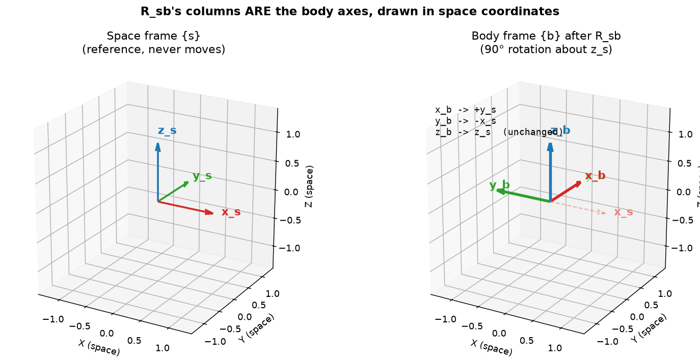
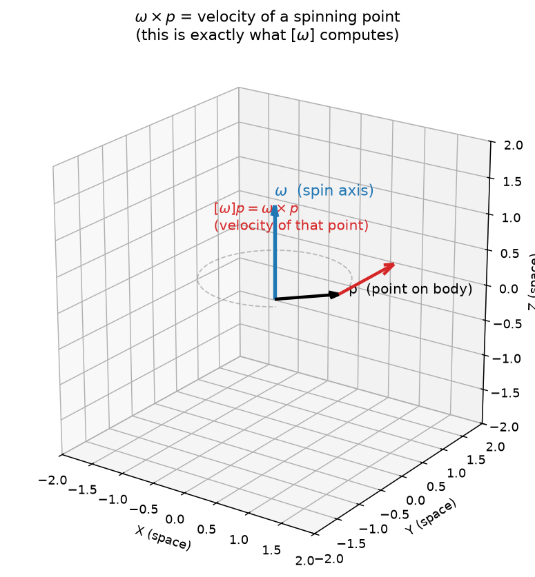

# 3a — Rotations & Angular Velocity (SO(3))

> Chapter 3.1–3.2.3 of *Modern Robotics*. The single most important idea in the
> book: how to describe and manipulate **orientation** in 3D.

---

## 1. The big picture — why we need this

A robot is a bunch of rigid bodies (links) floating in space. To control a robot
you constantly need to answer questions like:

- "Which way is the gripper pointing?"
- "If I know where the camera sees an object, where is it relative to the base?"
- "If I spin this joint, how does the end-effector's orientation change?"

All of these are about **orientation** — not *where* a body is, but how it's
*twisted*. This note is only about orientation (rotation). Position comes in 3b.

The key object is the **rotation matrix** `R`, a 3×3 matrix. By the end this
should feel less like "a grid of 9 numbers" and more like "a physical frame I can
point at in space."

---

## 2. The core idea — a rotation matrix is just a frame's axes

Pin a coordinate frame `{s}` to the world (the "space" frame). Pin another frame
`{b}` to a moving body (the "body" frame). Both are right-handed sets of three
unit axes: x̂, ŷ, ẑ.

**A rotation matrix is literally the body frame's three axis vectors, written in
the space frame's coordinates, stacked as columns:**

```
        |  |  |          ← x̂_b expressed in {s}  is the 1st column
R_sb =  x̂_b ŷ_b ẑ_b     ← ŷ_b expressed in {s}  is the 2nd column
        |  |  |          ← ẑ_b expressed in {s}  is the 3rd column
```

That's the whole secret. `R_sb` ("R of b relative to s") answers: *where do the
body's axes point, as seen from space?* Each column is a unit vector telling you
where one body axis is aimed.

Example — body frame rotated 90° about the space z-axis. The body's x̂ now points
along the space ŷ, the body's ŷ now points along space −x̂, ẑ unchanged:

```
        [ 0  -1   0 ]      col1 = (0,1,0)  = body x̂ points along space +y
R_sb =  [ 1   0   0 ]      col2 = (-1,0,0) = body ŷ points along space -x
        [ 0   0   1 ]      col3 = (0,0,1)  = body ẑ unchanged
```

Read the columns, not the rows — each column is a physical arrow.



Left: the space frame {s} — fixed, never moves. Right: the body frame {b} after
applying `R_sb` — notice the body's x̂ axis (red) is now pointing where space's ŷ
used to point, the body's ŷ (green) now points along −x_s, and ẑ (blue) didn't
move at all. Those three observations are *literally* the three columns of
`R_sb` above. The matrix isn't an abstract grid — it's "here's where each of the
body's three arrows ended up, measured in space coordinates."

### What you can DO with R (three jobs, same matrix)

1. **Represent an orientation** — `R_sb` *is* the orientation of {b} in {s}.
2. **Change the frame a vector is described in.** If a point is `p_b` in body
   coords, then `p_s = R_sb · p_b` gives the same physical point in space coords.
   (Subscript-cancellation trick: `R_s`**`b`** · `p`**`b`** → `p_s`. The inner
   `b`'s cancel.)
3. **Rotate a vector/frame** to a new orientation, staying in one frame.

Same matrix, read three ways. This triple-meaning trips everyone up at first;
we'll lean on the subscript trick to keep it straight.

### Composition (chaining frames)
`R_sb · R_bc = R_sc`. The b's cancel. This is how you walk a chain of links:
multiply the rotation of each link relative to the previous one.

⚠️ **Order matters.** `R_sb · R_bc ≠ R_bc · R_sb` in general. Rotations don't
commute — rotating "x then y" lands somewhere different than "y then x". Try it
with your hand and a book; it's physical, not a quirk of the math.

---

## 3. Linear algebra you need here (read this slowly)

Everything below is the LA that makes rotation matrices work. None of it is
assumed obvious.

### (a) Matrix × vector = a recipe that mixes the columns
`R · p` does **not** "apply rows to p" in any intuitive sense. The clean way to
see it: the result is a **weighted sum of R's columns**, with the weights being
the entries of `p`:

```
R · p  =  p₁·(col1)  +  p₂·(col2)  +  p₃·(col3)
```

So if `p = (1,0,0)`, then `R·p` = col1. That's *why* "the columns are where the
axes go": feeding in the body's own x-axis `(1,0,0)` spits out column 1, the
place that axis lands. Hold onto this picture.

### (b) Dot product = "how much do two arrows agree"
`a · b = |a||b|cos θ`. For **unit** vectors it's just `cos θ`. Two consequences:
- If `a·b = 0`, they're **perpendicular** (cos 90° = 0).
- If `a·a = 1`, then `a` has **length 1** (it's a unit vector).

### (c) Orthonormal columns ⇒ rigid (no stretch, no skew)
The columns of a rotation matrix are **orthonormal**: each is unit length, and
each pair is perpendicular. That's exactly the statement that {b} is still a
valid, undistorted right-angled frame — rotating a body can't stretch it or bend
its axes apart. Orthonormality *is* rigidity, written in LA.

### (d) Inverse = transpose (the magic property)
For a rotation, `R⁻¹ = Rᵀ`. You never need a real matrix inverse. Geometrically:
- `R_sb` turns body-coords into space-coords. Its inverse must turn space back
  into body: `R_bs`. So `R_bs = R_sb⁻¹ = R_sbᵀ`. **Flipping the subscripts =
  transpose.**
- *Why* transpose works: entry `(i,j)` of `RᵀR` is (column i of R)·(column j of
  R). By orthonormality that's 1 when i=j and 0 otherwise — i.e. `RᵀR = I`. So
  `Rᵀ` undoes `R`. Transpose is cheap; this is a huge practical gift.

### (e) Determinant = signed volume scaling
`det(R)` tells you how the matrix scales volumes, *with a sign*. For rotations
`det = +1`: volumes preserved (rigid) **and** the sign is positive, meaning no
mirror-flip. A `det = −1` orthogonal matrix is a *reflection* — it turns a
right hand into a left hand. We forbid that.

### (f) The group SO(3)
Put it together: the set of all 3×3 matrices with **orthonormal columns** and
**det = +1** is called **SO(3)** — the "Special Orthogonal group" in 3D.
"Orthogonal" = `RᵀR = I`, "Special" = det +1. It's a *group*: multiply two
rotations → still a rotation; every rotation has an inverse (its transpose);
identity `I` = no rotation. Don't be scared of "group" — it just means "rotations
combine and undo cleanly, and you never leave the set."

---

## 4. Angular velocity — how orientation *changes*

Now make the body spin. At any instant, its rotation is captured by an
**angular velocity vector** `ω` (omega):

- **direction of ω** = the axis it's spinning about (right-hand rule),
- **length |ω|** = how fast (rad/s).

One vector, both facts. Simple and physical.

### The skew-symmetric matrix `[ω]` (so(3)) — and why
We want a formula for how `R` changes over time. It turns out
`Ṙ = [ω] R` (Ṙ = time-derivative of R). But `ω` is a *vector* and `R` is a
*matrix* — to multiply them we first repackage `ω` as a 3×3 matrix `[ω]`:

```
        [  0   -ω₃   ω₂ ]
[ω]  =  [  ω₃   0   -ω₁ ]
        [ -ω₂   ω₁   0  ]
```

Note the 0 diagonal and the antisymmetry (`[ω]ᵀ = −[ω]`); that pattern is the set
**so(3)** (lowercase — the "Lie algebra"; just think "the space of these
skew matrices").

**Why this exact shape?** Because matrix-multiplying by `[ω]` does the same thing
as taking a **cross product**:

```
[ω] · p   =   ω × p
```

And `ω × p` is precisely the velocity of a point `p` on a body spinning with
angular velocity `ω` (a point moves perpendicular to both the spin axis and its
position — that's the cross product). So `[ω]` is just "cross-with-ω" rewritten
as a matrix, so it can sit in matrix equations. That's the only reason it exists.



Picture a body spinning about the blue axis `ω`. The point `p` (black arrow)
isn't on the axis, so it's getting dragged around in a circle (the dashed
ellipse). At this instant, its velocity is the red arrow `ω × p` — perpendicular
to both `ω` and `p`, tangent to the circle, pointing in the direction of travel.
`[ω]` is nothing but a matrix that computes this red arrow for you: `[ω]p = ω×p`.

So `Ṙ = [ω]R` reads: *the rate of change of the frame is "cross each axis with
ω,"* which is exactly what spinning does to each axis. (Frame matters: `[ω_s]R`
uses space-frame ω; `R[ω_b]` uses body-frame ω. We'll care later; for now just
know the side you multiply on encodes which frame ω lives in.)

---

## 5. Exponential coordinates — orientation as "axis + angle"

Here's the most useful representation for robotics, and the one that powers all
of Chapter 4 (forward kinematics).

**Euler's theorem:** *any* orientation, however complicated, can be reached by a
**single rotation by some angle θ about some unit axis ω̂.** So instead of 9
numbers in R, an orientation needs just:
- a unit axis `ω̂` (2 free numbers, since it's unit length),
- an angle `θ`.

We bundle them as the 3-vector `ω̂θ` — the **exponential coordinates** of the
rotation. Three numbers, the minimum possible.

### From axis-angle → R: the matrix exponential (Rodrigues' formula)
How do you turn "spin about ω̂ for total angle θ" into the matrix R? Intuition:
spin at constant unit angular velocity ω̂ for time θ. We said `Ṙ = [ω̂]R`. The
solution of that (just like `ẋ = ax` → `x = e^{at}`) is the **matrix
exponential**:

```
R = exp([ω̂]θ) = e^{[ω̂]θ}
```

You don't compute the infinite series by hand. For skew matrices it collapses to
a clean closed form — **Rodrigues' formula**:

```
R = I  +  sin θ · [ω̂]  +  (1 − cos θ) · [ω̂]²
```

What each term *means*: start at the identity (no rotation), `sin θ·[ω̂]` is the
"swing out perpendicular" part, `(1−cos θ)·[ω̂]²` is the "pull back toward the
axis" correction that keeps it on the unit sphere. You give it `(ω̂, θ)`, it
hands you a valid `R ∈ SO(3)`.

> **Matrix exponential, intuitively:** `e^M = I + M + M²/2! + …`. For a *skew* M
> it doesn't blow up or stretch — it *rotates*. "Exponentiating a small rotation
> rate, for a while, gives a finite rotation." This `exp` is the bridge from the
> velocity world (so(3), the [ω]'s) to the orientation world (SO(3), the R's),
> and it's the exact same bridge we'll use for full rigid motions and for whole
> robot arms. Worth getting comfy with now.

### From R → axis-angle: the matrix log (the inverse)
Going backward — "what axis & angle produces this R?" — is the **matrix
logarithm** `log(R)`. The handy closed form:
- **angle:** `θ = arccos((trace(R) − 1) / 2)`  (trace = sum of diagonal),
- **axis:** `[ω̂] = (R − Rᵀ) / (2 sin θ)`  (the skew, antisymmetric part of R,
  normalized) — then read ω̂ back out of the skew matrix.

Why trace? The diagonal of R encodes "how much each axis stayed put," and for a
rotation by θ that sum works out to `1 + 2cos θ` — solve for θ. (Edge cases:
θ=0 → axis undefined, any axis works; θ=π → `sin θ=0`, need a special formula.
The code will handle these.)

---

## 6. Small worked example (do this by hand once)

Rotate **90° about the space z-axis**, i.e. `ω̂ = (0,0,1)`, `θ = π/2`.

Skew of the axis:
```
        [ 0  -1   0 ]
[ω̂] =  [ 1   0   0 ]
        [ 0   0   0 ]
```
Square it:
```
        [ -1   0   0 ]
[ω̂]² = [  0  -1   0 ]
        [  0   0   0 ]
```
Rodrigues with `sin 90°=1`, `1−cos 90°=1`:
```
R = I + 1·[ω̂] + 1·[ω̂]²
  = [1 0 0; 0 1 0; 0 0 1] + [0 -1 0; 1 0 0; 0 0 0] + [-1 0 0; 0 -1 0; 0 0 0]
  = [ 0 -1 0 ; 1 0 0 ; 0 0 1 ]
```
Exactly the 90°-about-z matrix from §2. ✓ Columns are orthonormal, det = +1.

Now go backward: `trace(R) = 0+0+1 = 1`, so `θ = arccos((1−1)/2) = arccos(0) =
π/2`. ✓ And `(R − Rᵀ)/(2 sin θ)` recovers `[ω̂]` with `ω̂=(0,0,1)`. ✓ Round trip
closes.

---

## 7. Gotchas & intuition checks

- **Read columns, not rows.** Each column of R is a physical axis arrow.
- **Rotations don't commute.** `R₁R₂ ≠ R₂R₁`. Order = the order you do the spins.
- **Pre- vs post-multiply picks the frame.** Left-multiply (`R' = R_rot · R`)
  rotates about a **space/fixed** axis; right-multiply (`R' = R · R_rot`) rotates
  about the **body's own** axis. Same matrix `R_rot`, different physical meaning.
- **Inverse is free:** `R⁻¹ = Rᵀ`. Never call a numeric inverse on a rotation.
- **det must be +1.** If a computed matrix has det −1 you built a reflection (a
  left-handed frame) — a bug.
- **`[ω]` is just "cross with ω."** If you ever forget the skew layout,
  reconstruct it from `[ω]p = ω×p`.
- **exp = (axis,angle) → R; log = R → (axis,angle).** These two are the
  workhorses; everything in Ch. 4 is built on `exp`.
- **Numbers drift.** After many multiplications a stored R slowly stops being
  perfectly orthonormal; real code periodically "re-orthonormalizes" it. Good to
  know it's a thing.

---

## 8. FAQ — questions that came up in discussion

These are points that needed a second pass when we talked through this note.
Worth re-reading if you revisit this topic.

### "What exactly is a determinant?"
A single number from a square matrix that tells you **how it scales
volume, with a sign**:
- `|det(M)|` = how much a unit box's volume gets scaled by `M` (its columns
  become the box's edges). `det=2` → double the volume. `det=0` → the columns
  are linearly dependent and the box collapses flat (no volume).
- **sign of `det`** = whether handedness flips. Positive → a right-handed frame
  stays right-handed. Negative → mirrored into left-handed.

This is why `SO(3)` requires `det=+1`: volume preserved (`|det|=1`, rigid) *and*
no mirroring (`+`, not a reflection).

### "Does det=1 imply the columns are orthonormal?"
**No — these are two independent conditions**, both required for `SO(3)`, but
neither implies the other:
1. **Orthonormal columns** (`RᵀR=I`): unit length + mutually perpendicular →
   rigid, no stretch/shear. This alone defines `O(3)`.
2. **`det=+1`**: no mirror flip. Picks rotations out of `O(3)` (which also
   contains reflections, `det=-1`).

Counterexample showing `det=1` alone isn't enough — a shear matrix:
```
[ 1  1  0 ]
[ 0  1  0 ]      det = 1 (upper-triangular, product of diagonal)
[ 0  0  1 ]
```
Column 2 = `(1,1,0)` has length `√2` and isn't perpendicular to column 1 =
`(1,0,0)`. Valid `det=1`, but **not orthonormal, not a rotation** — it's a
shear (distorts a square into a parallelogram while preserving its area).
So always check *both* boxes separately.

### "Walk through `ω × p` with real numbers — is that what `[ω]p` computes?"
Yes, `ω × p` and `[ω]p` are the **same vector**, two recipes for it.

**Geometric recipe:** `ω × p = |ω||p| sin θ · n̂`, where `θ` = angle between
them and `n̂` ⊥ both, direction by the right-hand rule (curl fingers `ω`→`p`,
thumb = `n̂`).

**Simplest case** (sanity check the right-hand rule): `ω=ẑ=(0,0,1)`,
`p=x̂=(1,0,0)`, perpendicular & unit → `|ω×p|=1`. Curl `ẑ`→`x̂`, thumb points
`ŷ`. So `ẑ × x̂ = ŷ`, matching the 90°-about-z picture in §2.

**Numeric example** (matches the angular-velocity figure): `ω=(0,0,1.3)`,
`p=(1,0,0.3)`.
```
[ω] = [ 0    -1.3   0 ]        [ω]p = [ 0*1 + -1.3*0 + 0*0.3 ]   [ 0   ]
      [ 1.3   0     0 ]               [ 1.3*1 + 0*0 + 0*0.3  ] = [ 1.3 ]
      [ 0     0     0 ]               [ 0*1 + 0*0 + 0*0      ]   [ 0   ]
```
Check against the geometric formula: `|ω|=1.3`, `|p|≈1.044`, angle
`θ≈73.3°` (`sinθ≈0.958`) → `|ω||p|sinθ ≈ 1.3` ✓, direction `(0,1,0)` ⊥ both
`ω` and `p` ✓.

`[ω]` is just "bake `ω` into a matrix once, then `[ω]p` = cross product via
3 multiply-adds" — no angle/right-hand-rule reasoning needed at runtime.

### "Is `[ω_s]R = R[ω_b]`, or are these `Ṙ` in different frames?"
**Both equal the same `Ṙ`** — there's only one `Ṙ` (derivative of the one
matrix `R_sb`). `ω_s` and `ω_b` are **the same physical angular velocity**,
just described in space-coords vs body-coords — exactly like `p_s`/`p_b` for
a point. They're related the same way: `ω_s = R·ω_b` (and `ω_b = Rᵀω_s`).

**Concrete example** (reuse the §2 figure, `R_sb=[[0,-1,0],[1,0,0],[0,0,1]]`,
where body `x̂_b` currently points along space `ŷ`): say the body spins about
its **own x-axis**, `ω_b=(1,0,0)`. Then `ω_s = R·ω_b` = column 1 of `R` =
`(0,1,0)`. Makes sense — "spin about body-x" and "spin about space-y" are
*the same physical motion right now*, since body-`x̂` currently coincides with
space-`ŷ`.

**Why the two formulas collapse into each other:** `[ω_s] = [Rω_b] = R[ω_b]Rᵀ`
(rotating the vector inside `[·]` = conjugating the matrix by `R` — true
because `R(a×b)=(Ra)×(Rb)` for rotations, which is itself a `det=+1` fact).
So `[ω_s]R = (R[ω_b]Rᵀ)R = R[ω_b](RᵀR) = R[ω_b]`. Same `Ṙ`, two descriptions
of the same spin.

### "Why is `[ω]` called that?"
**Skew-symmetric matrix of `ω`** (`[ω]ᵀ = −[ω]`: zero diagonal, mirrored
off-diagonal entries are negatives of each other). The set of all 3×3 skew
matrices is **`so(3)`** (lowercase). The map `ω ↔ [ω]` is a bijection — 3
numbers `(ω₁,ω₂,ω₃)` ↔ 3 free entries of the matrix — so "angular velocity as
a vector" and "angular velocity as a skew matrix" are freely interchangeable.

---

### Quick self-check before we code (answer these to yourself)
1. I hand you `R_sb`. What does its **second column** physically tell you?
2. Why is `R_bs` just `R_sbᵀ` — no real inverse needed?
3. What's the difference between left- and right-multiplying by a rotation?
4. In one sentence: what does `exp([ω̂]θ)` do, and what does `log(R)` do?
