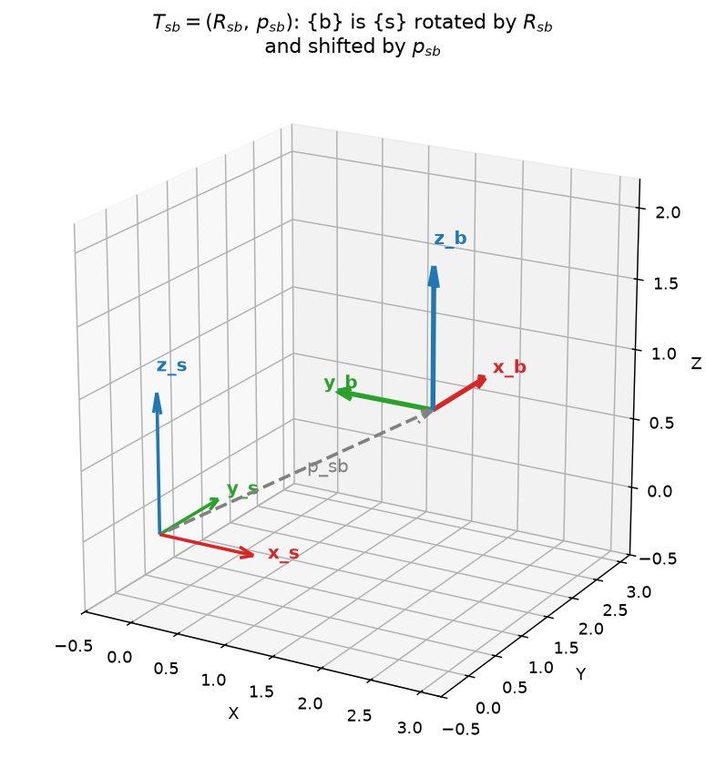
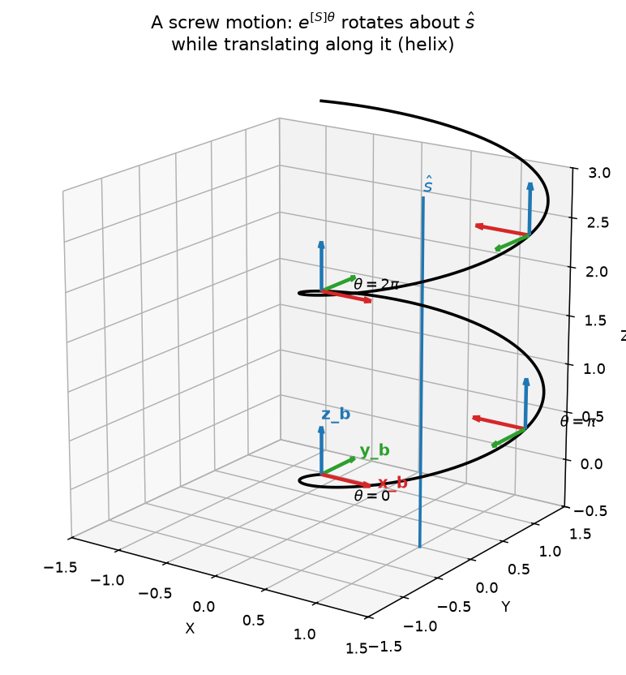

# 3b — Rigid-Body Motions & Twists (SE(3))

> Chapter 3.3 of *Modern Robotics*. Extends 3a from "orientation only" (`R`,
> `SO(3)`) to "orientation **and** position" — the full **pose** of a rigid
> body — and to the velocity analog of that, **twists**.

---

## 1. The big picture — why we need this

3a gave us `R`, which answers "which way is the body pointing?" But a robot
link, an end-effector, a camera, an object on a table — all of these also have
a **position**. "Pose" = orientation + position together. We need three things:

- A single object that bundles `(R, p)` — call it `T`, a **homogeneous
  transformation matrix**. The set of all valid `T` is **SE(3)** ("Special
  Euclidean group" in 3D) — the SE(3) analog of SO(3).
- A velocity analog of `ω`: a **twist** `V`, which bundles "how fast is it
  spinning" *and* "how fast is it translating" into one 6-number object. This
  is exactly what a robot's Jacobian (Ch. 5) maps joint velocities to —
  "move the end-effector with this twist" is a real command.
- A way to describe *any* rigid-body motion as **rotating about and
  translating along a single axis at once** — a **screw motion**. This is the
  geometric heart of forward kinematics (Ch. 4): every robot joint is a screw.

Everything here is the direct SE(3) upgrade of everything in 3a. Keep the 3a
intuitions (columns = axes, `[ω]` = "cross with ω", `exp`/`log` = axis-angle
↔ matrix) in mind — they reappear as *sub-blocks* of the bigger objects below.

---

## 2. The core idea — T is a 4×4 block matrix: rotation + position

Pin frame `{b}` to a moving body, `{s}` to the world. The **configuration**
(pose) of `{b}` relative to `{s}` is:

```
T_sb = [ R_sb   p_sb ]     <- 4x4 matrix
       [  0 0 0   1  ]
```

- **`R_sb`** (3×3, top-left block): the orientation of `{b}`'s axes, exactly
  as in 3a — its columns are `{b}`'s axes written in `{s}` coordinates.
- **`p_sb`** (3×1, top-right block): the position of `{b}`'s **origin**,
  written in `{s}` coordinates — an arrow from `{s}`'s origin to `{b}`'s
  origin.
- **bottom row `[0 0 0 1]`**: bookkeeping that makes the matrix multiplication
  work out correctly (explained in §3).



`{b}` (rotated axes, solid) sits at the tip of the arrow `p_sb` away from
`{s}` (reference axes). `T_sb` is *literally* "here's where {b}'s axes point
**and** here's where {b}'s origin is, both measured from {s}." Same spirit as
3a's "columns are axes" — now we also record *where those axes live*.

### What you can DO with T (same three jobs as R)
1. **Represent a configuration** — `T_sb` *is* the pose of `{b}` in `{s}`.
2. **Change the frame a point is described in** — if a point is `p_b` in body
   coordinates, `T_sb` converts it to `p_s` (space coordinates). Subscript
   trick still works: `T_s`**`b`** acting on a **`b`**-frame quantity cancels
   the `b`'s.
3. **Displace a point or frame** by `T`.

### Composition
`T_sb · T_bc = T_sc` — chain configurations exactly like rotations. Order
matters, same as 3a.

---

## 3. Linear algebra you need here — homogeneous coordinates

This is the genuinely new LA idea in this note. Take it slow.

### The problem: translation isn't a matrix multiply
A 3×3 matrix `M` acting on a vector `p` is a **linear** map, and every linear
map has one unavoidable property: `M·0 = 0`. The origin can never move. But
"shift everything by `p_sb`" *does* move the origin. So `Rx + p` (rotate, then
shift) — an **affine** map — simply cannot be written as a single 3×3 matrix
times `x`. We seem to be stuck needing two separate operations (a multiply and
an add).

### The trick: add a dummy coordinate equal to 1
Here's the fix, easiest to see one dimension down. Suppose you have an affine
map on a 1D line: `x' = a·x + b` (scale by `a`, then shift by `b`). Embed every
point `x` as the 2D point `(x, 1)` — i.e., glue a constant `1` underneath it.
Now watch:

```
[ a  b ] [ x ]   [ a*x + b ]   [ x' ]
[ 0  1 ] [ 1 ] = [    1    ] = [  1 ]
```

A single 2×2 **linear** matrix multiply now reproduces the 1D affine map, shift
and all. Geometrically: all your "real" points live on the horizontal line
`y=1` inside this 2D space. The matrix `[[a,b],[0,1]]` is an honest linear map
of the *whole* plane that happens to send that line back onto itself, and
*restricted to the line* it looks exactly like "scale and shift." We smuggled
translation into a linear multiply by going up one dimension.

**Exactly the same trick, one dimension higher:** embed a 3D point `x` as the
4D vector `(x,1)`. Then

```
T [ x ]  =  [ R  p ] [ x ]  =  [ Rx + p ]
  [ 1 ]     [ 0  1 ] [ 1 ]     [   1    ]
```

— a single 4×4 matrix multiply does "rotate, then translate." `(x,1)` is `x`
in **homogeneous coordinates**. The bottom row `[0 0 0 1]` is precisely what
keeps the 4th coordinate equal to `1`, so the output is still a valid point you
can feed back in.

### Block-matrix multiplication: treat blocks like numbers
You can multiply these 4×4 matrices by working with the `R`/`p`/`0`/`1` blocks
just as if they were single numbers in a 2×2 matrix — **as long as you never
reorder a product** (blocks are matrices; matrices don't commute):

```
T1 T2 = [ R1  p1 ] [ R2  p2 ]   [ R1 R2     R1 p2 + p1 ]
        [ 0   1  ] [ 0   1  ] = [   0            1     ]
```

Reading the result: the new rotation is `R1 R2` (compose orientations, same as
3a). The new position is `R1 p2 + p1` — take frame 2's offset `p2`, **rotate it
into frame 1's orientation** (`R1 p2`), then add frame 1's own offset `p1`.
This "rotate the inner offset *before* adding it" pattern is the source of
nearly every `R(...)` term you'll meet in this note. Watch for it.

---

## 4. T's inverse — no longer just a transpose

For rotations, `R⁻¹ = Rᵀ` (free). For `T`, the inverse has a specific block
form:

```
T⁻¹ = [ Rᵀ   -Rᵀp ]
      [ 0      1  ]
```

**Why `-Rᵀp` and not just `-p`?** `T` does "rotate, then shift by `p`." To undo
it you reverse the steps **in reverse order**: first undo the shift (subtract
`p`), *then* undo the rotation (apply `Rᵀ`). But applying `Rᵀ` also rotates the
offset you just subtracted, turning `-p` into `-Rᵀp`. (Sanity check with the
block-multiply rule: `T·T⁻¹` gives `R Rᵀ = I` on the diagonal and
`R(-Rᵀp) + p = -p + p = 0` for the position — clean `I₄`.)

Same subscript-flip habit as 3a: `T_bs = T_sb⁻¹` is the above with `R=R_sb`,
`p=p_sb`.

**SE(3)** = the set of all 4×4 matrices of this `[R,p;0,1]` form with
`R ∈ SO(3)`, `p ∈ ℝ³`. It's a group: composition stays in SE(3), every element
has the inverse above, identity = `I₄`. It also preserves all distances and
angles — that's the formal sense in which `T` is a *rigid* motion (it can move
and turn a body but never stretch or bend it).

---

## 5. Twists — the velocity of a rigid body

Now let `T(t)` change with time — the body is moving. In 3a, multiplying `Ṗ` by
`R⁻¹=Rᵀ` on either side collapsed the messy derivative into a clean
**skew-symmetric** matrix `[ω]` (so(3)). The exact same move works for `T`:

```
[V_b] = T⁻¹ Ṫ   (body twist)
[V_s] = Ṭ T⁻¹   (spatial twist)
```

Both come out in the special block form

```
[V] = [ [ω]  v ]   ∈ se(3)
      [  0   0 ]
```

— a 3×3 skew block (exactly 3a's `[ω]`) plus an extra 3-vector `v`. Unstacking
`[ω]` and `v` into one 6-vector gives the **twist**:

```
V = [ ω ]   ∈ ℝ⁶          ω = angular velocity (as in 3a)
    [ v ]                  v = linear velocity (read carefully below!)
```

A twist is the SE(3) analog of `ω`: **one object that captures the entire
instantaneous motion — spin *and* drift — of a rigid body.**

### The crucial subtlety: *which* point's velocity is `v`?
The `ω` half is easy — it's the body's angular velocity, the same idea as 3a.
The `v` half trips everyone up, so go slowly. `v` is **not** "the velocity of
the body" (a spinning body has no single velocity — different points move at
different speeds). `v` is the velocity of one *specific* point, and the two
twist flavors differ in *which* point:

- **`V_b = (ω_b, v_b)`** comes from `T⁻¹Ṫ`. Everything is in `{b}` coordinates,
  and `v_b` is the velocity of **the point currently at `{b}`'s origin**.
- **`V_s = (ω_s, v_s)`** comes from `ṬT⁻¹`. Everything is in `{s}` coordinates,
  and `v_s` is the velocity of **the (imaginary) point of the body that is
  currently passing through `{s}`'s origin** — picture the body as infinitely
  large so it actually reaches the world origin.

So `v_s` is generally **not** `ṗ` (the velocity of `{b}`'s origin written in
`{s}`). It's the velocity of a *different point* — the one momentarily at the
world origin.

### `ω` and `v` behave very differently across frames — don't lump them together
This is the single most important takeaway of the section, and it's worth
stating sharply because the symmetry of the notation hides it:

- **`ω_s` and `ω_b` are the same physical arrow in two coordinate systems.**
  `ω_s = R ω_b`. Pure change of basis, exactly like `p_s = R p_b` for a point.
  Angular velocity is a property of the *whole* body, so every point agrees on
  it; only the ruler you measure it with changes.
- **`v_s` and `v_b` are velocities of two genuinely different points.**
  Converting between them is *not* just a change of basis — it also has to
  account for the fact that you switched which point you're tracking, and on a
  spinning body that switch changes the velocity. That extra bookkeeping is
  the adjoint's job (§6).

> **Why this matters for building robots:** when you command a robot
> end-effector to "move in a straight line while rotating," you're specifying a
> twist. The Jacobian (Ch. 5) is the matrix that turns joint velocities into a
> twist of the end-effector — and the space-vs-body Jacobian distinction is
> exactly the `V_s`-vs-`V_b` distinction above.

---

## 6. The adjoint map — converting twists between frames

Because `v_s` and `v_b` track different points, converting a whole twist
between frames takes more than the rotation `R`. The 6×6 **adjoint matrix** of
`T=(R,p)` does it:

```
[Ad_T] = [  R    0  ]   ∈ ℝ⁶ˣ⁶          V_s = [Ad_(T_sb)] V_b
         [ [p]R  R  ]
```

- **Top-left `R`**: rotates the angular part. `ω_s = R ω_b` — the pure
  change-of-basis we just discussed.
- **Bottom-right `R`**: rotates the linear part into the new coordinates.
- **Bottom-left `[p]R`**: the *new* piece, and the reason the adjoint exists.
  This is the "I switched which point I'm tracking" correction. Expanded, it
  adds `p × ω_s` to the linear velocity: a point offset by `p` from the one you
  were tracking, on a body spinning at `ω_s`, moves faster by exactly the
  lever-arm term `ω × p`. **This is 3a's `ω × p` cross-product, reappearing
  automatically** — `[p]` is the same skew-matrix-as-cross-product trick from
  3a, now baked into the frame-change machinery.

So the full conversion reads:
```
ω_s = R ω_b                  (change of basis)
v_s = R v_b + p × ω_s        (change of basis  +  lever-arm correction)
```
The first line is "same arrow, new ruler." The second line's extra term is
"...and also, I'm now reporting a different point's velocity." You rarely
hand-compute `[Ad_T]`, but recognizing this shape will save you real confusion
in Ch. 5.

---

## 7. Screw axes — every rigid motion is a "turn while pushing"

3a's Euler theorem said: any *orientation* = rotate by `θ` about some axis `ω̂`.
The SE(3) version is the **Chasles–Mozzi theorem**:

> Any rigid-body **displacement** = rotate by `θ` about *and* translate by `hθ`
> along a single fixed axis — like driving a screw into a hole.

That axis is the **screw axis** `S = (ω, v)`, a *normalized* twist (either
`‖ω‖=1`, or `ω=0` and `‖v‖=1` for a pure translation). Geometrically it's:
- a point `q` the axis passes through,
- a unit direction `ŝ`,
- a **pitch** `h` — how far you translate along the axis per radian of rotation
  (`h=0` → pure rotation, like a hinge; `h=∞` → pure translation, like a
  slider).

Any twist is then `V = S·θ̇` — "spin at rate `θ̇` about screw axis `S`." This is
the unifying picture for robot joints: a **revolute** joint is a screw with
`h=0`; a **prismatic** joint is a screw with `h=∞` (`ω=0`). Every joint in
Ch. 4's forward kinematics is "just" a screw axis.

For a screw with `‖ω‖=1`, the linear part of `S` is `v = -ω × q + hω`: the
`-ω × q` term is the lever-arm motion the origin gets dragged through because
the axis is offset by `q`, and `hω` is the translation along the axis. (For a
pure hinge, `h=0`, so `v = -ω × q` — the offset term only.)



The body-frame origin (black curve) spirals around the blue screw axis `ŝ`: it
rotates around the axis *and* drifts along it at a constant rate — the helix's
"rise per turn" is set by the pitch `h`. The small frames show the body's
orientation at `θ = 0, π, 2π`; the orientation returns to identical every `2π`,
but the body keeps climbing.

---

## 8. Exponential coordinates for SE(3) — `exp` and `log`

Same bridge as 3a (`exp([ω̂]θ) = R`), one level up:

```
exp : [S]θ ∈ se(3)  →  T ∈ SE(3)
log :     T ∈ SE(3)  →  [S]θ ∈ se(3)
```

### exp: screw axis + distance → T
For a screw axis `S=(ω,v)` with `‖ω‖=1`, traveling a distance `θ` along it:

```
e^{[S]θ} = [ e^{[ω]θ}    G(θ)v ]
           [    0          1   ]

G(θ) = Iθ + (1−cosθ)[ω] + (θ−sinθ)[ω]²
```

- **Top-left `e^{[ω]θ}`**: exactly 3a's Rodrigues formula — the rotation part,
  unchanged.
- **Top-right `G(θ)v`**: where the origin ends up. **Not** simply `vθ`! As the
  body rotates about the screw axis, the direction `v` points (it's fixed *in
  the body*) sweeps around too, so the origin travels along a curving (helical)
  path, not a straight line. `G(θ)` accumulates that curved displacement — it's
  the integral of `e^{[ω]t}v` from `0` to `θ`. Note `G(0)=0` (you start at the
  origin), and `G(θ)→Iθ` as the rotation vanishes (`[ω]→0` ⇒ plain straight
  translation `vθ`).
- **Pure translation** (`ω=0`, `‖v‖=1`): `e^{[S]θ} = [I, vθ; 0,1]` — just slide
  by `vθ`, no rotation, no curving.

### log: T → screw axis + distance (the inverse)
- If `R=I` (pure translation): `ω=0`, `v = p/‖p‖`, `θ=‖p‖`.
- Otherwise: get `(ω̂, θ)` from 3a's `log` on `R`, then `v = G⁻¹(θ)·p`, where
  `G⁻¹(θ) = (1/θ)I − ½[ω] + (1/θ − ½cot(θ/2))[ω]²`.

`G⁻¹` looks intimidating, but conceptually it's just "undo `G`" — the SE(3)
counterpart of using `Rᵀ` to undo `R` in 3a, only algebraically messier because
`G` isn't an orthogonal matrix.

---

## 9. Worked example — a door swinging on a hinge

A door's hinge is the **screw axis**: vertical (`ŝ = ω̂ = (0,0,1)`), passing
through `q = (0,1,0)` (1 m along `{s}`'s y-axis), pure rotation (`h=0`). The
door's near edge starts at the origin. The door swings at `θ̇ = 1` rad/s.

**Find the twist** `V = (ω,v) = S·θ̇` (with `θ̇=1`, so `V = S`):
- `ω = ŝ = (0,0,1)`.
- `v = −ω̂ × q` (pure rotation, `h=0`): `ω̂ × q = (0,0,1)×(0,1,0) = (−1,0,0)`,
  so `v = (1,0,0)`.
- `V = (0,0,1, 1,0,0)`.

Sanity check on `v`: `v` is the velocity of the body-point currently at the
world origin — the door's near edge. That edge is `r = origin − hinge =
(0,−1,0)` away from the hinge, so its velocity is `ω × r = (0,0,1)×(0,−1,0) =
(1,0,0)` ✓. (3a's `ω × p` picture again, with `r` measured from the screw
axis.)

**Now swing the door a quarter turn (`θ=π/2`) and find `T`:**
- Rotation: `R = e^{[ω]π/2}` = the familiar 90°-about-z matrix from 3a:
  `[[0,−1,0],[1,0,0],[0,0,1]]`.
- Position: `G(π/2) = [[1,−1,0],[1,1,0],[0,0,π/2]]`, so
  `p = G(π/2)·v = G(π/2)·(1,0,0) = (1,1,0)`.

```
T = [ 0  -1   0   1 ]
    [ 1   0   0   1 ]
    [ 0   0   1   0 ]
    [ 0   0   0   1 ]
```

**Double-check geometrically:** the near edge started at `r=(0,−1,0)` relative
to the hinge `(0,1,0)`. Rotate that offset by 90°: `R·r = (1,0,0)`. New
position = `hinge + R·r = (0,1,0)+(1,0,0) = (1,1,0)` ✓ — matches `p` from the
`exp` formula. The screw machinery and "just rotate the offset and add the
pivot" agree, as they must.

---

## 10. Gotchas & intuition checks

- **`T⁻¹ ≠ Tᵀ`.** `T` isn't orthogonal. Only the `R` block transposes; `p`
  picks up the `-Rᵀp` term.
- **Homogeneous coords: append `1` for points, `0` for directions.** A *point*
  `(x,1)` transforms with the full `T` (rotation + translation). A
  *displacement/direction* `(d,0)` should only ever be rotated, never
  translated — append `0`, and `T·(d,0) = (Rd, 0)`. Handy whenever you need
  "the same arrow in another frame" vs. "this point in another frame."
- **A twist is `T⁻¹Ṫ` or `ṬT⁻¹`, not `(Ṙ, ṗ)` stacked.** It's a *relative*
  velocity — "how is the frame changing, measured against its own current
  pose" — just like `[ω]=ṖRᵀ` in 3a wasn't raw `Ṗ` but "derivative undone by
  current orientation."
- **`ω` changes frames by basis change; `v` changes frames by basis change
  *plus* a lever arm.** `ω_s=Rω_b` (same arrow); `v_s=Rv_b+p×ω_s` (different
  point). Never assume `v` transforms like a plain vector.
- **`V_s` and `V_b` are the same physical motion**, related by `[Ad_T]` — the
  6-vector analog of `ω_s`/`ω_b`.
- **The `[p]R` term in `[Ad_T]` is `ω×p` in disguise.** If a frame-change
  formula suddenly sprouts a cross product with a position, it's this lever
  arm.
- **Screw axis = unifying language for joints.** Revolute = `h=0`, prismatic =
  `h=∞` (`ω=0`). Ch. 4's "Product of Exponentials" is literally "multiply one
  `e^{[S]θ}` per joint."
- **`exp`/`log` for SE(3) = 3a's `exp`/`log` on the rotation block, plus
  `G(θ)`/`G⁻¹(θ)` for the position block.** When `ω=0` it all collapses to
  plain translation.

---

## 11. FAQ — questions that came up in discussion

### "Is `ω_s` just `ω_b` represented in the `{s}` frame, and vice versa?"
**Yes — for `ω`, that's exactly right.** `ω_s = R ω_b` (and `ω_b = Rᵀ ω_s`) is a
pure **change of basis**: same physical arrow (same spin axis, same rate), just
written in `{s}`- vs `{b}`-coordinates. Identical to `p_s = R p_b` for a point.
Angular velocity is shared by the *whole* rigid body — every point agrees on
it — so the only thing that differs between frames is the coordinate ruler.

**But do NOT extend that picture to the linear part `v`.** `v_s` and `v_b` are
*not* "one arrow in two rulers" — they are the velocities of **two different
points**:
- `v_b` = velocity of the point currently at `{b}`'s origin,
- `v_s` = velocity of the body-point currently at `{s}`'s origin.

On a spinning body, different points move at different speeds, so switching
which point you report genuinely changes the vector — over and above any change
of basis. The conversion carries an extra term:
```
v_s = R v_b + p × ω_s
```
The `R v_b` is the change-of-basis part; the `p × ω_s` is the lever-arm
correction for having switched points (this is the `[p]R` block of `[Ad_T]`).

**Concrete check (basis change alone can't explain it):** a disk spins about
its own center `{b}` with `ω_b=(0,0,1)` and `v_b=0` (the center doesn't
translate). Say `{s}`'s origin sits on the rim, `p_sb=(1,0,0)`, and at this
instant the frames are aligned so `R=I`. Then:
- `ω_s = R ω_b = (0,0,1)` — same numbers (because `R=I`).
- `v_s = R v_b + p×ω_s = 0 + (1,0,0)×(0,0,1) = (0,−1,0)`.

So `v_b=0` but `v_s=(0,−1,0)` **even though `R=I`** — there's literally no basis
change happening, yet the two linear velocities differ. The whole difference is
"center is stationary, but the rim point is moving at `|ω|·r = 1`." That's the
`p × ω` lever arm, and it's why `v` needs the adjoint, not just `R`.

---

### "Is `v_b` just the velocity of the body's own origin, in body coordinates?"
**Yes.** For `v_b`, the "which point" question is the easy case: the body-point
at `{b}`'s origin *is* `{b}`'s origin. So `v_b` = "velocity of the body's own
origin, written in body coordinates" — concretely `v_b = Rᵀṗ` (take `ṗ`, the
origin's velocity in space coords, and rotate it into the body frame with
`Rᵀ`). The "imaginary infinitely-large body" language is only needed for `v_s`,
where the tracked point (the body-point passing through the *world* origin) is
generally not `{b}`'s origin and may be nowhere near the actual body.

---

### "What *is* a twist, really — and why doesn't the 'infinite body' image bother me anymore?"
This is the intuition that makes the whole `V_s` / `V_b` / adjoint story sit
still. Two layers:

**(1) A twist is ONE object — `V_s` and `V_b` are two descriptions of it, not
two different things.** First, a wording fix that removes half the confusion:
`{s}` is **fixed** — it isn't moving relative to anything. A twist is just *the
motion of the body `{b}`*, full stop. `{s}` and `{b}` are two **vantage points**
from which we write that one motion down: "the body's motion, anchored at `{s}`"
vs "...anchored at `{b}`." So `V_s = [Ad_T] V_b` is a **change of coordinates** —
re-anchoring one motion to a new frame — *exactly* like `p_s = R p_b` re-expresses
one point. It is **not** a relation between two distinct quantities. Different
component numbers, same physical motion.

**(2) A rigid motion is a velocity field that fills ALL of space — not just
where the matter is.** Picture the motion as an **infinite sheet of rigid ice**
spinning/sliding as one piece; the real body (apple, link) is a painted patch on
it. Every location on the ice has a velocity, including spots far from the patch.
A twist *is* that space-filling flow.

- `v_b` = sample the flow at `{b}`'s origin (where the body actually sits, so it
  feels concrete: it's the body's own origin velocity, `Rᵀṗ`).
- `v_s` = sample the **same** flow at `{s}`'s origin.

That's all the "imaginary infinitely-large body" means: the flow is defined
everywhere, so "the point of the body *currently at* `{s}`'s origin" is just
"the flow's value at the world origin" — well-defined even if no actual body
material is there. `v_b` and `v_s` are the **same operation** ("sample the
field at *this* frame's origin, in *this* frame's axes"); they only *feel*
different because the matter happens to live near `{b}`'s origin, not `{s}`'s.

**Door check** (`ω=(0,0,1)`, hinge at `(0,1,0)`; flow at any `x` is
`ω×(x−hinge)`):
- at `{s}`'s origin `(0,0,0)`: `ω×(0,−1,0) = (1,0,0)` → that's `v_s`.
- at an empty-air point `(2,0,0)` (no door there!): flow still defined,
  `ω×(2,−1,0) = (1,2,0)`. The ghost-ice there *would* move that way.

**Why this convention (and not just `ṗ`)?** `ṗ` tracks `{b}`'s origin, a
*different* point, and doesn't transform cleanly (`v_s ≠ ṗ`). Defining `v_s` as
"flow sampled at `{s}`'s origin" is exactly what makes `V_s` a faithful
frame-anchored encoding that `[Ad_T]` converts to/from `V_b`, and it's what makes
the screw axis (the structure of the flow, valid over all space) work.

**One line:** a twist is the body's *space-filling velocity field*; `v_s` and
`v_b` just read that one field at two different origins.

---

### "Does a screw motion require `ω` and `v` to be parallel (collinear)?"
**No — that's only a special case.** The corkscrew image (spin about a line and
advance along the *same* line) makes `ω ∥ v` feel mandatory, but it isn't. A
screw is about a **line** in space, and that line usually doesn't pass through
your origin. Since `v` is the velocity *at the origin*, it splits into two
perpendicular pieces:
```
v  =  hω        +   (-ω × q)
      along axis      perpendicular to axis
      (screw advance) (lever arm because the origin is offset from the line by q)
```
- `v ∥ ω` only when `q=0` (axis passes through the origin) — the classic
  corkscrew/drill bit.
- **Door hinge** (§9): `ω=(0,0,1)`, `v=(1,0,0)` — fully **perpendicular**! A
  pure rotation (`h=0`) about an *offset* line, so `v` is entirely the
  lever-arm term. The opposite extreme from the corkscrew.
- General motion: `v` has both a parallel part (pitch) and a perpendicular part
  (locating the axis).

---

### "Is the screw axis just a normalized twist? Where do `h` and `q` come in?"
Two separate operations, easy to conflate:
- **Normalize** = factor the *speed* out of a twist: `V = S·θ̇` where
  `S = V/‖ω‖` (so `‖ω‖=1`) and `θ̇ = ‖ω‖`. Pure scaling of the 6-vector — `h`
  and `q` are **not** involved.
- **`h`, `q`** = an *alternative geometric decoding* of the same screw axis `S`:
  a physical line (direction `ŝ=ω`, through point `q`) plus pitch `h = ŝᵀv`. You
  extract these from `S` only if you want the picture; normalizing never touches
  them.

Two interchangeable representations of one screw axis: the **6-number twist**
`S=(ω,v)` and the **geometric** `{ŝ, q, h}`.

---

### "Given a transform `T` (pose A → pose B), can I recover the screw that does it?"
**Yes — that's exactly `log(T) = [S]θ`** (Chasles–Mozzi theorem). You get one
fixed screw axis `S` and a distance `θ`; executing that single screw motion
(rotate about + slide along the axis simultaneously) flows the body from A to B
along a helix. Bundled, `Sθ ∈ ℝ⁶` are the *exponential coordinates* of `T` — six
numbers for any rigid displacement. Feed the **relative** transform
(`T = T_sb·T_sa⁻¹` for a space-fixed axis), not pose B alone. This is the bridge
to Ch. 4: a robot joint *is* a screw, and forward kinematics chains one
`exp([Sᵢ]θᵢ)` per joint (Product of Exponentials).

---

### Quick self-check — confirmed answers
1. **`T_sb`'s last column, top three entries** = the **position of `{b}`'s
   origin, expressed in the fixed frame `{s}`** (that's `p_sb`). ✓
2. **`T⁻¹`'s position block is `-Rᵀp`** because undoing the motion means undoing
   the shift *and* the rotation, in reverse order: it's `Rᵀ·(-p)` — invert the
   forward rotation and apply it to the negated offset. ✓
3. **`ω_s` vs `ω_b`** = pure **change of basis** (same arrow, two rulers).
   **`v_s` vs `v_b`** = different points: `v_s` is the velocity of the
   body-point currently at the **fixed-frame origin**, measured in `{s}`;
   `v_b` is the velocity of the **body's own origin**, measured in `{b}`. ✓
4. **`h=0`** → a **revolute joint** (pure rotation, no translation along the
   axis). (`h=∞`, `ω=0` → prismatic.) ✓
5. **The position part of `exp([S]θ)` isn't just `vθ`** because the body keeps
   rotating *as* it translates, so the direction of `v` (fixed in the body)
   sweeps around — the origin follows a curved/helical path. That dependence on
   `ω` is exactly what `G(θ)` captures, just like a screw's translation is
   coupled to its rotation. ✓
