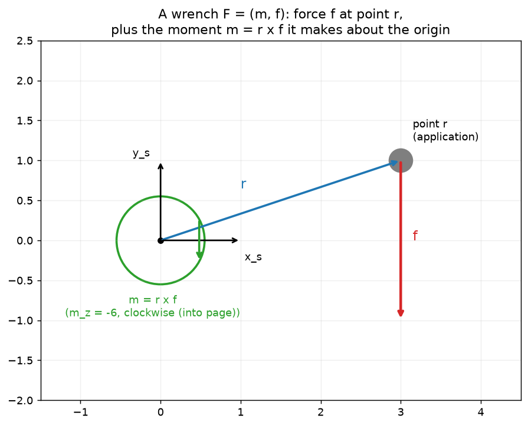

# 3c — Wrenches (forces + moments as one 6-vector)

> Chapter 3.4 of *Modern Robotics*. The **force** counterpart of 3b's twist.
> Short topic — it reuses the adjoint from 3b, just transposed.

---

## 1. The big picture — why bundle force and moment

3b gave us the **twist** `V=(ω,v)`: one 6-vector for the full *motion* (spin +
drift) of a rigid body. Now we want the same packaging for what *causes* motion:
**force and torque**.

- A **force** `f` (3-vector) is a push/pull.
- A **moment** (a.k.a. torque) `m` (3-vector) is a twisting effort — what a
  force does *about a reference point* when it's applied off to the side
  (think tightening a bolt with a wrench: same hand force, more turning effect
  the longer the handle).

Bundle them into one 6-vector, the **wrench**:

```
F = [ m ]   ∈ ℝ⁶          m = moment (top 3)
    [ f ]                  f = force  (bottom 3)
```

Note the ordering: **moment on top, force on bottom** — the same angular-then-
linear layout as the twist `V=(ω,v)`. That parallel is the whole point: twists
and wrenches are *dual* objects, and they'll pair up cleanly (§4).

**Why we care for robots:** a force/torque sensor at a robot's wrist reports a
wrench. Gravity on a held object is a wrench. Contact with the environment is a
wrench. When you do force control (Ch. 11) or compute the joint torques needed
to hold a load (statics, Ch. 5), you're moving wrenches between frames — exactly
this note.

---

## 2. The core idea — a force at a point makes a moment

Apply force `f` at a point `r` (both written in some frame `{a}`). The moment it
produces about `{a}`'s origin is the **cross product**:

```
m_a = r_a × f_a
```

This is 3a's cross product doing lever-arm duty again: `|m| = |r||f|sinθ` is
"force × perpendicular distance to the line of action," and the direction (by
the right-hand rule) is the axis the force would tend to spin the body about.



A downward force `f` (red) applied at `r=(3,1)` (blue lever arm) tends to spin
the body **clockwise** about the origin — that's `m = r×f` pointing into the
page (`m_z = −6`). Move the same force closer to the origin (shorter `r`) and
the moment shrinks; apply it *through* the origin (`r∥f`) and the moment
vanishes. The wrench here is `F = (0,0,−6, 0,−2,0)` (moment `m`, then force
`f`).

A couple of facts that fall out:
- **Where along its line of action you apply `f` doesn't matter.** Sliding the
  force forward/backward along its own direction doesn't change `r×f` (the
  added piece is parallel to `f`, so its cross product is zero). Only the
  *line* the force acts along matters.
- **Wrenches add.** Several forces/moments on one body → just sum the
  6-vectors, **as long as they're all expressed in the same frame.**
- A wrench with `f=0` (pure moment, `F=(m,0)`) is the wrench analog of a
  pure-rotation screw.

---

## 3. Linear algebra you need here — the transpose as "the dual side"

The one new LA idea: when an operator acts on "velocity-like" objects, its
**transpose** acts on the matching "force-like" objects. You don't need to
re-derive anything — if you know how twists transform (`[Ad_T]`), you get
wrenches for free by transposing. Here's the why, in plain terms.

### Power is a dot product — and it can't depend on your coordinate choice
**Power** = rate of doing work = `force · velocity` (push something at some
speed, that's watts). For our 6-vectors, power is the dot product of a twist
and a wrench:

```
power = Vᵀ F = ω·m + v·f
```

(Angular velocity dotted with moment, plus linear velocity dotted with force —
both are "effort × rate," both are power.)

Now the key physical fact: **power is real and physical — it cannot change just
because you describe the same situation in a different frame.** If a motor is
delivering 5 W, every observer must compute 5 W, whatever coordinates they use.
So for the *same* twist and wrench written in frame `{a}` vs frame `{b}`:

```
V_bᵀ F_b  =  V_aᵀ F_a      (power is frame-invariant)
```

### That invariance forces the transpose
We already know twists convert with the adjoint: `V_a = [Ad_Tab] V_b`. Substitute
that into the left side of the power equation and shuffle (using the matrix fact
`(Mx)ᵀy = xᵀMᵀy`):

```
V_bᵀ F_b = (Ad_Tab V_b)ᵀ F_a = V_bᵀ (Ad_Tabᵀ F_a)
```

This has to hold for *every* twist `V_b`, which is only possible if the wrench
parts match:

```
F_b = [Ad_Tab]ᵀ F_a
```

So wrenches transform by the **transpose** of the same adjoint that moves
twists. No new machinery — `[Ad_T]` from 3b, transposed.

> **What "transpose" buys you geometrically:** twists live in the "motion"
> world, wrenches in the "force" world. They're paired by power (`VᵀF`). Any
> time you have such a power-pairing, the force side always transforms by the
> transpose of the motion side. This twist↔wrench / adjoint↔adjointᵀ duality
> reappears constantly — e.g. the robot Jacobian `J` maps joint rates → twist,
> and `Jᵀ` maps wrench → joint torques (Ch. 5 statics). Same pattern.

---

## 4. The key result — wrench frame change

```
F_b = [Ad_Tab]ᵀ F_a          F_a = [Ad_Tba]ᵀ F_b
```

with, from 3b,

```
[Ad_T] = [  R    0  ]    so    [Ad_T]ᵀ = [ Rᵀ   ([p]R)ᵀ ]
         [ [p]R  R  ]                    [ 0      Rᵀ    ]
```

Mind the index pattern: twists used `V_a = [Ad_Tab]V_b`, but wrenches flip it —
`F_b = [Ad_Tab]ᵀ F_a` (same `T_ab`, but it now sends `a→b` for wrenches). If
that's confusing, don't memorize it — just use whichever `T` makes the power
`VᵀF` come out frame-independent, or lean on the code helper.

Usual special case — spatial vs body wrench (fixed frame `{s}`, body `{b}`):
```
F_s = [Ad_Tbs]ᵀ F_b          F_b = [Ad_Tsb]ᵀ F_s
```

---

## 5. Worked example — apple in a robot hand (book Ex. 3.28)

A robot hand holds an apple; a 6-axis force/torque sensor sits at the wrist
(frame `{f}`). Gravity pulls down on both the hand and the apple. What wrench
does the sensor read? **Strategy: write each gravity wrench in its own frame,
transform both into `{f}`, and add.**

Setup (gravity acts along a horizontal direction on the page; numbers rounded):
- Apple: 0.1 kg → weight 1 N. In the apple frame `{a}`, the gravity wrench is a
  pure force: `F_a = (0,0,0, 0,0,1)` (no moment about `{a}`'s own origin,
  because the weight acts *at* that origin).
- Hand: 0.5 kg → weight 5 N. In the hand frame `{h}`:
  `F_h = (0,0,0, 0,−5,0)`.

Each is a *pure force at its own center of mass*, so each has zero moment **in
its own frame**. The interesting part is that once you move them to `{f}` — a
different point — the lever arms turn those forces into moments too. You compute
`F_f = [Ad_Thf]ᵀ F_h + [Ad_Taf]ᵀ F_a`, and the off-origin distances `L₁, L₂`
show up as nonzero moments in the sensor reading.

The mechanics are just "apply §4 twice and sum." We'll grind the actual numbers
in the notebook (this is a perfect from-scratch check). The takeaway to hold:
**a pure force at a distance reads as force + moment once you change to a frame
that isn't on its line of action** — the `[p]R` lever-arm block of the adjoint,
now on the wrench side.

---

## 6. Gotchas & intuition checks

- **Ordering: `F=(m,f)` — moment first, force second**, matching `V=(ω,v)`. (Be
  careful: some textbooks stack force first. We follow the book, and so does
  the `modern_robotics` package.)
- **Wrenches transform by `[Ad_T]ᵀ`, twists by `[Ad_T]`.** Same matrix from 3b,
  transposed — because they're paired by power, which is frame-invariant.
- **The index/`T` direction flips relative to twists.** `V_a=[Ad_Tab]V_b` but
  `F_b=[Ad_Tab]ᵀF_a`. When in doubt, the right answer is the one keeping `VᵀF`
  the same in both frames.
- **A force's line of action is what matters, not the exact point** — sliding
  along `f`'s own direction leaves `m=r×f` unchanged.
- **Add wrenches only in a common frame.** Transform first, then sum.
- **`VᵀF` is power** — a single scalar, the bridge between the motion and force
  worlds. This duality (and the transpose it implies) is the same shape as
  Jacobian transpose in Ch. 5: `τ = Jᵀ F`.
- **Pure moment** (`f=0`) is to wrenches what a pure-rotation screw (`h=0`) is
  to twists.

---

## 7. FAQ — to be filled in after discussion

*(We'll capture any clarifying questions here, as in 03a §8 / 03b §11.)*

---

### Quick self-check before we code (answer these to yourself)
1. In `F=(m,f)`, which 3 entries are the moment and which the force — and why
   that order?
2. Why does a force applied *through* the origin contribute zero moment?
3. Twists transform with `[Ad_T]`. Why do wrenches transform with `[Ad_T]ᵀ`
   instead — what physical quantity forces that?
4. The apple weighs 1 N at its own center of mass, so `F_a` has zero moment. Why
   does the wrist sensor nonetheless read a nonzero moment?
5. What is `VᵀF`, physically, and why must it be the same in every frame?
