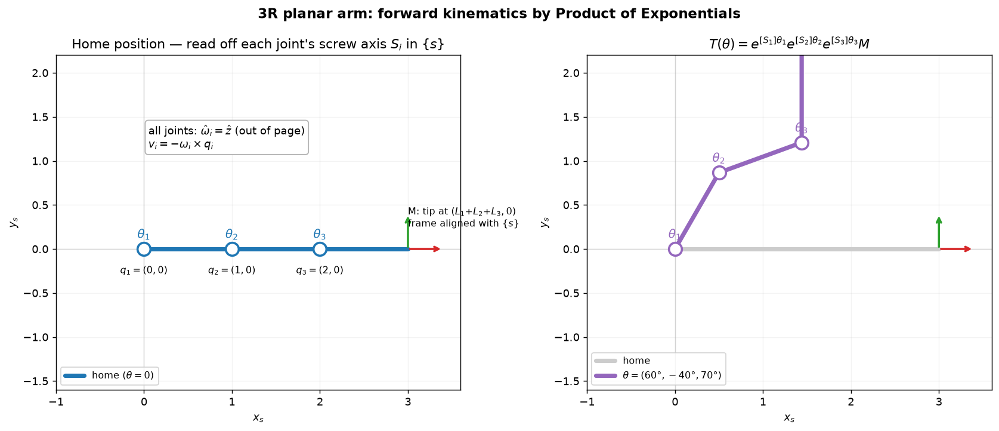

# 4a — Forward Kinematics: Product of Exponentials (space form)

> Chapter 4.1 of *Modern Robotics* (through §4.1.2). The first real robot-arm
> payoff: given the joint angles, compute exactly where the end-effector is.
> Built entirely on 3b's screw `exp([S]θ)`.

---

## 1. The big picture — "where is my hand?"

**Forward kinematics (FK):** input the joint values `θ = (θ₁,…,θₙ)`, output the
end-effector pose `T(θ) ∈ SE(3)` — position *and* orientation of the gripper in
the base frame. Every robot does this constantly: to know where the hand is, to
render the arm in sim, to feed a controller. It's *the* foundational arm
calculation, and inverse kinematics (Ch. 6), velocity (Ch. 5), and dynamics
(Ch. 8) all sit on top of it.

There are two classic ways to write FK:

1. **Chained link frames** `T(θ) = T₀₁ T₁₂ ⋯ Tₙ₋₁,ₙ` — attach a frame to every
   link and multiply the joint-to-joint transforms. This is the Denavit–
   Hartenberg (D–H) route; it needs a carefully-placed frame on each link.
2. **Product of Exponentials (PoE)** — *no link frames*. Just describe each joint
   as a **screw axis** (3b!) and chain one matrix exponential per joint. This is
   the book's preferred method, and ours, because it's geometric and reuses
   exactly the `exp([S]θ)` machinery you already built.

This note is the PoE **space form**.

---

## 2. The core idea — each joint screws everything beyond it

Park the robot at its **home position** (all `θ = 0`) — a configuration *you*
choose. Two things define the robot there:

- **`M ∈ SE(3)`**: the end-effector pose at home (the "zero" pose of `{b}` in
  `{s}`).
- **A screw axis `Sᵢ` per joint**, expressed in the fixed base frame `{s}`, *at
  the home position*.

Now the one mechanical insight that makes PoE work:

> **Rotating joint `i` applies a rigid screw motion to the entire chain of links
> *outboard* of it (joint `i` and everything past it), while links inboard don't
> care.**

Think of joint `n` (the last one). Turning it by `θₙ` screws the end-effector
about `Sₙ`: `T = e^{[Sₙ]θₙ} M`. Now also turn joint `n−1`: that screws *the whole
(link n−1)+(link n) assembly* — including the already-moved end-effector — about
`Sₙ₋₁`: `T = e^{[Sₙ₋₁]θₙ₋₁} e^{[Sₙ]θₙ} M`. Keep walking inward to joint 1 and you
get the **product of exponentials**:

```
T(θ) = e^{[S₁]θ₁} e^{[S₂]θ₂} ⋯ e^{[Sₙ]θₙ} M
```



Left: at home the arm lies along `x_s`; you read each joint's screw `Sᵢ` straight
off the picture (all axes point out of the page, `ω̂ᵢ = ẑ`). Right: plug in
`θ = (60°, −40°, 70°)` and the PoE product places the end-effector frame.

**The magic:** the screw axes `Sᵢ` are read **once**, at home, and **never
recomputed** as the robot moves. All the motion lives in the `θᵢ` inside the
exponentials. That's why PoE is so clean.

---

## 3. Linear algebra you need here — (almost) nothing new

This is the rare note that adds *no* new linear algebra. You already have:

- **`exp([S]θ)`** from 3b — turns a screw axis + joint value into a transform.
- **Composition of transforms** `T·T'` — block multiply, from 3b.

The only genuinely new things to be careful about are **order** and **which side
you multiply on**, so let's nail those:

### Why the screws multiply *left-to-right*, with `M` on the right
Read the product `e^{[S₁]θ₁} ⋯ e^{[Sₙ]θₙ} M` **right to left**: start at the home
pose `M`, then each exponential to its left pre-multiplies (left-multiplies) it.

Recall the pre/post-multiply rule from 3a/3b: **left-multiplying applies a
transform expressed in the fixed `{s}` frame.** Each `Sᵢ` here *is* a fixed-frame
screw (we read it in `{s}` at home), so each must be applied by **left-
multiplication**. Stacking them in joint order `1…n` and pre-multiplying `M` is
exactly that. (There's a matching **body form** — screws in the end-effector
frame, post-multiplied — coming in 4b.)

### Why "screws at home" keep working after the arm moves
You might worry: once joint 2 turns, joint 3's real axis has physically moved, so
how can we keep using `S₃` read at home? The resolution is the nesting:
`e^{[S₂]θ₂}(e^{[S₃]θ₃}M)` first does the home-frame screw `S₃`, *then* the whole
result is screwed by `S₂`. The outer screw automatically "carries" the inner
motion along — you never need the moved axis, because the home axis applied in
the right order produces the same physical result. (This is the adjoint identity
`e^{A⁻¹PA}=A⁻¹e^P A` from 3b doing quiet work; we won't grind the algebra.)

---

## 4. The key formula and its ingredients

```
T(θ) = e^{[S₁]θ₁} e^{[S₂]θ₂} ⋯ e^{[Sₙ]θₙ} · M          (space form PoE)
```

You need exactly three things:

**(a) `M ∈ SE(3)`** — end-effector pose at the home (all-zero) configuration.

**(b) The screw axes `Sᵢ = (ωᵢ, vᵢ)` in `{s}`, at home.** Read each off the
picture:
- **Revolute joint** (a hinge, zero pitch): `ωᵢ` = unit vector along the joint
  axis (right-hand rule for the positive direction); `vᵢ = −ωᵢ × qᵢ`, where `qᵢ`
  is *any* point on that axis written in `{s}` (pick the convenient one). This
  `−ω×q` is the 3b screw lever-arm term — `vᵢ` is the velocity that the base-
  frame origin would get if the joint span at 1 rad/s.
- **Prismatic joint** (a slider): `ωᵢ = 0`, `vᵢ` = unit vector along the slide
  direction. (Infinite-pitch screw — pure translation.)

**(c) The joint values `θ₁,…,θₙ`** — angles for revolute, displacements for
prismatic.

No link frames anywhere. `n` joints → `n` screws + `M`.

---

## 5. Worked example — 3R planar arm (book Example 4.2)

Three revolute joints, link lengths `L₁, L₂, L₃`, lying along `x_s` at home (the
left panel above). End-effector at home sits at `(L₁+L₂+L₃, 0, 0)`, axes aligned
with `{s}`:

```
     [ 1 0 0  L₁+L₂+L₃ ]
M =  [ 0 1 0     0     ]
     [ 0 0 1     0     ]
     [ 0 0 0     1     ]
```

All three joints rotate about `ẑ` (out of page), so every `ωᵢ = (0,0,1)`. Pick a
point `qᵢ` on each axis and compute `vᵢ = −ωᵢ × qᵢ`:

| `i` | `ωᵢ` | `qᵢ` (on axis) | `vᵢ = −ωᵢ × qᵢ` |
|----|--------|----------------|------------------|
| 1 | (0,0,1) | (0,0,0) | (0, 0, 0) |
| 2 | (0,0,1) | (L₁,0,0) | (0, −L₁, 0) |
| 3 | (0,0,1) | (L₁+L₂,0,0) | (0, −(L₁+L₂), 0) |

(Check joint 2: `ω₂ × q₂ = (0,0,1)×(L₁,0,0) = (0, L₁, 0)`, so `v₂ = (0,−L₁,0)`. ✓
The `−L₁` says "spinning about joint 2 drags the base-origin point in the `−y`
direction at rate `L₁`" — lever arm = distance from origin to the axis.)

**Sanity check against plain trigonometry.** Basic geometry gives the tip at
```
x = L₁cosθ₁ + L₂cos(θ₁+θ₂) + L₃cos(θ₁+θ₂+θ₃)
y = L₁sinθ₁ + L₂sin(θ₁+θ₂) + L₃sin(θ₁+θ₂+θ₃)
```
With `L₁=L₂=L₃=1` and `θ=(90°,0,0)`: trig says `x=0, y=3`, orientation `90°`. The
PoE product `e^{[S₁]π/2} M` must give the same — `T`'s last column `(0,3,0)` and a
90°-rotated `R`. (We'll verify exactly this by hand in the exercises.)

---

## 6. Gotchas & intuition checks

- **Order is fixed: `S₁ … Sₙ` left to right, `M` on the far right.** The product
  is read right-to-left (home pose first, then screws inward to the base).
- **Screw axes are read once, at home, in `{s}` — never recomputed.** All the
  configuration-dependence is in the `θᵢ`.
- **`qᵢ` is *any* point on joint `i`'s axis** — different choices give the same
  `vᵢ` (the part of `q` along `ω` cancels in `ω×q`). Pick the one with the most
  zeros.
- **Revolute vs prismatic:** revolute → `(ω̂, v=−ω×q)`; prismatic → `(0, v̂)`.
- **`vᵢ` is not the joint's velocity** — it's the screw's linear component, the
  base-origin lever-arm velocity. Same subtlety as `v` in a twist (3b).
- **PoE is non-minimal** (`6n` numbers for the screws vs D–H's `4n`) but needs no
  link frames and is far more geometric. The book — and we — prefer it.
- **Left-multiply = fixed/space frame.** That's *why* space-form screws
  pre-multiply. The body form (4b) flips this.

---

## 7. FAQ — to be filled in after discussion

*(We'll capture clarifying questions here, as in 03a §8 / 03b §11.)*

---

### Quick self-check before the exercises (answer these to yourself)
1. In `T(θ) = e^{[S₁]θ₁}⋯e^{[Sₙ]θₙ}M`, what does `M` represent, and why is it on
   the right?
2. For a revolute joint, how do you get `ωᵢ` and `vᵢ` from the picture? What is
   `qᵢ`?
3. Why don't we recompute the screw axes as the arm moves?
4. A joint is prismatic. What are `ωᵢ` and `vᵢ`?
5. Why are the space-form screws applied by *left*-multiplication (not right)?
