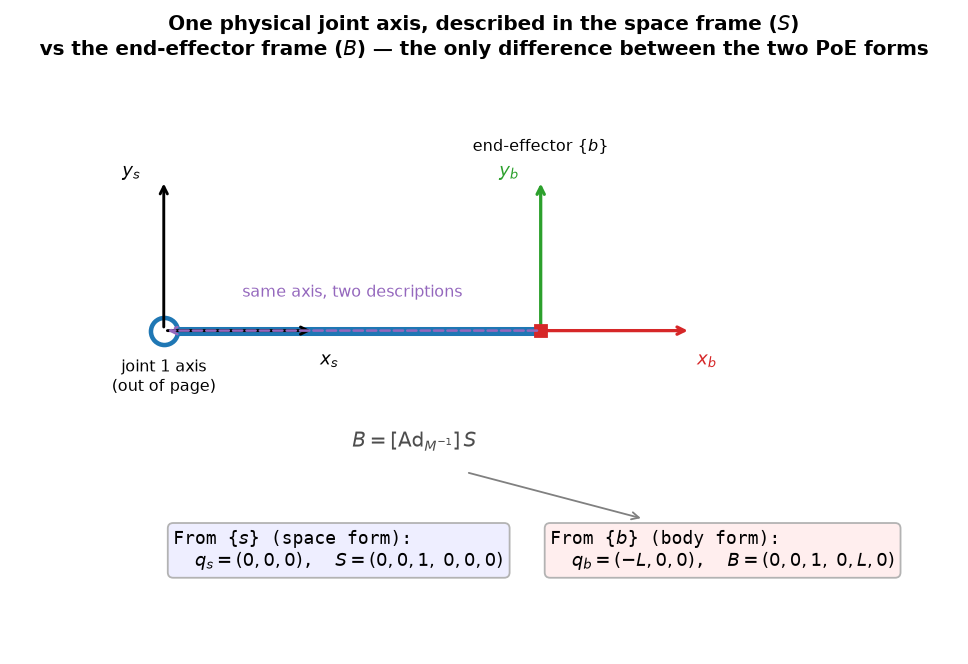

# 4b — Forward Kinematics: PoE body form + URDF

> Chapter 4.1.3–4.2 of *Modern Robotics*. The *same* forward kinematics as 4a,
> but with each joint's screw axis written in the **end-effector frame** instead
> of the base frame — plus a first look at **URDF**, the file format that
> actually loads a robot into ROS / a simulator.

---

## 1. The big picture — why a second form

In 4a (space form) we wrote each joint's screw `Sᵢ` in the **fixed base frame**
`{s}`. There's an equally valid choice: write each joint's screw in the
**end-effector (body) frame** `{b}`. That gives the **body form** of PoE:

```
SPACE form (4a):   T(θ) = e^{[S₁]θ₁} ⋯ e^{[Sₙ]θₙ} · M     (screws in {s}, on the LEFT of M)
BODY  form (4b):   T(θ) = M · e^{[B₁]θ₁} ⋯ e^{[Bₙ]θₙ}     (screws in {b}, on the RIGHT of M)
```

Same robot, same `T(θ)` — just a different bookkeeping frame. Why bother?

- It's the form that pairs naturally with the **body Jacobian** (Ch. 5), which
  is what you use when your reference is *the hand itself* — e.g. a camera or
  force sensor mounted on the end-effector, "move 5 cm along the gripper's own
  approach axis."
- It makes the symmetry of PoE explicit and deepens the "left vs right
  multiply" intuition from 4a.

Nothing here is conceptually new — it's 4a + the **adjoint** from 3b.

---

## 2. The core idea — describe each joint axis *from the hand*

A joint axis is a physical line in space. In 4a we described it from the base
(`Sᵢ`). Now describe the **same line** from the end-effector frame at home
(`Bᵢ`). That's the *only* change.



For the 1R arm from 4a (link length `L`, hinge at the base): from `{s}` the joint
sits at `q_s=(0,0,0)`, giving `S=(0,0,1, 0,0,0)`. From the hand frame `{b}` (which
sits at the tip, `L` ahead along `x_b` at home), the *same* joint axis is `L`
behind you: `q_b=(−L,0,0)`, giving `B=(0,0,1, 0,L,0)`. One physical axis, two
coordinate descriptions.

### Converting space → body: reuse the adjoint
You don't re-read the geometry from scratch. Changing a screw's frame is exactly
what 3b's **adjoint** does:

```
Bᵢ = [Ad_{M⁻¹}] Sᵢ
```

`M` is the home pose of `{b}` in `{s}`, so `M⁻¹ = T_bs` (home) converts a
space-frame screw into the body frame. (Quick check on the 1R arm:
`Ad_{M⁻¹}` with `M⁻¹` translating by `(−L,0,0)` turns `S=(0,0,1, 0,0,0)` into
`(0,0,1, 0,L,0) = B` — the `[p]R` lever-arm block injects the `L`. ✓ matches the
picture.)

### Why `M` moves to the *left* and screws to the *right*
This is the "left = world, right = self" rule from 4a in action. The `Bᵢ` live in
the **body frame**, and body-frame transforms are applied by **right-
multiplication**. So they stack to the *right* of `M`, and `M` (the home pose) now
sits on the far left as the anchor. The space form was the mirror image: `{s}`
screws, left-multiplied, `M` on the right.

---

## 3. Linear algebra you need here — none new, just the adjoint again

- **Adjoint `[Ad_T]`** (3b): converts a screw/twist between frames. Here
  `Bᵢ = [Ad_{M⁻¹}]Sᵢ`. That's the whole derivation.
- **Left vs right multiply** (4a): body screws → right-multiply. That's why the
  formula flips around `M`.

The book's one-line derivation just uses the identity `M e^{M⁻¹PM} = e^P M`
repeatedly to "push `M` left through" each exponential, turning every `[Sᵢ]` into
`M⁻¹[Sᵢ]M` — i.e. `[Bᵢ]`. We won't grind it; the adjoint statement
`Bᵢ=[Ad_{M⁻¹}]Sᵢ` is the takeaway.

---

## 4. The key formula and a useful symmetry

```
T(θ) = M · e^{[B₁]θ₁} e^{[B₂]θ₂} ⋯ e^{[Bₙ]θₙ},      Bᵢ = [Ad_{M⁻¹}] Sᵢ
```

A neat duality in how the two forms "build" the arm (book's observation):

- **Space form:** start at `M`, transform it by the **most distal** joint first,
  working **inward** to the base. A proximal joint's *space*-frame screw is
  unaffected by distal joint motion. (Joint 3 moving doesn't change `S₂`.)
- **Body form:** start at `M`, transform by the **first** joint, working
  **outward** to the tip. A distal joint's *body*-frame screw is unaffected by
  proximal motion. (Joint 2 moving doesn't change `B₃`.)

Either way: **you only ever read the screw axes at the zero (home) position.**
That invariance — `Sᵢ` immune to distal joints, `Bᵢ` immune to proximal joints —
is what makes both forms practical.

---

## 5. Worked example — 1R arm, body form (continues 4a)

`M = [I, (L,0,0)]`, `S = (0,0,1, 0,0,0)`.

1. **Convert:** `B = [Ad_{M⁻¹}]S = (0,0,1, 0,L,0)` (joint axis seen from the hand,
   `q_b=(−L,0,0)` → `v_b = −ω×q_b = (0,L,0)`).
2. **Forward kinematics:** `T(θ) = M · e^{[B]θ}`.

Both forms must agree: `M e^{[B]θ} = e^{[S]θ} M`. They do — for `θ=0.7` the tip
lands at the same `(1.530, 1.288)` either way. (Verified in `mr/se3.py`; you'll
re-derive a case like this by hand in the exercises.)

> Book Example 4.6 does the 6R arm in body form; its `Bᵢ` table is just
> `[Ad_{M⁻¹}]` applied to each `Sᵢ` from the 4a 6R example.

---

## 6. URDF — how a robot actually gets into a simulator

PoE (`M` + screw axes) is the *math*. **URDF (Universal Robot Description
Format)** is the *file* that real tools — ROS, and via converters MuJoCo / Isaac
— read to know a robot's structure. This is the bridge to your north star, so
it's worth meeting now.

A URDF is an XML file describing a robot as a **tree of links connected by
joints**:

- **Joints** connect a **parent** link to a **child** link. Types: `revolute`
  (with limits), `continuous` (revolute, no limits), `prismatic`, `fixed`. Each
  joint specifies:
  - an **origin** frame — the pose of the child link's frame relative to the
    parent's *when the joint is at zero* (the origin lies on the joint axis);
  - an **axis** — a unit 3-vector *in the child link's frame* giving the positive
    rotation (revolute) or translation (prismatic) direction.
- **Links** carry the **mass properties** (mass, center-of-mass frame, 3×3
  symmetric inertia matrix — only the 6 on/above-diagonal entries are stored).
  These don't matter for kinematics but become essential for **dynamics**
  (Ch. 8) and for rendering/collision geometry.

**Connection to what we've built:** URDF stores the kinematics in the *chained
joint-to-joint* style (each joint's origin = a transform from parent to child at
zero) — closer to 4a's Eq. (4.4) `T = T₀₁T₁₂⋯` / the D–H spirit than to PoE. But
the two are interconvertible: walk the tree multiplying the joint origin
transforms to get `M`, and read each joint's axis (pushed into the base or
end-effector frame) to get the `Sᵢ` or `Bᵢ`. In practice you'll load a URDF and a
library hands you screw axes — but now you'll know *what those numbers mean*.

> URDF describes **tree-structured** robots (serial arms, hands) — not closed
> loops like a Stewart platform (that's Ch. 7).

---

## 7. Gotchas & intuition checks

- **Body form flips the layout: `M` on the LEFT, screws on the RIGHT.** Because
  body-frame screws right-multiply ("right = self").
- **`Bᵢ = [Ad_{M⁻¹}]Sᵢ`** — one adjoint per screw converts the whole 4a table to
  the 4b table. No re-reading geometry (though you *can* read `Bᵢ` straight off
  the picture from the hand's viewpoint, as a check).
- **Read axes only at the home position** — `Sᵢ` is immune to distal joints,
  `Bᵢ` is immune to proximal joints.
- **Same `T(θ)` from both forms, always.** They're two routes to one pose.
- **Which to use?** Space form with the space Jacobian (world-referenced tasks);
  body form with the body Jacobian (hand-referenced tasks, e.g. eye-in-hand
  camera). You'll see this pairing in Ch. 5.
- **URDF ≈ chained joint transforms (D–H-ish), not PoE directly** — but
  convertible. Links add mass/inertia, needed from Ch. 8 on.

---

## 8. FAQ — to be filled in after discussion

*(Capture clarifying questions here, as in 03a §8 / 03b §11.)*

---

### Quick self-check before the exercises (answer these to yourself)
1. Why does `M` sit on the *left* in the body form but the *right* in the space
   form?
2. How do you get `Bᵢ` from `Sᵢ` without re-reading the geometry?
3. In the body form, which joints' displacements leave `B₃` unchanged — proximal
   or distal? Why does that let us read axes only at home?
4. In a URDF, what two things does a `joint` element specify, and in which
   frame is the axis given?
5. Is URDF storing PoE screw axes directly? If not, what *is* it storing, and
   how does it relate?
