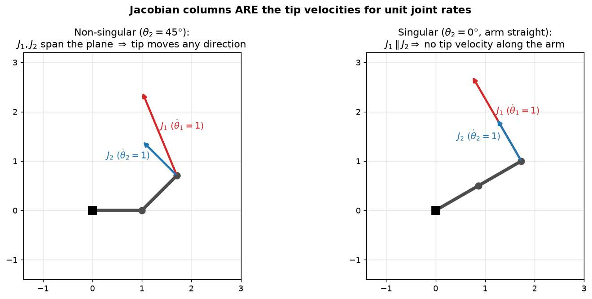
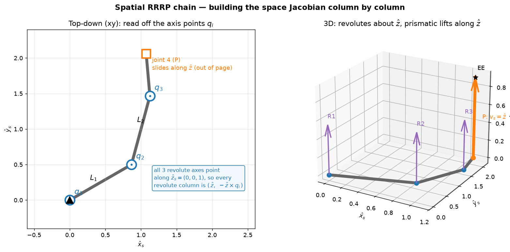

# 5a — The Jacobian & Velocity Kinematics (space + body)

> Chapter 5.1 of *Modern Robotics* (§5.1.1–5.1.4, plus the intro). Forward
> kinematics (Ch. 4) answered *"where is the hand?"*. The Jacobian answers the
> next question: *"if I spin the joints at these rates, how fast — and in what
> direction — does the hand move?"* It's the single most-used matrix in robot
> control. Built directly on twists/screws (3b) and the adjoint (3b).

---

## 1. The big picture — the Jacobian is the robot's "gearbox"

Forward kinematics is a *nonlinear* map `T(θ)`: bend the joints, get a pose.
Velocity kinematics is its **local linearization**. At any configuration `θ`,
the relationship between **joint velocities** `θ̇` and **end-effector velocity**
is *linear*:

```
   V = J(θ) θ̇
```

- `θ̇ ∈ ℝⁿ` — how fast each joint is turning/sliding right now (`n` = #joints).
- `V ∈ ℝ⁶` — the end-effector **twist** (3b): its angular + linear velocity,
  stacked as `V = (ω, v)`.
- `J(θ) ∈ ℝ⁶ˣⁿ` — the **Jacobian**. It depends on the *current pose* `θ` (the
  "gear ratio" changes as the arm folds and unfolds), but for a *frozen* `θ` it's
  just a constant matrix you multiply by.

Why this is *the* workhorse matrix for the north star:

- **Policies output end-effector motion.** A learned manipulation policy says
  "move the gripper 2 cm left and tilt 5°" — that's a desired `V`. The robot is
  commanded in **joint** space. The Jacobian (well, its inverse — Ch. 6) is the
  bridge: `θ̇ = J⁻¹ V`. This is the "policy → EE twist → joint rates" stack.
- **Forces too, for free.** The *transpose* `Jᵀ` maps an end-effector
  force/wrench to the joint torques that produce it: `τ = Jᵀ F`. That's the
  whole basis of force/impedance control (Ch. 11), the contact-rich regime
  manipulation lives in. (We cover statics in 5b.)
- **It tells you where the robot is crippled.** When `J` loses rank
  (a *singularity*), whole directions of motion become impossible. (5b.)

---

## 2. The core idea — *each column of J is a twist*

This is the one sentence to remember, and everything else is bookkeeping:

> **Column `i` of `J` is the end-effector twist you get when joint `i` moves at
> unit speed (`θ̇ᵢ = 1`) and every other joint is frozen.**

Why? Because `V = J θ̇` is just a weighted sum of the columns:

```
   V = J₁ θ̇₁ + J₂ θ̇₂ + ⋯ + Jₙ θ̇ₙ
```

Set `θ̇ = (1,0,…,0)` and you get `V = J₁`. So `J₁` *is* the twist from joint 1
alone, `J₂` the twist from joint 2 alone, and so on. The full motion is just the
**superposition** of the individual joint contributions — each joint adds its own
twist, scaled by how fast it's turning. (Velocities add linearly; that's the
whole reason a *matrix* captures this.)



**Left:** a 2R planar arm. The red arrow is the tip velocity when only joint 1
spins (`θ̇₁=1`) — that's `J₁`. The blue arrow is the tip velocity when only
joint 2 spins — that's `J₂`. They point in different directions, so by mixing
`θ̇₁` and `θ̇₂` you can send the tip *anywhere* in the plane. **Right:** straighten
the arm (`θ₂=0`) and the two arrows become **parallel** — now every reachable tip
velocity lies along that one line. The tip *cannot* move along the arm's length,
no matter how you drive the joints. That collapse is a **singularity** (5b).

And here's the beautiful part connecting to Ch. 4: **a column of `J` is literally
a joint's screw axis (3b), expressed in the current configuration.** In Ch. 4 you
read each joint's screw `Sᵢ` *at the home pose* `θ=0`. The Jacobian is the *same
screws*, but moved to where the joint axes actually are *right now* at the current
`θ`. That "move the screw to where it is now" operation is the **adjoint**.

---

## 3. Linear algebra you need here

Three pieces. The first two you already own; the third is the only new habit.

### (a) A matrix times a vector = a weighted sum of columns
`J θ̇` can be read two ways. Row-wise ("dot each row with `θ̇`") is the mechanical
view. The useful view here is **column-wise**:

```
   J θ̇  =  θ̇₁·(col 1)  +  θ̇₂·(col 2)  +  ⋯  +  θ̇ₙ·(col n)
```

The output `V` is a **linear combination of the columns of `J`**. So the set of
*all* achievable twists (over all choices of `θ̇`) is exactly the **column space**
(span) of `J`. This single fact drives everything: if the columns span all of
ℝ⁶, the end-effector can move any way it likes; if they only span a 4-D subspace,
two directions of motion are forbidden. **Rank of `J` = number of independent
directions the end-effector can move.**

### (b) The adjoint `[Ad_T]` — "re-express a twist in another frame" (from 3b)
Recall from 3b: a twist `V` written in one frame can be converted to another
frame by the `6×6` **adjoint matrix** of the transform between them,
`V' = [Ad_T] V`. Geometrically it does two jobs at once: **rotate** the angular
and linear parts into the new frame's orientation, and add the **lever-arm
cross-term** (`[p]R` block) that accounts for the frames being at different
*locations* (a screw axis that's offset from you looks like it has extra linear
velocity). The key algebraic facts we'll lean on:

```
   [Ad_X][Ad_Y] = [Ad_XY]          (composes like the transforms do)
   [Ad_T]⁻¹     = [Ad_{T⁻¹}]
```

That's all the adjoint algebra the Jacobian needs.

### (c) Why a *velocity* is a twist, not just `dx/dt`
Tempting to think "EE velocity = derivative of its position." For the **linear**
part that's nearly right, but a rigid body also has an **angular velocity**, and
the two are bundled into the 6-vector twist `V=(ω,v)`. Crucially, `v` is **not**
the velocity of the EE origin in general — it's the screw's linear component (the
velocity of the *body-fixed point currently at the space/body origin*), exactly
the same subtlety as in 3b. We'll flag where this bites.

---

## 4. The two Jacobians — space and body

Because a twist can be written in the fixed frame `{s}` or the body frame `{b}`
(3b), there are two Jacobians, differing only by which frame their columns
(twists) live in.

### Space Jacobian `J_s` — columns are screws in `{s}`
From the space-form PoE `T = e^{[S₁]θ₁}⋯e^{[Sₙ]θₙ} M`, the columns are:

```
   J_{s1} = S₁                                    (first joint: unchanged)
   J_{si}(θ) = [Ad_{ e^{[S₁]θ₁} ⋯ e^{[Sᵢ₋₁]θᵢ₋₁} }] Sᵢ      for i ≥ 2
```

**Read it geometrically, ignore the algebra.** `Sᵢ` is joint `i`'s screw at home
(Ch. 4). The product of exponentials `T_{i-1} = e^{[S₁]θ₁}⋯e^{[Sᵢ₋₁]θᵢ₋₁}` is the
rigid motion that the *inboard* joints `1…i-1` have undergone to reach the current
pose. Applying its adjoint `[Ad_{T_{i-1}}]` to `Sᵢ` **carries joint `i`'s screw
axis from its home location to where it physically sits now**. That's the whole
formula:

> **`J_{si}` = joint `i`'s screw axis, expressed in `{s}`, at the current `θ`.**

Joint 1 is never displaced by anything inboard (nothing is inboard of it), so
`J_{s1} = S₁`, constant. Joint 2 is carried by joint 1's motion. Joint `i` is
carried by joints `1…i-1`. Outboard joints don't affect joint `i`'s axis, so they
never appear in `J_{si}` — only the inboard ones.

### Body Jacobian `J_b` — columns are screws in `{b}`
From the body-form PoE `T = M e^{[B₁]θ₁}⋯e^{[Bₙ]θₙ}` (note `M` is on the *left*),
the columns run the *other way*:

```
   J_{bn} = Bₙ                                    (last joint: unchanged)
   J_{bi}(θ) = [Ad_{ e^{-[Bₙ]θₙ} ⋯ e^{-[Bᵢ₊₁]θᵢ₊₁} }] Bᵢ    for i < n
```

Mirror image of the space case. `Bᵢ` is joint `i`'s screw at home **in the body
frame**. Now the *outboard* joints `i+1…n` are the ones that move the body frame
relative to joint `i`, so the adjoint carries joint `i`'s axis using the **inverse**
of the outboard motion (note the minus signs in the exponents). The last joint
`n` is never displaced *relative to the body frame* by anything outboard (nothing
is), so `J_{bn} = Bₙ`, constant.

| | space `J_s` | body `J_b` |
|---|---|---|
| columns are screws in | fixed frame `{s}` | end-effector frame `{b}` |
| constant column | **first** (`J_{s1}=S₁`) | **last** (`J_{bn}=Bₙ`) |
| adjoint uses | **inboard** joints `1…i-1` | **outboard** joints `i+1…n` |
| pairs with PoE form | `e^{[S₁]θ₁}⋯e^{[Sₙ]θₙ}M` | `M e^{[B₁]θ₁}⋯e^{[Bₙ]θₙ}` |

### They're two views of the same thing
Just as `V_s = [Ad_{T_{sb}}] V_b` relates the twists (3b), the Jacobians satisfy:

```
   J_s(θ) = [Ad_{T_{sb}}] J_b(θ)        J_b(θ) = [Ad_{T_{bs}}] J_s(θ)
```

(Makes sense: each *column* is a twist, and each column gets re-framed by the same
adjoint.) **Consequence:** since the adjoint is always invertible, `J_s` and `J_b`
**always have the same rank** — singularities are a property of the *robot's
configuration*, not of which frame you picked. Good: "can the arm move this
direction?" can't depend on bookkeeping.

---

## 5. Worked example — space Jacobian of an RRRP chain (book Example 5.2)

A spatial chain: three revolute joints all about `ẑ_s` (a planar 3R arm in the
`xy`-plane), then a prismatic joint that **slides along `ẑ_s`** (lifting the tip
up out of the plane). Link lengths `L₁, L₂`. Shorthand `c₁=cosθ₁`, `s₁=sinθ₁`,
`c₁₂=cos(θ₁+θ₂)`, etc.



**Left (top-down `xy`):** all three revolute axes point straight out of the page
along `ẑ_s`, so each revolute column is `(ẑ, −ẑ×qᵢ)` — and the figure shows
exactly where each axis point `qᵢ` sits at this `θ`. The lever arm `qᵢ` grows as
you walk outboard (origin → elbow → wrist), which is the *only* thing that
changes between the three revolute columns. **Right (3D):** the prismatic 4th
joint slides along `ẑ`, lifting the end-effector out of the arm's plane — a pure
translation, so its column is `(0, ẑ)` with no lever arm at all.

We build `J_s` **column by column**, each column = "joint `i`'s screw, in `{s}`,
at current `θ`". For a revolute joint, `ω_s` = axis direction, `v_s = −ω_s × q`,
with `q` *any* current point on the axis.

**Column 1 (joint 1, revolute about `ẑ`):** nothing inboard, so it's just `S₁`.
Axis through the origin → `q₁=0`.
```
   ω_{s1} = (0,0,1),   v_{s1} = −ω₁×q₁ = (0,0,0)
   J_{s1} = (0,0,1, 0,0,0)
```

**Column 2 (joint 2, revolute about `ẑ`):** joint 1 has rotated it. Direction
still `ẑ` (rotating about `ẑ` keeps `ẑ` fixed), but its *location* moved to the
elbow at `q₂ = (L₁c₁, L₁s₁, 0)`.
```
   ω_{s2} = (0,0,1),   v_{s2} = −ω₂×q₂ = (L₁s₁, −L₁c₁, 0)
```
(Check: `(0,0,1)×(L₁c₁,L₁s₁,0) = (−L₁s₁, L₁c₁, 0)`; negate → `(L₁s₁,−L₁c₁,0)`. ✓)

**Column 3 (joint 3, revolute about `ẑ`):** carried by joints 1 and 2. Direction
`ẑ` again; location at the next joint `q₃ = (L₁c₁+L₂c₁₂, L₁s₁+L₂s₁₂, 0)`.
```
   ω_{s3} = (0,0,1),   v_{s3} = (L₁s₁+L₂s₁₂, −L₁c₁−L₂c₁₂, 0)
```

**Column 4 (joint 4, prismatic along `ẑ`):** a slider has `ω=0` and `v` = the
slide *direction* in `{s}` (an infinite-pitch screw, 3b). Here it slides along
`ẑ_s`, so:
```
   ω_{s4} = (0,0,0),   v_{s4} = (0,0,1)
   J_{s4} = (0,0,0, 0,0,1)
```
No lever arm `q` at all — that's the whole difference between a revolute column
(carries a moving `q`) and a prismatic column (pure direction).

Stacking the four columns side by side gives the full `J_s(θ) ∈ ℝ⁶ˣ⁴`:
```
        ⎡ 0     0          0        0 ⎤   ← ω_x
        ⎢ 0     0          0        0 ⎥   ← ω_y
   J_s =⎢ 1     1          1        0 ⎥   ← ω_z
        ⎢ 0   L₁s₁    L₁s₁+L₂s₁₂    0 ⎥   ← v_x
        ⎢ 0  −L₁c₁  −L₁c₁−L₂c₁₂     0 ⎥   ← v_y
        ⎣ 0     0          0        1 ⎦   ← v_z
          J_{s1} J_{s2}   J_{s3}  J_{s4}
```
Read it against the picture: the three revolute columns share the **same top
half** `ω=(0,0,1)` (all spin about `ẑ`) and differ only in their `v` rows — the
growing lever arms `q₂, q₃` from the figure. The prismatic column is the lone
`(0,0,0,0,0,1)`. Three columns sharing an `ω` is exactly the kind of structure
that makes a chain go singular easily — three "parallel `ẑ`" rotations can only
do so much. We'll exploit that in 5b.

> **The method in one line:** for each joint, write down its axis direction `ω`
> *now* and a point `q` on it *now*, then the column is `(ω, −ω×q)` (revolute) or
> `(0, v̂)` (prismatic). The adjoint formula is just the bookkeeping that produces
> these "now" quantities automatically — but by hand you can often read `ω` and
> `q` straight off the geometry.

---

## 6. Inverse velocity (the forward look to Ch. 6)

We answered "joints → twist." The inverse — "I want twist `V`, what `θ̇`?" — is
`θ̇ = J⁻¹(θ) V` **when `J` is square (`n=6`) and full rank**. Three cases:

- **`n = 6`, nonsingular:** unique `θ̇ = J⁻¹V`. The clean case.
- **`n < 6`:** not enough joints; most twists `V` are simply unreachable.
- **`n > 6` (redundant):** infinitely many `θ̇` give the same `V`; the extra
  freedoms are **internal motions** (move your elbow while your palm stays put on
  the table). This is where pseudo-inverses and null-space tricks come in (Ch. 6).

Near a singularity `J⁻¹` blows up — tiny EE motions demand enormous joint speeds.
That's the practical reason singularities matter on real hardware, and why 5b
spends time measuring "how close to singular am I" (manipulability).

---

## 7. Gotchas & intuition checks

- **A column of `J` is a twist (6-vector), not a scalar gear ratio.** `V = Σ Jᵢ θ̇ᵢ`.
- **`J` depends on `θ`.** It's a *local* linearization; recompute it as the arm
  moves. (Cheap: it's just adjoints of the current FK.)
- **Space vs body is only a frame choice.** Same robot, same rank, same
  singularities; `J_s = [Ad_{T_{sb}}] J_b`.
- **The constant column is at opposite ends:** `J_{s1}=S₁` (first) for space,
  `J_{bn}=Bₙ` (last) for body. Easy to mix up — tie it to "which joints can
  displace this axis relative to my frame."
- **`v` in a column is the screw's linear part, not the EE-origin velocity.**
  Same trap as twists in 3b. For the *actual* point-velocity of the gripper
  origin, the body Jacobian's `v_b` rotated into `{s}` is usually what you want
  (we'll see this in the analytic-Jacobian aside / 5b).
- **Revolute column = `(ω, −ω×q)`; prismatic column = `(0, v̂)`.** Memorize this;
  it's the by-hand shortcut that sidesteps the adjoint algebra.
- **More joints than 6 ≠ "can do more with the EE."** It just adds internal
  motions. The EE twist still lives in (at most) 6-D.

---

## 8. FAQ — captured from discussion

**Q1. What exactly is the rank of a matrix — is it "the number of non-collinear
columns"?** Close, but "non-collinear" is only the two-vector version. Rank =
the **dimension of the space the columns span** = the number of **linearly
independent** columns. A column is redundant if it's *any* linear combination of
the others (not just a scalar multiple of one). Example: `(1,0), (0,1), (1,1)`
are pairwise non-collinear, yet the third `= a+b`, so they span only a plane →
rank 2. Geometrically: 1 independent direction → a line (rank 1), 2 → a plane
(rank 2), etc. For the Jacobian this is the whole game: achievable EE twists =
column space of `J`, so **rank `J` = number of independent directions the
end-effector can instantaneously move**. Losing a rank = losing a motion
direction = a singularity. Also: `rank ≤ min(rows, cols)`, and a *square* `J`
that isn't full rank is exactly a "singular" (non-invertible) matrix. (See §2,
§3a; expanded in 5b.)

**Q2. Could I get column `i` by taking the home screw `Sᵢ` and applying the
adjoint of the inboard PoE product, instead of reading `ω,q` off directly?**
Yes — those are the *same* thing, and the adjoint route **is** the textbook
formula `J_{si} = [Ad_{e^{[S₁]θ₁}⋯e^{[Sᵢ₋₁]θᵢ₋₁}}] Sᵢ`. Example 5.2 just does that
adjoint "in your head" by reading the displaced `ω` and `q` off the geometry (the
book says the `[Ad]` matrices are *implicit*). Concrete check for the RRRP
column 2: home screw `S₂=(0,0,1,0,−L₁,0)`; only joint 1 is inboard, so
`T₁=Rot(ẑ,θ₁)` and (rotation about the origin → adjoint is block-diagonal `R`)
`[Ad_{T₁}]S₂` rotates the lever arm to `(L₁s₁,−L₁c₁,0)` — identical to the direct
result. Note the adjoint was trivial only because joint 1's axis passes through
the origin (`p=0`); an *offset* inboard joint makes the adjoint's `[p]R`
cross-term fire, and that cross-term *is* the `−ω×q` lever-arm velocity. (See §4,
§5.)

**Q3. In the real world, how is `J` actually computed?** For **serial/open
chains** (this chapter): recompute it analytically **every control cycle** — it's
just a few adjoints and is essentially free. That's what `mj_jac` (MuJoCo),
Pinocchio, Drake, KDL all do; in the learning world you instead **autodiff
through FK** (or finite-difference as a check). Nobody precomputes/interpolates a
serial Jacobian. For **closed/parallel chains (delta robots, Ch. 7)** the
column-is-a-screw picture breaks: you differentiate the **loop-closure
constraint** `g(x,θ)=0` to get `A ẋ = B θ̇`, so `J = A⁻¹B` (and you get *two*
singularity types, from `A` vs `B`). A delta has a clean closed-form `J=A⁻¹B`;
the common engineering shortcut of **sampling `J` on a grid and interpolating**
(constant-time, microcontroller-friendly) trades accuracy for speed and is
risky near singularities where `A⁻¹` changes fast. We'll derive the delta `J`
properly in Ch. 7.

**Q4. Frames in `τ = Jᵀ F` — does `Js` give torques "in `{s}`" and `Jb` torques
"in `{b}`"?** No — **`τ` is frame-free.** It's a vector of per-joint scalar
torques (one number per motor), living in joint space ℝⁿ; there's nothing to
rotate, so there's no "`τ` in `{s}`." The frame rule is about the **input
wrench**: match `F`'s frame to `J`'s frame. `τ = Jsᵀ F_s = Jbᵀ F_b` give the
**same** `τ`. Reason: power `τᵀθ̇ = F_sᵀV_s = F_bᵀV_b` is frame-invariant; and
explicitly, `Jb=[Ad_{Tbs}]Js` while `F_s=[Ad_{Tbs}]ᵀF_b`, so the two adjoints are
transposes and cancel in `Jbᵀ F_b = Jsᵀ F_s`. Practical: a wrist F/T sensor
reports `F_b` → use `Jbᵀ`; a world-specified force is `F_s` → use `Jsᵀ`. (Full
statics in 5b.)

---

### Quick self-check before the exercises
1. In `V = J θ̇`, what *is* column `i` of `J`, physically?
2. Why does the achievable set of end-effector twists equal the column space of
   `J`? What does it mean for `J` to "lose rank"?
3. For the space Jacobian, which joints' angles appear in column `i`, and what
   operation moves joint `i`'s home screw to its current location?
4. What's different about the *body* Jacobian — which column is constant, and why?
5. A revolute joint's axis currently points along `ω` and passes through point `q`.
   Write its Jacobian column. Now make it prismatic along `v̂` — what's the column?
6. Why must `J_s` and `J_b` have the same rank?
