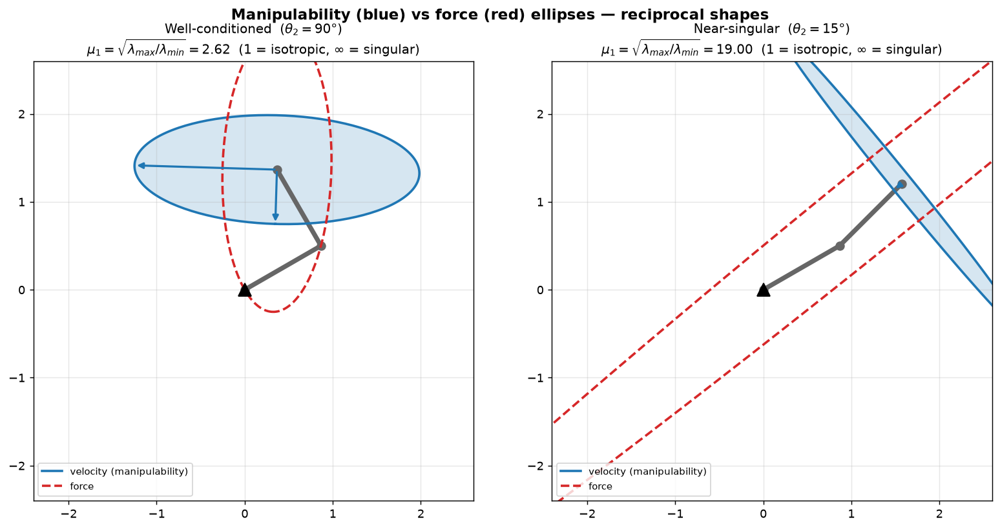

# 5b — Statics, Singularities & Manipulability

> Chapter 5.2–5.4 of *Modern Robotics*. With the Jacobian `J(θ)` in hand (5a),
> three payoffs fall out almost for free, all from the *same* matrix:
> **(1) statics** — what joint torques hold an external force (`τ = Jᵀ F`);
> **(2) singularities** — configurations where `J` loses rank and the arm goes
> lame in some direction; **(3) manipulability** — a quantitative "how close to
> singular am I, and in which directions?" via the *shape* of `J`.

---

## 1. The big picture — one matrix, three questions

In 5a, `J` answered "joint rates → end-effector twist," `V = J θ̇`. The same
`J(θ)`, looked at three more ways, answers:

- **Statics (§2):** freeze the robot against an external push. The *transpose*
  `Jᵀ` maps an end-effector wrench to the joint torques that balance it,
  `τ = Jᵀ F`. This is the velocity story run backwards through the transpose —
  and it's the foundation of force/impedance control (Ch. 11).
- **Singularities (§3):** poses where `J` drops rank. The end-effector *loses the
  ability to move* (or resist force) in some direction. Practically, these are
  the places where control blows up.
- **Manipulability (§4):** rank is a yes/no flag, but "nearly singular" is a
  spectrum. Map a ball of joint rates through `J` and you get an **ellipsoid** of
  end-effector velocities. Its shape — fat and round vs. thin and flat — tells
  you exactly how well-conditioned the pose is, and along which directions motion
  is easy or hard.

All three matter for the north star: a learned policy commands EE motions/forces,
and the controller underneath has to know when those commands are cheap, when
they're expensive, and when they're impossible.

---

## 2. Statics — `τ = Jᵀ F`

**The setup.** The robot is at rest (static equilibrium) holding a configuration
`θ`. Someone pushes on the end-effector with a wrench. What joint torques `τ` do
the motors need to *exactly balance* that push so nothing moves?

**The answer, from conservation of power.** If no power goes into *moving* the
robot (it's static), then power in at the joints = power out at the tip:

```
   τᵀ θ̇  =  Fᵀ V       for all joint rates θ̇
```

`τᵀθ̇` is mechanical power at the joints (torque × angular rate, summed). `FᵀV` is
power at the tip (wrench · twist — the 6-D dot product from 3c). Substitute
`V = J θ̇`:

```
   τᵀ θ̇ = Fᵀ J θ̇   for all θ̇   ⟹   τ = Jᵀ F        (5.26)
```

That's it. The matrix that maps joint rates *forward* to tip velocity (`J`) maps
tip force *backward* to joint torques **through its transpose** (`Jᵀ`).

**Why a transpose, intuitively.** `J` is `6×n`, so `Jᵀ` is `n×6`: it eats a
6-vector wrench `F` and spits out an `n`-vector of joint torques `τ`. Row `i` of
`Jᵀ` is *column `i` of `J`* — joint `i`'s screw axis. So:

```
   τᵢ = (column i of J) · F = Jᵢ · F
```

**Joint `i`'s torque is the dot product of its own screw axis with the applied
wrench.** That's exactly right physically: a force does work against joint `i`
only to the extent it pushes *along* joint `i`'s motion direction. A force
perpendicular to what a joint can do produces zero torque on it. (Think of pushing
a door exactly toward its hinge line — no twisting effect on the hinge.)

**Frames (important subtlety):** `τ` is **frame-free** — it's `n` scalar motor
torques, not a spatial vector, so there's no "torque in `{s}`." The frame rule is
on the *input*: match `F`'s frame to `J`'s frame. `τ = Jsᵀ F_s = Jbᵀ F_b` give
the **same** `τ`. (Wrist F/T sensor → `F_b`, use `Jbᵀ`; world-specified force →
`F_s`, use `Jsᵀ`. See 5a FAQ Q4.)

**The four cases of `τ = Jᵀ F`** (mirror of the inverse-velocity cases in 5a §6):

| joints `n` | `Jᵀ` shape | what you can do |
|---|---|---|
| `n = 6`, nonsingular | `6×6` invertible | both directions: `τ=JᵀF` **and** `F=J⁻ᵀτ` |
| `n < 6` | tall | not every external wrench can be resisted by torques alone (the structure carries the rest) |
| `n > 6` (redundant) | wide | many `τ` resist the same `F`; spare torques cause internal motions |

**The suitcase intuition (book).** Hold a heavy suitcase with your arm hanging
straight down, elbow locked (a singularity). The weight passes *straight through*
your joints, so it produces almost **no torque** about them — your skeleton bears
it, not your muscles. That's the force payoff of a singularity: you can resist
huge forces along the "locked" direction for free. The flip side (next section)
is you can't *move* the tip in that direction at all.

---

## 3. Singularities — where `J` loses rank

**Definition.** A configuration `θ` is a **kinematic singularity** if `rank J(θ)`
is *less than its maximum*. For a 6-DOF spatial arm, max rank is 6; a singularity
is any pose where it drops to 5 or below.

**What it means physically** (recall 5a §3a: achievable twists = column space of
`J`):

- Full rank → columns span all 6 twist directions → tip can move/rotate any way.
- Rank drops by 1 → the span collapses to a 5-D subspace → there's a direction the
  tip **cannot move**, no matter how you drive the joints. Two columns (joint
  screws) have become linearly dependent — one joint's instantaneous motion is now
  just a combination of the others', so it adds nothing new.

The 2R example from 5a made this visible: straighten the arm and `J₁ ∥ J₂` — the
two columns collinear, rank 2 → 1, and the tip loses the ability to move along the
arm's length. **Same rank in either frame:** since `Jb = [Ad]Js` and the adjoint
is invertible, `J_s` and `J_b` always have equal rank — singularity is a property
of the *configuration*, not the frame (5a §4).

**Common singularity types** (worth pattern-matching by eye — the book catalogs
these, and you spot them from the screw structure, not by computing a determinant):

1. **Two collinear revolute axes** — both joints do the *same* rotation; one is
   redundant.
2. **Three coplanar, parallel revolute axes** (the 2R-straight case generalized) —
   their screws can't span enough.
3. **Four revolute axes intersecting a common point.**
4. **Four coplanar revolute axes.**
5. **Six revolute axes intersecting a common line** — every `vᵢ = −ωᵢ×qᵢ` loses
   its component along that line; a whole row of `J` collapses.

The unifying trick: when several joint screws *share* something (a common axis,
plane, point, or line), their columns can't be independent, and `J` goes singular.
In the RRRP example (5a §5) all three revolute columns shared `ω=(0,0,1)` — that
shared structure is precisely what makes such a chain prone to singularity.

**Why you care on real hardware.** Near a singularity, inverse velocity
`θ̇ = J⁻¹V` blows up: a small commanded tip motion in the "lost" direction demands
enormous joint speeds. Controllers go unstable, motors saturate. So we don't just
want the *binary* "singular or not" — we want a *continuous* warning. That's
manipulability.

---

## 4. Manipulability — the *shape* of `J`

### The idea
Take all joint-rate vectors of unit size, `‖θ̇‖ = 1` (a **sphere** in
`n`-dim joint-rate space — an "equal effort" budget). Push them through `J`. The
images `V = J θ̇` trace out an **ellipsoid** in twist space — the
**manipulability ellipsoid**. Its shape tells you everything:

- **Long axis** → a direction the tip moves *fast* for unit joint effort (easy).
- **Short axis** → a direction it moves *slowly* (hard).
- **Round (isotropic)** → equally easy everywhere; far from singular, ideal.
- **Flattened to a pancake/sliver** → nearly singular; the collapsed axis is the
  direction about to become impossible.



**Left:** elbow at 90° — the velocity ellipse (blue) is fat and fairly round
(`μ₁ = 2.62`), the tip moves easily in all directions. **Right:** elbow nearly
straight (15°) — the ellipse collapses toward a **sliver** perpendicular to the
arm (`μ₁ = 19`); the tip can barely move along the arm. The **force ellipse**
(red, dashed) is the *reciprocal* — long exactly where the velocity ellipse is
short. Near the singularity it balloons along the arm: easy to *push* hard in the
direction you can't *move*. (That's the locked-elbow suitcase, quantified.)

### Linear algebra you need here — eigenvectors as ellipsoid axes

This is the chapter's big new LA tool, so let's go slow.

**Step 1 — where the ellipsoid equation comes from.** Start from the unit-effort
condition and substitute `θ̇ = J⁻¹ V` (assume `J` invertible for intuition):

```
   1 = ‖θ̇‖² = θ̇ᵀθ̇ = (J⁻¹V)ᵀ(J⁻¹V) = Vᵀ (JJᵀ)⁻¹ V = Vᵀ A⁻¹ V,   A ≡ JJᵀ
```

So the reachable twists satisfy `Vᵀ A⁻¹ V = 1`. This kind of expression
`(vector)ᵀ(matrix)(vector)` is a **quadratic form**, and when the matrix is
symmetric positive-definite, the solution set is an **ellipsoid**. (Compare the
unit circle `x² + y² = 1`, which is `xᵀ I x = 1` — the special case `A = I`,
a sphere. A general `A` stretches that sphere into an ellipsoid.)

**Step 2 — what `A = JJᵀ` is.** It's `6×6` (or `m×m`), **symmetric** (`(JJᵀ)ᵀ =
JJᵀ`) and **positive semidefinite** (`VᵀJJᵀV = ‖JᵀV‖² ≥ 0`). Symmetric matrices
have a magical property we lean on next.

**Step 3 — eigenvectors and eigenvalues, geometrically.** An **eigenvector** of
`A` is a special direction `vᵢ` that `A` does **not rotate** — it only *stretches*
it: `A vᵢ = λᵢ vᵢ`. The stretch factor `λᵢ` is the **eigenvalue**. Most vectors
get rotated *and* stretched when you hit them with a matrix; eigenvectors are the
rare directions that stay put in direction. For a **symmetric** `A`, two gifts:
(a) the eigenvalues are real and the eigenvectors are **mutually perpendicular**,
so they form a clean set of axes; (b) `A` acts as "pure stretch along these
perpendicular axes" — exactly the recipe for an ellipsoid.

**Step 4 — read the ellipsoid off the eigendecomposition.** For
`Vᵀ A⁻¹ V = 1`:

```
   principal axis directions  =  eigenvectors  vᵢ  of A
   principal semi-axis lengths =  √λᵢ           (λᵢ = eigenvalues of A)
```

So the ellipsoid points along `A`'s eigenvectors, and is `√λᵢ` long in each. Big
`λ` → long axis → easy motion; small `λ` → short axis → hard motion. At a
singularity some `λ → 0`: an axis length → 0, the ellipsoid loses a dimension
(pancake), and that's the lost motion direction. *(This is exactly the **SVD** of
`J` in disguise: the ellipsoid axes are `J`'s left singular vectors and the
lengths are its singular values `σᵢ = √λᵢ`. Same picture, two names.)*

### Scalar measures (one number for "how good is this pose")

Let `λ_max, λ_min` be the largest/smallest eigenvalues of `A = JJᵀ`:

| measure | formula | good value | meaning |
|---|---|---|---|
| `μ₁` (aspect ratio) | `√(λ_max/λ_min)` | **near 1** | ratio of longest to shortest axis; `1` = perfectly round, `∞` = singular |
| `μ₂` (condition number) | `λ_max/λ_min` = `μ₁²` | **near 1** | sensitivity / numerical conditioning of `J` |
| `μ₃` (volume) | `√(λ₁λ₂⋯) = √det A` | **larger** | proportional to ellipsoid volume — overall "reach rate" |

`μ₁, μ₂` measure *shape* (roundness — close to 1 is good); `μ₃` measures *size*
(bigger is better). As you approach a singularity, `μ₁, μ₂ → ∞` and `μ₃ → 0`.

**Angular vs linear:** a 6-D twist mixes rad/s (top 3) and m/s (bottom 3) — units
don't match, so a combined 6-D ellipsoid is unit-salad. In practice you split `J`
into `Jω` (top 3 rows) and `Jv` (bottom 3) and draw **two** 3-D ellipsoids,
`A = JωJωᵀ` for angular and `A = JvJvᵀ` for linear. For the linear one you
usually use the **body** Jacobian (you care about the velocity of the *gripper*
point, the body origin — 5a §3c).

### Force ellipsoid — the reciprocal

Run the same construction from `τ = JᵀF` with `‖τ‖ = 1`, and you get a **force
ellipsoid** with matrix `B = (JJᵀ)⁻¹ = A⁻¹`. Since `A⁻¹` has the **same
eigenvectors** as `A` but **reciprocal eigenvalues** `1/λᵢ`, the force ellipsoid
has the **same axes** as the velocity ellipsoid but semi-axis lengths `1/√λᵢ`.
Consequence, visible in the figure:

> **Easy to move = hard to push, and vice versa.** Where the velocity ellipsoid
> is long (easy motion), the force ellipsoid is short (weak force), because the
> joints are "geared for speed" there. Near a singularity the velocity ellipsoid
> collapses (can't move) while the force ellipsoid blows up (can resist huge
> loads) — the locked-elbow suitcase, made quantitative. The product of the two
> volumes is *constant*, independent of `θ`.

---

## 5. Gotchas & intuition checks

- **`τ = Jᵀ F` is the velocity map run backwards through the transpose**, not the
  inverse. `J` forward maps rates→twist; `Jᵀ` maps wrench→torque. No inversion, so
  it works for *any* `n` (even redundant arms).
- **`τᵢ = Jᵢ · F`** — each joint torque is its screw column dotted with the wrench.
  Force ⟂ joint's motion → zero torque on that joint.
- **`τ` has no frame; `F` does.** Match `F` to your `J`'s frame; `Jsᵀ F_s = Jbᵀ F_b`.
- **Singularity = rank drop = a lost direction**, the *same* in space or body
  frame. Spot them from *shared* joint-screw structure (collinear/coplanar/
  concurrent axes), not by grinding a determinant.
- **Manipulability ellipsoid axes = eigenvectors of `A = JJᵀ`, lengths = `√λᵢ`.**
  Round (μ₁≈1) good; sliver (μ₁→∞) near-singular. This *is* the SVD of `J`.
- **Don't mix angular and linear units** — make two ellipsoids (`JωJωᵀ`, `JvJvᵀ`).
- **Force ellipsoid = reciprocal of velocity ellipsoid** (same axes, `1/√λ`
  lengths). Fast directions are weak directions.
- **Why it matters for control:** μ₁/μ₂ are an early-warning gauge; redundant arms
  (Ch. 6) actively steer `θ` to *maximize* manipulability and stay away from
  singularities while still hitting the task.

---

## 6. FAQ — captured from discussion

**Q1. What are the axes in the manipulability-ellipse figure?** Two spaces are
overlaid. The **gridded background** is Cartesian *position* (meters) — where the
arm is drawn. The **ellipse** lives in *velocity* space `(ẋ₁,ẋ₂)` (m/s): it's
the set of tip velocities for unit joint effort `‖θ̇‖=1`, translated to sit at the
tip so you read it as arrows-from-the-tip (direction = which way the tip moves,
length-from-center = how fast). They share one picture only because in 2-D a
velocity *direction* matches a position *direction*; the units differ. The red
force ellipse is yet another space (newtons), sharing only directions.

**Q2. A 2-D Jacobian has 2 eigenvectors — does a 3-D one have 3?** Yes, but the
eigenvectors belong to **`A = JJᵀ`**, not to `J` (eigenvectors need a square
matrix; `J` is `m×n` and usually isn't). The count of ellipsoid axes = `m` = the
**number of rows of `J`** = dimension of the velocity space = size of `A` — *not*
the number of joints `n`. So a 3-row Jacobian → `A` is `3×3` → 3 perpendicular
eigenvectors → a 3-axis ellipsoid, for *any* `n ≥ 3`. (The spectral theorem
guarantees a symmetric `m×m` matrix always has `m` real, orthogonal
eigenvectors.) This is why §4 splits the 6-D twist into `Jω`/`Jv` → two clean 3-D
ellipsoids.

**Q3 (optional / parked). Why is the ellipsoid "the SVD of `J`"?** The
manipulability ellipsoid is by definition the image of the unit joint-rate sphere
under `J`, and the SVD `J = UΣVᵀ` is exactly the statement "every matrix =
rotate→stretch→rotate," i.e. it maps a sphere to an ellipsoid with axes along the
left singular vectors `uᵢ` (= columns of `U`) and half-lengths the singular values
`σᵢ`. Plugging the SVD into `A = JJᵀ = U(ΣΣᵀ)Uᵀ` shows `A`'s eigenvectors are
those same `uᵢ` and its eigenvalues are `λᵢ = σᵢ²`, hence axis length
`√λᵢ = σᵢ`. **SVD is parked as optional** — not needed to progress. The takeaway
that *is* needed: *avoid near-singular poses; measure closeness by the eigenvalue
ratio `λ_max/λ_min` of `A = JJᵀ` (the condition number μ₂) — near 1 is safe, blowing
up means near-singular.* SVD resurfaces as the **pseudo-inverse** in Ch. 6 (IK);
revisit there if wanted. See also the parked-topics note in the README.

**Q4 (from Exercise 5.3 c/d). A wrench's moment is referenced to its frame's
origin — mind the `p×f` term.** When you write `τ = JᵀF`, the `F` must be a
*consistent* wrench in your Jacobian's frame, and the **moment component is the
moment about that frame's origin**. If a load is a force `f` applied at the tip
plus a couple `m`, then: in the **body** frame (origin *at* the tip) the wrench is
just `F_b = (m, f)` — no correction, because `f` has no moment about its own point
of application. In the **space** frame (origin at the base) you must add the
force's moment about the base: `m_s = m + (p_tip × f)`. Forgetting `p_tip×f`
inflates every joint torque. Practical lesson: **a tip-applied load is cleanest in
the body frame** (use `J_bᵀ F_b`) — which is exactly what the body Jacobian is
for. Sanity check on the result: each `τᵢ` should equal *(applied couple) + (moment
of the tip force about joint `i`'s axis)*; e.g. the last joint's torque depends
only on its own link length (`τ₄ = m + |f| L₄` in the worked arm).

**Q5 (from Exercise 5.3 e). Singularity-by-inspection for a planar chain: are the
joints collinear?** For an `n`R planar arm, `J_s` is `3×n` with every column
`(1, q_{iy}, −q_{ix})` sharing `ω_z=1`. Trick: **subtract column 1 from the
others** to kill the shared top row; the differences become
`(q_{iy}−q_{1y}, −(q_{ix}−q_{1x}))` = the joint-to-joint displacement vectors
rotated 90°. So `rank J_s = 1 + (#independent joint-position directions)`. Hence
the arm is **singular exactly when all joints are collinear** (stretched straight
or folded onto one line) — then every joint sweeps the tip the *same*
perpendicular direction, and the "move along the arm" direction is lost. The
column-subtraction move (turn "are columns dependent?" into "what's the *geometry*
of the joint positions?") is the general singularity-by-inspection method.

---

### Quick self-check before the exercises
1. Derive `τ = Jᵀ F` in one line from "power in = power out." Why a transpose, not
   an inverse?
2. What does `τᵢ = Jᵢ·F` say about a force pointing perpendicular to joint `i`'s
   motion?
3. Define a kinematic singularity in terms of rank. What does the arm lose there?
   Why is it the same in `{s}` and `{b}`?
4. The manipulability ellipsoid: where do its axis *directions* come from, and
   where do its axis *lengths* come from? What happens to a length at a singularity?
5. Why is the force ellipsoid the reciprocal of the velocity ellipsoid — same axes
   but `1/√λ` lengths? State the suitcase intuition.
6. Why split `J` into `Jω` and `Jv` for manipulability instead of one 6-D ellipsoid?
