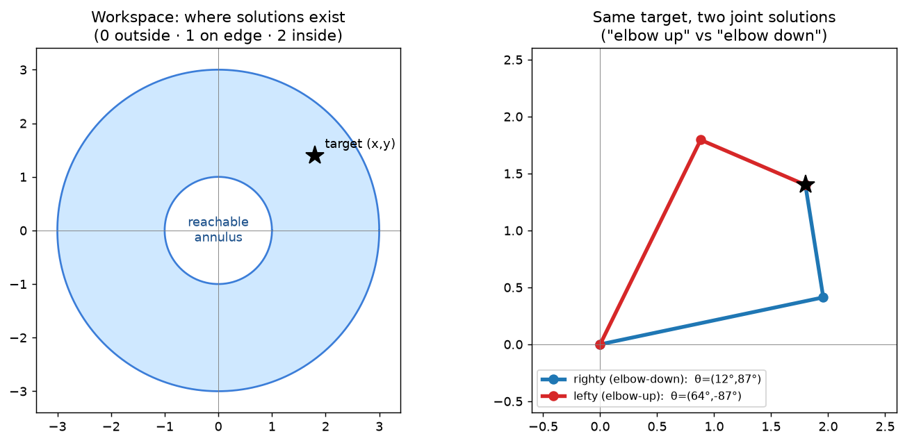
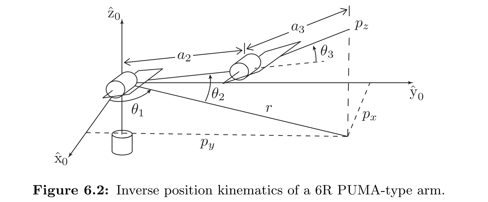
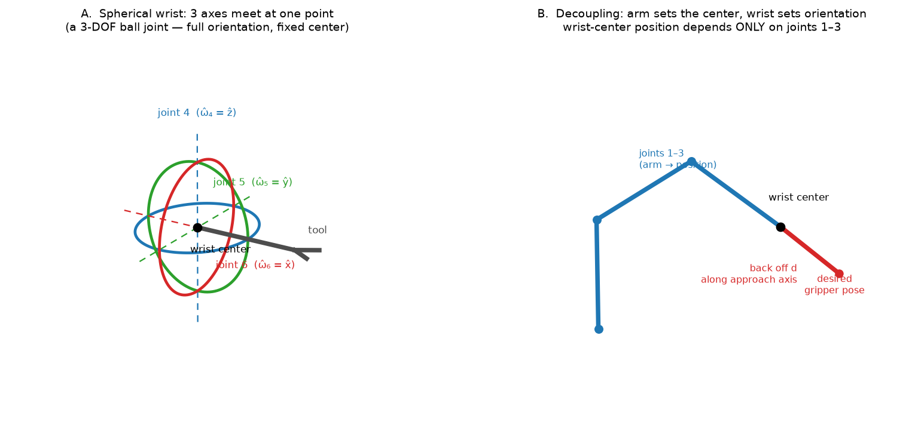

# 6a — The Inverse Kinematics Problem & Analytic Solutions

> Chapter 6.1 of *Modern Robotics*. Forward kinematics (Ch. 4) answered
> "joint angles → end-effector pose." **Inverse kinematics (IK) runs it
> backwards: given a desired pose `X ∈ SE(3)`, find the joint angles `θ` with
> `T(θ) = X`.** This is the half of kinematics you actually use to *command* a
> robot — a policy or planner says "put the gripper *here*," and IK turns that
> into joint targets the motors can track.
>
> This note is about the **structure** of the problem (why IK is hard, why it
> has *many* answers) and the **geometric/analytic** way to solve it for nice
> arm geometries. The general numerical hammer (Newton–Raphson + pseudoinverse)
> is **6b**.

---

## 1. The big picture — FK is easy, IK is the interesting one

Forward kinematics is a *function*: plug in `θ`, get exactly one pose `T(θ)`
out. No ambiguity, no failure — every joint configuration lands the gripper
somewhere definite.

Inverse kinematics is the opposite in every way, and that asymmetry is the
whole story:

- **It can have no solution.** Ask for a pose outside the arm's reach and there
  is simply no `θ` that gets there.
- **It can have many solutions.** A 6-DOF arm reaching a typical pose has up to
  **8** ways to do it (and a fully general 6R chain, up to **16**) — different
  elbow/shoulder/wrist postures, *same gripper pose*.
- **It can have infinitely many.** If the arm has more joints than the task
  needs (a *redundant* arm, `n > 6`), there's a whole continuous family of
  solutions — you can wiggle the elbow while keeping the gripper nailed in
  place.

Why the asymmetry? `T(θ)` is a **nonlinear** function of `θ` (sines and cosines
of sums of angles). FK evaluates that nonlinear function — trivial. IK *inverts*
it — and nonlinear equations, unlike linear ones, routinely have zero, several,
or infinitely many roots. That's not a robotics quirk; it's just what solving
`sin`/`cos` equations is like.

**Why this matters for the north star.** The whole control stack you're building
toward is *policy → desired EE pose → IK → joint targets → low-level controller*.
IK is the translator in the middle. And "there are multiple solutions" is not
academic: real arms pick *which* solution (elbow-up vs elbow-down) based on joint
limits, obstacles, and staying near the current pose — a learned system has to
respect that the map from task space back to joint space is one-to-**many**.

---

## 2. The cleanest example: the 2R planar arm

Two links of length `L₁, L₂` in a plane, two revolute joints. Forward
kinematics (position of the tip only — ignore orientation for now):

```
   x = L₁ cos θ₁ + L₂ cos(θ₁ + θ₂)
   y = L₁ sin θ₁ + L₂ sin(θ₁ + θ₂)
```

We want the reverse: given `(x, y)`, find `(θ₁, θ₂)`. Here's the picture
(`notes/figures/06a_2R_ik_solutions.png`):



### 2a. The workspace — where solutions even exist

The tip can reach any point between `L₁ − L₂` (links folded back, arm fully
"in") and `L₁ + L₂` (links straight, arm fully "out"). So the **reachable set is
an annulus** (a ring/washer shape) — left panel above. This immediately tells
you the solution count:

- **Outside the annulus** → 0 solutions (unreachable).
- **On either boundary circle** → exactly 1 solution (arm dead straight, or
  fully folded — the elbow has no freedom left).
- **Strictly inside** → 2 solutions (the two elbow postures).

### 2b. Solving it geometrically — the elbow angle first

The trick is to find `θ₂` (the elbow) using the triangle formed by the two links
and the line from the base to the tip. Call that line's squared length
`r² = x² + y²`. The **law of cosines** relates the three sides of a triangle to
one of its interior angles:

```
   c² = a² + b² − 2ab·cos(C)
```

(sides `a,b,c`; `C` is the angle opposite side `c`). Apply it with the two links
as two sides and `√(x²+y²)` as the third side. Solving for the cosine of the
elbow angle gives:

```
   cos θ₂ = (x² + y² − L₁² − L₂²) / (2 L₁ L₂)  ≡  D
```

Now the **two solutions** appear, and *this is the geometric heart of IK
multiplicity*: `cos θ₂ = D` has **two** answers, `θ₂ = +arccos(D)` and
`θ₂ = −arccos(D)`. Same cosine, opposite sign — the elbow bent one way or the
mirror-image other way. Those are your "righty/elbow-down" and "lefty/elbow-up"
(right panel above: both reach the same star, different elbow).

- If `D` is in `[−1, 1]`, two real solutions (or one, if `D = ±1` exactly →
  arm straight or folded → the boundary cases).
- If `|D| > 1`, `arccos` is undefined → **no solution** → you asked for a point
  outside the annulus. The algebra refuses, exactly matching the geometry.

### 2c. Then the shoulder angle, with `atan2`

Once `θ₂` is fixed, `θ₁` is the base angle. You get it as "the angle to the
target, minus the angle the first link is offset from the target line":

```
   θ₁ = atan2(y, x) − atan2(L₂ sin θ₂,  L₁ + L₂ cos θ₂)
```

Plug in `+θ₂` for the righty `θ₁`, `−θ₂` for the lefty `θ₁`. Two `θ₂`'s → two
matching `θ₁`'s → two complete solutions.

#### Why `atan2` and not `arctan`?

This is a small but constant gotcha in all of kinematics. Plain `arctan(y/x)`
throws away sign information: it can't tell `(x, y)` from `(−x, −y)` because both
give the same ratio `y/x`, so it only ever returns angles in `(−π/2, π/2)` —
half the circle. **`atan2(y, x)` keeps `x` and `y` separate**, looks at the
signs of *both*, and returns the correct angle in the full range `(−π, π]`. Any
time you recover an angle from a point or a pair of components, use `atan2`.
(That's why it shows up everywhere in this chapter.)

---

## 3. Redundancy — when "infinitely many" kicks in

Add a third revolute joint to the planar arm (a **3R planar** arm) but still only
ask it to hit a *position* `(x, y)` — 2 task numbers, 3 joints. Now there's a
**spare degree of freedom**: for a reachable point there's a whole continuous
1-parameter family of `(θ₁, θ₂, θ₃)` that put the tip there. You can sweep the
elbow through an arc and chase it with the other two joints, tip frozen.

The arm has more joints `n` than the task has constraints `m` (`n > m`), so it's
**kinematically redundant**. This isn't a defect — it's the *point* of arms like
the 7-DOF ones (and your eventual mobile manipulator): the extra freedom lets you
reach a pose *and simultaneously* dodge an obstacle, stay off joint limits, or
keep the elbow comfortable. The cost is that IK no longer has a clean finite
answer; you need an optimization or the pseudoinverse to pick *one* solution out
of the infinite set (that's 6b §inverse-velocity and the redundancy discussion).

> **Intuition: your own arm.** The human arm is the perfect example of *both*
> ideas in this note — the spherical wrist *and* redundancy — and it has **7 DOF**:
>
> | Segment | DOF | Type |
> |---|---|---|
> | shoulder | 3 | spherical (ball-and-socket) |
> | elbow | 1 | hinge |
> | forearm | 1 | twist (pronation/supination) |
> | wrist | 2 | flex/extend + deviation |
>
> The hand-end rotations (wrist 2 + forearm twist) form an effective **3R
> orientation complex** — a spherical wrist (§4a): it sets *hand orientation*
> without moving where the wrist *is*.
>
> Now count what positions the wrist: **shoulder (3) + elbow (1) = 4 DOF to place
> a 3-D point** → **one to spare.** That spare DOF is redundancy made physical:
> press your hand flat on a table (position *and* orientation locked) and you can
> still **swing your elbow through an arc**. That arc is the continuous infinity
> of IK solutions above — the "self-motion" the redundant joint absorbs.
>
> Compare: a **PUMA** spends exactly 6 (3 to position + 3 spherical wrist) → the
> minimum for full `SE(3)` → *finite* IK. Your arm adds a **7th** so you can hold
> a pose *while* routing the elbow around obstacles and into a comfortable
> posture — exactly why robotics builds 7-DOF arms. (Nice symmetry you may have
> spotted: the human arm has **two** spherical joints, shoulder *and* wrist,
> bridged by one hinge; the PUMA keeps only the wrist spherical and shrinks the
> shoulder/elbow to a minimal 2R, trading the redundancy away for clean finite IK.)

---

## 4. Analytic IK for a real 6-DOF arm — the *decoupling* trick

A full spatial arm needs to hit a 6-D target: 3 for position + 3 for
orientation. Solving all six coupled `sin`/`cos` equations at once is ugly. The
classic arms (PUMA, Stanford) are **designed** so the problem splits cleanly into
two 3-DOF problems. This "design the geometry so the math decouples" idea is
worth absorbing even though you'll rarely hand-solve a PUMA.



*The PUMA's first three joints (above): joint 1 spins about `ẑ₀` (the angle `θ₁`
that aims the arm at the wrist center), and joints 2–3 form a vertical 2R
"shoulder–elbow" with link lengths `a₂, a₃`. The target wrist-center position is
`p = (pₓ, p_y, p_z)`, with `r` its projection into the `x̂₀–ŷ₀` plane. The whole
inverse-**position** solve happens in this picture; the spherical wrist (joints
4–6, not drawn) handles orientation separately.*

### 4a. Deep dive: what a *spherical wrist* actually is

**The key design feature.** The last three joint axes (4, 5, 6) all **intersect
at one common point** — the **wrist center**. That single geometric fact is what
makes analytic IK possible, so it's worth really seeing.



**It's a 3-DOF ball joint (a gimbal).** Look at Panel A. Three revolute joints
stacked so their axes pass through one point behave exactly like a
**gimbal** — the nested-ring mechanism in a ship's compass or a camera stabilizer.
Spinning any of the three rings re-points the tool, but the **center point never
moves.** Mathematically, three independent rotation axes through a point can
compose to produce *any* orientation in `SO(3)` — the wrist has full 3-DOF
orientation freedom while contributing **zero** translation. (In the orthogonal
wrist the book uses, the three axes are mutually perpendicular —
`ω̂₄ = ẑ`, `ω̂₅ = ŷ`, `ω̂₆ = x̂` — which is the cleanest case, but the decoupling
only needs them to *share a point*, not to be orthogonal.)

**Why "three axes through a point ⇒ any orientation."** This is the geometric
heart of it. Each revolute joint contributes one rotational degree of freedom (a
spin about its own axis). `SO(3)` — the space of all 3-D orientations — is itself
3-dimensional (you need exactly 3 numbers to pin down an orientation). So three
*independent* rotation axes are exactly enough to reach every orientation,
*provided* stacking them doesn't accidentally translate the tool. Keeping all
three axes through one shared point is precisely the condition that kills the
translation: a rotation about an axis through point `c` leaves `c` fixed, so
composing three of them still leaves `c` fixed. Three rotations, one fixed point,
full orientation freedom — that's a spherical wrist.

**Why this gives the decoupling (Panel B).** Because the wrist center `c` is
unmoved by joints 4–6, its *position* is a function of **joints 1–3 only**. So
you can solve position first, in isolation:

1. Take the desired gripper frame `X = (R_d, p_d)`.
2. The tool sticks out from the wrist center by a fixed offset `d` along the
   gripper's **approach axis** (a known column of `R_d`). **Back off** from the
   gripper origin by `d` along that axis to recover the wrist center
   `c = p_d − d · (approach axis)`.
3. Now `c` is a pure *position* target for the 3-joint arm → solve `(θ₁, θ₂, θ₃)`
   with the law-of-cosines machinery from §2. No orientation in sight.

Then orientation is whatever's left over for the wrist to supply — a clean
second 3-DOF problem. Six coupled equations became two independent threes.

**Gotcha — wrist singularity / gimbal lock.** A gimbal has a famous failure
mode: when two of the three axes line up (e.g. joint 5 rotates until axes 4 and 6
become collinear), you *lose* a degree of freedom — two joints now do the same
thing, and the wrist can't rotate about the missing direction. This is exactly a
**kinematic singularity** (5b) living in the wrist, and it's the same `1/sin θ`
blow-up that makes Euler-angle representations fragile. It's a big reason
simulators/hardware store orientation as **quaternions** instead (the parked
`notes/0B_quaternions.md` topic) — a 4th number buys you out of gimbal lock.

**That decoupling, step by step:**

1. **Inverse position (joints 1–3):** the wrist center's location depends only
   on the first three joints. From the desired gripper pose, back off along the
   gripper's axis to find where the wrist center must be, then solve a 3-joint
   position problem for `(θ₁, θ₂, θ₃)`. For the PUMA this is exactly:
   - `θ₁ = atan2(p_y, p_x)` — point the shoulder at the wrist center (the
     "spin around the base" angle). Note `atan2(p_y, p_x) + π` is a *second*
     valid `θ₁`, giving the **lefty/righty** pair again.
   - `θ₂, θ₃` — a **2R planar sub-problem** in the vertical plane (law of cosines
     again!), giving **elbow-up/elbow-down**.
   - 2 (shoulder) × 2 (elbow) = **4 position solutions** for an arm with a
     shoulder offset.

2. **Inverse orientation (joints 4–6):** with `(θ₁, θ₂, θ₃)` known, the
   remaining rotation the wrist must supply is fixed:
   `R_wrist = (rotation from joints 1–3)ᵀ · R_desired`. The three wrist joints
   are just a **ZYX Euler-angle** decomposition of `R_wrist` — solve for
   `(θ₄, θ₅, θ₆)`. Each gives a pair too, roughly **doubling** the count → up to
   **8 solutions** total.

**Stanford arm** = same idea, but the elbow (a revolute joint) is swapped for a
**prismatic** (sliding) joint, so step 1's "elbow angle" becomes a "slide
distance" `θ₃ = √(...)`. Same decoupling, same lefty/righty structure.

You don't need to memorize the PUMA formulas. The transferable lessons:

- **Spherical wrist ⇒ position and orientation decouple** into two 3-DOF solves.
  This is *why* most industrial 6R arms put three intersecting axes at the wrist.
- **Each `±`/`atan2±π` branch doubles the solution count.** 2×2×2 = 8 is the
  generic count for these arms; the most general 6R can reach 16.
- It's all **trig + law of cosines + `atan2`** — no calculus, no iteration. When
  the geometry is friendly, analytic IK is exact and instant. When it isn't
  (arbitrary arm, joints don't intersect nicely), you fall back to **numerical
  IK — that's 6b.**

---

## 5. Linear algebra you need here

6a is light on heavy LA (the SVD/pseudoinverse machinery is 6b). The pieces:

- **Nonlinear systems have multiple roots.** Unlike `Ax = b` (a *linear* system,
  which has either one solution, none, or a flat infinity — the clean cases you
  know), a *nonlinear* system like the IK equations can have any number of
  isolated solutions. The two `arccos` branches are the simplest instance: one
  scalar equation `cos θ = D` already has two roots. Stack three of those (one
  per joint pair) and you get the 2×2×2 = 8.
- **`atan2` = recovering an angle from a 2-vector.** Geometrically: given a
  point's `(x, y)` components, return the polar angle. The reason it beats
  `arctan` is that it uses the *full vector*, not just the ratio — so it knows
  which quadrant you're in. (Same spirit as why a direction needs both
  components, not their ratio.)
- **Composition/inverse of rotations** (the decoupling step
  `R_wrist = R_arm⁻¹ R_desired`): for a rotation matrix, inverse = **transpose**
  (`R⁻¹ = Rᵀ`, from Ch. 3a). "Undo the shoulder/elbow rotation, then whatever
  orientation is left is the wrist's job."

---

## 6. Gotchas / intuition checks

- **Zero / one / many is the default, not the exception.** Always ask "how many
  IK solutions, and which do I want?" A controller must *choose* (usually:
  stay closest to the current configuration, respect joint limits, avoid
  obstacles).
- **Singular configurations break the count.** For the zero-offset PUMA, if the
  wrist center sits exactly on the base axis (`p_x = p_y = 0`), `θ₁` is
  *undefined* — infinitely many shoulder angles work. These are the **kinematic
  singularities** from 5b showing up in IK: directions where the arm momentarily
  loses control authority, and where IK answers blow up or smear out.
- **Reachability is a hard wall.** `|D| > 1`, or a target outside the workspace,
  means *no* solution — no amount of iterating will find one. Numerical IK (6b)
  will thrash forever if you ask for the impossible.
- **Analytic vs numerical is a real engineering choice.** Analytic: exact, fast,
  gives *all* solutions — but only exists for special geometries. Numerical:
  works for *any* arm and any task dimension, but needs a good initial guess and
  returns just *one* (nearest) solution. Production systems often use analytic
  when available, numerical to refine or for general arms.

---

## 7. FAQ

**Q: In the back-off `c = p_d − d·(approach axis)`, how is the approach axis a
"known column of `R_d`"?**
Because the **columns of a rotation matrix *are* the frame's own axes**, written
in base coordinates (Ch. 3a). `R_d = [ x̂_g | ŷ_g | ẑ_g ]`, so its 3rd column is
the gripper's local **ẑ_g** expressed in the world. By convention the gripper's
**approach axis** (the direction it moves in to grab) *is* its local ẑ, so the
approach axis = `R_d · [0,0,1]ᵀ` = column 3 of `R_d`. And `R_d` is the *desired*
orientation — an **input** to the IK problem — so that column is known *before*
you solve anything. (Multiplying by `[0,0,1]ᵀ` just selects the 3rd column.)

**Q: What exactly is the wrist center `c`, and which joints fix it?**
`c` is the **common intersection point of axes 4, 5, and 6** (not "on joint 5's
axis" specifically — it's on all three). A point lying *on* a rotation axis
doesn't move when you rotate about that axis, so joints 4, 5, 6 **cannot move
`c`**. The only actuators that can are joints **1, 2, 3** — therefore `c`'s
*position* is a function of joints 1–3 alone. (Joints 4–6 still set the gripper's
*orientation* about the fixed `c` — position and orientation are the two
decoupled halves.)

**Q: Is the offset `d` from `c` to the gripper "link 4's length"?**
No. In an ideal spherical wrist there is **no** translation among joints 4–6 —
their axes all cross at `c`, so link 4 adds no offset (if it did, the axes
wouldn't share a point and the decoupling would break). The offset `d` is the
**tool / flange length sitting *past* joint 6** — the gripper sticking out along
the approach axis. Also note the *direction*: `c` is what joints 1–3 deliver
**directly** (no offset needed to reach it); the offset takes you *outward* from
`c` to the real tip, `p_d = c + d·ẑ_g`. If a real arm's wrist axes *don't*
exactly intersect (a true link-4 offset), this trick fails and you go **numerical
(6b)**.
