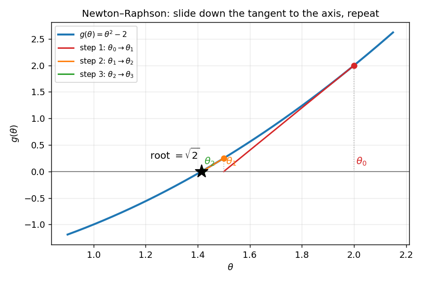
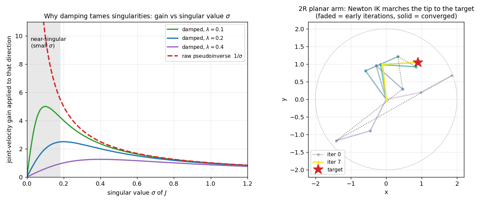

# 6b — Numerical Inverse Kinematics (Newton–Raphson, pseudoinverse, damped least squares)

> Chapter 6.2 of *Modern Robotics*. Analytic IK (6a) is exact and instant — but
> only exists for **specially designed** arm geometries (spherical wrist,
> intersecting axes). The moment the geometry isn't friendly — a general 6R, a
> redundant 7-DOF arm, your eventual mobile manipulator — you reach for the
> **general hammer: numerical IK.** Start from a guess, use the **Jacobian**
> (Ch. 5) to take a step toward the target, repeat until you land.
>
> This is *the* IK you'll actually run in MuJoCo/Isaac and on hardware. It's the
> "**policy → desired EE pose → IK → joint targets**" stage from the north star,
> and it's where the **pseudoinverse / SVD** that we parked back in 5b finally
> earns its keep.

---

## 1. The big picture — invert FK by inverting its *linearization*, repeatedly

Forward kinematics `T(θ)` is a known function: joints in, pose out. IK wants the
reverse, and 6a showed it's nonlinear and nasty to invert in closed form.

The numerical idea sidesteps the closed form entirely:

1. **Guess** a joint configuration `θ`.
2. Look at how far the resulting EE pose `T(θ)` is from the target `T_sd` — call
   that error `e`.
3. The **Jacobian** `J(θ)` is the *local linear map* "joint rates → EE velocity"
   (5a). So `J(θ)` tells you, to first order, how a small joint step changes the
   pose. Invert that linear map to find the joint step that would kill the error:
   `Δθ = J⁻¹ e`.
4. Take the step `θ ← θ + Δθ`, recompute the error, and **repeat.**

Because step 3 only uses the *linear approximation*, one step doesn't land you
exactly — but each step gets you closer, and a few iterations converge fast. This
is **Newton–Raphson root-finding**, and the genius is that the hard nonlinear
inversion is replaced by repeatedly inverting the easy linear thing you already
built in Ch. 5.

> **One sentence to keep:** *numerical IK = inverse velocity kinematics
> (`θ̇ = J⁻¹V`) from 5a, iterated — each step drives the pose error down a little
> more.* Everything below is detail on (a) how to measure the pose error `e` when
> the pose lives in `SE(3)`, and (b) what to do when `J` can't be cleanly
> inverted.

---

## 2. Root-finding first: Newton–Raphson in 1-D

Forget robots for a second. You want to solve a scalar equation `g(θ) = 0` — find
where a curve crosses zero. Newton's method:

- Stand at your current guess `θₖ`. The curve has some height `g(θₖ)` and some
  slope `g'(θₖ)`.
- **Pretend the curve is its tangent line** (the linear approximation). Slide down
  that straight line to where it hits zero — that's your next guess:

```
   θₖ₊₁ = θₖ − g(θₖ) / g'(θₖ)
```

- Repeat. Each step the tangent is a better and better stand-in for the curve, so
  you home in fast (it roughly *doubles* the number of correct digits per step
  once you're close — "quadratic convergence").



*Solving `g(θ)=θ²−2=0` from `θ₀=2`: each red/orange/green segment is the tangent
at the current guess, slid down to the axis to give the next guess. Three steps
land on `√2` to ~10 digits.*

The only ingredients are the **value** `g(θₖ)` and the **slope** `g'(θₖ)`. In
robotics the "slope" becomes the Jacobian — that's the whole leap to the next
section.

**Gotchas (they carry over to IK):** a bad starting guess can send you to the
*wrong* root or diverge; a near-zero slope `g'(θ)≈0` makes the step `g/g'` blow up
(this is exactly the **singularity** problem, §6). Newton is fast but not
foolproof — it needs a sane initial guess.

---

## 3. From root-finding to IK — the coordinate version

Now make `θ` a vector of joint angles and `g` the "pose error." Suppose for a
moment the EE pose is captured by a plain coordinate vector `x = f(θ)` (e.g. a
2-vector tip position for a planar arm). We want `f(θ) = x_d`, i.e.

```
   g(θ) = x_d − f(θ) = 0
```

Vector Newton–Raphson replaces "divide by the slope" with "multiply by the
inverse Jacobian" (the Jacobian *is* the multidimensional slope of `f`):

```
   θₖ₊₁ = θₖ + J(θₖ)⁻¹ ( x_d − f(θₖ) )
                 └──────┘ └──────────┘
                inverse      error e_k  (a desired EE displacement)
                velocity
                kinematics
```

Read it physically: `e_k = x_d − f(θₖ)` is "how far, and which way, the tip needs
to move." `J⁻¹` converts that desired tip displacement into the joint step that
(to first order) produces it. That's **literally** the inverse-velocity formula
`θ̇ = J⁻¹V` from 5a, with the desired tip *velocity* replaced by the desired tip
*displacement-to-target*. Iterate and the tip walks to the goal — exactly the 2R
arm in the figure below.

The catch: a real EE pose isn't a tidy coordinate vector you can subtract. It's a
matrix `T ∈ SE(3)`. Fixing that is §4.

---

## 4. Measuring pose error in `SE(3)` — the body-twist trick

You **cannot** write `x_d − f(θ)` when the configuration is a homogeneous
transform `T`. "Desired matrix minus current matrix" is meaningless: subtract two
rotation matrices and you don't get a rotation, or any sensible error. We need a
proper 6-vector error that lives in the right space.

The fix reuses the **matrix logarithm** from 3b. Here's the construction:

1. Current EE pose from FK: `T_sb(θ)` (frame `{b}` = body/EE in space `{s}`).
2. Desired pose: `T_sd`.
3. The transform that carries *current* onto *desired*, expressed in the **body
   frame**, is

```
   T_bd  =  T_sb⁻¹(θ) · T_sd        (= "where the target is, seen from the gripper")
```

4. Take its matrix log to get a **body twist**:

```
   [𝒱_b]  =  log( T_bd ),     then read off the 6-vector  𝒱_b = (ω_b, v_b)
```

`𝒱_b` is the body twist that, **followed for one unit of time, slides the gripper
from where it is exactly onto the target** (3b: a twist is the screw "velocity"
whose exponential is a rigid motion; the log inverts the exponential). It's a
genuine 6-vector — three rotational, three translational — so it's a legitimate
error `e` we can feed to Newton:

```
   θₖ₊₁  =  θₖ  +  J_b⁻¹(θₖ) · 𝒱_b
```

where `J_b` is the **body Jacobian** (5a) — chosen to match `𝒱_b`, which is a body
twist. (There's a space-frame version too; see §7.) This is the matrix log from
3b finally doing real work: it's the *correct* way to say "how far is this pose
from that pose" as a single twist vector.

> **Why a twist and not "Euler angle error + position error"?** Because a twist is
> coordinate-free and handles the full coupling of rotation and translation along
> a screw — no gimbal-lock fragility, no arbitrary angle-convention choices. It's
> the same reason SE(3) is the right home for poses in the first place (Ch. 3).

---

## 5. Linear algebra you need here — the **pseudoinverse** (cashing in the parked SVD)

`J⁻¹` assumed `J` is square and invertible. For real arms it usually **isn't**:
`J` is `m × n` with `m` = task dimensions (typically 6) and `n` = number of
joints. We need a stand-in for the inverse that works for *any* shape. That's the
**pseudoinverse `J†`** ("J-dagger"), and this is the big LA idea of the chapter.
Let's build it from low assumptions.

### 5.1 The three shapes of `J`

| case | shape of `J` | the IK situation | what we want |
|---|---|---|---|
| **square, full rank** | `n = m`, invertible | exactly enough joints, non-singular | the plain inverse `J⁻¹` |
| **wide (redundant)** | `n > m` | more joints than task needs (7-DOF arm) | *infinitely many* joint steps hit the target — pick the **smallest** one |
| **tall (overconstrained)** | `n < m` | fewer joints than task dims | *can't* hit the target exactly — get as **close** as possible |

The pseudoinverse `J†` gives the sensible answer in **all three** cases with one
formula-family:

```
   wide  (n > m):   J† = Jᵀ (J Jᵀ)⁻¹        "right inverse"  → minimum-norm θ̇
   tall  (n < m):   J† = (Jᵀ J)⁻¹ Jᵀ        "left inverse"   → least-squares θ̇
   square nonsing.: J† = J⁻¹                  (both formulas collapse to this)
```

In code you never pick by hand — `np.linalg.pinv(J)` does the right thing.

### 5.2 What "minimum-norm" and "least-squares" mean geometrically

These are the two things a pseudoinverse does, and they're worth feeling:

- **Redundant arm (wide `J`), minimum-norm.** Many joint-velocity vectors `θ̇`
  produce the *same* tip twist `𝒱`. They differ by motions in the **null space**
  of `J` — internal wiggles that move the joints but **not** the tip (the elbow
  swinging while the hand stays put, from 6a's redundancy story). `J†` picks the
  **shortest** `θ̇` among all of them: the one with zero null-space component, i.e.
  the laziest joint motion that still does the job. *(Geometric meaning of "null
  space": the set of joint-rate directions `J` crushes to zero tip motion — the
  "free" internal degrees of freedom.)*

- **Overconstrained (tall `J`), least-squares.** You're asking for 6 things with
  fewer than 6 knobs — generally impossible to satisfy exactly. `J†` returns the
  `θ̇` whose resulting twist `Jθ̇` is **closest** (smallest Euclidean error) to the
  requested `𝒱`. It's the same least-squares "best fit" idea as fitting a line
  through scattered points: minimize the leftover.

### 5.3 The SVD picture — *why* `J†` works (this is the 5b park, cashed)

Recall from 5b: every matrix factors as `J = U Σ Vᵀ` (the **SVD**), which reads
"**rotate → stretch → rotate**." `Σ` is diagonal with the **singular values**
`σ₁ ≥ σ₂ ≥ … ≥ 0` — exactly the **semi-axis lengths of the manipulability
ellipsoid** we drew in 5b. *(5b told the ellipsoid in eigenvalues `λ` of `JJᵀ`;
these are the same axes, with `σᵢ = √λᵢ` — see FAQ Q1 for the bridge.)* The
pseudoinverse just inverts this factorization the only way it can:

```
   J = U Σ Vᵀ      ⟹      J† = V Σ† Uᵀ
   where Σ† inverts each NONZERO singular value (σ → 1/σ) and leaves zeros as zeros.
```

That last clause is the whole trick. Where `J` *can* move the tip (a real
direction, `σ > 0`), `J†` undoes the stretch by `1/σ`. Where `J` **can't** (a
collapsed/lost direction, `σ = 0`, a singularity), there's nothing to invert, so
`J†` leaves it alone instead of dividing by zero. The pseudoinverse is "**the best
inverse possible**: exact on the controllable part, gracefully does nothing on the
uncontrollable part."

> **The singular values are the same `σᵢ` from the manipulability ellipsoid (5b).**
> Big `σ` = easy direction = small gain `1/σ`. **Small `σ` = nearly-lost direction
> = huge gain `1/σ`.** This is precisely the blow-up 5b warned about, now staring
> at us as a literal `1/σ` in `J†`. Which sets up the last piece.

---

## 6. Near singularities: **damped least squares** (Levenberg–Marquardt)

The pure pseudoinverse has a dangerous failure mode. As the arm approaches a
singularity, some singular value `σ → 0`, so the gain `1/σ → ∞`. A modest
commanded tip motion in that almost-lost direction demands **enormous** joint
speeds. On hardware: motors saturate, the arm lurches, the controller goes
unstable. (This is the 5b "near-singular = `J⁻¹` blows up" warning made concrete
in the IK loop.)

The fix is **damped least squares (DLS)**, also called the Levenberg–Marquardt
pseudoinverse. Add a small `λ²I` floor inside the inverse:

```
   θ̇ = Jᵀ ( J Jᵀ + λ² I )⁻¹ 𝒱
```

The `λ²I` term keeps the matrix from becoming singular, so the inverse never blows
up. In SVD terms it replaces the gain `1/σ` with

```
   σ / (σ² + λ²)
```

which is the magic curve: for **large** `σ` it ≈ `1/σ` (so well-conditioned
directions behave normally), but as `σ → 0` it **smoothly goes to 0** instead of
`∞`. The arm just refuses to chase the impossible direction at insane speed —
it gives up a little accuracy there in exchange for staying stable.



*Left: the raw pseudoinverse gain `1/σ` (red dashed) rockets to infinity as a
singular value `σ → 0` (grey "near-singular" band). The damped gains
`σ/(σ²+λ²)` (solid) peak at a finite value `1/(2λ)` and then roll back to 0 —
bounded everywhere. Bigger `λ` = more damping, lower peak, more stable but less
accurate. Right: the 2R Newton-IK loop of §3 in action — from the initial guess
(faded) the tip marches onto the target (solid) in a handful of iterations.*

**The trade-off in one line:** `λ = 0` is the exact pseudoinverse (accurate but
explodes near singularities); large `λ` is heavily damped (rock-stable but sloppy,
even far from singularities). Production IK either uses a small fixed `λ`, or
**adapts** `λ` — near zero when well-conditioned, ramping up only as you near a
singularity (measured by the smallest `σ`, i.e. the 5b condition-number gauge).

---

## 7. The algorithm (this is exactly `modern_robotics`'s `IKinBody`)

Putting it together — body-frame numerical IK:

```
GIVEN:  M (home pose), Blist (body screw axes), T_sd (target),
        θ (initial guess), tolerances εω, εv, maxiter

  T_sb  ← FKinBody(M, Blist, θ)                  # where the EE actually is
  𝒱_b   ← se3ToVec( MatrixLog6( T_sb⁻¹ · T_sd ) ) # body-twist error  (§4)
  err   ← (‖ω_b‖ > εω)  OR  (‖v_b‖ > εv)          # split rot/trans tolerances
  i ← 0
  WHILE err AND i < maxiter:
      θ    ← θ + pinv( J_b(θ) ) · 𝒱_b             # Newton step  (§5; swap pinv→DLS near singularities)
      i    ← i + 1
      T_sb ← FKinBody(M, Blist, θ)                # recompute everything
      𝒱_b  ← se3ToVec( MatrixLog6( T_sb⁻¹ · T_sd ) )
      err  ← (‖ω_b‖ > εω) OR (‖v_b‖ > εv)
  RETURN θ, success = (NOT err)
```

A few practical notes:

- **Two separate tolerances** `εω` (rotation, rad) and `εv` (translation, m)
  because the twist mixes units — you don't want one to mask the other.
- **Space-frame variant** (`IKinSpace`): same loop, but convert the body twist to
  a **space twist** via the adjoint, `𝒱_s = [Ad_{T_sb}] 𝒱_b`, and use the **space
  Jacobian** `J_s`. Same answer, different bookkeeping frame.
- **Initial guess matters a lot.** Newton finds the solution *nearest the guess*.
  On a robot you seed with the **current** joint configuration, which (a) usually
  converges in 1–3 steps because consecutive targets are close, and (b)
  automatically prefers the IK branch you're already in (the lefty/righty,
  elbow-up/down choice from 6a) — no separate branch logic needed.
- **It can fail.** Unreachable target, or a guess in a bad basin, returns
  `success = false`. Numerical IK will happily thrash forever on the impossible
  (6a's reachability wall) — hence `maxiter`.
- **One solution, not all.** Unlike analytic IK, you get a single nearest answer.
  Want a different branch? Re-run from a different seed.

---

## 8. Why this is the IK you'll actually use

- **It works for *any* arm and *any* task dimension** — general 6R, redundant
  7-DOF, the wheeled mobile manipulator, even partial tasks (position-only). No
  special geometry required. That generality is why every simulator and motion
  library ships a numerical IK solver.
- It's the literal middle of the **north-star stack**: a learned policy emits a
  desired EE pose (or a small EE delta); numerical IK turns it into joint targets
  the low-level controller tracks. When a VLA outputs "move gripper +2 cm in `x`,"
  something like this loop is what runs.
- The **redundancy resolution** (`J†`'s minimum-norm pick, plus null-space
  projection for secondary goals like "stay off joint limits / maximize
  manipulability") is how redundant arms get steered — the 6a "infinite solutions"
  problem, solved in practice.
- Everything ties back: **Jacobian** (5a) is the engine, **singularities /
  manipulability / SVD** (5b) explain when it's healthy vs. about to blow up, the
  **matrix log** (3b) measures the pose error, and **damping** is the seatbelt.

---

## 9. Gotchas / intuition checks

- **Numerical IK = iterated inverse-velocity kinematics.** Each step is
  `θ ← θ + J†·(twist toward target)`. If you understand `θ̇ = J⁻¹V` (5a), you
  understand this — the rest is robustness.
- **You can't subtract poses.** Pose error must be a **twist** via
  `𝒱 = log(T_current⁻¹ T_desired)`, not a matrix difference or Euler-angle
  subtraction.
- **`J†` is shape-aware:** wide `J` → minimum-norm (laziest joints); tall `J` →
  least-squares (closest reachable). `np.linalg.pinv` handles both.
- **Singular value `σ → 0` ⟹ gain `1/σ → ∞` ⟹ instability.** The same `σ` from
  5b's ellipsoid. **Damped least squares** (`σ/(σ²+λ²)`) is the standard fix;
  trades a little accuracy near singularities for stability.
- **Good initial guess is non-negotiable.** Seed with the current configuration;
  it converges fast and stays in the right IK branch.
- **Convergence ≠ existence.** If the target is unreachable, no iteration count
  saves you. Check `success`, cap `maxiter`.

---

## 10. FAQ — captured from discussion

**Q1. The note uses *singular values* `σ`, but 5b's manipulability ellipsoid was
all about *eigenvalues* `λ`. What's the relationship?**
Same picture, two languages — and `σ = √λ`. Both describe the **same
manipulability ellipsoid** (the image of the unit joint-rate sphere under `J`).
The **singular values `σ₁ ≥ σ₂ ≥ … ≥ 0` *are* the ellipsoid's semi-axis lengths**
— `J`'s own per-axis stretch factors. 5b couldn't name them directly because
**eigenvalues need a *square* matrix and `J` is `m×n`** (not square). So 5b
detoured through the square matrix `A = JJᵀ` and used *its* eigenvalues `λ`. The
link:

```
   σᵢ = √λᵢ ,    λᵢ = eigenvalues of A = JJᵀ
```

**Why the square root:** `J` stretches each axis by `σ`; `A = JJᵀ` applies `J`
twice along that axis, so it stretches by `σ·σ = σ² = λ`. Squaring `J` up to make
it square squares the stretch factors — so `λ` are just the squares of the more
fundamental `σ`. **Why 6b prefers `σ`:** the pseudoinverse *inverts* `J` directly,
and inverting a stretch-by-`σ` is a stretch-by-`1/σ` — so `J†`'s gain along each
direction is literally `1/σ` (the x-axis of the §6 damping figure). Phrasing it in
`λ` would force `1/√λ` everywhere. Tiny check: `J = diag(3,2)` → `A = JJᵀ =
diag(9,4)` → `λ = 9,4` → `σ = 3,2 = √9,√4` ✓; the ellipse has semi-axes 3 and 2,
and `J⁻¹ = diag(1/3, 1/2)` applies gains `1/σ`. At a singularity `σ→0` ⇒ `1/σ→∞`
— the blow-up §6 fixes. *(See 5b §4 / 5b FAQ Q3, where the SVD was parked.)*

**Q2. How do you get a *good initial guess* when there's no analytic solution
(the 6a PUMA decoupling doesn't apply — general 6R, redundant arm, or offset
wrist)?**
First, reframe: "good guess" is mostly a **cold-start** problem, and you rarely
cold-start. In a control loop the target drifts only microns/millirad per tick, so
the **previous solved configuration is a near-perfect seed** (warm start) →
converges in 1–3 steps, and it auto-stays in the current IK branch. The hard case
is only the *first* solve or a *big jump*. For those:

1. **Random multi-start (the workhorse).** Sample many configs within joint
   limits, run Newton from each, keep what converges. Each solve is cheap, so
   dozens–hundreds of restarts are affordable. Bonus: different seeds land in
   different branches → this is also how numerical IK recovers *multiple*
   solutions. (What TRAC-IK does.)
2. **Solve a *nearby idealized* arm in closed form, seed with that.** If the wrist
   *almost* intersects, zero out the offending offset, solve the perfect-spherical
   -wrist version analytically (6a), and let Newton clean up the residual. For a
   redundant arm: lock the spare joint(s), analytically solve the minimal sub-arm,
   seed with that.
3. **Offline IK database / learned regressor.** Densely sample joint space, run
   *forward* kinematics (cheap, never fails) to build a `(pose → θ)` table in a
   k-d tree; query nearest at runtime. Learned version: a small net regresses `θ`
   from pose (IKNet), Newton polishes.
4. **Continuation/homotopy** for far targets: build a chain of intermediate poses
   from a solvable one to the target, walking the solution along, each step
   seeded by the last.

And pair any seed with **damped least squares (§6)** — it widens the basin of
convergence so a mediocre seed won't diverge. North-star tie: **cuRobo** does
massively parallel multi-start IK on GPU (hundreds of seeds at once) precisely to
brute-force this away; learned policies often emit a near-answer directly, leaving
IK only the cleanup.

**Q3. Do diffusion / flow-matching policies output a sequence of EE *poses* or
*twists*? And where does this chapter's IK fit?**
A sequence of **poses (or pose-deltas, or joint targets) — essentially never
twists.** Two independent axes:

- **Diffusion vs flow matching = *how* the action chunk is generated** (iterative
  denoising vs ODE integration), **not what it contains.** Both emit an *action
  chunk* — `H` future actions run receding-horizon. The representation is decided
  separately.
- **The action space is a design choice**, almost always one of: **absolute EE
  pose**, **delta EE pose** (the 7-dim `Δp,ΔR,gripper` standard in OpenVLA / RT-2
  / Octo), **absolute joint positions** (ACT/ALOHA), or **delta joint positions**
  (π0). A twist `(ω,v)` is an *instantaneous* velocity in se(3); a policy emits
  *discrete targets at a control rate*, so it's a pose, not a twist. A **delta EE
  pose is the closest thing** — and the bridge is exactly §4's log:
  `𝒱 = (1/Δt)·log(T_cur⁻¹ T_target)`.

**Where IK enters depends entirely on the action space — it's one of two designs:**

- **EE-pose / delta-pose actions** → need joint targets, via either **numerical
  IK** (this chapter, warm-started — consecutive chunk poses are mm apart, so 1–2
  Newton steps each) **or** a **Cartesian controller** (operational-space /
  Cartesian impedance, Ch. 11) that tracks an EE pose with `J`/`Jᵀ` and *no*
  explicit IK.
- **Joint-target actions** → **no IK at all**; straight to the joint PD
  controller. Often a *deliberate* choice (ACT, much of Diffusion Policy) to dodge
  IK and singularities entirely.

Trade-off: EE-pose actions are embodiment-agnostic (transfer across arms) but cost
you IK/Cartesian control and singularity handling; joint actions are simplest and
singularity-free at deploy but weld the policy to one arm. So the note's "policy →
EE pose → IK → joint targets" stack is **one** branch; "policy → joint targets →
controller" routes around IK completely.

**Q4. What exactly is a "delta EE pose," and how is it represented?** (companion
to Q3.)
A **relative** pose command — "from wherever you are now, move by *this much*" —
versus an absolute "be at pose `T_target`." The new pose is the **composition**
`T_new = T_current ∘ ΔT`. Policies favor deltas because "move 2 cm toward the
object" is the same action anywhere in the workspace → the image→motion map is
more stationary → better generalization. The standard learned-action encoding
(OpenVLA / RT-2 / Octo) is **7 numbers**:

| component | dims | representation |
|---|---|---|
| **Δposition** | 3 | `(Δx, Δy, Δz)` — a displacement vector (m) |
| **Δrotation** | 3 | a *small* rotation as **axis-angle** `ω̂θ` (= `log(ΔR)`, 3a) or **Euler RPY** |
| **gripper** | 1 | open/close |

The **rotation half is pure Ch. 3a**: three numbers encode `ΔR` as axis-angle (a
vector whose direction is the axis, length is the angle); you recover the rotation
by exponentiating, `ΔR = exp([Δr])` (Rodrigues). *(Euler RPY deltas are also
common — fine for small angles. Quaternion (4, unit-norm) and the continuous **6D
rotation rep** show up for **absolute** orientation, e.g. Diffusion Policy.)*

**The subtlety — translation *adds*, rotation *composes*** (the §4 point again):

```
   p_new = p_current + Δp          ← translations ADD (vectors)
   R_new = R_current · ΔR          ← rotations COMPOSE (can't add rotation matrices!)
```

You exponentiate the 3-number axis-angle to a real `ΔR`, then **matrix-multiply**
onto the current orientation — never "add."

**Which frame is the delta in?** Exactly the left-vs-right-multiply choice from
3b: **body/tool-frame** delta (most common) → right-multiply `T_new = T_current ·
ΔT` ("move along where I'm pointing"); **world/base-frame** delta → left-multiply
`T_new = ΔT · T_current`. Same `ΔT`, different result — getting it backwards is a
classic sign bug.

**It's a twist × Δt:** `ΔT = exp([𝒱]Δt)` ⇒ `𝒱 = (1/Δt)·log(ΔT)` (the Q3 bridge).
The stacked `(Δp, Δr)` ≈ `(v, ω)·Δt`; for the small deltas used as actions the
se(3) translation/rotation coupling is negligible, which is why practitioners just
stack 3 + 3. **Downstream:** reconstruct `ΔT` (exp the rotation, compose with the
current pose) → then **IK** (warm-started) → joint targets, **or** hand `T_new`
straight to a **Cartesian controller** (Ch. 11). So "delta EE pose" is just Ch. 3
(compose poses via `exp`/`log`, mind the frame) packaged as a 7-number net output.
