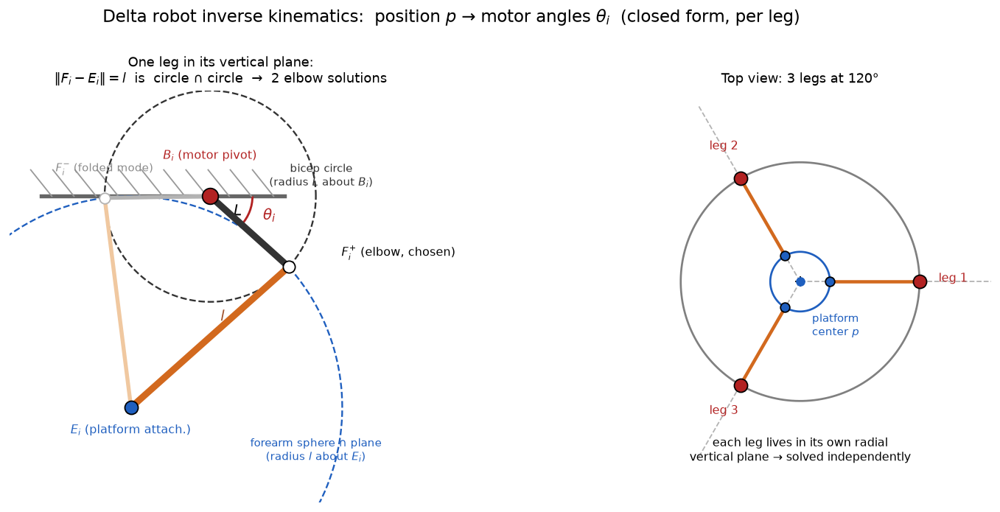
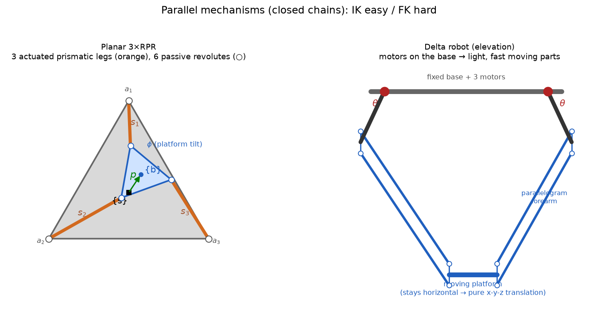

# 7a — Closed Chains: Parallel Mechanisms & their Kinematics

> Chapter 7, §7.1. The kinematics of mechanisms that contain **loops**. We meet
> the **delta robot** and the **Stewart–Gough platform**, and we learn the one
> big idea that flips everything you know about serial arms on its head.

---

## 1. The big picture — what is a closed chain, and why care?

Everything up to now (Ch. 4–6) has been an **open chain**: a single
unbranching string of links, base → joint → link → joint → … → gripper. Like a
human arm. Every joint is actuated, and the links dangle freely off the end.

A **closed chain** is any mechanism whose links and joints form **at least one
loop**. The canonical example is a **parallel mechanism**: two platforms — one
fixed (the base), one moving (the end-effector) — connected by **several legs in
parallel**, like a table held up by several adjustable legs.

```
        moving platform  (the "end-effector")
        /      |      \
     leg 1   leg 2   leg 3      ← several legs share the load
        \      |      /
         fixed base
```

Two real machines you should picture the whole time:

- **Stewart–Gough platform** — 6 legs, each a piston (prismatic actuator) capped
  with ball joints. Full 6-DOF motion of the top platform. This is the book's
  main example, and it's what every **flight simulator motion base** and many
  **hexapod machine tools** are.
- **Delta robot** — 3 (or 4) arms hanging from an overhead base, each driven by
  one motor, connected to a small triangular platform by clever
  **parallelogram** forearms. The platform stays **horizontal** and just
  translates in x-y-z (plus maybe one spin axis). This is **the** pick-and-place
  robot — the blur of motion sorting candy / packing boxes at 200+ picks/minute.

### Why this matters for the north star

Two reasons, one practical and one personal:

1. **It's the same SE(3) language, used in reverse.** A delta or Stewart
   platform still has a moving-platform pose `T ∈ SE(3)` that a perception system
   or a learned policy will reason about. The transforms, frames, and twists from
   Ch. 3–5 all still apply — closed chains are not a new world, just a new
   *constraint* on the old one.
2. **Delta robots are the fast manipulators.** You flagged these as a personal
   fascination, and they earn it: because the heavy motors sit on the *fixed*
   base (not riding out on the arm), the moving parts are feather-light, so deltas
   accelerate at 10–50 g and dominate high-speed pick-and-place. If your north
   star is language-conditioned pick-and-place, the delta is the embodiment that
   does it *fast*.

---

## 2. The core idea — the serial/parallel duality (read this twice)

Here is the single most important sentence in the chapter:

> **For serial chains, forward kinematics is easy and inverse kinematics is
> hard. For parallel chains, it flips: inverse kinematics is easy and forward
> kinematics is hard.**

Let that land with the delta robot.

- **Inverse kinematics (IK):** "I want the platform *here* (`px, py, pz`) — what
  must each leg/motor do?" For a parallel machine this is usually **easy and
  has a clean closed-form answer**, often one independent calculation *per leg*.
  Each leg only cares about where *its* two attachment points are; given the
  platform pose, both endpoints are known, so the leg's joint variable (its
  length, or its motor angle) drops out of simple geometry. The legs don't talk
  to each other.

- **Forward kinematics (FK):** "I set the motors to *these* values — where did
  the platform end up?" This is the **hard** one. All the legs must
  *simultaneously* reach a common platform pose, and those coupled constraints
  generally give a **high-order polynomial** with **many solutions** — the same
  motor readings can correspond to several physically distinct platform poses.
  (For the planar 3×RPR below: up to **6** solutions. For the Stewart–Gough
  platform: up to **40**.)

**Why exactly backwards from a serial arm?** A serial arm's FK is "just multiply
the joint transforms in order" — trivially one answer. Its IK is hard because you
must invert that product (Ch. 6). A parallel machine *defines* the platform pose
through many simultaneous leg constraints, so going pose → legs (IK) is the
"forward evaluation" direction and legs → pose (FK) is the "solve the coupled
system" direction. The hardness just follows the direction in which the
constraints are explicit vs. implicit.

> **Mnemonic:** the *easy* direction is always the one where each leg can be
> solved **independently**. Serial: that's FK (march down the chain). Parallel:
> that's IK (each leg on its own).

---

## 3. Loop-closure constraints & counting degrees of freedom

What makes a closed chain genuinely different is the **loop**. Walk around any
loop and you must come back to where you started — that geometric "you must
close the loop" condition is a set of **constraint equations** the joint
variables are forced to satisfy. Not every joint is free anymore.

This splits the joints into two kinds — a distinction that runs through the whole
chapter:

- **Actuated joints** — the ones with motors, that you command. (Delta: the 3
  base motors. Stewart: the 6 pistons.)
- **Passive joints** — unmotored, just along for the ride (all those ball and
  revolute joints). Their motion is *determined* by the loop-closure constraints
  once the actuated joints are set.

### DOF by constraint counting (Grübler, revisited from Ch. 2)

The clean way to count a parallel mechanism's mobility: count all the joint
variables, then subtract the independent loop-closure constraints.

For the **general 3-legged spatial parallel mechanism** (§7.1.3): the three legs
have `m`, `n`, `p` joint variables. Loop closure says all three legs reach the
same platform pose:

$$ T_1(\theta) = T_2(\phi) = T_3(\psi) = T_{sb} $$

Eliminating the shared `T_{sb}` gives two matrix equations, `T_1 = T_2` and
`T_2 = T_3`. Each is a statement in SE(3), so each carries **6 independent
constraints** (3 rotation + 3 position — the rotation part is 9 numbers but
`RᵀR = I` knocks it down to 3). Two equations → **12 independent constraints**.
So:

$$ \boxed{\,d = (m + n + p) - 12\,} $$

That's it — total joint freedoms minus 12 loop constraints. This is exactly the
Grübler/constraint-counting philosophy from Ch. 2, now in its natural home.

> **Reality check on the delta:** it has way more than 3 joint variables (each
> leg has a base revolute + a parallelogram of passive joints), yet `d = 3`. The
> parallelograms are precisely engineered so all those passive freedoms cancel
> out *except* a net 3-DOF pure translation — that's why the platform never
> tilts. The geometry is doing bookkeeping for you.

---

## 4. The linear algebra you need here

Three small LA/algebra tools, explained geometrically:

**(a) Constraints subtract dimensions.** A configuration with `N` joint
variables lives in an `N`-dimensional space. Each *independent* scalar equation
the variables must satisfy pins down one combination of them, cutting the
free-to-move space by one dimension. `k` independent constraints → the reachable
configurations form an `(N−k)`-dimensional surface. "DOF = variables −
independent constraints" is just *dimension counting on that surface*. (This is
the same null-space-dimension idea from the Jacobian chapter, one level up: the
constraints' Jacobian has rank `k`, so its null space — the directions you can
still move — has dimension `N−k`.)

**(b) `RᵀR = I` is 6 redundancies, not 9 freedoms.** A rotation matrix is 9
numbers but only **3** are free (it's SO(3), a 3-DOF object). The condition
`RᵀR = I` imposes 6 scalar equations (3 unit-length columns + 3 orthogonal
pairs). So whenever a loop equation equates two rotation matrices, count it as
**3** independent constraints, not 9. This is why each SE(3) equality = 6
constraints, not 12.

**(c) The tangent half-angle substitution — how trig becomes polynomials.** The
FK equations are full of `sin φ` and `cos φ`, which are transcendental and hard
to solve simultaneously. The trick: let

$$ t = \tan\frac{\phi}{2}, \qquad
   \sin\phi = \frac{2t}{1+t^2}, \qquad
   \cos\phi = \frac{1 - t^2}{1+t^2}. $$

Now *every* `sin`/`cos` becomes a **rational function of one variable `t`**.
Multiply through by denominators and the trig system turns into honest
**polynomial** equations. Polynomials are solvable and — crucially — a degree-`d`
polynomial has up to `d` roots. That's *where the "multiple FK solutions" come
from*: the 3×RPR reduces to a **single 6th-order polynomial in `t`** → up to
**6** forward-kinematics solutions. The multiplicity isn't a bug; it's the
geometry — the same leg lengths really can place the platform in several distinct
poses (Fig 7.3b).

---

## 5. Worked case: the planar 3×RPR (Fig 7.2)

A flat, 3-DOF parallel mechanism: a moving triangle (platform) connected to
ground by **three RPR legs**. Each leg = Revolute (at base) – Prismatic
(extends) – Revolute (at platform). The **prismatic joints are actuated** (you
control the three leg lengths `s₁, s₂, s₃`); the six revolute joints are passive.
Platform pose is `(px, py, φ)` — a position and an orientation in the plane, i.e.
`T_{sb} ∈ SE(2)`. Three actuators, three DOF: square mechanism.

**Geometry setup.** For each leg `i`:
- `aᵢ` = vector from `{s}` origin to leg `i`'s base anchor (constant, in `{s}`).
- `bᵢ` = vector from `{b}` origin to leg `i`'s platform anchor (constant, in
  `{b}`).
- `p` = vector from `{s}` to `{b}` origin.
- `dᵢ` = the leg vector itself. By walking the loop (base anchor → platform
  origin → platform anchor):

$$ d_i = p + b_i - a_i. \tag{7.1} $$

To use this we must put `bᵢ` (known in the *platform* frame) into `{s}`
coordinates, which means rotating it by the platform orientation:

$$ R_{sb} = \begin{bmatrix} \cos\phi & -\sin\phi \\ \sin\phi & \cos\phi \end{bmatrix},
\qquad
\begin{bmatrix} d_{ix}\\ d_{iy}\end{bmatrix}
= \begin{bmatrix} p_x\\ p_y\end{bmatrix}
+ R_{sb}\begin{bmatrix} b_{ix}\\ b_{iy}\end{bmatrix}
- \begin{bmatrix} a_{ix}\\ a_{iy}\end{bmatrix}. $$

The leg **length** is just the length of `dᵢ`, so `sᵢ² = d_{ix}² + d_{iy}²`:

$$ s_i^2 = (p_x + b_{ix}\cos\phi - b_{iy}\sin\phi - a_{ix})^2
        + (p_y + b_{ix}\sin\phi + b_{iy}\cos\phi - a_{iy})^2. \tag{7.2} $$

**Inverse kinematics (easy):** given `(px, py, φ)`, plug into (7.2) and read off
`s₁, s₂, s₃` directly. One independent formula per leg. Done. (Discard negative
lengths.)

**Forward kinematics (hard):** given `(s₁, s₂, s₃)`, solve the three coupled
equations (7.2) for `(px, py, φ)`. Apply the tangent half-angle substitution →
one **6th-order polynomial** → up to **6** platform poses for the same three leg
lengths.

---

## 6. The Stewart–Gough platform (Fig 7.1a) — IK in one line per leg

Six **SPS** legs (Spherical – Prismatic – Spherical): a piston with a ball joint
at each end. Spherical joints are passive; the **6 pistons are actuated**. Full
6-DOF platform pose `(R, p) ∈ SE(3)`.

The same loop-closure idea, even cleaner because a ball-joint-capped piston is
*just a straight line segment* between its two anchors. For leg `i`, with base
anchor `aᵢ` (in `{s}`) and platform anchor `bᵢ` (in `{b}`), the leg vector is
`p + R bᵢ − aᵢ`, and its **length** is

$$ s_i = \big\| \, p + R\,b_i - a_i \, \big\|, \qquad i = 1,\dots,6. $$

**Inverse kinematics:** given `(R, p)`, that's six independent square-roots.
Trivial — the cleanest IK you'll ever see. **Forward kinematics:** given the six
`sᵢ`, solve the coupled system — famously up to **40** solutions. The duality in
its purest form.

This clean IK is also why, in 7b, we'll get the **inverse-kinematics Jacobian for
free from statics** — the leg directions are literally the wrench axes.

---

## 7. The delta robot — why it stays flat and moves so fast

The delta (Fig 7.1b) is the mechanism worth really understanding, so here's the
intuition in full.

**The build.** An overhead fixed base carries **three motors**, spaced 120°
apart. Each motor drives one **upper arm** (a rigid bar) that swings in a
vertical plane. The clever bit is the **forearm**: it's not a single bar but a
**parallelogram** — two parallel bars joined by ball/universal joints — linking
the upper arm to the small **moving platform**.

**Why the platform never tilts.** A parallelogram, by construction, keeps its two
opposite sides **parallel** no matter how it flexes. So the moving-platform side
of each forearm stays parallel to the upper-arm side. With three such
parallelograms pulling on the platform from three directions, the platform's
orientation is **locked to the base's orientation** — it can only **translate**.
That's the whole trick: the passive parallelogram joints are arranged so every
rotational freedom cancels, leaving `d = 3` **pure x-y-z translation**. (A 4th
motor down the center can add one tool-spin axis for a "delta + 1.")

**Why it's blisteringly fast.** All three motors are bolted to the **fixed base**.
The moving structure is just thin arms and a tiny platform — almost no inertia
riding around. Low moving mass → enormous accelerations → the pick-and-place
speed deltas are famous for. (Contrast a serial arm, where each motor must haul
all the motors distal to it.)

**Its kinematics, in duality terms (you'll derive this in Exercise 7.7):**
- **IK (easy):** given the desired platform position `(x, y, z)`, each leg is
  independent. The platform anchor point of leg `i` is known, the motor pivot is
  fixed, and the two bar lengths are fixed — so the motor angle `θᵢ` falls out of
  a single-leg geometry problem (intersection of a circle and a sphere). Three
  independent solves. Worked out in §7a.1 below.
- **FK (hard):** given `(θ₁, θ₂, θ₃)`, each motor angle places the *elbow* of its
  leg on a known circle; the platform must sit so all three forearms reach it.
  This becomes the classic **three-spheres intersection** → generally **2**
  solutions (platform above vs. below) → pick the physical one. Still "hard"
  relative to IK, but far gentler than the Stewart–Gough's 40.

### §7a.1 — Delta inverse kinematics, worked

Fix one leg `i` (the others are identical and independent). Hardware:
- **Motor pivot** `Bᵢ` on the base at radius `R`, direction
  `ûᵢ = (cos φᵢ, sin φᵢ, 0)`, `φᵢ = 0°, 120°, 240°`.
- **Upper arm** length `L`, swinging in the vertical plane spanned by `ûᵢ, ẑ`;
  its angle `θᵢ` (from horizontal, down-positive) is the unknown. The **elbow**:
  $$ F_i = B_i + L(\cos\theta_i\,\hat u_i - \sin\theta_i\,\hat z). $$
- **Forearm (parallelogram)** length `l`, from elbow `Fᵢ` to **platform
  attachment** `Eᵢ = p + r\,\hat u_i` (platform never rotates → just center `p`
  plus platform radius `r` in direction `ûᵢ`).

The single per-leg constraint is the rigid forearm: `‖Fᵢ − Eᵢ‖ = l`. Geometrically
this is a **circle** (the bicep sweep of `Fᵢ`) intersected with a **sphere**
(radius `l` about `Eᵢ`) → up to **2** points = two assembly modes (elbow
down/out vs up/back). Pick elbow-down.



*Left: one leg in its own vertical plane. The forearm constraint `‖Fᵢ−Eᵢ‖=l`
is the bicep circle (radius `L` about pivot `Bᵢ`) meeting the forearm sphere
(radius `l` about attachment `Eᵢ`, cut to a circle by the plane) → two elbows
`F⁺` (chosen) and `F⁻` (folded). The angle `θᵢ` from horizontal to the bicep is
the IK answer. Right: the three legs sit at 120°, each in its own radial vertical
plane, solved independently.*

Expanding `‖Fᵢ − Eᵢ‖² = l²`, the `θ`-quadratic terms cancel (`cos²+sin²=1`),
leaving a **linear** equation in `cos θᵢ, sin θᵢ`. With
`dᵢ = Eᵢ − Bᵢ = p − (R−r)ûᵢ`, `u = dᵢ·ûᵢ`, `z = dᵢ·ẑ`:

$$ A\cos\theta_i + B\sin\theta_i = C,\quad
   A=-2Lu,\; B=2Lz,\; C=l^2-L^2-\lVert d_i\rVert^2, $$
$$ \boxed{\;\theta_i = \operatorname{atan2}(B,A)\;\pm\;\arccos\frac{C}{\sqrt{A^2+B^2}}\;},
   \qquad \sqrt{A^2+B^2}=2L\sqrt{u^2+z^2}. $$

`|C| > √(A²+B²)` ⇒ `arccos` undefined ⇒ leg can't reach ⇒ workspace boundary.
Three legs, three independent closed-form solves — *this is the whole IK*, no
iteration, hence kHz replanning.

**Numeric check** (`R=0.2, r=0.05, L=0.2, l=0.4`, target `p=(0,0,−0.4)`): by
symmetry all `θᵢ = atan2(−0.16, 0.06) ± arccos(−0.0625/0.1709) = −69.4° ± 111.4°`
→ elbow-down root `θᵢ ≈ 42.0°` (the `−180.9°` root is the folded-back mode).
Reconstructing `Fᵢ` from `42°` gives `‖Fᵢ − Eᵢ‖ = 0.400 = l` ✓.

**FK (dual, hard):** given `(θ₁,θ₂,θ₃)`, each known elbow `Fᵢ` puts the platform
on a **sphere** of radius `l` → **three-sphere intersection** → generically 2
solutions (above/below) → pick the physical one.

> 
>
> *Left: the planar 3×RPR — moving triangle on three actuated prismatic legs
> (loop closure `dᵢ = p + bᵢ − aᵢ`). Right: the delta — three base-mounted
> motors, parallelogram forearms keeping the platform horizontal, net 3-DOF
> translation.*

---

## 8. Gotchas & intuition checks

- **"Parallel" ≠ wires in parallel.** It means *mechanically in parallel* —
  several legs sharing the load between the same two bodies — as opposed to a
  *series* (serial) chain. A delta's legs are in parallel; a robot arm's links
  are in series.
- **Don't expect FK to be unique.** With a serial arm you're used to "joints in →
  one pose out." Parallel FK gives **a set** of candidate poses (6, 40, 2, …);
  the controller must track which branch it's physically on. Crossing between
  branches happens at **singularities** (the topic of 7b, and why Fig 7.3a's
  symmetric pose is dangerous: the platform can snap either way).
- **Count DOF by constraints, not by joints.** A delta has *many* joints but only
  3 DOF. Always do "joint variables − independent loop constraints."
- **Actuated vs passive is the load-bearing distinction.** Only actuated joints
  take commands; passive joint motions are *consequences*. Keeping this straight
  is what makes 7b's differential kinematics (the constraint Jacobian) tractable.
- **The "hard" direction is rarely solved live.** In practice you don't solve the
  40th-order FK each cycle — you control in IK (the easy direction) and track the
  FK branch incrementally, or use sensors. Good to know before MuJoCo.

---

## 9. FAQ

**Q: If I knew the parallelogram + ball-socket (passive) angles too, wouldn't FK
become easy?**
**Yes — completely.** Parallel FK is hard *only* because the passive angles are
unknown; you measure only the actuated joints. If every joint of *one* leg is
known, that leg is just a serial chain → march down it with product-of-exponentials
(Ch. 4) and read off the platform pose. One leg, no coupling, one answer; the
other legs become redundant. This is the cleanest statement of the duality (§2):
**the easy direction is the one where each leg is independently solvable** — IK
gives you that for free (platform pose → each leg's full geometry), FK doesn't
(actuated angle alone doesn't pin a leg's passive angles; only all legs *agreeing*
on a common platform locks it, and that mutual agreement is the high-order system).

Two real consequences:
- **Redundant sensing is a real trick.** Putting encoders on passive joints makes
  FK a single fast serial-leg evaluation *and* resolves which FK branch you're on
  (the multiple FK solutions = different consistent passive-angle sets). Not
  standard only because passive joints are deliberately cheap/light/unmonitored,
  and extra sensors add moving mass — the one thing a delta is built to avoid.
- **Subtlety:** "if I knew the passive angles" is *exactly what FK must solve for*.
  Given only actuated angles, finding the consistent passive angles **is** the hard
  coupled problem. You can only remove the difficulty by *measuring* them, not by
  assuming them.
