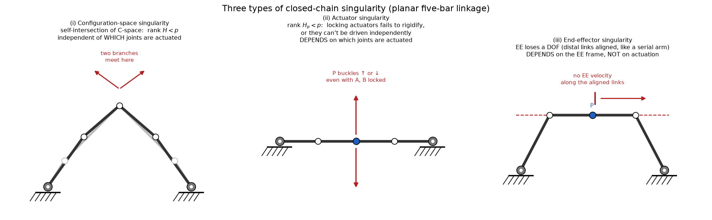

# 7b — Closed Chains: Differential Kinematics & Singularities

> Chapter 7, §7.2–7.3. Now that we can place a parallel mechanism (7a), we ask:
> how do **velocities** propagate, and **where does the mechanism break down**?
> This is where the actuated/passive split (7a §3) earns its keep, and where the
> serial-arm idea of a singularity splits into **three** distinct flavors.

---

## 1. The big picture — why velocity analysis is harder here

For an open chain (Ch. 5) the velocity story was a one-liner: `V = J(θ) θ̇`. You
command *every* joint velocity, and the Jacobian maps them straight to the
end-effector twist.

A closed chain breaks that simplicity for exactly the reason 7a kept hammering:
**only some joints are actuated.** You command `q̇_a` (the actuated joint
velocities — the 3 delta motors, the 6 Stewart pistons). But the end-effector
twist depends on *all* the joints, including the **passive** ones `q̇_p`, whose
motion you do **not** command. So the workflow is:

1. From the **loop-closure constraints**, solve for the passive velocities `q̇_p`
   in terms of the commanded `q̇_a`.
2. Then feed *all* the joint velocities through any single leg's ordinary
   (open-chain) Jacobian to get the end-effector twist `V`.

Two Jacobians show up, and keeping them straight is the whole game:

- the **forward-kinematics Jacobian** of a leg (the Ch. 5 kind, `V = J θ̇`), and
- the **constraint Jacobian** `H(q)` — *new* — encoding "the loop must stay
  closed at all times."

---

## 2. The constraint Jacobian — `H(q) q̇ = 0`

Start from the loop-closure constraints (7a §3): all legs reach the same
platform, e.g. `T_1(θ) = T_2(φ) = T_3(ψ)`. These hold *at all times*, so their
time-derivative holds too. Differentiating `T_1 = T_2` (via `Ṫ T⁻¹ = [V]`, the
twist) and rewriting through each leg's Jacobian gives, for the 3-leg example,

$$ J_1(\theta)\dot\theta = J_2(\phi)\dot\phi, \qquad J_2(\phi)\dot\phi = J_3(\psi)\dot\psi, $$

which stack into one homogeneous system in **all** the joint velocities:

$$ \boxed{\,H(q)\,\dot q = 0\,} \qquad q = (q_a, q_p). $$

**What this equation *means*, geometrically:** the loop can't tear or gap. Out of
all conceivable combinations of joint velocities, only those satisfying
`H(q) q̇ = 0` keep the loop closed — they live in the **null space of `H`** (the
same null-space idea from Ch. 5, now expressing "allowed motions of the whole
linkage"). Any `q̇` *not* in that null space would rip the mechanism apart.

### Splitting into actuated and passive

Reorder the columns of `H` so the actuated joints come first:

$$ \begin{bmatrix} H_a & H_p \end{bmatrix}
   \begin{bmatrix} \dot q_a \\ \dot q_p \end{bmatrix} = 0
   \quad\Longrightarrow\quad
   H_a \dot q_a + H_p \dot q_p = 0. $$

If the **passive block `H_p` is invertible**, solve for the passive velocities:

$$ \boxed{\,\dot q_p = -H_p^{-1} H_a\,\dot q_a\,} \tag{7.15} $$

**Read this in words:** "tell me how fast the motors are turning (`q̇_a`), and I'll
tell you how fast every passive joint *must* be moving (`q̇_p`) to keep the loop
intact." It's the missing half of the velocity state, recovered from the geometry.

> `H_p` square and invertible is the generic, healthy case. When `H_p` *loses
> rank*, you can't recover the passive velocities — the mechanism is at an
> **actuator singularity** (§4). This single matrix is the hinge between the
> velocity analysis and the singularity analysis.

### Assembling the actuated Jacobian `J_a`

Now you have all joint velocities (`q̇_a` commanded, `q̇_p` from 7.15). Push them
through **any one leg's** open-chain Jacobian to get the platform twist. The
result is packaged as

$$ V_s = J_a(q)\,\dot q_a, \qquad J_a(q) \in \mathbb{R}^{6\times m}, $$

where `J_a` is built by composing leg 1's Jacobian `J_1` with the relations from
(7.15) (book Eq. 7.21). `m` = number of actuators = DOF. That's the closed-chain
analogue of the Ch. 5 Jacobian: **commanded joint rates → end-effector twist.**

---

## 3. The static shortcut for Stewart–Gough (the elegant special case)

For the Stewart–Gough platform you don't need any of that `H_p^{-1}` machinery —
the **statics** hand you the inverse Jacobian for free, exactly via the `τ = JᵀF`
duality from Ch. 5.5. Here's why it's so clean:

Each leg is a piston with **ball joints at both ends**. A ball joint can't resist
torque, so each leg can only **push/pull along its own length** — the force it
applies is `f_i = n̂_i τ_i`, a magnitude `τ_i` along the unit leg direction `n̂_i`.
That's the whole point: a Stewart leg *is* a pure force along a known line.

Summing the six leg wrenches on the platform (each `F_i = (m_i, f_i)` with moment
`m_i = q_i × f_i`, using the **fixed-base** anchor `q_i` since it's constant):

$$ F_s = \sum_{i=1}^{6} \begin{bmatrix} q_i \times \hat n_i \\ \hat n_i \end{bmatrix}\tau_i
   = J_s^{-T}\,\tau,
   \qquad
   J_s^{-1} = \begin{bmatrix} -\hat n_1\times q_1 & \cdots & -\hat n_6\times q_6 \\
                               \hat n_1 & \cdots & \hat n_6 \end{bmatrix}^{T}. $$

So the columns of `J_s^{-1}` are just the **six leg screws** — each `(n̂_i, leg
moment)` is the screw axis of that piston. We get the inverse Jacobian by
*inspection of the geometry*, no differentiation. (Compare 7a §6, where the same
"a leg is a straight line" fact made the IK a one-line square-root. The leg's
simplicity pays off twice: once in position, once in velocity/statics.)

> **Why `J⁻¹` and not `J`?** For a parallel mechanism the *easy* direction is
> pose → legs (IK), so the **inverse** Jacobian (platform twist → leg rates, and
> by duality leg forces → platform wrench) is the natural one to write down. The
> forward Jacobian `J_s` is its matrix inverse — and inverting it is exactly as
> hard as parallel FK. Same duality as 7a, one derivative up.

---

## 4. Singularities — three distinct flavors

For a serial arm, "singularity" meant one thing: the Jacobian `J(θ)` drops rank,
the arm loses an end-effector DOF (Ch. 5b). Closed chains are richer because of
the actuated/passive split and the loop, so singularities fork into **three
types**. The book uses the **planar five-bar linkage** to show all three (two
ground motors `A`, `B`; arms `A–C–P` and `B–D–P` meeting at `P`).

### (i) Configuration-space singularity — `rank H(q) < p`

The set of all valid configurations forms a **surface** in joint space (recall
Ch. 2: the four-bar's C-space is a 1-D curve in 4-D). Where that surface
**self-intersects** — a *bifurcation point* — the mechanism reaches a fork: it can
continue onto **either branch**, and you can't predict which. (This is precisely
the 3×RPR "snap clockwise or counterclockwise" pose from 7a, and your branch-
switching question from the discussion: branches collide where the C-space
crosses itself.)

- **Test:** `rank ∂f/∂q = rank H(q) < p` (the *full* constraint Jacobian drops
  rank — the constraint surface stops being locally smooth).
- **Key property: it does NOT depend on which joints are actuated, or where the
  end-effector is.** It's a property of the linkage's *shape space* alone.
- Equivalently: it's the **intersection of all possible actuator singularities**,
  over every choice of which joints you actuate.

### (ii) Actuator singularity — `rank H_p(q) < p`

Now fix a choice of actuated joints. An actuator singularity is where the
**passive block `H_p` drops rank** — exactly the `H_p^{-1}` blow-up from §2.
Physically, two failure modes (both in the middle panel):

- **Nondegenerate:** the actuated joints **can't be driven independently** — push
  them and the mechanism jams or gets pulled apart; the commanded motion is
  infeasible.
- **Degenerate:** even with **all actuators locked, the mechanism still moves** —
  it fails to become a rigid structure. (Five-bar flat on a line: lock `A`, `B`
  and the center joint `P` still buckles up or down.)

- **Test:** `rank H_p(q) < p`.
- **Key property: it DEPENDS on which joints you actuate.** Relocating an actuator
  to a different (currently passive) joint can *eliminate* the singularity — a
  real design lever. (Distinguishing degenerate vs nondegenerate needs
  second-order/Hessian info; we don't go there.)
- **Nesting:** every configuration-space singularity is also an actuator
  singularity for every actuation choice (`rank H < p ⟹ rank H_p < p`), but **not
  vice-versa**. C-space singularities are the ones common to *all* choices.

### (iii) End-effector singularity — like a serial arm's

This is the familiar one: the **end-effector loses the ability to move in some
direction**, independent of the loop. In the right panel, the two distal links
`C–P` and `D–P` are **collinear** — so, just like an aligned 2R serial arm
(Ch. 5b), `P` can have **no velocity along that line**. The mechanism is locally
stuck in one Cartesian direction.

- **Test:** pick any valid (non-actuator-singular) actuation, write the forward
  kinematics `f(q_a) = T_{sb}`, and check `J_a = ∂f/∂q_a` for a rank drop — exactly
  the open-chain test from Ch. 5b.
- **Key property: it DEPENDS on the end-effector frame** (move the tool point and
  the singular set changes) **but NOT on which joints are actuated.**

### The cheat-sheet

| Type | Matrix test | Depends on actuation? | Depends on EE frame? | Physical tell |
|---|---|---|---|---|
| Configuration-space | `rank H < p` | **No** | No | C-space self-intersects; branch fork; snaps unpredictably |
| Actuator | `rank H_p < p` | **Yes** | No | can't drive actuators independently, or locking them doesn't rigidify |
| End-effector | `rank J_a < 6` (or DOF) | No | **Yes** | EE loses a Cartesian DOF (links align, like a serial arm) |

---

## 5. Why a roboticist cares (north-star hook)

- **Stay away from all three at runtime.** Near a singularity, required joint
  speeds blow up (`H_p^{-1}` huge), force control degenerates, and at C-space
  singularities the controller can hop branches and lose track of the platform's
  actual pose. A delta doing 200 picks/min lives or dies by keeping its workspace
  *inside* the singularity-free region — that region is literally the spec sheet.
- **Actuator singularities are a design choice.** Because they depend on *which*
  joints are actuated, mechanism designers move actuators around (or add a
  redundant one) to push singularities out of the useful workspace. This is the
  velocity-level reason redundant actuation/sensing (your 7a question) is worth
  the cost.
- **`J_a` is the object MuJoCo/Isaac expose.** When you command a parallel
  mechanism's platform velocity and ask the sim for joint torques, you're using
  `J_a` and `J_aᵀ` — the closed-chain twins of the Ch. 5 Jacobian. Same algebra,
  one constraint-solve deeper.

---

## 6. Gotchas & intuition checks

- **`H_p` invertible is the good case.** The instant it loses rank you're at an
  actuator singularity and `q̇_p = −H_p⁻¹H_a q̇_a` is meaningless — the passive
  velocities are no longer determined by the actuated ones.
- **Don't conflate the two Jacobians.** `H(q)` (constraint, "loop stays closed")
  is *not* `J_a` (twist = `J_a q̇_a`). You build `J_a` *using* `H` (via 7.15), but
  they answer different questions.
- **Three singularity types, three independences** — memorize the dependency
  pattern, it's the whole point: C-space depends on *neither* actuation nor EE
  frame; actuator depends on *actuation only*; end-effector depends on *EE frame
  only*.
- **The Stewart static shortcut is special, not general.** It works because each
  leg is a pure force along a line (ball-jointed piston). For mechanisms whose
  legs carry moments, you fall back to the `H_a, H_p` constraint-Jacobian
  procedure of §2.

---

## 7. FAQ

**Q: If one leg's Jacobian `J_1` is enough to get the end-effector twist, why
build `J_a` from the whole loop (Eq. 7.21)?**
Because one leg gives the twist *only if you already know all of that leg's joint
velocities* — and most of them are **passive**. In the book's example leg 1 has
joints `(θ₁,…,θ₅)` but only `θ₁` is actuated; `V = J_1 θ̇` needs all five `θ̇`. The
passive rates `θ̇₂…θ̇₅` are driven by the **other legs'** motors (`φ̇₁, ψ̇₁`) through
loop closure, so recovering them requires the full constraint system `H(q) q̇ = 0`
→ Eq. (7.15). In Eq. (7.21), `J_a = J_1 · [e₁ᵀ; g₂ᵀ; g₃ᵀ; g₄ᵀ; g₅ᵀ]`: the `J_1`
is the single-leg map ("one leg is enough"), while the `g_i` rows — which
reconstruct leg 1's *own passive* rates from `q̇_a` — are where "compile all legs"
hides. You compile the loop not to compute `V` from scratch, but to learn how
leg 1's passive joints move in response to the other legs' actuators.

This is the velocity-level twin of the 7a FK question: *one leg is always a
trivial serial chain; the difficulty is always reconstructing the passive part,
which only the full loop determines.* At the velocity level that reconstruction
is the `H_p⁻¹` step — and when `H_p` loses rank you can't do it, which is exactly
an actuator singularity (§4). See [[07a_closed_chains_kinematics]] §9.

**Q: How is the constraint Jacobian `H(q)` actually compiled?**
`H` is the **Jacobian of the loop-closure equations**. Two equivalent routes:

- **Scalar/analytic (`H = ∂f/∂q`).** Write loop closure as scalar equations
  `f(q) = 0` and differentiate. *Five-bar example:* the two equations
  `Σ Lⱼcos(...) = L₅`, `Σ Lⱼsin(...) = 0` give `f: ℝ⁴→ℝ²`; then `H = ∂f/∂q` is the
  2×4 matrix of partials (e.g. `∂f₁/∂θ₁ = −[L₁sinθ₁ + L₂sin(θ₁+θ₂) + …]`). Best
  for small planar linkages.
- **Geometric/screw (stack leg Jacobians, Eq. 7.12).** Build each leg's space
  Jacobian `Jᵢ` (columns = the leg's joint screws, Ch. 5). The loop forces all
  leg-tip twists equal, `J₁θ̇ = J₂φ̇ = J₃ψ̇`; pick `k−1` pairwise equalities for
  `k` legs and lay them out in a block matrix with `+Jᵢ / −Jⱼ` in the columns of
  legs `i, j`:
  $$ H = \begin{bmatrix} J_1 & -J_2 & 0 \\ 0 & J_2 & -J_3 \end{bmatrix}. $$
  The block sparsity *is* the loop bookkeeping. Best for spatial mechanisms (no
  trig differentiation).

The two routes give the same matrix (a leg's screw columns *are* the partials of
its tip pose). **Dimension bookkeeping** (book's 3×5-joint example): 15 columns
(all joints), 2 equalities × 6 = 12 rows → `H ∈ ℝ¹²ˣ¹⁵`, generic rank 12 → null
space dim `15−12 = 3 = DOF`; #passive `= 15−3 = 12 =` #rows, so after permuting
columns to `[H_a | H_p]`, **`H_p` is 12×12 square** — which is *why* `q̇_p =
−H_p⁻¹H_a q̇_a` is a determined solve. (#constraints always = #passive joints.)

**Q: In the real control loop I command a trajectory → IK → actuator angles. Do I
form `J` and invert it, or get `J⁻¹` directly?**
For a parallel robot you get **`J⁻¹` directly — you almost never form `J` and
invert it** (the mirror image of serial arms, where `J` is easy and you invert it
for control). Two levels:

- **Position level (most common): no Jacobian at all.** Parallel IK is closed-form
  per leg (Stewart `sᵢ=‖p+Rbᵢ−aᵢ‖`; delta §7a.1), so evaluate it at each waypoint
  → actuator positions → per-motor PID. This is what industrial deltas do.
- **Velocity / resolved-rate level:** to track a twist `V` you want `q̇_a = J⁻¹V`.
  Get `J⁻¹` **directly**: differentiate the closed-form IK (`ṡ = G(R,p)V`, `G=J⁻¹`,
  Eq. 7.5) *or* read it off as the stacked **leg screws** via statics (§3). Then
  `q̇_a = J⁻¹V` is one matrix-vector product (each actuator rate = projection of
  its anchor's velocity onto the leg) — *no inversion*. The hard `J = (J⁻¹)⁻¹`
  would only be needed for the forward velocity map (twist *from* leg rates),
  which a controller rarely wants.

`J†` / damped least squares enters only for **redundant actuation** (non-square
`J⁻¹`) or **near a singularity** (`J⁻¹` ill-conditioned) — identical machinery to
Ch. 6b, and the concrete runtime reason to stay out of the singular region (§5).
