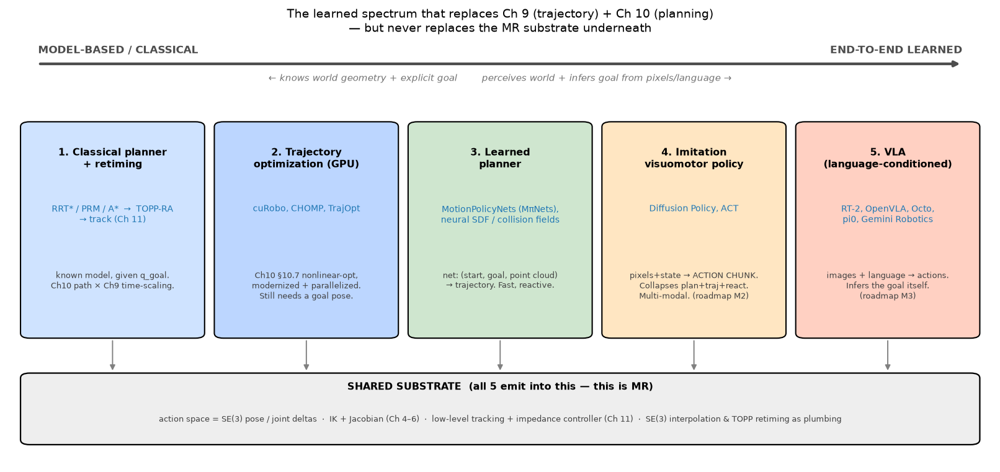

# 9 & 10 — The Learned SOTA (the modern replacement, unified)

> **Why one note for two chapters.** Classically, Ch 9 (*time a known path*) and
> Ch 10 (*find a collision-free path*) are separate problems with separate
> algorithms. The modern learned methods **dissolve that boundary**: a single
> closed-loop policy maps perception → actions, collapsing *find a path*, *time
> it*, and *react to what happens* into one thing. So the classical gist lives in
> [`09_trajectory_generation.md`](09_trajectory_generation.md) and
> [`10_motion_planning.md`](10_motion_planning.md); **this note is the SOTA story
> they share.** This is the most north-star-relevant note in the project so far —
> it's the bridge from MR (Phase 0) to the actual robot-learning stack.

---

## 1. The thesis: from a pipeline to a policy

The classical stack is a **pipeline of independent stages**:

```
perceive world model → pick goal q_goal → PLAN path θ(s)  [Ch10]
                     → TIME-SCALE s(t) into θ(t)           [Ch9]
                     → TRACK with a controller             [Ch11]
```

Each stage assumes the previous one handed it something clean: a known geometric
world model, an explicit goal configuration, a feasible path. **For the
north-star tasks, every one of those assumptions breaks:**

- *"Pick up that mug"* — there is **no `q_goal`**. The target is a novel,
  possibly deformable object seen through a camera; you'd have to *perceive* its
  pose, *decide* a grasp, and only then would you have a goal. And the "right"
  motion is contact-rich and **multi-modal** (many equally-good ways to do it).
- *"Tidy the room"* — there is **no known world model and no single goal**; the
  task is a *language phrase*, the world is perceived live, and you must **react**
  to clutter, slip, and your own errors *during* the motion.

The learned answer is to **replace the open-loop pipeline with a closed-loop
policy** `a = π(observation)` that is re-evaluated many times per second:

> Instead of *computing* a trajectory once and tracking it blindly, a network
> **predicts a short trajectory segment directly from the current observation**,
> executes a bit of it, then **re-predicts** from the new observation. Planning,
> trajectory generation, and reaction become one learned, feedback-driven loop.

The crucial thing MR teaches you to see: **the policy's output is still an MR
object.** It emits SE(3) poses or joint deltas, fed to an IK/Jacobian map (Ch 4–6)
and a low-level tracking/impedance controller (Ch 11). *The learned net replaced
the trajectory **author**, not the action **space** or the **substrate**.*

---

## 2. The spectrum (the one picture to hold)

There isn't "classical vs learned" — there's a **spectrum** of how much is
learned vs modeled, and modern systems mix rungs freely:



| Rung | What it is | What it still needs | MR chapter it modernizes |
|---|---|---|---|
| **1. Classical planner + retime** | RRT\*/PRM/A\* path → TOPP-RA time scaling → track | known geometry model, explicit `q_goal` | Ch 10 × Ch 9 × Ch 11 |
| **2. Trajectory optimization (GPU)** | cuRobo, CHOMP, TrajOpt | known geometry, goal pose | Ch 10 §10.7 (nonlinear opt) |
| **3. Learned planner** | MotionPolicyNets (MπNets), neural collision/SDF fields | a goal pose + a point cloud | Ch 10 (replaces sampling/opt with a net) |
| **4. Imitation visuomotor policy** | **Diffusion Policy, ACT** | demonstrations to imitate | Ch 9 + Ch 10 (collapses both) |
| **5. VLA** | RT-2, OpenVLA, Octo, π0, Gemini Robotics | big robot+web data | Ch 9 + Ch 10 + perception + task |

Read left→right as "knows the world & goal explicitly" → "perceives the world &
infers the goal." **The whole bottom of the figure — the shared substrate — is
MR**, and every rung emits into it.

---

## 3. The right edge of classical: GPU trajectory optimization (cuRobo)

Before the learned rungs, know the *modern classical* tool, because it's a
real workhorse for the **reach/retract** phases of pick-and-place where you *do*
have a collision model:

- **cuRobo** is §10.7 nonlinear trajectory optimization, **parallelized on a
  GPU**. It solves thousands of optimization seeds at once (beating the
  "needs a good initial guess / non-convex" weakness of classical TrajOpt by
  brute-force parallel restarts), checks collisions against a point cloud / signed
  distance field, and returns a smooth, time-parameterized, joint-limit-respecting
  trajectory in **milliseconds**.
- It *is* "Ch 10 path + Ch 9 retiming + collision-checking," just fast enough to
  run in the perception→control loop. In a real pick-place stack you often use
  **a learned grasp predictor to get the goal pose, then cuRobo to plan the
  motion to it** — learning for the *semantic* part, classical optimization for
  the *geometric* part. Best of both rungs.

This is the honest picture: the learned methods didn't *delete* classical
planning; they took over the parts classical planning is bad at (perception,
semantics, contact, multimodality) and left it the part it's good at
(collision-free geometry with a known model).

---

## 4. The core learned methods (the two to really understand)

These are roadmap milestone **M2** (imitation learning on demos). Both are
**behavior cloning**: collect human teleop demonstrations, train a net to
reproduce the action given the observation. The interesting engineering is in
*how* they represent the action.

### 4.1 The problem they both solve: action chunking

Naive behavior cloning predicts **one action at a time** `aₜ = π(oₜ)`. This fails
two ways:
1. **Compounding error.** Tiny per-step mistakes push the robot into states the
   net never saw in training; errors snowball. (This is the classic
   *covariate-shift* problem of imitation learning.)
2. **Idle/pause ambiguity & jitter.** Single-step prediction produces jerky,
   indecisive motion.

The fix both methods use is **action chunking**: predict a **chunk** of the next
`H` actions at once, `a_{t:t+H} = π(oₜ)` (e.g. the next ~0.5–1 s). Execute the
chunk (or part of it, **receding-horizon** style — do a few steps, then re-predict
from a fresh observation), and **blend overlapping chunks** for smoothness
("temporal ensembling"). Two payoffs:

- A chunk **is a short trajectory segment** — the net *is* the Ch-9 trajectory
  generator, but learned and conditioned on what it sees.
- Committing to `H` steps cuts the compounding-error feedback loop and produces
  decisive, smooth motion.

> **The single sentence that ties it to MR:** *an "action chunk" is a
> short receding-horizon trajectory, authored by a network from pixels instead of
> by a polynomial from waypoints.* Everything you learned about `θ(t)`,
> smoothness, and feasibility still applies to that chunk.

### 4.2 ACT — Action Chunking with Transformers

A **transformer**, trained as a **CVAE** (conditional variational autoencoder),
that takes multi-camera images + joint state and outputs the next chunk of
target actions. The CVAE latent lets it capture variability in human demos
(people don't do the task identically every time) instead of averaging it into
mush. ACT is the engine behind **ALOHA**'s impressively precise bimanual
manipulation (threading zip-ties, etc.). Mental model: *"a transformer that
autocompletes the next second of robot motion."*

### 4.3 Diffusion Policy — the multimodality champion

Frames "what's the next action chunk?" as **conditional generation**: start from
Gaussian noise and **iteratively denoise it into an action sequence**,
conditioned on the observation (the same diffusion idea as image generators,
applied to action trajectories). Why this won mindshare:

- **Multimodality.** When several actions are equally good (go left *or* right
  around the mug), a plain regression net averages them → a useless path *through*
  the mug. Diffusion represents the **full distribution** and **commits to one
  mode**. This is the key advantage and the reason it's so widely copied.
- Stable to train, handles high-dimensional action chunks, naturally
  receding-horizon.

> **The LA/intuition hook (for the diffusion idea):** think of the space of
> possible action-chunks as a landscape where "good" chunks form a few separate
> peaks (the modes). Regression finds the *mean* (a valley between peaks = bad).
> Diffusion learns to **walk noise downhill onto one peak**, so it produces a
> *committed, coherent* trajectory rather than an average. This "represent the
> whole distribution, then sample one mode" is the conceptual leap over
> classical trajectory generation, which only ever produced *one* hand-chosen
> path.

---

## 5. VLAs — language in, actions out (milestone M3)

Vision-Language-Action models push the policy upstream to also **infer the goal
from language**: `images + "put the apple in the bowl" → actions`. They're
typically built by fine-tuning a **vision-language model** (the same family as
multimodal chat models) to output robot actions as just another token stream.

- **RT-2** (Google) — co-trains a VLM on web data + robot data so web semantics
  ("which object is the apple") transfer to control.
- **OpenVLA** — open-source, ~7B params, the documented one to actually study
  first (roadmap names it as the M3 starting point).
- **Octo / π0 / Gemini Robotics** — generalist policies / flow-matching action
  experts / frontier multimodal-robotics models.

The MR punchline, again: a VLA **internalizes perception + task understanding +
planning + trajectory generation**, but its **output is still SE(3)/joint deltas
through a low-level controller**. You cannot understand, debug, or deploy one
without the MR action-space vocabulary. **MR *is* the interface a VLA writes to.**

---

## 6. The navigation branch — semantic nav / VLN (north-star task #2)

"Semantically navigate a room" is the *mobile* version of this same collapse, and
it leans on Ch 10 (planning) + Ch 13 (wheeled robots). The classical→learned
spectrum repeats:

- **Classical nav stack** (ROS **Nav2** / `move_base`): build an **occupancy
  grid** map (SLAM), run a **global planner** (A\* / Dijkstra on the grid — pure
  Ch 10) to get a route, and a **local planner** (DWA / TEB) for reactive
  obstacle avoidance. Rock-solid for *geometric* "go to coordinate (x,y)."
- **The gap:** "go to the **kitchen**" / "find a **mug**" is *semantic* — there's
  no (x,y) goal until you ground the language in what you perceive.
- **Learned / foundation-model nav:**
  - **ViNT / NoMaD** — foundation models for visual navigation: image-goal /
    exploration policies that generalize across robots, often over a
    **topological** map of places rather than a metric grid.
  - **VLN (Vision-and-Language Navigation)** — follow natural-language route
    instructions ("go down the hall, turn left at the plant").
  - **VLMs for semantic goals** — use an open-vocabulary detector / VLM to turn
    "the kitchen" into a metric goal, then hand that goal to the *classical* Nav2
    planner. Same pattern as pick-place: **learning for semantics, classical
    planning for geometry.**

So the same lesson holds for navigation: the **learned layer grounds language and
perception into a goal**; the **classical Ch-10 planner + Ch-13 controller still
move the base.**

---

## 7. What MR Ch 9 & 10 still do underneath (don't skip these)

The learned policy sits *on top of* a classical substrate that never went away.
When you build M1–M3, you will personally use:

- **SE(3) interpolation primitives** (Ch 9): screw / decoupled `CartesianTrajectory`,
  slerp. Scripted phases ("move straight down 10 cm to grasp"), the *demos you
  collect to train policies*, and data augmentation are full of these.
- **Retiming / feasibility layer** (Ch 9 §9.4 → **TOPP-RA**): a learned or
  optimized path still must be made to respect velocity/accel/torque limits
  before it hits motors. Smoothness-vs-jerk is real on real hardware.
- **A\* on occupancy grids + collision checking / distance fields** (Ch 10): the
  global nav planner and the collision oracle inside cuRobo.
- **The vocabulary**: action chunk = trajectory; receding horizon; path vs
  retiming; satisficing vs optimal; probabilistic completeness; multimodality.
  You'll read all of these in robot-learning papers — and they're Ch 9/10 ideas.

---

## 8. Toy examples we'll build (the "code" step for 9 & 10 together)

Small, runnable, bridging classical → learned:

1. **SE(3) interpolation** *(Ch 9 primitive that survives)* — implement decoupled
   vs screw `CartesianTrajectory`/`ScrewTrajectory` between two poses; plot the two
   tip paths. The most-used-downstream piece.
2. **Time-scaling sandbox** *(Ch 9)* — `Cubic/QuinticTimeScaling` from scratch,
   the jerk story, cross-check vs `modern_robotics`.
3. **RRT in 2D** *(Ch 10)* — a ~40-line RRT through a 2D obstacle field
   (regenerate the note figure as a live toy); optionally add the RRT\* rewire to
   *see* paths shorten. Builds the "point in C_free" intuition concretely.
4. **Action-chunking smoothing** *(the bridge to learned)* — simulate a noisy
   "predicted chunk," implement ACT-style **temporal ensembling** of overlapping
   chunks, and watch open-loop single-step prediction drift while chunked +
   blended stays smooth. Makes §4.1 tangible with zero training.
5. *(Optional, multimodality demo)* — a 1-D toy where two action modes are valid;
   show a regression fit collapsing to the bad mean vs a tiny sampling/mixture
   model committing to one mode — the Diffusion-Policy intuition in miniature.

---

## 9. Gotchas / intuition checks

- **The learned net replaced the *author*, not the *action space*.** Output is
  still SE(3)/joint deltas → IK/Jacobian → controller. MR is the substrate, not
  a detour.
- **"Action chunk" = short trajectory.** If a paper says "predict H actions,"
  read "generate a receding-horizon trajectory segment."
- **Multimodality is *why* generative (diffusion) beats regression** for action
  prediction — averaging valid alternatives gives an invalid action.
- **Imitation's failure mode is compounding error / covariate shift** — the
  motivation for chunking (and later for DAgger / RL fine-tuning).
- **Learning ≠ replacing planning everywhere.** The strong systems are *hybrid*:
  learning for perception/semantics/contact, classical optimization (cuRobo) /
  A\* for known-model geometry. "Learn the goal, plan the geometry."
- **Same pattern for arm and base.** Pick-place and semantic-nav both =
  *ground language+perception into a goal (learned)* + *move there (classical
  planner/controller)*, increasingly fused into one policy as you go right on the
  spectrum.

---

## 10. FAQ

### Q: What does "known geometry" mean (the left side of the spectrum)?

It means you have an **explicit 3-D model of the shapes and poses of everything
the robot could collide with** — its own links *and* the obstacles — in a form a
**collision checker can query**. Two parts: the **robot's geometry** (URDF +
meshes, you always have this) and the **environment's geometry** (the part that's
"known" or not). The environment model can come from a **CAD model** of a
structured cell, or from **live perception turned into geometry** (depth-camera
**point cloud / voxel grid / signed-distance field** registered into a "collision
world"). The book states the assumption in §10.1.1/§10.2.1: evaluating `C_free`
*"assumes an accurate geometric model of the robot and environment is available."*

Why it's the dividing line: classical planners and trajectory optimization
(RRT/PRM/cuRobo) **cannot run without it** — their inner loop is "does the body at
`q` collide?", which is meaningless without shapes+poses. The learned-from-pixels
rungs (4–5) **drop this assumption**: they map raw images → actions and *never
build an explicit obstacle model*; "avoid the clutter" is implicit in the learned
mapping. That's why learning is needed for unstructured, never-seen scenes.

> **Nuance:** "known" ≠ "pre-built/static." cuRobo typically runs on a *live*
> depth point cloud rebuilt every cycle — geometry that's "currently perceived and
> represented as an explicit collision shape," not modeled in advance. The real
> contrast is **explicit geometric representation** (classical) vs **raw
> perception → actions, no geometry ever materialized** (learned).

### Q: How do Diffusion Policy / ACT work without an FK/IK model of the robot?

They have no analytic FK/IK — and depending on the **action space** they either
don't need one or **outsource it to the classical substrate**. A policy is just
`action = π(observation)`; the kinematics question is decided by *what numbers it
outputs* (a choice you make at training time, not a property of ACT vs DP):

- **Joint-space actions** (e.g. ACT/ALOHA: target joint angles). Output goes
  **straight to a joint PD controller → no FK, no IK anywhere.** "How does it know
  where the gripper is?" — it *sees* the gripper+object in the images and *knows
  its own joint angles* (proprioception is in the observation), and has learned
  from demos *"when the scene looks like this and my joints are here, move the
  joints like this."* A **learned, task-conditioned visuomotor map** that does
  IK's *job* without solving IK's *problem* (it's never given an explicit goal
  pose to invert).
- **End-effector / task-space actions** (common in Diffusion Policy: target SE(3)
  pose/delta). Now FK and IK **are** used — but by the **classical layer wrapping
  the policy**: the robot's driver provides the current EE pose via *its own FK*
  (proprioception), and an **IK solver / Cartesian-impedance controller executes**
  the policy's EE target. The policy just shuffles SE(3) numbers; kinematics are
  the substrate's job.

Two enablers make "no innate model" fine: (1) **proprioception is in the
observation** (the robot tells the policy where it is, so it never derives its own
pose), and (2) **fixed embodiment + closed-loop re-planning** (same robot for
train & deploy, so baked-in kinematics are valid; re-observing every fraction of
a second forgives IK-grade imprecision and dodges singularities the demos
avoided).

> **The catch:** because the kinematics are *implicit and body-specific*, these
> policies are **embodiment-specific** — change link lengths/joint layout and the
> learned map is silently wrong, since it can't re-derive FK/IK from a model it
> doesn't have. That's why **cross-embodiment** (Octo, Open X-Embodiment, π0) is
> an open problem, while a classical IK solver just needs a new URDF.
> **MR thesis restated:** FK/IK didn't vanish — they're *absorbed into the learned
> map* (joint-space) or *done explicitly by the wrapping controller* (EE-space).
> The policy replaced the trajectory **author**, not the kinematics.

### Q: A cloned policy (Rung 4) only reproduces its demos — how do you give it a custom command (pick the apple vs the banana)?

**Vanilla single-task DP/ACT has no input for "which object"** — it reproduces the
one behavior it was cloned on. If you only demoed apple-picking, nothing makes it
pick the banana; that behavior isn't in its distribution. To get
command-on-demand you must **add a conditioning channel** *and* **put the variation
in the data**:

1. **Add a conditioning input:** `action = π(observation, task)`. Forms:
   - **language embedding** (CLIP/T5 encode "pick up the apple") — *language-
     conditioned BC*; the most common, and the seed of a VLA;
   - **goal image** (a picture of success) — goal-conditioned BC;
   - **spatial prompt — a selected object mask or clicked pixel** (run **SAM** to
     segment the apple, feed the mask as "pick *this*"). A real hybrid:
     **classical perception picks the target, learned policy does the motion;**
   - **one-hot task ID** (simplest; fixed task set, no generalization to new
     objects).
2. **The data must contain both behaviors, *labeled* with the conditioning** —
   apple demos tagged "apple," banana demos tagged "banana." The net learns to
   *attend* to `task` only if demos vary by it.
3. **Generalizing the conditioning to *novel* objects = Rung 5.** Handling "pick
   the mango" with no mango demos needs huge diverse language-labeled data — which
   **is what a VLA is.** So *Rung 4 + a language-conditioning channel, scaled up,
   becomes Rung 5*; that jump is the whole Rung 4 → Rung 5 transition.

**Structural contrast with the classical VLM+SAM+point-cloud+AnyGrasp pipeline:**
there, "which object" is decided in a **separate perception module** that emits an
explicit **goal pose**, and you retarget by re-running perception → new pose →
re-plan. In Rung 4 the decision is **inside the policy** via a conditioning input
it was *trained to interpret* — you **can't** just hand it a goal pose (it has no
such input unless you built one); you hand it the conditioning signal (language /
mask / goal image) it learned from. That coupling of perception+decision+control
is the price of end-to-end, and why "how do I tell it what to do" is a **design
choice baked in at training time**, not a runtime argument.

### Q: What is flow matching (and how does it relate to diffusion)?

**Same job as diffusion — turn noise into a sample from a complex distribution
(an action chunk) — different mechanism.** Diffusion *iteratively denoises*; flow
matching **learns a velocity field and follows it**, like a wind that carries a
particle from noise into place.

*The picture:* you have a **noise cloud** (simple Gaussian) and a **data cloud**
(real action chunks). Flow matching learns a **velocity field** — at every
position and time `t∈[0,1]`, an arrow "move this way, this fast" — built so that
releasing the noise cloud at `t=0` and following the arrows morphs it into the
data cloud by `t=1`. To **generate one sample**: drop a particle at a random noise
point and *follow the arrows* `t=0→1`; where it lands is your action chunk.

> **LA aside (Ch-3 callback):** a "velocity field" is exactly what `ω×p` was in
> Ch 3 — an arrow at every point. "Follow the arrows over time" = solving an ODE
> `dx/dt = v(x,t)` by small steps `x ← x + v·Δt`. Nothing new; it's integrating a
> vector field, like twist integration.

*Training (the simple trick):* pick a noise point `x₀` and a data point `x₁`, draw
the **straight line** `xₜ=(1−t)x₀+t·x₁`; its velocity is the constant `x₁−x₀`.
Train the net to regress that: `loss = ‖net(xₜ,t) − (x₁−x₀)‖²`. Averaged over many
(noise,data) pairs this learns the whole field. Straight paths → **"rectified
flow."**

*Why it's used:* **faster sampling** (straight flows need *few* integration steps
vs diffusion's tens–hundreds → matters because **inference speed = control rate**;
π0 runs ~50 Hz), simpler/stable objective, and it **keeps diffusion's
multimodality** (models the full distribution, commits to one mode vs averaging).
Treat diffusion and flow matching as **interchangeable engines for the same role**
— "generate a multi-modal action chunk" — with flow matching the faster-sampling
trend. **π0** = "a Diffusion-Policy-style action generator, swapped to a faster
flow-matching sampler" bolted onto a vision-language backbone.

### Q: Does flow matching need different training data? Can π0 run with *no* data?

**No different data, and no — π0 cannot run dataless.** Flow matching is only the
*engine* that fits/samples the action distribution; it needs the **same imitation
data** as Diffusion Policy: (observation, action-chunk) demo pairs on the target
embodiment, language-labeled for conditioning. Swapping diffusion → flow matching
changes *how* you fit the distribution, **not how much data you need.**

> **Key principle:** data efficiency comes from **pretraining scale + transfer +
> conditioning**, *not* from the generative mechanism. Diffusion-vs-flow-matching
> is orthogonal to data hunger.

π0 is among the *most* heavily trained things on the spectrum — two stacked piles
of data: (1) **web-scale vision-language pretraining** (its VLM backbone → where
"apple/bowl/left" come from), and (2) **thousands of hours of diverse,
cross-embodiment robot data** (PI's own + open datasets → where "what motions
manipulate" come from). With **zero** data it's random weights = useless. What
feels like "no data" is a *deployment* property: thanks to massive pretraining it
can attempt a **new task zero-shot, or adapt with a handful of demos (few-shot)** —
the foundation-model payoff, i.e. it **generalizes the conditioning channel** to
unseen commands. Caveat: even π0 usually wants **some fine-tuning on your specific
robot** (the embodiment-specificity problem); pure zero-shot on a brand-new
embodiment is the frontier. **"Little/no *new* task data" ≠ "no data ever" — the
data moved into a one-time internet-and-robot-scale pretraining you inherit.**

### Q: How do VLAs actually output actions — tokens, or a generative head? (Is OpenVLA like π0?)

**Two design families; VLAs split between them — OpenVLA and π0 are on opposite
sides.**

- **Family A — actions as *discrete tokens* (autoregressive; no generative head).**
  Discretize each action dim into bins (e.g. 256), make each bin a **token**, and
  have the LLM **predict action tokens like words.** Action comes straight from
  the LM head — *no* diffusion/flow module.
  - **OpenVLA** (Prismatic-7B backbone, fine-tuned on Open X-Embodiment): 7 action
    dims × 256 bins as tokens. So OpenVLA **generates action poses directly — it
    does *not* feed a generative head.**
  - **RT-2**: same (actions as text-like tokens, co-trained with web VQA).
- **Family B — continuous actions via a *generative head* conditioned on the
  backbone.** The VLM emits a **conditioning embedding**; a separate **diffusion or
  flow-matching** action expert (co-trained) generates continuous action chunks.
  - **π0** → **flow-matching** head (~50 Hz). **Octo** → **diffusion** head.
    **RDT-1B** → diffusion-transformer.

| | Family A: discrete tokens | Family B: generative head |
|---|---|---|
| examples | RT-2, OpenVLA | π0 (flow), Octo (diffusion) |
| action made by | LLM predicts binned tokens | backbone embedding conditions a diffusion/flow sampler |
| precision | quantized (bin width) | continuous |
| multimodality | limited (binning + AR) | native (full distribution) |
| control rate | lower (token-by-token) | higher (chunk in few steps) → dexterity |
| simplicity | rides the LLM directly | extra generative module |

**Notes:** *ACT* is usually a **standalone policy**, not a head bolted on a VLM —
the common bolt-on decoders are **diffusion and flow matching**. **Trend:** drift
toward **continuous generative heads (flow matching)** for precise, smooth,
high-frequency control, but token-based persists (simplest, rides LLM scaling).
The two are converging — even **OpenVLA-OFT** experiments with continuous-action
heads / parallel decoding. **Takeaway:** "VLA" only means *vision+language →
actions*; **how** actions are produced (tokenize vs condition-a-sampler) is a
separate architectural axis, and you'll see both.
