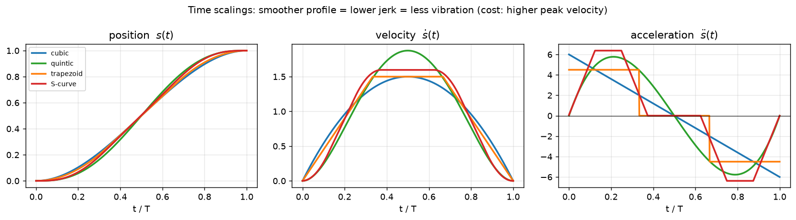
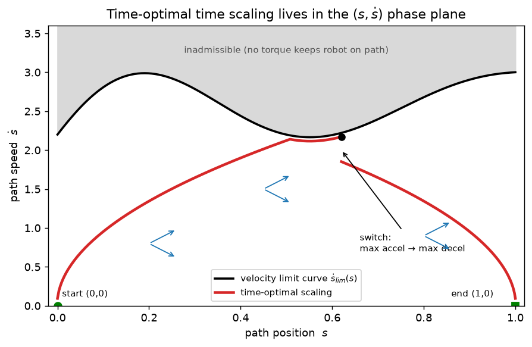
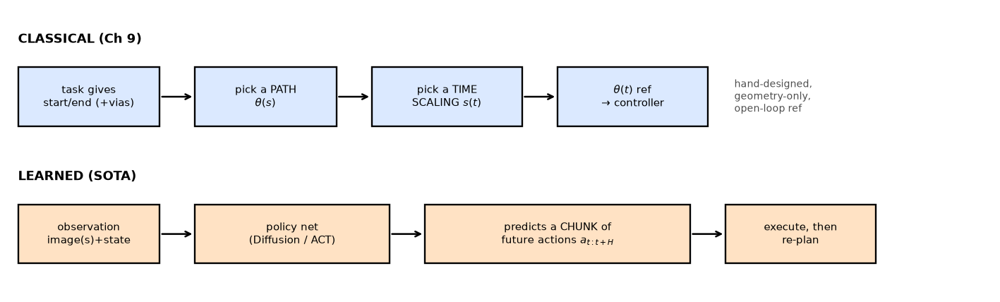

# 9 — Trajectory Generation (gist + the learned replacements)

> **How to read this note.** Chapter 9 is on the *special-handling* list (see
> `CLAUDE.md`): we get the **gist** of the classical theory, then spend real
> energy on the **SOTA learned approaches that replace it** (Diffusion Policy,
> ACT), then play with **small toy examples**. So §1–§5 are deliberately brisk —
> enough to own the vocabulary and the ideas that *survive* into modern systems —
> and §6 is the part that matters for your north star. Don't sweat the
> derivations.

---

## 1. The big picture — what is a "trajectory," and where does it sit?

Everything before this chapter answered *geometry* questions: where is the
end-effector (FK, Ch 4), how do joint speeds map to tip speeds (Jacobian, Ch 5),
what joint angles hit a target pose (IK, Ch 6), what torques produce what
accelerations (dynamics, Ch 8). **None of those said anything about *time*** —
about the actual stream of `(position, velocity)` setpoints the robot should
track second by second.

That stream is a **trajectory**: the robot's configuration *as a function of
time*, `θ(t)`. The controller in Ch 11 is a tracking machine — you hand it
`θ(t), θ̇(t)` and it computes torques to follow it. Chapter 9 is **how you
manufacture that reference signal** in the first place.

The chapter's one big organizing idea:

> **trajectory = path × time scaling.**
> A *path* `θ(s)` is the pure geometry — the sequence of configurations, with no
> clock attached (`s` runs 0→1). A *time scaling* `s(t)` is the clock — *when*
> you're at each point of the path. Compose them: `θ(t) = θ(s(t))`.

Why split a single function `θ(t)` into two? Because the two halves have totally
different concerns and you want to design them separately:

- the **path** worries about *where you go* — straight line? avoid the singularity?
  pass through these via points?
- the **time scaling** worries about *how fast* — smooth enough to not shake the
  robot? within velocity/acceleration/torque limits? minimum time?

This split is not just a textbook convenience — it's still a live design pattern.
A modern stack will often have a learned policy or a planner produce a *path*
(geometry), and a separate, boringly-reliable *time-scaling / retiming* module
make it dynamically feasible. Keep the split in mind; it outlives the chapter.

### The chain rule (the only "math" in the front half)

Once `θ(t) = θ(s(t))`, velocity and acceleration come straight from the chain
rule. This is worth seeing once because it shows *exactly* how the two halves
combine:

```
θ̇ = (dθ/ds) · ṡ
θ̈ = (dθ/ds) · s̈  +  (d²θ/ds²) · ṡ²
```

Read it geometrically:
- `dθ/ds` is the **path tangent** — the direction you're moving in config space,
  a purely geometric object. `ṡ` is **how fast you slide along the path**. Their
  product is the actual joint velocity. *Same path, faster clock ⇒ proportionally
  bigger joint velocities.*
- Acceleration has **two** pieces: `s̈` times the tangent (speeding up/slowing
  down *along* the path) **plus** `ṡ²` times the path *curvature* `d²θ/ds²`
  (the centripetal-style term — even at constant speed, a curved path needs
  acceleration to stay on it). This `ṡ²` term is exactly why fast motion through
  curved paths is hard, and it's the seed of the whole time-optimal story in §5.

Both `θ(s)` and `s(t)` must be **twice differentiable** so `θ̈` (hence the
dynamics, hence the torques) is well defined.

---

## 2. Point-to-point paths: the straight line

Simplest task: start at rest at `θ_start`, end at rest at `θ_end`. Simplest path:
a straight line. But "straight line" means different things in different spaces.

**Straight line in joint space** — interpolate the joint vector linearly:

```
θ(s) = θ_start + s (θ_end − θ_start),    s ∈ [0,1]
```

`dθ/ds = θ_end − θ_start` (constant), `d²θ/ds² = 0` (no curvature → the ugly `ṡ²`
term vanishes). Dead simple, and it **respects joint limits for free**: joint
limits carve out a *convex* box in joint space, and a straight line between two
points in a convex set stays inside it. Downside: a straight line in *joint*
space makes the end-effector trace some **curved, hard-to-predict path** in the
world.

**Straight line in task space** — interpolate the end-effector coordinates
instead, so the *tip* goes straight in the world. Now two new problems appear
(both worth knowing because learned systems hit them too):

1. **Singularities.** If the straight task-space line passes near a kinematic
   singularity, the Jacobian blows up the required joint velocities (Ch 5/6) —
   for *almost any* time scaling. Geometry that's innocent in the world can be
   violent in joint space.
2. **Reachable space isn't convex.** Two poses can be reachable while the
   straight line between them pokes outside the workspace. (Fig 9.1 in the book:
   the straight task-space line demands joint values past the limits.)

### "Straight line" in SE(3) — you can't just subtract matrices

If start/end are full poses `X = (R, p) ∈ SE(3)`, the naive `X_start + s(X_end −
X_start)` is **garbage** — adding two rotation matrices does not give a rotation
matrix (SE(3) is a curved space, not a vector space; you can't average it
element-wise). This is a direct callback to Ch 3. Two clean fixes:

- **Constant-screw path** — move along a single fixed screw axis from start to
  end (simultaneous rotate + translate, Ch 3's screw motion):
  ```
  X(s) = X_start · exp( log(X_start⁻¹ X_end) · s )
  ```
  `log(X_start⁻¹ X_end)` is the twist (in the start frame) that carries start→end
  in unit time; scaling it by `s` and re-exponentiating walks you along the
  screw. The tip does **not** trace a straight Cartesian line (it spirals along
  the screw), but the motion is "geometrically straight" in the screw sense.

- **Decoupled path** — usually what you actually want: let the *position* go
  straight and let the *rotation* slerp along its own constant axis:
  ```
  p(s) = p_start + s (p_end − p_start)               # straight line in ℝ³
  R(s) = R_start · exp( log(R_startᵀ R_end) · s )     # constant-axis rotation
  ```
  Origin travels a clean straight line; orientation interpolates smoothly and
  independently. This is the `CartesianTrajectory` primitive, and **it is still
  used constantly** — e.g. "move the gripper straight down 10 cm while keeping it
  level" in a manipulation pipeline. `ScrewTrajectory` is the screw version.

> **LA you need here:** the only real linear algebra in this chapter is this
> `exp(log(·)·s)` interpolation, and it's pure Ch-3 recall. `log` of an SE(3)
> element gives you exponential coordinates (a twist `[V]`); scaling those by `s`
> and `exp`-ing back is "do a fraction `s` of that screw motion." That's how you
> interpolate in a curved space: drop to the flat tangent space (the Lie
> algebra), scale there, lift back. Element-wise arithmetic on `R`/`T` is *never*
> valid; always go through `log`/`exp`. The same trick is how you'd average or
> blend poses anywhere downstream.

---

## 3. Time scalings I — the polynomial family

Now fix a path and design the clock `s(t)`, `s: [0,T] → [0,1]`, with `s(0)=0,
s(T)=1`. The whole game is **smoothness vs. aggressiveness**, and the
discriminator is *jerk* (the derivative of acceleration — what you physically
feel as a "lurch," and what excites mechanical vibration).



**Cubic** `s(t) = a₀+a₁t+a₂t²+a₃t³`. Four coefficients, four boundary conditions
(`s=0, ṡ=0` at start; `s=1, ṡ=0` at end) → unique solution `s = 3(t/T)² −
2(t/T)³`. Peak velocity `1.5/T`, hit at the midpoint. **Problem:** the
acceleration is nonzero at `t=0` and `t=T` and snaps to it from zero
instantaneously → a **step in acceleration → infinite jerk** at both ends
(see the blue curve jumping in the right panel). Robots vibrate.

**Quintic** `s(t) = a₀+…+a₅t⁵`. Six coefficients let you *also* pin the endpoint
accelerations to zero (`s̈(0)=s̈(T)=0`). Acceleration now ramps up smoothly from
zero (green curve) → **finite jerk**, smoother motion. Cost: higher peak velocity
for the same `T`. This is the usual default when you want a smooth
point-to-point move.

> **The pattern (worth internalizing):** every two extra polynomial orders buy
> you two extra boundary conditions = one more derivative you can force to zero
> at both ends. Cubic pins position+velocity; quintic adds acceleration; a
> 7th-order would add jerk (Exercise 9.7). More smoothness, more cost.

### Solving for the coefficients = solving a linear system

Finding `a₀…a₃` (or `…a₅`) is just **a small linear system** — your boundary
conditions are linear in the unknown coefficients, so you write `M a = b` and
solve. For the cubic, the four conditions give a 4×4 system; the book just hands
you the answer. (You don't need to grind this; recognize it as "stack the
constraints into a matrix, invert.") This is the same `Ax=b` muscle as
everywhere else — nothing new, just applied to polynomial coefficients.

---

## 4. Time scalings II — trapezoid & S-curve (the motor-control favorites)

Polynomials are smooth but their velocity/acceleration *vary* the whole time, so
they don't make crisp use of a known velocity or acceleration *limit*. For
single-motor moves, two profiles defined directly in terms of those limits are
more common:

**Trapezoidal** (orange in the figure). Three phases: **constant acceleration
`a`** → **constant velocity `v` (coast)** → **constant deceleration `−a`**. The
velocity plot is a trapezoid; position is parabola–line–parabola. The appeal:
if you know hard limits `θ̇_limit`, `θ̈_limit`, the trapezoid using the largest
feasible `v` and `a` is the **fastest** straight-line move (Exercise 9.8).
- Only **2 of {v, a, T}** are independent (they must satisfy `s(T)=1` and
  `v = a·tₐ`).
- If `v²/a > 1` the robot never reaches the coast speed `v`: the trapezoid
  collapses to a triangle — **"bang-bang"** accelerate-then-decelerate.
- **Downside:** acceleration *steps* at the four phase boundaries → still
  infinite jerk there (orange steps in the right panel).

**S-curve** (red). The smooth upgrade to the trapezoid, ubiquitous in CNC/motor
control. **Seven phases** — it ramps the *acceleration* in and out with constant
**jerk** segments instead of stepping it: `+jerk → const accel → −jerk → coast →
−jerk → const decel → +jerk`. Acceleration is now a trapezoid itself (red curve),
so jerk is bounded everywhere → minimal vibration. "S-curve" = the shape of the
`s(t)` position curve.

The takeaway for all four: **it's a smoothness ladder.** cubic < trapezoid (jerk
spikes) → quintic / S-curve (bounded jerk). Smoother = gentler on the hardware,
at the price of higher peak speeds or more complex switching logic.

---

## 5. Via points & time-optimal scaling (gist only)

**Via-point interpolation (§9.3).** Want the robot to *pass through* a sequence
of waypoints `(βᵢ, β̇ᵢ)` at times `Tᵢ`, without caring about the exact shape
between them? Skip the path/time-scaling split entirely and **fit a cubic
polynomial per segment** directly in time, matching position+velocity at both
ends of each segment. Solve each segment's 4 coefficients (Eqs 9.26–9.29).
Cubic vias give **continuous velocity but not acceleration** at the knots; use
quintics if you need smooth acceleration too. (B-splines are the popular
alternative — they don't pass exactly through the points but stay inside their
convex hull, which is handy for respecting limits.) **This is exactly what a
keyframe animation / "move through these poses" tool does.**

**Time-optimal time scaling (§9.4) — the chapter's deep classical result.**
Suppose the *path* `θ(s)` is fully fixed (handed to you by a planner, Ch 10), and
you want the **fastest** traversal that respects the actuator torque limits and
the *real* dynamics (Ch 8). This is where the `ṡ²` curvature term and the
state-dependent torque limits collide. The elegant trick: plot everything in the
**`(s, ṡ)` phase plane** — horizontal axis = where you are on the path, vertical
= how fast you're sliding along it.



- At each point `(s, ṡ)`, the dynamics + torque limits allow only a **cone** of
  feasible accelerations `s̈ ∈ [L(s,ṡ), U(s,ṡ)]` (blue cones). Push `ṡ` too high
  and the cone *closes* — no torque can keep you on the path. The boundary is the
  **velocity limit curve**; everything above it is inadmissible (gray).
- Total time `T = ∫₀¹ (1/ṡ) ds`, so **minimum time ⇔ keep `ṡ` as high as
  possible everywhere** under the limit curve.
- The optimum is therefore **bang-bang**: ride the *max-acceleration* limit
  `U` up, then *switch* to the *max-deceleration* limit `L` to arrive at
  `(1,0)`. You integrate `U` forward from the start and `L` backward from the
  end and find where they meet — that crossing is the switch point. (Wiggly limit
  curves can force several switches; the full algorithm hunts them via a binary
  search for tangency points.)

You don't need the algorithm details. Own the **picture**: *the fastest motion
along a path saturates an actuator at every instant, accelerating then braking,
and the velocity limit curve is the dynamics telling you "any faster and you fly
off the path."* The caveat the book itself flags is the punchline for why this is
classical-not-practical: a min-time scaling **saturates a motor at all times, so
there's zero torque left for feedback corrections** — drift off the path and you
can't recover. Real systems back off from the true optimum. (And it needs an
accurate dynamics + friction model, which you rarely have.)

---

## 6. The modern replacement (pointer — full story in the combined note)

> The deep SOTA story is treated **once, for Ch 9 and Ch 10 together**, in the
> keystone note [`09_10_learned_sota.md`](09_10_learned_sota.md) — because the
> learned methods dissolve the boundary between *timing a path* (Ch 9) and
> *finding a path* (Ch 10). Here's just the Ch-9-shaped slice and the hook.

Classical trajectory generation assumes three things that **all break** for the
north-star tasks (*"pick up that object," "tidy the room"*):

1. **you already know the goal** `θ_end` (someone solved perception + task
   planning for you),
2. **a geometric path is enough** (no notion of "approach the handle from the
   side," "adapt if it slipped"), and
3. **the reference is open-loop** (baked up front, no feedback from what the robot
   *sees* mid-motion).



So modern manipulation **lets a network generate the trajectory directly from
pixels, closed-loop** — re-planning every fraction of a second. The key idea that
makes this *this chapter's* topic: such a policy (ACT, Diffusion Policy) predicts
a **chunk** of the next ~`H` actions at once, and **an action chunk *is* a short
receding-horizon trajectory** — the network is the trajectory generator, just
*learned and perception-conditioned* instead of polynomial-and-waypoint. Full
treatment (action chunking, ACT, Diffusion Policy, VLAs, navigation) in
[`09_10_learned_sota.md`](09_10_learned_sota.md).

**What Ch 9 still does underneath the policy** (don't write these off):
- **Pose/EE interpolation primitives** (`CartesianTrajectory`, screw/decoupled
  SE(3) interpolation, slerp) — scripted grasp phases and the *teleop demos you
  train policies on* are full of `exp(log(·)s)` interpolation.
- **Retiming / feasibility layer** — a learned or planned path still gets passed
  through a **TOPP-RA** (modern descendant of §9.4) or trapezoid/S-curve retimer
  to respect velocity/accel/torque limits before it hits motors.
- **The vocabulary** — "action chunk = trajectory," "path vs. retiming,"
  "feasibility under actuator limits" — all this chapter's ideas, in every
  robot-learning paper.

> **One-line synthesis:** Ch 9's *hand-designed path × time scaling* is replaced,
> for hard semantic tasks, by a **learned closed-loop policy emitting short action
> chunks from perception** — but the interpolation primitives and retiming layer
> *survive* as plumbing, and the split "geometry vs. timing" persists. Only the
> author changed, human → net.

---

## 7. A small worked example (cubic time scaling, concrete numbers)

Joint-space straight line, `θ_start = (0, 0)`, `θ_end = (π, π/3)`, motion time
`T = 2 s`, cubic time scaling.

`s(t) = 3(t/T)² − 2(t/T)³`. At the **midpoint** `t = T/2 = 1 s`:
`s = 3(0.25) − 2(0.125) = 0.75 − 0.25 = 0.5` (halfway along the path, good).
Peak joint velocity (cubic peaks at midpoint, `ṡ_max = 1.5/T = 0.75 /s`):

```
θ̇_max = (1.5/T)(θ_end − θ_start) = 0.75 · (π, π/3) ≈ (2.36, 0.79) rad/s
```

Peak acceleration (at the endpoints, `s̈_max = 6/T² = 1.5 /s²`):

```
θ̈_max = (6/T²)(θ_end − θ_start) = 1.5 · (π, π/3) ≈ (4.71, 1.57) rad/s²
```

If your motors cap at, say, `θ̇_limit = 2 rad/s`, joint 1's `2.36 > 2` says
`T = 2 s` is **too fast** — solve `(1.5/T)·π ≤ 2` for the minimum feasible `T`.
This "check the peaks against the limits, solve for the binding `T`" is the whole
practical use of the polynomial formulas. (Exercise 9.4 is exactly this kind of
problem, with both velocity *and* acceleration limits — we'll do it by hand.)

---

## 8. Toy examples we'll build (the "code" step)

Per the special-handling plan, instead of grinding book exercises we'll write a
few tiny scripts that make the ideas tangible and bridge to the learned side:

1. **Time-scaling sandbox** — implement `CubicTimeScaling` / `QuinticTimeScaling`
   from scratch, cross-check against the `modern_robotics` package, and
   regenerate the `s, ṡ, s̈` comparison (own the jerk story by hand).
2. **SE(3) interpolation** — implement the decoupled vs. screw `CartesianTrajectory`
   / `ScrewTrajectory` between two poses; visualize the two tip paths. *This is
   the piece that survives into modern pipelines, so it's the most worth owning.*
3. **(Optional) phase-plane sketch** — for a 1-DOF toy with a velocity-dependent
   torque limit, draw the motion cones + velocity-limit curve (Exercise 9.25
   flavor) to make the time-optimal picture concrete.
4. **(Bridge) action-chunk smoothing** — generate a noisy "predicted chunk" and
   show how temporal-ensembling/blending overlapping chunks (the ACT trick)
   smooths it — connecting §6 back to a runnable toy.

---

## 9. Gotchas / intuition checks

- **You cannot subtract or average poses in SE(3).** `X_start + s(X_end −
  X_start)` is not a valid transform. Always interpolate through `exp(log(·)·s)`.
  This is the #1 trap and a direct Ch-3 callback.
- **Joint-space straight ≠ task-space straight.** Linear in joints → curved tip
  path, and vice-versa. Pick the space that matches what must be straight.
- **Same path, faster clock scales velocities linearly but accelerations
  quadratically** (the `ṡ²` term). Doubling speed quadruples the curvature-driven
  acceleration — why fast cornering saturates motors.
- **Smoothness costs speed.** For a fixed `T`, quintic/S-curve have *higher* peak
  velocity than cubic/trapezoid — the smoother profile spends less time near top
  speed, so it must go faster in the middle.
- **Min-time = zero feedback margin.** A time-optimal scaling saturates an
  actuator at all times → no torque left to correct disturbances. Reason real
  controllers never run the true optimum.
- **"Action chunk" *is* a trajectory.** When you read ACT/Diffusion-Policy
  papers, mentally translate "predict the next H actions" as "generate a short
  receding-horizon trajectory segment" — same object, learned author.

---

## 10. FAQ

*(to be filled in from our discussion — open questions welcome)*
