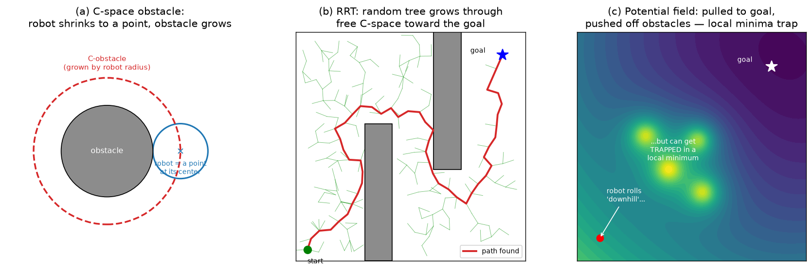

# 10 — Motion Planning (classical gist)

> **Special-handling note (see `CLAUDE.md`).** Like Ch 9, this is *gist + SOTA +
> toy*. This file is the **classical gist** — the vocabulary and the handful of
> ideas that survive into modern systems. The **learned replacements for Ch 9 and
> Ch 10 are treated together** in the keystone note
> [`09_10_learned_sota.md`](09_10_learned_sota.md)
> *(the SOTA story for trajectory generation + planning + reactive control, since
> the learned methods dissolve the boundary between them).* Read this for the
> classical picture, then go there for what actually runs on a modern robot.

---

## 1. The big picture — the "piano mover's problem"

Chapter 9 assumed you already had a path and just needed to *time* it. Chapter 10
is the harder upstream question: **find a collision-free path through a cluttered
world at all.** Classic framing: how do you move a piano from one room to another
through doorways and around furniture, without passing through walls? The robot's
*shape* and the *obstacles' shapes* are the whole difficulty.

Three distinctions the book draws up front, all worth keeping:

- **Path planning ⊂ motion planning.** *Path* planning is the **purely geometric**
  problem: find a collision-free `q(s)`, `s∈[0,1]`, from `q_start` to `q_goal` —
  no clock, no dynamics, no torque limits. The assumption is then "Ch 9 can
  time-scale this path into a feasible trajectory." *Motion* planning is the
  bigger problem that also respects dynamics/control limits. **This is exactly
  the path × time-scaling split from Ch 9** showing up again: planner makes the
  geometry, retimer makes it feasible.
- **`m = n` vs `m < n` (holonomic vs nonholonomic).** If you have fewer controls
  `m` than DOF `n`, some collision-free paths are still *unexecutable*. A car has
  `n=3` (x, y, heading) but `m=2` (drive, steer) — it **can't slide sideways**
  into a parking spot even though that path is obstacle-free. (This is the Ch 13
  wheeled-robot wrinkle; flag it forward.)
- **Online vs offline, optimal vs satisficing, exact vs approximate.** Moving
  obstacles → you need a *fast online* planner. "Satisficing" = any feasible
  path will do (vs minimizing a cost `J = ∫L dt`). These axes decide which
  algorithm family you reach for.

---

## 2. The one idea to really own: configuration-space obstacles

This is the conceptual heart of the chapter and the thing that survives
everywhere (it's literally how collision checking is framed inside cuRobo, OMPL,
MoveIt). The move is a **change of viewpoint**:

> A robot has *shape*, which makes "is it colliding?" a messy geometry problem in
> the workspace. But every configuration `q` is a single **point** in C-space.
> So push all the messiness into the *obstacles*: an obstacle becomes a region
> **C_obs** of configurations that would collide, and the free space **C_free =
> C \ C_obs** is everything else. Now the robot is a **point** moving among the
> grown obstacles `C_obs`, and "find a collision-free motion" = "find a path for
> a point that stays in C_free."

Panel (a): for a *circular mobile robot*, the C-obstacle is the workspace
obstacle **grown by the robot's radius** — then the robot is a point at its
center. (For a 2R arm the C-obstacles are weird curved blobs in the `(θ₁,θ₂)`
torus — Fig 10.2 in the book; same idea, uglier shapes.) Two facts to keep:

- **Joint limits are just obstacles** in C-space (slabs you can't enter).
- C-obstacles can **split C_free into disconnected components** — if start and
  goal land in different components, *no path exists*, full stop.

The catch (and the reason classical "complete" planners are mostly theoretical):
the exact C-obstacle is **horrendously expensive to compute** in high dimensions.
So in practice nobody builds `C_obs` explicitly — they **sample configurations
and call a collision checker**. Collision detection itself is done with things
like **GJK** (distance between convex shapes) or by approximating robot+obstacles
as **unions of spheres** (conservative — must cover the true geometry), so
`d(q,B) = min over sphere pairs of ‖rᵢ−bⱼ‖ − Rᵢ − Bⱼ`. *This sphere-approximation
trick is exactly what GPU planners like cuRobo vectorize across thousands of
configs.*

> **LA you need here:** almost none — but note the C-space **topology** matters
> (Ch 2 callback). An n-joint arm's C-space is the torus `Tⁿ = S¹×…×S¹`, so
> "distance" and "straight line" between configs must respect wraparound
> (θ=359° is 2° from θ=1°, not 358°). And a graph of N nodes can be stored as an
> `N×N` cost matrix `A` (`aᵢⱼ` = edge cost) — a reminder that "search a graph" is
> a linear-algebra-flavored object underneath.

---

## 3. The method families (taxonomy — know the names + the tradeoff)

The chapter is essentially a tour of ways to find a path in C_free. Five families:

**(1) Complete / exact methods (§10.3).** Build an exact representation of
C_free's geometry/topology → guaranteed to find a path if one exists. Beautiful,
but **computationally prohibitive** beyond toy/low-DOF problems. Mostly of
theoretical interest.

**(2) Grid methods (§10.4).** Discretize C_free into a grid; search it with
**A\*** (see below). **Resolution-complete** and can be optimal-at-resolution,
but memory/time grow **exponentially with dimension** (curse of dimensionality)
→ only good for low-DOF. Multi-resolution grids help near obstacles.

**(3) Sampling methods (§10.5) — the workhorses.** Don't represent C_obs at all;
randomly **sample** configs, keep the free ones, connect them. Easy to implement,
**probabilistically complete** (P(find solution)→1 as time→∞), and they scale to
**high-DOF**. Solutions are *satisficing*, not optimal. Two canonical ones:

  - **RRT (Rapidly-exploring Random Tree)** — *single-query*. Grow a tree from
    `x_start`: sample a random config, find the nearest tree node, take a small
    step from it toward the sample, keep it if the edge is collision-free; bias
    ~10% of samples toward the goal. The "nearest-node + step toward random
    sample" rule is what makes the tree **rapidly fan out to fill space** (panel
    b). Works for dynamics too (the step is a feasible control). **RRT\*** rewires
    the tree as it grows so it converges toward the *optimal* path (vanilla RRT
    doesn't). RRT\* is the classical ancestor of a lot of modern arm planning.
  - **PRM (Probabilistic Roadmap)** — *multi-query*. Pre-build a **roadmap graph**
    of C_free (sample many configs, connect nearby ones with a local straight-line
    planner) *once*; then answer many start/goal queries cheaply by connecting
    them to the roadmap and running **A\*** on the graph. Great when the
    environment is static and you'll plan repeatedly in it.

**(4) Virtual potential fields (§10.6).** Make the goal a **valley** (attractive
potential) and obstacles **hills** (repulsive); the robot rolls **downhill**
along the negative gradient — a force, not a search. Fast, online, scales to
high-DOF. **Fatal flaw: local minima** — attractive and repulsive forces cancel
somewhere that isn't the goal and the robot gets *stuck* (panel c). "Navigation
functions" are specially-built potentials with a single global minimum, but
they're hard to construct in general. (Potential fields also reappear as a
*reactive* layer underneath planners.)

**(5) Nonlinear optimization (§10.7) + smoothing (§10.8).** Parameterize the
path/controls by a few numbers (polynomial/Fourier coeffs) and **minimize a cost
subject to constraints** (avoid obstacles, hit the goal, respect controls). Can
give near-optimal, smooth paths — but needs a decent **initial guess** and the
problem is **non-convex**, so it can get stuck. *This family is the direct
ancestor of modern trajectory optimization (TrajOpt, CHOMP, and the optimization
core of cuRobo).* Smoothing is a cheap post-process to de-jerk a planner's raw
(often jagged) output — note the **handoff to Ch 9**: plan a path, then smooth +
time-scale it into the actual trajectory.

### A\* graph search — the one algorithm to actually know

Grid and PRM both reduce to "find the cheapest path in a weighted graph," and the
standard tool is **A\***. Intuition: it's Dijkstra (always expand the
cheapest-so-far frontier node) **plus a heuristic** `h(n)` = an *optimistic*
(never-overestimating, "admissible") guess of the remaining cost to the goal,
e.g. straight-line distance. It expands the node minimizing `f(n) = g(n) + h(n)`
= (cost to reach `n`) + (estimated cost to finish). The heuristic *aims* the
search at the goal instead of expanding blindly in all directions, and
admissibility guarantees the path it returns is **optimal**. This is the
bread-and-butter graph search under classical planning *and* under grid-based
navigation maps in mobile robotics.

---

## 4. Planner properties (the vocabulary you'll see in papers)

- **Completeness ladder:** *complete* (finds a path if one exists, else reports
  failure — exact methods) > *resolution-complete* (complete at the grid
  resolution — grid methods) > *probabilistically complete* (P→1 as time→∞ —
  sampling methods). Real high-DOF planners live at the bottom rung, and that's
  fine.
- **Single-query vs multiple-query:** RRT (solve once, from scratch) vs PRM
  (build a reusable roadmap).
- **Anytime:** returns *a* solution fast, then keeps improving it if given more
  time (RRT\*).
- **Optimal vs satisficing:** minimize a cost `J` vs just reach the goal.

---

## 5. Where this lands for the north star

Two things to carry forward:

1. **The classical stack is `plan a geometric path (Ch 10) → smooth + time-scale
   it (Ch 9) → track it (Ch 11)`.** That pipeline still runs today for
   *known-geometry* tasks — e.g. **cuRobo** (GPU trajectory optimization) is the
   modern, fast incarnation of §10.7, and it's a standard tool for the
   pick-and-place *reach/retract* phases where you have a collision model.
2. **But for the semantic north-star tasks it's not enough.** Classical planning
   assumes a *known geometric model of the world* and a *specified goal config*.
   "Navigate the room to the kitchen" / "pick up that mug" give you neither — the
   world is perceived live from pixels/point clouds, and the goal is a *language
   phrase*, not a `q_goal`. That's the gap the learned methods fill, and where
   the planning story merges with the trajectory-generation story.

Continue to the combined SOTA note:
[`09_10_learned_sota.md`](09_10_learned_sota.md).

---

## 6. Gotchas / intuition checks

- **The robot becomes a *point*; the obstacles do the work.** If you're ever
  confused about a planner, ask "what does C_free look like?" — the algorithm is
  always just moving a point through C_free.
- **Disconnected C_free ⇒ no path.** No amount of cleverness finds a path between
  components separated by obstacles.
- **Curse of dimensionality** kills grids past a few DOF; **sampling** is how you
  escape to 6–7+ DOF arms. The price is you lose optimality and exact
  completeness (only *probabilistic*).
- **Potential fields get stuck in local minima** — the single most important
  failure mode to remember for that family.
- **A\* is optimal only with an admissible (never-overestimating) heuristic.** An
  over-eager heuristic makes it fast but can return a sub-optimal path.
- **Planning ≠ trajectory.** A planner returns *geometry*; you still owe it a
  time scaling (Ch 9) and a tracking controller (Ch 11) before a motor moves.

---

## 7. FAQ

### Q: Isn't the C-space the end-effector's space? (No — C-space = *joint* space.)

This is the trap to clear up first, because everything else follows from it.
**C-space is the space of *configurations* — for a 6R arm that's the joint vector
`q = (θ₁,…,θ₆)`, *not* the end-effector pose.** They are different spaces:

| | what a point is | dimension (6R arm) | the book's symbol |
|---|---|---|---|
| **C-space** (configuration) | a full joint vector `q` | 6 (`T⁶`) | `C`, `q` |
| **task space** | an EE pose `X ∈ SE(3)` | 6 | `X` (Ch 4–6) |

They happen to both be 6-dimensional for this arm, which makes the confusion easy
— but they're connected by **FK** (`q → X`, Ch 4) one way and **IK** (`X → q`,
Ch 6) the other, and a single `X` can correspond to **several** `q` (elbow-up /
elbow-down, Ch 6). Motion planning §10.2 is defined entirely in **C-space**: "the
robot is a point in C-space" means *a point in joint space*, and C-obstacles are
sets of *joint vectors* that would collide. The whole arm's body is implied by
that one joint vector.

### Q: For a 6R arm, does IK have to run to check whether a sample is in C_free?

**No — checking `q ∈ C_free` uses *forward* kinematics, not inverse.** Because the
planner samples directly in C-space (joint space), a sample *already is* a joint
configuration `q` — there's nothing to invert. The free-space test is:

1. **FK places the *entire body*** (not just the EE). The product of exponentials
   gives the frame of *every link* `T_i(q) = exp([S₁]θ₁)···exp([S_i]θ_i) M_i`, so
   from one `q` you know where the whole arm is in space — this is what lets you
   worry about the full body, not just the tip.
2. **Collision-check each link's geometry** vs obstacles, vs the other links
   (self-collision), and vs joint limits (GJK / sphere-union, §10.2.2). No
   penetration ⇒ `q ∈ C_free`.

So the per-sample inner loop is **FK + distance query**, run thousands of times
(exactly what cuRobo vectorizes on the GPU). The same FK-based check sweeps the
body along an *edge* between two samples.

**Where IK *does* appear** — only at the boundaries, never in the free-space test:
- **Goal specification:** the task usually gives a Cartesian grasp pose
  `X_goal ∈ SE(3)`. Convert it to a joint goal with IK **once** (or keep it as a
  region and test `FK(q)≈X_goal` — still FK), then plan in joint space.
- **Task-space sampling variants:** a few planners sample in Cartesian space and
  need IK to bring each sample back to joints before collision-checking. Avoiding
  this (and IK's multiplicity/failure headaches) is a big reason the **default is
  to sample in joint space**.

> **One-liner:** sampling planners live in joint space, so a sample already *is* a
> configuration; you verify `C_free` with **FK (places the whole body) +
> collision detection**, and IK only shows up when a *Cartesian* goal or sample
> must be converted to joints.
