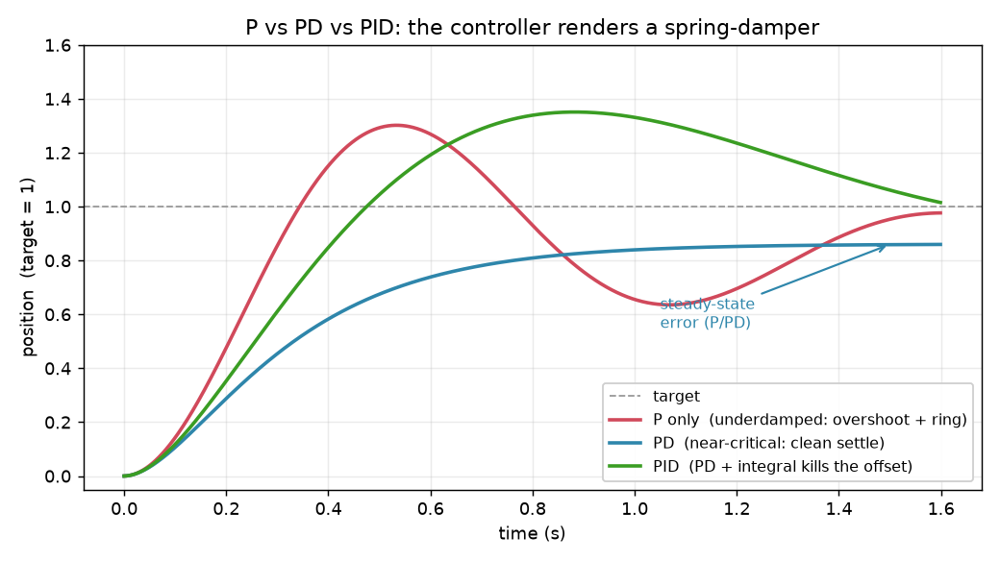

# 11a — Control fundamentals & the actuation stack

> Chapter 11, first pass. What a *controller* actually is, the feedback loop and
> its "damped spring" error dynamics (P/I/D), the three actuation interfaces
> (**position / velocity / torque**), and **where a learned policy plugs into the
> stack**. Impedance/compliance — the contact-rich payoff — is the next note (11b).
> Tier 2: intuition and shapes, derivations skipped.

---

## 1. The big picture — control is a hierarchy of loops

A robot doesn't move because you "set" a joint angle. A motor produces **torque**;
torque produces acceleration; acceleration integrates to velocity, then position.
Somewhere a piece of software has to keep *choosing* torques, thousands of times a
second, so the arm ends up where you want. That software is the **controller**.

The key mental model for the whole project: **control is layered loops, fast on
the inside, slow on the outside.**

```
  language + mask ──►  POLICY  ──► EE-pose delta   (your DiT, ~10 Hz "decisions")
                         │
                         ▼
                    IK (Ch 6)      target EE pose → target joint angles
                         │
                         ▼
                 JOINT CONTROLLER  ──► torques      (~500–1000 Hz feedback)
                         │
                         ▼
                    ROBOT + WORLD  ──► new state (sensors) ──┐
                         ▲                                    │
                         └──────────── feedback ─────────────┘
```

- **Inner loop (fast):** given a *target joint configuration*, produce torques so
  the joints track it. Runs at ~500 Hz–1 kHz. This is the "controller" Ch 11 is
  about. It is **dumb and reflexive** — it knows nothing about the task.
- **Outer loop (slow):** your learned policy. It looks at cameras + state ~10×/s
  and emits an EE-delta, which IK turns into a joint target that it *hands down*
  to the inner loop.

Your `EEController` (`pick_place/controller.py`) **is** an inner-loop controller:
target EE pose → IK → **MuJoCo position actuators**. The "position actuator" is
itself a little PD controller in disguise (§4). So you've been using Ch 11 the
whole time — this note is naming what was already there.

**Why this layering matters for the north star:** the policy never emits torque.
All the hard-to-model, hard-to-transfer dynamics live *below* it in the inner
loop. That's exactly why your sim→real story is friendly (previous discussion):
the inner loop is the *same controller math* in sim and on the real Franka.

---

## 2. The core idea — feedback and the "damped spring"

**Feedforward vs feedback.**
- **Feedforward** = "I know the plan, execute it open-loop." Compute the torques a
  perfect model says you need, apply them, don't look. Fast and smooth, but *any*
  model error or disturbance accumulates with nothing to correct it.
- **Feedback** = "measure the error, react to it." Look at how far off you are
  right now and push proportionally to close the gap. Robust to error and
  disturbance, but reacts *after* the fact.

Real controllers use **both**: feedforward for the bulk motion, feedback to mop up
the difference. (Your `gravcomp=1` is pure feedforward — it cancels gravity from a
model. The position actuator's stiffness is the feedback part.)

**Error dynamics = a virtual spring-damper.** Define the error `e = θ_desired −
θ_actual`. A feedback controller decides torque from `e`. The classic choice is
**PID**:

$$\tau_{fb} = \underbrace{k_p\, e}_{\text{P}} \;+\; \underbrace{k_i \!\int e\,dt}_{\text{I}} \;+\; \underbrace{k_d\, \dot e}_{\text{D}}$$

Each term has a physical picture — this is the whole intuition of the chapter:

- **P (proportional), `k_p e`** — a **spring** connecting where you are to where
  you want to be. Bigger error → harder pull. `k_p` is the **stiffness**. P alone
  behaves like a mass on a spring: it reaches the target but *overshoots and
  oscillates* (a plucked spring rings).
- **D (derivative), `k_d ẋ`** — a **damper** (shock absorber). It opposes
  *velocity*, bleeding off energy so the spring stops ringing. `k_d` is the
  **damping**. P+D = a well-behaved reach that settles without oscillating.
- **I (integral), `k_i ∫e`** — a slow "grudge." If a *constant* disturbance
  (gravity sag, a steady push) leaves a small permanent error that P can't
  overcome, I keeps accumulating that error until the controller pushes hard
  enough to erase it. Kills **steady-state error**. Overused, it makes things
  sluggish and wind-up-prone.

So a PD controller literally **renders a spring-damper** between the robot and its
target. Hold that image — in 11b we make the *stiffness and damping themselves*
the thing we command, and that's impedance control.

The figure shows P (rings), PD (clean settle), PID (kills a leftover offset):



---

## 3. The three actuation interfaces — position, velocity, torque

When you "command" a robot, you're talking to an **actuator** through one of three
interfaces. This is the single most practical thing to get straight, because it
decides what your policy's action space can even *be*.

| Interface | You send… | The robot does… | Who closes the loop | Feel |
|-----------|-----------|-----------------|--------------------|------|
| **Position** | a target angle `θ_d` | its *internal* PD drives joints to `θ_d` | firmware (hidden) | stiff, "go there and hold" |
| **Velocity** | a target rate `θ̇_d` | internal loop holds that rate | firmware | smooth jogging |
| **Torque** | a torque `τ` directly | applies it, that's all | **you** | raw, compliant, dangerous |

Reading them:

- **Position control** is what you've been using. You hand over a target
  configuration and the actuator's *built-in* stiff PD makes it happen — you never
  see the torques. Easiest and safest; the arm feels **rigid** (high `k_p`). Great
  for free-space motion, **bad on contact**: a stiff position controller told to
  go *through* a surface will push with enormous force (huge `e` → huge τ). That
  stiffness is why contact-rich tasks need something softer (11b).
- **Velocity control** — command rates. Natural for teleop jogging and for
  policies that output "move this fast this way."
- **Torque control** — you command torque directly and close the whole feedback
  loop yourself. Maximum authority and the only way to be truly *compliant*
  (soft/force-aware), but you now own stability and safety. This is what
  impedance control and classical RL torque policies use.

**Where MuJoCo/your build sit:** MuJoCo actuators can be any of these; your
`position` actuators are the "internal PD" case (the gain you scaled for the
gripper in `env.py`, `GRIP_STIFFEN`, is literally that PD's stiffness). On a real
Franka you get all three interfaces (via libfranka / polymetis).

**Design decision recap:** your action space is **EE-pose delta → IK → position
targets**. So the *policy* is interface-agnostic and portable; the position loop
underneath absorbs the dynamics. The cost you accepted is exactly the stiffness
problem above — which is the motivation for 11b.

---

## 4. Using the robot's own dynamics (feedforward that cancels physics)

From Ch 8, the equation of motion of the arm:

$$\underbrace{M(\theta)\,\ddot\theta}_{\text{inertia}} \;+\; \underbrace{C(\theta,\dot\theta)\,\dot\theta}_{\text{Coriolis/centrifugal}} \;+\; \underbrace{g(\theta)}_{\text{gravity}} \;=\; \tau$$

Quick re-read of the terms (no derivation):
- **`M(θ)` — the mass/inertia matrix.** How much torque each joint needs per unit
  of acceleration, *and* how joints are inertially coupled (moving joint 2 jerks
  joint 3). Configuration-dependent because a stretched-out arm has different
  inertia than a folded one.
- **`C(θ,θ̇)θ̇` — velocity-dependent forces** (Coriolis + centrifugal). Only shows
  up when moving; the "phantom" forces from a rotating, articulated body.
- **`g(θ)` — gravity.** The torque just to *hold still* against gravity.

Two controllers use this model as feedforward:

- **Gravity compensation** — cancel just `g(θ)` so the arm is weightless and
  doesn't sag; feedback then only fights the *residual*. This is your `gravcomp=1`
  (MuJoCo does it for free instead of you computing `g(θ)`).
- **Computed-torque control (inverse-dynamics control)** — the fuller version.
  Command
  $$\tau = M(\theta)\big(\ddot\theta_d + k_d\dot e + k_p e\big) + C(\theta,\dot\theta)\dot\theta + g(\theta).$$
  The `C` and `g` terms cancel the real dynamics; the `M(·)` term *converts your
  desired error behavior into the right torques regardless of configuration*. The
  net effect: **every joint behaves like the same clean, decoupled spring-damper**,
  no matter how the arm is posed. It "linearizes and decouples" the messy nonlinear
  robot. Powerful, but it *needs an accurate model* (`M,C,g`) — which is exactly
  what's hard to get on real hardware, and why your design deliberately **avoids**
  computed torque (locked decision: "no computed-torque control") and leans on
  position control + `gravcomp` instead.

Takeaway: know what computed torque *is* and why it's elegant, but also why you're
not using it — model dependence kills its sim→real friendliness.

---

## 5. Linear algebra / math you actually need here

Only two things, both light:

**(a) Second-order ODEs and damping** (the P/D story made precise). The error of a
PD-controlled 1-DOF system obeys
$$\ddot e + k_d \dot e + k_p e = 0,$$
the equation of a mass–spring–damper. Its behavior is set by one number, the
**damping ratio** `ζ = k_d / (2√k_p)`:
- `ζ < 1` **underdamped** — overshoots and oscillates (too little `k_d`). 
- `ζ = 1` **critically damped** — fastest approach with *no* overshoot. The sweet spot.
- `ζ > 1` **overdamped** — no overshoot but sluggish (too much `k_d`).

"Tuning a controller" is mostly: pick `k_p` for how stiff/fast you want it, then
pick `k_d ≈ 2√k_p` to sit near critical damping. That's it — no eigenvalues needed
for the 1-DOF intuition (the matrix version just does this per decoupled mode).

**(b) The matrix `M(θ)` as a "unit converter."** You don't invert it by hand, but
know its role: `M` maps accelerations→torques, so `M⁻¹` maps torques→accelerations.
It's **symmetric positive-definite** (like an inertia should be: energy is always
positive), which is the property that guarantees it's invertible and that the
computed-torque cancellation is well-posed. Geometrically, `M` being non-diagonal
is exactly the **inertial coupling** between joints.

---

## 6. A small worked example — tune a 1-DOF PD

Say one joint behaves like a unit inertia (`M = 1`) and you want it to reach a
target and settle in about `0.5 s` with no overshoot.

- **Speed target → `k_p`.** A second-order system settles in roughly `~4/(ζω_n)`
  seconds, with natural frequency `ω_n = √k_p`. For critical damping (`ζ=1`) and a
  `0.5 s` settle, you need `ω_n ≈ 4/0.5 = 8 rad/s`, so `k_p = ω_n² ≈ 64`.
- **No overshoot → `k_d`.** Critical damping: `k_d = 2√k_p = 2·8 = 16`.
- **Steady-state?** With gravity on this joint, PD alone would sag a little (a
  constant `g` vs a spring `k_p e` balances at a small nonzero `e`). Two fixes:
  add **gravity feedforward** (cancel `g`, keep PD) — the clean way, and what you
  do — or add a small **`k_i`** to grind the offset to zero.

So `(k_p, k_d) ≈ (64, 16)` with gravity feedforward. Notice you *reason about the
behavior you want* (settle time, no overshoot) and back out gains — you don't
guess. In MuJoCo, the position actuator's `kp` (and implicit damping) is this same
knob; `GRIP_STIFFEN` scaled exactly this to grip harder.

---

## 7. Gotchas / intuition checks

- **Stiffer isn't better.** High `k_p` tracks tighter in free space but hits harder
  on contact and can go unstable past what the loop rate / actuator can support.
  The whole point of 11b is that for contact you often want *low* stiffness.
- **A "position controller" is a hidden PD.** When someone says "just use position
  control," there's a spring-damper in the firmware you don't see; its stiffness is
  a design choice, not a law of nature.
- **Feedback reacts late; feedforward is blind.** Neither alone is great — pair
  them (feedforward gravity + feedback PD is the canonical combo, and yours).
- **Loop rate matters.** All of this assumes the inner loop runs *fast* (≫ the
  arm's natural frequency). Your policy at ~10 Hz could **never** be the inner
  loop — it would be a mushy, unstable controller. That's *why* the policy sits
  outside and hands targets to a 500 Hz loop.
- **Computed torque is only as good as the model.** Beautiful on paper, brittle on
  real hardware; you skipped it on purpose.

---

## 8. Where this is going (11b)

Section 2's "the controller renders a spring-damper" is the doorway. In **11b —
impedance/compliance** we stop trying to hit an exact *position* and instead
command a **relationship between force and motion**: "be a soft spring of stiffness
`K` about this target." That's what makes a robot safe on contact — push it and it
gives, like a human arm going limp vs rigid. It's the control mode contact-rich
manipulation (your grasp, insertion, wiping) actually needs, and the sim→real
insurance for the hardest part of your pick-place.

---

## FAQ
_(to be filled from discussion)_
