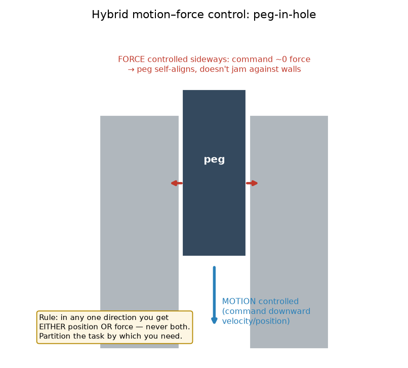
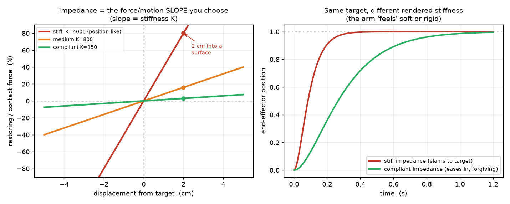
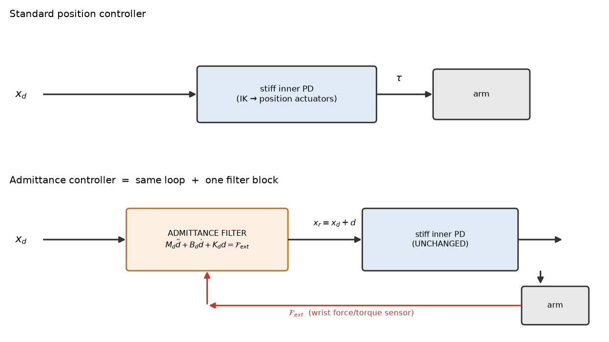

# 11b — Compliance, force control & impedance (the contact-rich payoff)

> Chapter 11, §11.5–11.7. What to do when the robot **touches the world**. Stiff
> position control (11a) is great in free space and dangerous on contact; this
> note is the fix. Three ideas, one family: **force control** (command a push,
> not a place), **hybrid motion–force control** (position some axes, force
> others), and **impedance control** (command a *stiffness* — "be a soft spring").
> This is the control mode your pick-place, insertion, and wiping tasks actually
> need. Tier 2: shapes and intuition, derivations skipped.

---

## 1. The big picture — contact breaks position control

In free space, "go to this pose" is a fine command: nothing resists, the arm
gets there. The instant the gripper **touches something**, position control has a
problem it cannot solve.

Recall from 11a: a position controller is a hidden stiff spring, `τ = k_p·e`,
`e = θ_d − θ`. Now command it to move to a target that is *2 cm inside a table*.
It can't get there — the table is in the way — so the error `e` never closes. The
spring just keeps pulling: `k_p` is huge, so it pushes with **enormous force**
against the table until something breaks (the object, the table, the arm, the
force limit). A stiff position controller on contact is a bull in a china shop.

The human answer is obvious and it's the whole chapter: **when you're about to
touch something, stop controlling *where* your hand is and start controlling *how
hard it pushes* — or better, control the *relationship* between the two** ("be
springy: give a little when pushed"). Your arm going limp to catch a ball vs
going rigid to punch a wall is you re-tuning exactly this.

Three flavors, increasing generality:

| Mode | You command | Good for |
|------|-------------|----------|
| **Force control** (§11.5) | a contact wrench (push/torque) | pressing, polishing with set force |
| **Hybrid motion–force** (§11.6) | position on *some* axes, force on *others* | peg-in-hole, wiping a surface |
| **Impedance control** (§11.7) | a *stiffness/damping* — a force–motion law | safe contact, insertion, human-robot |

**Why this is the highest-value control note for your north star:** every
contact-rich manipulation skill — grasping without crushing, insertion,
placing gently, wiping — lives or dies on this. It's also your **sim→real
insurance**: a compliant controller forgives the pose errors that a learned
policy and an imperfect camera calibration *will* produce. A stiff position
controller turns a 3 mm pose error into a destructive jam; a compliant one just
gives 3 mm and keeps going.

---

## 2. Force control — command a push instead of a place (§11.5)

The single equation that makes force control possible is one you already met in
Ch 5 (the Jacobian), used **transposed**:

$$\tau = J^\top(\theta)\, \mathcal{F}$$

- `\mathcal{F}` is the **wrench** you want the end-effector to exert on the world
  (a 6-vector: 3 moments + 3 forces, from 3c).
- `J^\top` is the **transpose** of the Jacobian.
- `τ` is the joint torques that produce that wrench.

**Why the transpose?** This is the key linear-algebra fact of the whole chapter,
so slow down (details in §6). The Jacobian `J` maps *joint velocities → EE
velocity*: `V = J θ̇`. Its transpose maps the other way for *forces*: *EE wrench →
joint torques*: `τ = Jᵀ 𝓕`. Velocities go through `J`, forces go through `Jᵀ` —
**the same matrix, transposed, handles the dual quantity.** This "velocity uses
`J`, force uses `Jᵀ`" duality is one of the most reused facts in robotics.

So pure force control is almost embarrassingly simple: decide the wrench you
want, hit it with `Jᵀ`, done. In practice you add:
- **gravity + dynamics feedforward** so the arm's own weight doesn't count as
  contact force (you want to feel the *table*, not the arm), and
- a **force-feedback** term: measure the actual contact wrench with a
  force/torque sensor, compare to desired, correct. So really
  `τ = Jᵀ(𝓕_d + k_{fp}(𝓕_d − 𝓕_sensed) + …) + g(θ)`.

The catch: **pure force control only makes sense against contact.** Command "push
with 10 N" in free space and there's nothing to push against — the arm just
accelerates away. That's why the useful thing is not pure force control but the
next two, which *mix* force and motion.

---

## 3. Hybrid motion–force control — split the task by direction (§11.6)

Real contact tasks are naturally split: some directions you want to **move**,
others you want to **push** (or stay soft). Peg-in-hole is the canonical example:



- **Down the hole (z):** you want the peg to *travel*. **Position/velocity
  controlled** — command a downward motion.
- **Sideways and in rotation (x, y, tilt):** you do *not* want to command a
  position (you don't know the hole's exact location to sub-millimeter). You want
  to command **~zero contact force**, so the peg **self-aligns** — it slides
  along the walls instead of jamming against them.

**The hard rule (the one thing to remember):** *in any single direction you can
control **either** position **or** force — never both at once.* They're two ends
of the same axis: if you're rigidly holding a position, you can't also dictate
the force (the wall decides that); if you're dictating the force, you've given up
saying exactly where you are. So hybrid control means **partitioning the 6 task
directions**: choose a set to position-control and the complementary set to
force-control.

**Natural vs artificial constraints** (§11.6.1) — the bookkeeping for the split:
- **Natural constraints** are what the *environment* forces on you for free. Peg
  in a hole: the walls stop sideways motion (natural *position* constraint:
  sideways velocity ≈ 0), and the open air below means no resisting force along
  the free direction (natural *force* constraint). The geometry hands you one or
  the other on every axis.
- **Artificial constraints** are what *you choose to command* on the
  complementary axes — the ones the environment left free. "Slide down at 2
  cm/s" (motion on the free axis), "keep 0 N sideways" (force on the constrained
  axes).
- Rule of thumb: **where the environment constrains motion, you command force;
  where it leaves motion free, you command motion.** They interleave perfectly —
  6 axes, each is either a natural motion constraint or a natural force
  constraint, and you supply the artificial constraint of the *other* type.

Mechanically this is a **projection**: a matrix `P` picks out the
force-controlled subspace and `I − P` the motion-controlled subspace, and the
controller runs force control through `P` and motion control through `I − P`,
then adds the torques. (You won't hand-derive `P`; know it's "the matrix that
selects which directions are force vs motion" — see §6.)

---

## 4. Impedance control — command a *stiffness*, not a position (§11.7)

Hybrid control is powerful but brittle: it needs a clean model of *which*
directions are constrained, and reality is messier (contact appears and
disappears, geometry is uncertain). **Impedance control** is the softer, more
robust idea, and the one most worth internalizing.

**The idea:** don't command a position *or* a force — command the **rule
relating them**. Make the end-effector *behave like a chosen mass–spring–damper*
about a target. You pick the stiffness `K`, damping `B`, (and virtual mass `M`),
and the robot *renders* that mechanical behavior:

$$\underbrace{M\,\Delta\ddot x}_{\text{virtual mass}} \;+\; \underbrace{B\,\Delta\dot x}_{\text{virtual damper}} \;+\; \underbrace{K\,\Delta x}_{\text{virtual spring}} \;=\; \mathcal{F}_{ext}$$

where `Δx = x − x_d` is how far the EE is from its target and `𝓕_ext` is the
external force the world applies. Read it as a promise the robot keeps: *"push me
(`𝓕_ext`) and I'll move (`Δx`) exactly as a spring `K` + damper `B` + mass `M`
would."*

- **Free space:** no `𝓕_ext`, so the spring pulls the EE to the target `x_d` and
  the damper settles it — it behaves like ordinary (soft) motion control.
- **On contact:** the wall pushes back (`𝓕_ext ≠ 0`), so the EE settles at an
  offset `Δx = 𝓕_ext / K` from the target — it *gives*. **You chose how much it
  gives by choosing `K`.**

That last equation is the whole payoff and the picture to hold:



**Impedance is a slope you get to pick** (left panel). It's the ratio
force/motion:
- **High `K` (stiff):** near-vertical line — a tiny push produces a huge force.
  This is position control. Precise in free space, brutal on contact.
- **Low `K` (compliant):** gentle slope — the arm gives a lot for a little force.
  Safe, forgiving, self-aligning. This is what contact-rich tasks want.

The right panel: same commanded target step, but a **stiff** rendered impedance
slams to it while a **compliant** one eases in — the arm literally *feels* rigid
or soft depending on the `K, B` you dialed in. Compliance is now a **knob**, not
a property of the hardware.

**Impedance vs admittance** (§11.7.1 vs 11.7.2) — the same behavior, implemented
from the two opposite actuation interfaces of 11a. You only need the gist:
- **Impedance control:** *measure motion → output force.* Natural on a
  **torque-controlled** robot. "You moved me this far, here's the spring force I
  push back with." Great when the robot is backdrivable and the F/T sensing is
  cheap.
- **Admittance control:** *measure force → output motion.* Natural on a
  **position-controlled** robot (like your MuJoCo position actuators!). "You
  pushed me with this force, so I'll move my position target this much." A
  force/torque sensor reading drives a commanded displacement that the stiff
  inner position loop then executes.
- They're duals (impedance = force/motion, admittance = motion/force = its
  inverse). Which one you can build depends on your actuation interface — and
  since your stack is **position-controlled**, the **admittance** flavor is the
  one that fits without re-architecting to torque control.

---

## 4b. Admittance control, concretely — converting a position PD loop

Your stack is position-controlled, so this is the version you'd actually build.
A position-controlled arm **can't output a force** — its interface is "here's a
target, go there stiffly." So you can't render a spring by pushing back with a
chosen force (that's impedance, torque-only). You flip it:

> **Impedance:** measure *motion* → output *force*. (torque robot)
> **Admittance:** measure *force* → output *motion* (a shifted setpoint). (position robot)

**The trick: keep the stiff inner PD loop exactly as-is, and insert one block in
front of it** — a *virtual* spring-damper that reads the contact force and nudges
the target pose. The arm gives not because the controller went soft, but because
you *moved where it's trying to go*. **Compliance is simulated, not physical.**



You do **not** retune the inner PD. You add: (1) a force sensor, (2) a filter
turning `x_d` + measured force into a compliant reference `x_r`, fed to the
unchanged loop. Same target dynamics as impedance, but **solved for the motion**.
Let `d = x_r − x_d` be the compliant deviation:

$$M_d\,\ddot d + B_d\,\dot d + K_d\,d = \mathcal{F}_{ext}\;\Longrightarrow\; \ddot d = M_d^{-1}\big(\mathcal{F}_{ext} - B_d\dot d - K_d d\big)$$

Each cycle you **integrate this little ODE** and hand the result down:

```
every tick (dt):
    F_ext  = read_force_sensor()                    # wrist F/T (or contact estimate)
    d_ddot = M_d_inv @ (F_ext - B_d @ d_dot - K_d @ d)
    d_dot += d_ddot * dt                            # integrate accel → vel
    d     += d_dot  * dt                            # integrate vel   → deviation
    x_r    = x_d + d                                # compliant reference
    send_to_position_loop(x_r)                      # e.g. IK(x_r) → position actuators
```

**Dead-simple special case** — drop mass & damper, keep stiffness: `K_d d = 𝓕_ext`,
so `x_r = x_d + 𝓕_ext / K_d`. **"Shift the target proportional to measured
force."** That one line is a working admittance controller; `B_d` damps how the
setpoint moves, `M_d` gives it inertia.

**In your build:** insert the filter **between the policy's EE target and IK** —
nudge the EE pose by `d = 𝓕_ext/K_d` (from MuJoCo's contact wrench) before IK.
No torque control, no mass matrix — consistent with the "no computed-torque"
decision. This is the principled fix for "the policy slams the object into the
table."

**The catch (why it's a dual, not strictly better):** admittance's accuracy rests
on the inner loop being *much stiffer/faster* than the virtual dynamics — it has
to actually *reach* `x_r`. So it's **great at free-space precision + soft
contact**, but **struggles on stiff contact**: against a rigid wall a tiny
setpoint move spikes the force, which feeds back and can go **unstable** (chatter).
That's exactly where impedance (torque robot) wins. The book's trade: *admittance
for free-motion precision + soft contact; impedance for stiff contact.*

---

## 5. Where this plugs into *your* build

- **Your gripper is already a crude impedance knob.** `GRIP_STIFFEN` in `env.py`
  scales the gripper position actuator's `kp` — that's you choosing a stiffness
  `K` so it grips firmly without a real force loop. You've been doing baby
  impedance control all along.
- **The stiff-contact failure is real for you.** A position-controlled EE driving
  a grasp or a place into the table is exactly the §1 bull-in-a-china-shop case.
  Lowering the arm's Cartesian stiffness (or adding an admittance wrapper around
  your `EEController`) is the principled fix for "the policy sometimes slams the
  object."
- **Admittance is your natural path.** You're position-controlled, so if you want
  compliance you add an *outer* loop: read contact force (MuJoCo gives you
  contact wrenches; a real Franka has joint-torque-based external force
  estimates), and nudge the EE-pose target `x_d` you feed to IK. No torque
  control, no dynamics model — consistent with your "no computed-torque" decision.
- **Real Franka gives you this for free.** libfranka/polymetis expose a
  **Cartesian impedance controller**: you set `K` (translational + rotational
  stiffness) and stream a target pose; the robot renders the spring. That is *the*
  standard low-level controller for learned manipulation policies (it's what most
  diffusion-policy / ACT deployments sit on top of), precisely because it forgives
  policy and calibration error. Your "policy → EE pose → low-level controller"
  stack was designed for this drop-in.
- **Sim→real insurance, restated:** a compliant low-level controller is the layer
  that converts "my policy's pose is a few mm off" from *catastrophic* to
  *fine*. It's the most important robustness lever you have below the policy.

---

## 6. Linear algebra / math you actually need here

**(a) `Jᵀ` = the force map (velocity/force duality).** The Jacobian `J` turns
joint velocities into EE velocity: `V = J θ̇`. The *same information transposed*
turns EE wrench into joint torque: `τ = Jᵀ 𝓕`. Why must it be the transpose and
not `J⁻¹` or something? **Conservation of power.** Power is force·velocity, and it
must read the same in joint space and task space: `τᵀθ̇ = 𝓕ᵀV` for *all* motions.
Substitute `V = Jθ̇`: `τᵀθ̇ = 𝓕ᵀJθ̇`, true for every `θ̇` only if `τ = Jᵀ𝓕`. So the
transpose isn't a coincidence — it's forced by energy bookkeeping. Geometric
punchline: **`J` moves velocities one way, `Jᵀ` moves forces the opposite way**,
and you rarely need `J⁻¹` for force tasks at all (a big deal near singularities,
where `J⁻¹` blows up but `Jᵀ` stays perfectly well-behaved).

**(b) Projection matrices `P` (the hybrid split).** A projection `P` is a matrix
with `P² = P`: apply it twice, same as once (like casting a shadow — shadowing a
shadow changes nothing). It **splits a space into two complementary parts**: `P`
keeps one subspace, `I − P` keeps the rest, and `P + (I−P) = I` so together they
cover everything with no overlap. In hybrid control, `P` selects the
**force-controlled directions** and `I − P` the **motion-controlled directions**.
That's the precise version of "6 axes, each one is force OR motion": `P` is
literally the bookkeeper that routes each direction to the right controller.

**(c) Stiffness/damping as matrices `K`, `B`.** In 1-DOF these are numbers; in 6-D
task space they're 6×6 matrices, usually diagonal (independent stiffness per axis)
— e.g. stiff vertically to hold weight, soft horizontally to self-align. A
diagonal `K` = "different spring constant on each axis," which is exactly what you
want for a task like wiping (soft into the surface, stiff along it). Same
critical-damping intuition as 11a applies per axis: pick `B ≈ 2√K` on each
direction for a clean, non-ringing give.

---

## 7. A small worked example — render a soft wall-touch

1-DOF: the EE approaches a wall. You command an impedance with stiffness
`K = 200 N/m` and a target `x_d` that is **1 cm past the wall surface** (you
*intend* to press in). Question: how hard does it press, and what's the contact
force, vs a stiff `K = 20 000 N/m` (position-like)?

At rest on the wall, motion stops, so `Δẍ = Δẋ = 0` and the impedance law reduces
to the spring balance `𝓕_ext = K·Δx`. The wall lets the EE reach the surface but
no further, so the steady offset from target is `Δx = 1 cm = 0.01 m`.

- **Compliant, `K = 200`:** contact force `= 200 × 0.01 = 2 N`. Gentle — a nice
  press, nothing breaks.
- **Stiff, `K = 20 000`:** contact force `= 20 000 × 0.01 = 200 N`. Same 1 cm of
  "overshoot into the wall," **100× the force.** That's the crush.

The lesson in one line: **for the same commanded overshoot, contact force scales
with stiffness.** Contact-rich = deliberately *low* `K`. And notice you never
needed to know the wall's exact position — you aimed *past* it and let compliance
absorb the difference. That's the pose-error forgiveness your policy needs.

(Tie-back to 11a: you still pick damping the same way — `B ≈ 2√(K·M)` for
critical, non-ringing settle. Impedance control is 11a's spring-damper with the
spring/damper constants promoted to *commands*.)

---

## 8. Gotchas / intuition checks

- **You can't control position AND force on the same axis.** They're two ends of
  one axis. Pick one per direction; that *is* what hybrid control is.
- **Pure force control needs something to push on.** Command a force in free
  space and the arm flies off. Real tasks mix motion and force (hybrid) or a
  spring that also works in free space (impedance).
- **Stiff ≠ better.** In free space stiff tracks tighter; on contact stiff is
  dangerous. Contact-rich manipulation wants *low* stiffness, on purpose.
- **Impedance vs admittance is set by your actuation interface, not preference.**
  Torque-controlled robot → impedance (motion in, force out). Position-controlled
  robot (you) → admittance (force in, motion in the target out).
- **Compliance forgives calibration/policy error.** The single biggest reason
  learned manipulation deploys on a Cartesian *impedance* controller rather than a
  stiff position one. If your sim→real place is slamming, this is the lever.
- **You still need to feel the contact.** Impedance/force control needs a force
  estimate — a wrist F/T sensor, or joint-torque-based external-force estimation
  (what the Franka does). In MuJoCo you read contact wrenches directly.

---

## 9. Implementation exercise — a real Cartesian impedance controller

Instead of book exercises, the "code" step for this Tier-2, build-focused chapter
was **implementing the controller** — `pick_place/cartesian_controller.py`, a
drop-in compliant replacement for the stiff `EEController`. It renders the note's
law directly:

$$\tau = J^\top\big[K\,(x_d - x) + B\,(\dot x_d - \dot x)\big] + \underbrace{\text{qfrc\_bias}}_{g(\theta)+C\dot\theta} + N\,\tau_{posture}$$

Highlights (each a concept from this note, made real):
- **`τ = Jᵀ·wrench`** — the velocity/force duality (§2), matching the `[ω; v]`
  Jacobian order from `ik.py`.
- **Torque interface in MuJoCo** — the Franka ships as *position servos*, so the
  controller **neutralizes their gains at init** and injects torque via
  `data.qfrc_applied`. (You can't do impedance without a torque interface — §4b.)
- **Gravity + Coriolis feedforward via `data.qfrc_bias`** — the `g(θ)` term.
  *Finding:* MuJoCo's `body_gravcomp=1` is a **no-op** in this build
  (`qfrc_gravcomp` stays 0; the arm falls under zero torque). The stiff
  `EEController` masked it by brute force — a soft controller can't, so it must
  compensate explicitly.
- **Null-space posture** — `N = I − Jᵀ(Jᵀ)⁺` projects a home-pulling joint PD into
  the 7-DOF elbow-swivel null space so it tidies the elbow *without moving the
  TCP* (the projection-matrix idea, §6b).
- **Skips IK** — uses FK + `Jᵀ` only, never the inverse-position solve (Q6).

**Validation (fresh sim per case), and it's the whole chapter in three numbers:**
- Hold home: **0.0 mm** error; Track (+8 cm, −5 cm): **0.0 mm** error.
- Command the EE **5 cm into the table**: soft `K=200` → **11.7 N** contact force;
  stiff `K=3000` → **172.5 N**. *Same commanded overshoot, ~15× the force* — §7
  live: compliance forgiving a pose error instead of crushing.

**Try it:** `run_infer.py --controller impedance [--imp-kp-pos 200]` A/B's it
against the stiff position controller on the *same* checkpoint — expect impedance
to rescue "slammed the object / pushed into table" failures.

---

## FAQ

### Q1. I have a gravity-comp, torque-controlled arm running computed-torque PD: `τ = M(θ)(θ̈_d + k_p e + k_d ė) + Cθ̇ + g(θ)`. What actually changes with impedance control — just picking a lower `k_p`, or a max limit on external force?

**Neither, quite.** A max-force cap is a *safety saturation*, orthogonal to impedance; "lower `k_p`" captures the *feel* but misses the two real structural moves.

Your law is inverse-dynamics control **in joint space**, and its whole point is *tight tracking* — the `M(θ)(…)` term cancels the real inertia to make each joint a clean unit-mass spring so it follows `θ_d` rigidly. That's the opposite of good contact behavior. Two things change:

1. **The spring moves to *task* space, about the EE.** Contact happens at the end-effector and you want compliance in physical directions (soft in z, stiff in xy). So you render `K, B` about the EE pose `x` and convert to torque with `Jᵀ` — see the boxed Cartesian law in Q2. `K, B` become 6×6 (usually diagonal); *this* is where "picking `k_p`" lives, but promoted to per-axis task space.
2. **You drop the inertia cancellation.** The standard Cartesian impedance controller *removes* the `M(θ)` and `C` terms and keeps only gravity comp — so it's **simpler** than computed torque, needs **no mass-matrix model and no force sensor**, and lets the EE keep its natural inertia. The design intent flips: you stop trying to hit `x_d` and instead let the EE settle at `Δx = 𝓕_ext/K` — reasoning about the *contact force you produce*, not the position error.

On the force cap: impedance gives force limiting **implicitly** — with soft `K`, contact force `K·Δx` stays small as long as penetration stays small. Low `K` *is* a graceful max-force, which is exactly what forgives policy/calibration error. An explicit `𝓕_ext` term only reappears if you also want to dictate the *virtual mass* (Q2, full impedance).

**Spectrum:** joint computed-torque high `k_p` = stiff position; joint low `k_p` = crude compliance in the *wrong* coordinates; **Cartesian impedance (grav-comp + `Jᵀ` spring) = the useful one**; full impedance (+ chosen mass) = needs `M,C,g` + F/T sensor.

### Q2. Give me the explicit `τ` for Cartesian impedance vs full impedance.

Notation: `x,ẋ,ẍ` EE pose/vel/accel (`x_d…` desired); `J,J̇` Jacobian and its time-derivative (`ẋ=Jθ̇`); `M,Cθ̇,g` the Ch 8 dynamics; `K,B,M_d` desired Cartesian stiffness/damping/mass (6×6, diagonal); `𝓕_ext` measured external EE wrench.

**(A) Cartesian impedance / stiffness control — practical, no sensor:**
$$\tau = J^\top(\theta)\big[\,K\,(x_d - x) + B\,(\dot x_d - \dot x)\,\big] + g(\theta)$$
- `K(x_d−x)` restoring spring wrench at the EE; `B(ẋ_d−ẋ)` damper; `Jᵀ[…]` converts EE wrench→joint torque; `g(θ)` floats the arm.
- **No `M`, `C`, `J̇`, or force sensor.** Keeps the arm's natural inertia. **Singularity-safe** — only ever uses `Jᵀ` (always defined), never `J⁻¹`. This is a real Franka's Cartesian impedance mode.

**(B) Full impedance — you also dictate the virtual mass `M_d`:** target `M_d Δẍ + B Δẋ + K Δx = 𝓕_ext` with `Δx = x−x_d`. Commanded accel `ẍ_cmd = ẍ_d + M_d⁻¹(𝓕_ext − BΔẋ − KΔx)`, then
$$\tau = M(\theta)\,J^{-1}\big[\ddot x_{cmd} - \dot J\dot\theta\big] + C(\theta,\dot\theta)\dot\theta + g(\theta) - J^\top\mathcal{F}_{ext}$$
- `J̇θ̇` comes from differentiating `ẋ=Jθ̇` → `ẍ=Jθ̈+J̇θ̇`; it's *"the Jacobian is changing as the arm moves,"* subtracted before inverting to `θ̈=J⁻¹(ẍ−J̇θ̇)`.
- `J⁻¹` is really a **pseudoinverse + null-space** for a 7-DOF arm and **blows up near singularities** — a big reason to prefer (A).
- Needs **everything**: full `M,C,g`, `J̇`, `J⁻¹`, and a live `𝓕_ext` (appears twice).

**The link:** pick `M_d = Λ = (J M⁻¹ Jᵀ)⁻¹` (the arm's *natural* task-space inertia) and the two `𝓕_ext` terms cancel exactly — `M J⁻¹ M_d⁻¹ 𝓕_ext = M J⁻¹(J M⁻¹Jᵀ)𝓕_ext = Jᵀ𝓕_ext`, cancelling `−Jᵀ𝓕_ext`. The sensor and the `M J⁻¹` machinery are the price paid **only** to make the arm feel like a different mass than it is. Happy with natural inertia → use (A) and skip all of it. **(A) shapes stiffness & damping; (B) additionally shapes inertia.**

### Q3. How do I turn a standard position-control PD loop into admittance control? (See §4b for the full version + block diagram.)

A position-controlled arm can't output a force, so you **emulate** compliance: keep the stiff inner PD loop unchanged and insert a *virtual* spring-damper in front of it that reads the contact force and **shifts the setpoint**. Impedance measures motion→outputs force (torque robot); admittance measures force→outputs motion (position robot) — duals.

Same target dynamics, solved for the *motion* `d = x_r − x_d`: `M_d d̈ + B_d ḋ + K_d d = 𝓕_ext`. Each tick, integrate `d̈ = M_d⁻¹(𝓕_ext − B_d ḋ − K_d d)` → `ḋ` → `d`, then feed `x_r = x_d + d` (not `x_d`) to the unchanged loop. **Simplest form:** drop `M_d, B_d` → `x_r = x_d + 𝓕_ext/K_d`, "shift the target proportional to measured force."

**In your build:** insert the filter between the policy's EE target and IK — nudge the EE pose by `𝓕_ext/K_d` (MuJoCo contact wrench) before IK. No torque control needed. **Catch:** admittance needs the inner loop much stiffer/faster than the virtual dynamics; great for free-space precision + soft contact, but can go unstable on *stiff* contact (where impedance wins).

### Q4. Can you do compliance on force-blind cheap arms (SO-100) with no torque interface and no F/T sensor?

"No control" is too strong — you have full **position** control; what's missing is high-fidelity **force/impedance** control, and even that isn't a hard binary. SO-100's Feetech STS3215 (and Dynamixel on pricier hobby arms) expose two things people forget:
1. **Current/load feedback.** Motor torque ∝ current (`τ≈k_t·I`), so you can *estimate* joint torque for free — subtract a gravity+friction model, and `Jᵀ⁺` maps the residual to an estimated EE wrench. A noisy built-in torque sensor.
2. **Lowerable position gains / PWM mode.** Drop the servo P gain → softer joint (crude joint-space compliance, no sensor at all); if a PWM/open-loop mode exists, PWM ≈ voltage ≈ rough torque command.

So current-based torque estimation + gain-lowering gets you crude gravity comp, crude admittance, and kinesthetic teaching. **The real limiter is mechanical, not the interface:** cheap high-ratio geartrains have huge nonlinear friction/stiction that *swamps* the small contact torque in the current signal, and resist backdrive. That's why a Franka feels compliant and an SO-100 doesn't — Franka has **torque-transparent (backdrivable) joints**, not a magic sensor. The thing worth paying for is backdrivable/quasi-direct-drive joints with clean current control, not specifically an F/T sensor. **Escape hatch:** imitation learning sidesteps explicit force control — run position control, let the policy learn contact behavior from demos. That's why the LeRobot ecosystem thrives on force-blind arms.

### Q5. But an imperfect imitation policy might command the EE *beyond* the wall — then what?

Right — "the policy is the compliance" is only a *statistical* argument that holds **in-distribution**; a model's errors are out-of-distribution and a stiff position loop gives them zero help. Concretely: **IK doesn't know the wall exists**, so it happily solves the through-wall target and the position loop pushes until something gives. You defend in depth, not with one layer:
1. **Servo current/torque limit** — the big one for cheap arms. Set a low ceiling → the servo **stalls** at the wall instead of pushing to destruction. This *is* the "max external force limit" — a hard force cap, your primary net on a force-blind arm.
2. **Self-limiting hardware** — small servos physically can't crush much, and plastic links/backlash flex (crude passive compliance). Low stakes.
3. **Software workspace clamps** — reject/clip targets leaving a safe box (virtual floor/walls) before IK sees them. Catches gross errors cheaply.
4. **Crude admittance via current sensing** — detect the contact spike, back the setpoint off.

**The punchline (why 11b is "sim→real insurance"):** compliance doesn't make the policy correct, it makes the policy's *inevitable* errors **cheap**. Good arm (Franka Cartesian impedance): a 2 cm through-wall command → arm gives 2 cm, applies a few N, a **non-event**. Cheap stiff arm: you fall back to current-limit + clamps + flex — survives, but ungracefully (stalls rather than complies).

### Q6. With Cartesian (impedance) control you skip IK entirely — right?

True for the **torque/impedance path**, and it's a real feature — but sharpen it. The law `τ = Jᵀ[K(x_d−x)+B(ẋ_d−ẋ)]+g(θ)` needs **forward kinematics** (`θ→x`, to form the error) and the **Jacobian** `J(θ)`. What it drops is the **inverse *position* solve** `x_d→θ_d` — you never compute a joint target; you form the Cartesian error directly and push it through `Jᵀ`. So **"skip IK" = skip the inverse-position solve, replaced by FK + `Jᵀ`** (you don't escape kinematics). Wins: no iterative solver (no convergence/branch/unreachable failures), **singularity-robust** (`Jᵀ` always defined, unlike `J⁻¹`), redundancy handled via the null space.

**Catch for *your* stack:** skip-IK is a *torque-robot* perk. **Admittance on a position arm (SO-100, MuJoCo position actuators) still needs IK** — the inner loop wants joint targets, so after the admittance filter makes `x_r` you still solve `x_r→θ_d`. So "skip IK" really means "you have a torque-controlled arm." A real Franka Cartesian impedance controller is compliant *and* IK-free in one box — the clean target for your `policy → EE pose → controller` architecture. (See `pick_place/cartesian_controller.py` for the implemented version — it does FK + `Jᵀ`, no IK.)

### Q7. How is *grip force* really controlled? We've been doing full open/close on a position-servo gripper.

Full-close on a **position servo** is *accidental stiffness control*: the object blocks the fingers, a position error persists, and the servo pushes with `F_grip = k_p^grip × (how far the closed target overshoots the object surface)`. So grip force depends on **both stiffness *and* object width** — and you can't even observe it. (`env.py`'s `GRIP_STIFFEN=4` is the tell: force was bought by cranking *stiffness*, which couples it to object size.) The force must sit in a band — **floor** `2μF ≥ m(g+a)` (else it slips → the "DROPPED mid-carry" failure) and **ceiling** (else crush) — and a size-varying force easily leaves that band across a randomized object set.

**Real grippers force-control the grasp** instead: command a **grasp force**, close until motor current (∝ force) hits it, then hold — Franka's `grasp(width, speed, force)`. Force is now a *settable, observable scalar, decoupled from size* (1-DOF force control, §11.5). This doesn't eliminate needing to know the load — it **isolates** it (removes the spurious size dependence) so you can either:
- **Set a conservative constant `F_max`.** The band is *wide* — `F_max ≈ 15–20 N` holds up to ~0.75 kg (μ=0.5) yet won't hurt a rigid object — so one number covers a whole object *class* with zero per-object knowledge. Strictly better than `GRIP_STIFFEN`: constant across size, and an actual force.
- **Close a loop when the band is tight** (fragile + varied mass — strawberry vs full can): stop guessing, **sense the load** — slip detection → tighten reactively (tactile, or the gripper's own current/encoder), heft-and-regrip (lift 1 cm, read joint torques → weight), or learned/perceived force from vision (the VLA / grasp-net answer).

**In MuJoCo:** set `model.actuator_forcerange[gripper_act_id] = [−F_max, F_max]` (drop-in: keeps the position servo but saturates its force at `F_max`, replacing the `GRIP_STIFFEN` hack), or make actuator8 a force actuator and command a constant closing force. **Design:** keep the policy's gripper action as open/close *intent*; a force-limited gripper controller underneath owns the force — the same *what/how-hard* split as the Cartesian arm controller.
