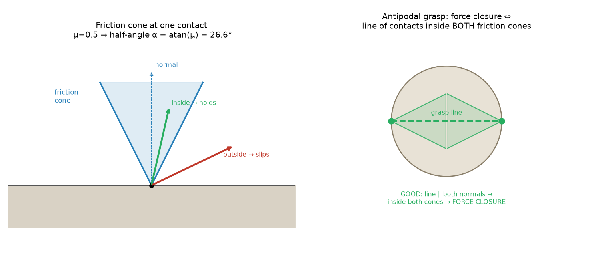

# 12a — What makes a grasp *hold* (contact, friction, closure)

> Chapter 12, §12.1–12.2. The theory of *why a grasp works*: contacts as
> one-way constraints, the **friction cone**, and the two ways to trap an object
> — **form closure** (cage it with geometry) and **force closure** (pinch it with
> friction). This is the criterion every grasp planner and every *learned* grasp
> detector is implicitly solving. **Special handling (Ch 12):** get the gist here,
> then 12b covers the SOTA learned replacements + a toy. Intuition first,
> derivations skipped. Direct sequel to Ch 11's grip-force thread: 11 was *how
> hard to squeeze*; 12 is *where to put the fingers and will it hold*.

---

## 1. The big picture — a grasp is a constraint that gravity can't break

To "grasp" an object is to constrain it so that **no disturbance** — gravity from
any direction, the object's own inertia as you swing the arm, a bump — can move
it relative to the hand. The whole chapter is about *when* a set of finger
contacts achieves that.

There are exactly two mechanisms, and they map to two kinds of gripper:

- **Form closure** — trap the object by **geometry alone**. Enough contacts that
  the object is *caged*: it literally cannot move in any direction, even with
  zero friction (imagine a peg in a snug hole, or a ball in a socket). Robust and
  friction-independent, but needs *many* contacts (≥ 7 in 3D) — think enveloping /
  caging grasps, multi-finger hands wrapping around.
- **Force closure** — trap the object with **friction**. Fewer contacts, but the
  fingers must *squeeze*: they resist disturbances by applying friction forces.
  The classic **two-finger pinch** (your Franka parallel-jaw gripper) is force
  closure. This is what almost all practical robot grasping uses.

Why you care: your pick-place gripper is a **parallel-jaw = force-closure**
device, and every learned grasp detector (Contact-GraspNet, AnyGrasp — 12b) is,
under the hood, proposing gripper poses that achieve **force closure** on the
object. The theory here is the *definition of a good grasp* those networks were
trained to output.

---

## 2. Contacts are one-way constraints (contact kinematics gist)

Press a fingertip on an object. That contact can do exactly one geometric thing:
**stop the object from moving *into* the finger.** It cannot pull the object
back, and (frictionless) it cannot stop sideways sliding. So a single contact is
a **one-way (unilateral) constraint**: it forbids one direction of motion (the
"into the finger" direction) and permits everything else.

Three things can then happen at a contact as the object tries to move (§12.1.2):
- **breaking** — the object moves away from the finger (contact lost),
- **sliding** — it moves tangentially (contact kept, sliding),
- **rolling** — the contact point stays put on both bodies (contact kept, no slip).

**Form closure, precisely:** stack up enough one-way constraints that their
*combined* "you can't go that way" walls leave **no possible motion at all** —
every direction the object might move is blocked by some contact. Counting result
(state it, don't derive): a rigid body in the plane needs **≥ 4** contacts, in 3D
**≥ 7**, for first-order form closure. That's a lot of fingers — which is exactly
why friction (next) is so valuable: it lets you cheat the count down.

---

## 3. The friction cone — the one object to internalize (§12.2.1)

Real contacts have **friction**, and friction is what lets 2 fingers do what
would otherwise need 7. Here's the picture:

At a contact, the finger pushes along the **inward normal** (a normal force
`f_n ≥ 0` — you can push, never pull). Friction lets it *also* resist a
**tangential** force, but only up to `μ·f_n` (Coulomb friction, `μ` = friction
coefficient). Combine those and the set of forces the contact can apply is a
**cone** around the normal:

$$\text{friction cone: half-angle } \alpha = \arctan(\mu).$$

- A required contact force **inside** the cone → the contact holds it **without
  slipping** (static friction is enough).
- **On the edge** → on the verge of slipping.
- **Outside** → the contact *cannot* supply that force; it slips.

So the friction cone is the **menu of forces one finger can apply**. `μ=0.5`
gives `α ≈ 26.6°` (left panel). Bigger `μ` (grippier pads — your `env.py`'s
"grippier fingertips" comment!) = wider cone = more forgiving grasps. This is the
*direction* companion to Ch 11's grip force *magnitude*: Ch 11 set how hard `f_n`
pushes; the cone says which total-force directions that buys you.

---

## 4. Force closure — can the fingers resist *any* wrench? (§12.2.3)

**Force closure** holds when the fingers, choosing contact forces *within their
friction cones*, can generate a net wrench on the object to **cancel any external
disturbance wrench** — gravity from any direction, inertial loads, pushes. If yes,
the grasp is secure no matter what the world throws at it.

The famous special case is the **antipodal grasp** (right panel above): two
fingers pushing toward each other. The clean test:

> **A two-finger grasp is force-closure ⇔ the line joining the two contact points
> lies inside *both* friction cones.**

Intuitively: if the grasp line is within each finger's cone, each finger can push
along that line (squeeze) *and* has friction margin to resist any tangential
tug — the pinch can't be twisted or slid apart. If the line falls outside a cone
(too glancing an approach, too slippery), a tangential disturbance exceeds the
friction limit and the object squirts out. **This single test is essentially what
antipodal grasp detectors check** — find two surface points whose connecting line
is near-normal to both surfaces (within the cones).

Because friction supplies the tangential resistance, force closure needs only
**2 contacts in 2D / 3 in 3D** (or 2 with soft/finite-area fingertip contacts),
versus 4/7 for form closure. Friction buys you the grasp with far fewer fingers —
the whole reason parallel-jaw grippers work.

---

## 5. The linear algebra: contact forces → object wrench (grasp map & wrench space)

This is the LA that turns "will it hold" into a computation, and what grasp
*quality metrics* are built on. Take it geometrically.

**The grasp map `G`.** Each contact `i` can apply forces in its friction cone.
Each such force produces a **wrench** (force + moment, from 3c) on the object,
through a linear map — a contact's little "Jacobian transpose." Stacking all
contacts, the total object wrench is

$$\mathcal{F}_{obj} = G\, f_c,\qquad f_c \ge 0 \text{ (inside the cones)}$$

`G` (the **grasp matrix/map**) collects how each contact force pushes the object;
`f_c` are the contact-force magnitudes, constrained to be **non-negative and
inside the cones** (you can only push, and only within friction limits).

**Force closure as a spanning condition.** The set of *all* wrenches the fingers
can produce is `{G f_c : f_c inside the cones}` — a **cone in 6-D wrench space**
(3D) built from the contact wrenches. Force closure ⇔ that set is *all* of wrench
space, i.e. **the contact wrenches positively span ℝ⁶**:

- *Positively span* = you can reach any wrench by adding contact wrenches with
  **non-negative** coefficients (you can push but not pull — so ordinary spanning
  isn't enough, you need the origin *strictly inside* the convex hull of the
  contact wrenches). Geometrically: the disturbance-wrench you must resist can
  point *any* direction, and the grasp can always answer it.

**Grasp quality.** Force closure is yes/no; in practice you want *how good*. The
standard metric: inscribe the **largest ball centered at the origin inside the
convex hull of the (normalized) contact wrenches** — its radius is the smallest
disturbance wrench that could break the grasp. Bigger ball = more robust grasp.
**This scalar is what learned grasp detectors were trained to maximize** (Dex-Net
labels grasps by exactly this kind of robustness score). You won't compute `G` by
hand for the Franka — but know that "a good grasp" = "contact wrenches that
surround the origin with a fat margin."

*LA vocabulary used here, plainly:* a **cone** = all non-negative combinations of
some vectors (you can scale up and add, not negate); **convex hull** = the filled
region spanned by points; **positively span ℝ⁶** = that filled cone covers every
direction. Force closure = the object's possible disturbance can always be met.

---

## 6. A small worked check — does a pinch on a cylinder hold?

Parallel-jaw fingers squeeze a cylinder on opposite sides. Pads have `μ = 0.5`
(`α = 26.6°`). The object weighs `m·g`, and you're lifting it with up to `1 g` of
extra acceleration (so total vertical load `≈ 2·m·g`).

- **Directional (force closure):** the grasp line is horizontal and hits each
  circular face along its *normal* (dead-center antipodal) → the line is at `0°`
  to each normal, well inside the `26.6°` cones → **force closure ✓**, regardless
  of weight. Good approach geometry = secure grasp.
- **Magnitude (from Ch 11):** friction must carry the vertical load:
  `2·(μ f_n) ≥ 2 m g` ⇒ `f_n ≥ m g / μ`. For `m = 0.2 kg`, `μ=0.5`:
  `f_n ≥ 0.2·9.8/0.5 ≈ 3.9 N` (×2 for the lift accel → ~8 N). That's your
  `F_max` from the Ch 11 Q7 discussion — **the friction cone sets the direction,
  the friction *magnitude* sets the squeeze.**

Two failure flavors, cleanly separated: a **glancing** grasp (line outside the
cone) fails on *direction* no matter how hard you squeeze; a **too-light** grasp
(line fine but `f_n` too small) fails on *magnitude*. A good grasp needs both.

---

## 7. Gotchas / intuition checks

- **Contacts only push.** Every contact force is one-way (`f_n ≥ 0`) — a grasp
  works by *opposing* pushes surrounding the object, never by "pulling" it.
- **Form vs force closure:** form = geometry-only cage (many contacts, no friction
  needed); force = friction pinch (few contacts, must squeeze). Parallel-jaw =
  force closure.
- **Friction cone = direction; grip force = magnitude.** Ch 12's cone tells you
  *which* forces are achievable; Ch 11's `f_n`/`F_max` tells you *how much*. A
  grasp needs the line inside the cones **and** enough squeeze.
- **Bigger μ = wider cone = more forgiving grasps.** Grippy pads literally enlarge
  the set of secure grasp geometries — cheap robustness (why soft/rubber
  fingertips matter).
- **"Antipodal" ≈ what detectors find.** The 2-finger force-closure test (line
  within both cones ≈ line normal to both surfaces) is the geometric target of
  learned grasp detection — 12b is how that target got replaced by a network.
- **Quality is a margin, not a bit.** Force closure is yes/no; real grasp ranking
  uses *how much* disturbance the grasp can resist (largest ball in wrench space).

---

## 8. Where this is going (12b)

Classically you'd model the object, place contacts, build `G`, and check force
closure / maximize the quality metric — expensive and needs a known object model.
**Modern grasping skips all of it:** a network looks at a depth image / point
cloud of a *never-seen* object and directly outputs **6-DOF gripper poses** that
are (implicitly) high-quality force-closure grasps, ranked by a learned score.
12b covers **Contact-GraspNet / AnyGrasp / GraspNet-1B / Dex-Net**, how they plug
into your `perception → grasp → IK/impedance → lift` pick-place stack and your
language-conditioned VLA north star, plus a small toy (antipodal grasp detection /
force-closure check on a simple shape).

---

## FAQ
_(to be filled from discussion)_
