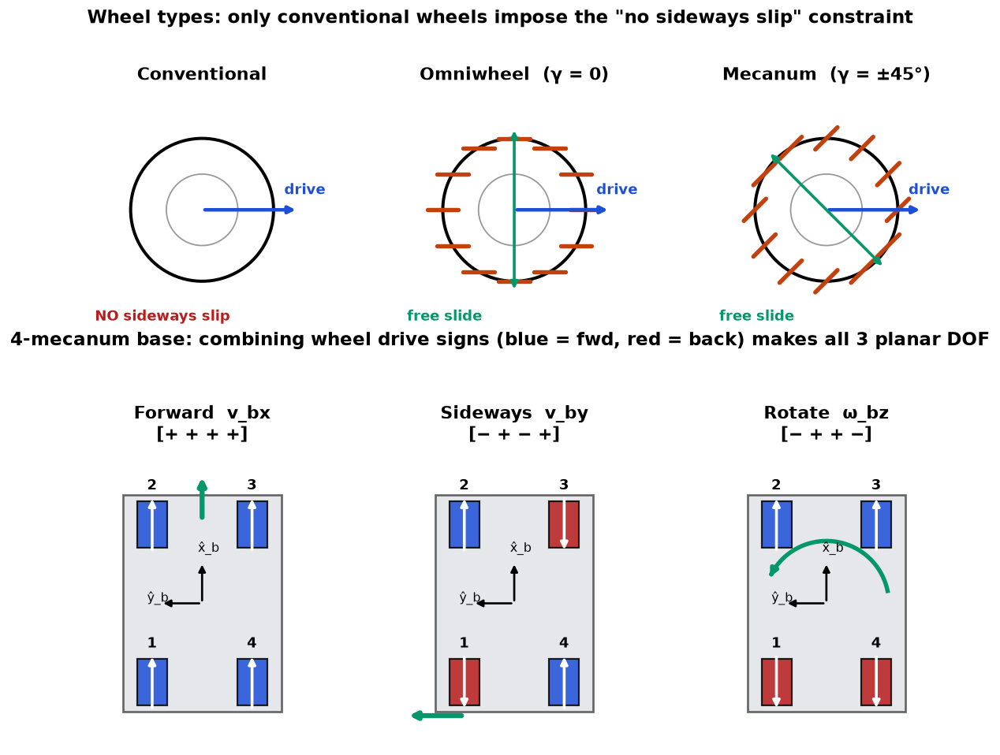
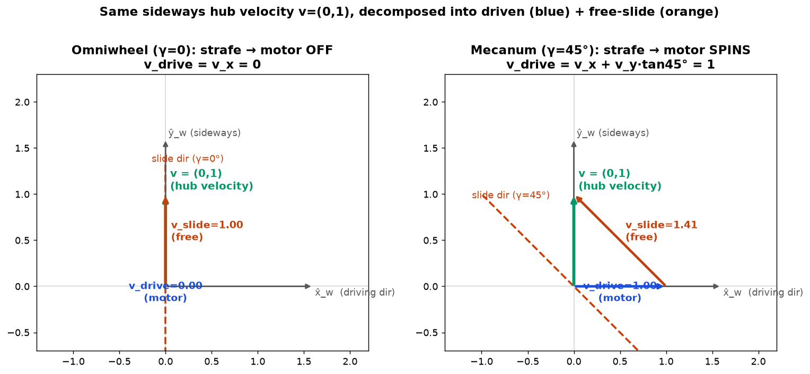
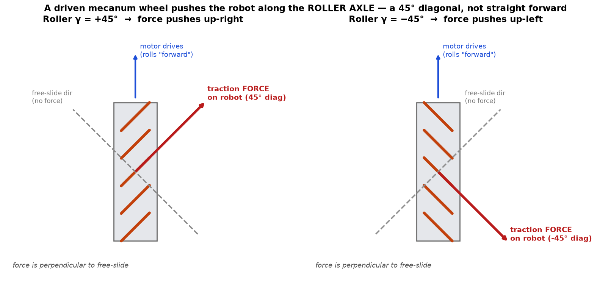

# 13a — Wheeled Mobile Robots: Overview + Omnidirectional Kinematics

> Chapter 13 is the **target-embodiment chapter**. The plan is to build a
> *statically stable wheeled mobile manipulator* — a base that drives around a
> room (perception / nav / SLAM) with an arm bolted on top (manipulation). This
> chapter is the geometric/control language for the **base**. It splits cleanly:
> - **13a (this note):** the big split (holonomic vs nonholonomic) + the *easy*
>   case, **omnidirectional** bases (mecanum / omniwheels).
> - **13b:** the *hard* case, **nonholonomic** bases (diff-drive, car) — the
>   sideways-can't-slide constraint, controllability, path planning.
> - **13c:** **odometry** (wheels → pose estimate) + **mobile manipulation**
>   (base + arm as one combined Jacobian — the payoff for pick-and-place).

---

## 1. The big picture — a mobile robot's *config is its pose in the world*

Every robot so far (Ch 4–8) was **bolted to a table**. Its base frame `{s}` was
nailed to the floor and never moved; the configuration was just the joint
angles. A mobile robot is different in one fundamental way: **the whole body
moves through the world**, so the configuration *is* the chassis's pose in the
plane:

$$q = (\phi, x, y)$$

- `(x, y)` — position of the chassis frame `{b}` origin in the world frame `{s}`.
- `\phi` — the heading angle (how the chassis is rotated about the vertical).

That's a **planar rigid-body pose** — an element of SE(2), the 2D cousin of the
SE(3) we've lived in. Three numbers, three DOF.

The chapter answers one central question, the **kinematic model**:

> Given the wheel speeds I command, how does the chassis pose move? And
> inversely: to move the chassis a desired way, how fast must I spin each wheel?

This is the *exact analogue of the arm Jacobian* (Ch 5): there, joint velocities
`θ̇` mapped to end-effector twist `V` via `V = J θ̇`. Here, **wheel speeds** map
to **chassis velocity**. Same idea, new body. Keep that analogy in your pocket —
it's the whole chapter.

---

## 2. The one distinction that organizes everything: holonomic vs nonholonomic

Wheeled robots come in **two families**, and *almost every downstream fact*
(can it strafe sideways? how do you plan a path? how hard is control?) follows
from which family you're in.

### Omnidirectional (holonomic) — "I can move any direction, right now"

An **omnidirectional** base can instantaneously produce **any** chassis velocity
`q̇ = (φ̇, ẋ, ẏ)`. All three velocity DOF are free and independently commandable.
Want to slide straight left without turning? Yes. Spin in place? Yes. Drive a
diagonal while rotating? Yes. There are **no constraints** on `q̇`.

This is the base you want for manipulation-in-tight-spaces: you can nudge the
gripper in any planar direction without a three-point-turn.

### Nonholonomic — "I can reach anywhere, but not by moving any direction"

A **car** (or diff-drive robot, or shopping cart) is different. At any instant it
can only do two things: **drive along its heading** and **turn**. It *cannot slide
directly sideways* — the tires would have to skid. That's a constraint on its
**velocity**:

$$A(q)\,\dot q = 0 \qquad\text{(a single "no sideways slip" equation)}$$

This is called a **Pfaffian constraint** (a linear-in-velocity constraint;
Ch 2.4). For a car it literally says "the sideways component of chassis velocity
is zero."

**Here is the subtle, beautiful part.** Even though the car can't move sideways
*at any instant*, it can still **reach any configuration `(φ, x, y)`** — you
parallel-park by wiggling forward and back. So the velocity constraint does
**not** shrink the set of reachable configurations. A velocity constraint that
you *cannot* rewrite as a constraint on position is called **nonholonomic**.

Contrast: "this door can only open 90°" is a **holonomic** constraint — it
directly restricts *where* you can be. "This car can't move sideways *right now*"
restricts *how you get there*, not *where you can get*. That's the essence:

| | restricts reachable configs? | example |
|---|---|---|
| **Holonomic** constraint | yes (fewer DOF) | pin joint, closed loop (Ch 7) |
| **Nonholonomic** constraint | **no** (same reachable space, restricted *paths*) | car / diff-drive |

> **Why the name.** "Holonomic" = the velocity constraint can be *integrated*
> back into a position constraint (`f(q)=0`). Nonholonomic = it **can't** be
> integrated — there's no `f(q)` whose time-derivative gives you `A(q)q̇=0`. The
> car has 3 reachable DOF but only 2 *controllable velocity directions* at each
> instant. 13b is entirely about living with that gap.

Everything else in the chapter is downstream of this split, which is why the
book (and we) treat the two cases in separate sections.

---

## 3. Where the constraint comes from: wheel types

Whether you're holonomic or not is decided by **your wheels**.

- **Conventional wheel** (your car's tire): rolls forward/back freely, but
  **refuses to slip sideways**. Each such wheel stamps a "no sideways velocity
  at my contact point" constraint onto the chassis. → **nonholonomic**.

- **Omniwheel:** a normal wheel with a ring of small passive **rollers** on its
  rim, roller axes *in the plane of the wheel*. The wheel drives forward under
  motor power, but the rollers let it **slide freely sideways** with no
  resistance. → the sideways constraint is **removed**.

- **Mecanum wheel:** same idea, but the rollers are canted at **45°** (`γ = ±45°`)
  instead of 0°. Driving the wheel produces a force at 45°; combine four of them
  and you get full planar mobility. This is the **KUKA youBot** base — the
  canonical mobile-manipulator example, and a great template for our build.

Omniwheels and mecanum wheels **aren't steered**, only driven. Small rollers →
they want hard, flat floors (fine for an indoor room-navigating robot).

*Top: the three wheel types — a conventional wheel constrains sideways motion; an
omniwheel (rollers at γ=0) and a mecanum wheel (rollers at γ=±45°) slide freely,
removing the constraint. Bottom: a 4-mecanum base and the three motion primitives
it can produce by combining wheel drive signs.*

---

## 4. Omnidirectional kinematics — the wheel "Jacobian" `H`

Now the concrete map. We want, for each wheel `i`, its **driving speed** `u_i`
(the motor's angular speed) as a function of the chassis velocity.

### One wheel

Put a frame at the wheel center with `x̂_w` along its driving direction. The
wheel-center linear velocity `v = (v_x, v_y)` splits into a **driven** part
(along `x̂_w`) and a **free-sliding** part (allowed by the rollers, at angle `γ`):

$$v_{\text{drive}} = v_x + v_y \tan\gamma, \qquad
  u = \frac{v_{\text{drive}}}{r} = \frac{1}{r}\,(v_x + v_y\tan\gamma)$$

with `r` the wheel radius. Only the **driven** component costs motor speed; the
slide is free. (For an omniwheel `γ=0`, so `u = v_x/r` — pure forward rolling.)

### From chassis velocity to all wheels

Each wheel sits at position `(x_i, y_i)` in the body frame `{b}`, points in
driving direction `β_i`, and slides at angle `γ_i`. Chaining "chassis twist →
velocity at the wheel → driven speed" gives one **row** `h_i` per wheel. Stacking
`m` wheels:

$$\boxed{\;u = H(0)\,\mathcal V_b,\qquad
  \begin{bmatrix}u_1\\ \vdots\\ u_m\end{bmatrix}
  = \begin{bmatrix}h_1(0)\\ \vdots\\ h_m(0)\end{bmatrix}
  \begin{bmatrix}\omega_{bz}\\ v_{bx}\\ v_{by}\end{bmatrix}\;}$$

- `\mathcal V_b = (\omega_{bz}, v_{bx}, v_{by})` — the **body twist** of the
  chassis: how fast it's turning, and its forward/sideways speed *in its own
  frame*. (This is the planar slice of the SE(3) body twist from Ch 3b: one
  angular component `ω_z`, two linear `v_x, v_y`.)
- `H(0) ∈ ℝ^{m×3}` — the **wheel matrix**: it turns the chassis's desired motion
  into the `m` motor speeds. This is *literally a Jacobian* — the base's
  equivalent of the arm's `J`. The `(0)` means "evaluated with `φ=0`"; the map
  from body twist to wheel speeds doesn't care about the chassis's heading in
  the world (a wheel spins the same whether the robot faces north or east). If
  instead you feed the **world-frame** velocity `q̇=(φ̇,ẋ,ẏ)`, you use `H(φ)`,
  which just rotates `(ẋ,ẏ)` into the body frame first.

### The youBot (four mecanum wheels)

With half-length `ℓ` (center-to-wheel along `x̂_b`), half-width `w`, all `β_i=0`,
`γ = ∓45°`, radius `r`:

$$u = \frac{1}{r}
\begin{bmatrix}
-\ell-w & 1 & -1\\
\ \ell+w & 1 & \ 1\\
\ \ell+w & 1 & -1\\
-\ell-w & 1 & \ 1
\end{bmatrix}
\begin{bmatrix}\omega_{bz}\\ v_{bx}\\ v_{by}\end{bmatrix}$$

Read the **columns** as "what each unit of chassis motion asks of the wheels":

- **column 2 (`v_bx`, forward):** `[1,1,1,1]` → **all four wheels drive forward
  together**. Makes sense.
- **column 3 (`v_by`, sideways/left):** `[-1,1,-1,1]` → wheels 1&3 back, 2&4
  forward. The 45° rollers turn that into pure sideways glide. *This column is
  the whole point of mecanum* — a conventional base has no way to make it.
- **column 1 (`ω_bz`, spin):** `[-,+,+,-]·(ℓ+w)` → left wheels back, right wheels
  forward → rotate in place. The `ℓ+w` is the lever arm.

This matches the bottom of the figure exactly.

---

## 5. Linear algebra you need here

`H(0)` is a **linear map** `ℝ³ → ℝ^m`: feed it a 3-vector (chassis body twist),
get back an `m`-vector (wheel speeds). Two Ch-5/Ch-6 ideas do all the work.

### (a) Rank — *is the robot actually omnidirectional?*

For the base to reach **every** chassis velocity, `H(0)` must be able to produce
motor commands for any `(ω_{bz}, v_{bx}, v_{by})`. In matrix terms its columns
must span all of `ℝ³` — i.e. **`H(0)` must have rank 3**. Rank = "how many
genuinely independent directions the map can reach." The book's warning:

> If you built a robot whose wheels all drove *and* slid in aligned directions,
> `H(0)` would be rank **2** — the sideways column would be a combination of the
> others, and *no wheel command could ever move you sideways.* You'd have a
> secretly-2-DOF base.

That's the same "loss of a direction" idea as an **arm singularity** (5b): rank
drop = a motion you can no longer command. Here it's a *design* condition on wheel
placement, not a configuration you drift into. You need ≥ 3 wheels for a chance at
rank 3 (each wheel = one motor = one row).

### (b) Inverting the map — square vs tall

- **Exactly 3 wheels** (`m=3`, e.g. the 3-omniwheel base): `H(0)` is `3×3`. If
  rank 3 it's **invertible**, so `\mathcal V_b = H(0)^{-1} u` — clean two-way
  street between wheel speeds and chassis motion.
- **More than 3 wheels** (`m=4` youBot): `H(0)` is **tall** (4×3). Forward
  (`\mathcal V_b → u`) is fine. But going backward (`u → \mathcal V_b`) is
  **overdetermined**: 4 measured wheel speeds, 3 unknowns. If the wheels are
  slipping even slightly, no exact `\mathcal V_b` fits all four. You take the
  **least-squares best fit** via the **pseudoinverse** (the exact tool from
  6b!):
  $$\mathcal V_b = H(0)^{+}\,u,\qquad H^{+} = (H^\top H)^{-1}H^\top.$$
  This backward direction is **odometry** — estimating how the chassis moved
  from how the wheels turned — which we cover in 13c. The redundancy `m>3` is
  also what lets you *detect* wheel slip (the residual `u - H\mathcal V_b`).

So the whole omnidirectional story is: **`H` forward to drive, `H^+` backward to
estimate.** Same `J` / `J^+` duality as the arm.

---

## 6. A small worked example (numbers)

Take a youBot-like base: `r = 0.05 m`, `ℓ = 0.235 m`, `w = 0.15 m`, so
`ℓ+w = 0.385`. Command a **pure sideways glide left** at `v_by = 0.1 m/s`
(`ω_bz = 0`, `v_bx = 0`):

$$u = \frac{1}{0.05}\begin{bmatrix}-0.385&1&-1\\0.385&1&1\\0.385&1&-1\\-0.385&1&1\end{bmatrix}
\begin{bmatrix}0\\0\\0.1\end{bmatrix}
= \frac{1}{0.05}\begin{bmatrix}-0.1\\0.1\\-0.1\\0.1\end{bmatrix}
= \begin{bmatrix}-2\\2\\-2\\2\end{bmatrix}\ \text{rad/s}.$$

Wheels 1&3 spin **backward** at 2 rad/s, wheels 2&4 **forward** at 2 rad/s — and
the 45° rollers convert that into pure leftward glide, no rotation, no forward
drift. That's the "strafe" a conventional car simply cannot do. (Sanity-check the
magnitude: `u·r = 0.1 m/s` at the rim = the commanded speed. ✓)

---

## 7. Gotchas / intuition checks

- **"Nonholonomic = can't reach some places" — NO.** It can reach every
  `(φ,x,y)`. The constraint is on *instantaneous velocity*, not on the reachable
  set. This is the #1 thing people get backwards.
- **Body twist vs world velocity.** `u = H(0)\mathcal V_b` uses the chassis's
  *own-frame* velocity `(ω,v_x,v_y)`. To command in world frame you rotate
  `(ẋ,ẏ)` by `−φ` first — that's all `H(φ)` vs `H(0)` differ by. The *wheels*
  never care about your heading in the world.
- **≥3 wheels is necessary, not sufficient.** Three motors give you a *chance* at
  rank 3, but bad wheel geometry still collapses the rank. Placement matters.
- **`m>3` doesn't add mobility.** The youBot's 4th wheel gives no extra motion
  DOF (still only 3). It buys *load capacity, stability, and slip detection*, and
  forces least-squares odometry.
- **Mecanum ≠ free lunch.** Those little rollers hate debris, gaps, and soft
  floors, and mecanum wheels waste some effort as internal skidding. Great for a
  clean indoor room robot; bad for outdoors.
- **This `H` is a Jacobian.** If that word makes you reach for Ch 5, good —
  columns = "what one unit of each motion costs," rank drop = lost direction,
  pseudoinverse = best-fit inverse. Same machinery, new body.

---

## 8. FAQ

**Q: In `v_drive = v_x + v_y tanγ`, what are `v_x` and `v_y`? Is `v_x` along the
driving direction?**

Yes. Plant a frame at the wheel center: `x̂_w` = the driving direction (the way
the wheel rolls, ⟂ to the axle), `ŷ_w` = straight sideways (along the axle).
Then `v=(v_x, v_y)` is simply the **wheel center's actual velocity** — how the
chassis is dragging the hub right now — written in that frame. `v_x` is its
forward component, `v_y` its sideways component. The wheel doesn't choose `v`;
the chassis motion imposes it, and we ask "how fast must the motor spin (`u`) to
allow it?"

The reason `v_drive ≠ v_x` (for mecanum) is that the wheel's only *free* motion
is sliding along the **roller direction**, which is tilted by `γ` — so it has a
forward component too. Decompose `v` into a **driven** part (along `x̂_w`, motor's
job) plus a **free-slide** part (along the tilted roller line):
`v = v_drive·(1,0) + v_slide·(−sinγ, cosγ)`. Solving gives
`v_drive = v_x + v_y tanγ`, `v_slide = v_y/cosγ`.

**Punchline:** command pure sideways `v=(0,1)`. Omniwheel (`γ=0`): `v_drive=0`,
motor **off** — it strafes on the rollers alone. Mecanum (`γ=45°`):
`v_drive = 0 + 1·tan45° = 1`, motor **spins** — pure sideways is a *combination*
of rolling + 45° sliding. This is exactly why the youBot's wheels all spin to
strafe (`v_by` column of `H` is nonzero). See figure:

**Q: When a mecanum wheel is driven, which way does it push the robot?**

**Diagonally, at 45° — not straight forward.** The contact is through a
freely-spinning roller, and a roller can only transmit force along its *axle*
(the direction it can't roll); along its rolling direction it just spins →
**zero force**. That force-transmitting axle sits **perpendicular to the
free-slide direction**, so in the wheel frame the traction force points along
`f̂ = (cosγ, sinγ)`, which for `γ=45°` is the 45° diagonal `(0.707, 0.707)`.

This is why a mecanum base needs **four wheels with alternating roller angles**
(`±45°`): each wheel pushes diagonally, and you combine the pushes — forward
(diagonals' sideways parts cancel, forward parts add), sideways (vice-versa), or
a pure couple (rotate). It's the force-side mirror of the `H`-matrix wheel
patterns.

The clean takeaway is a **free/locked duality**: a wheel moves freely along the
roller-rolling direction (**no force there**) and transmits force along the
perpendicular axle (**no free motion there**) — *a wheel pushes exactly in the
direction it cannot freely move.* Same velocity↔force duality as `V=Jθ̇` vs
`τ=JᵀF` (5b): the velocity map is `H`, the force map (wheel forces → chassis
wrench) is built from `Hᵀ`.

