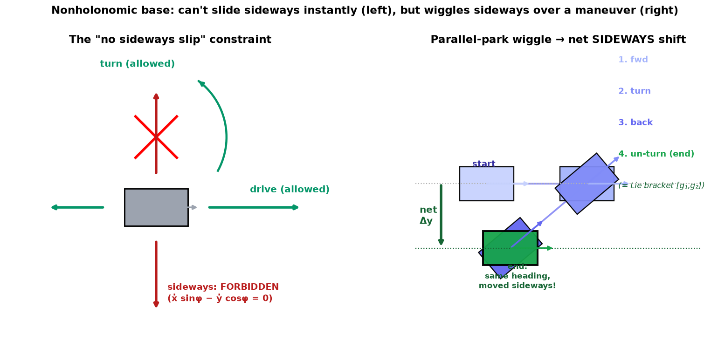

# 13b — Nonholonomic Wheeled Mobile Robots (diff-drive & car)

> 13a was the *easy* base: omnidirectional (mecanum/omni), any velocity anytime,
> a linear `H` matrix. This note is the *hard but far more common* base — the
> **diff-drive** robot and the **car**. These use conventional wheels, so they
> carry the **"no sideways slip"** constraint. This is the base under a TurtleBot,
> a Roomba, a warehouse AMR, and literally your car. We're deciding the build's
> base type later, so treat 13a and 13b as the two candidates, evenhanded.

---

## 1. The big picture — 2 controls, 3 DOF

A diff-drive robot has **two motors** (left wheel, right wheel). A car has two
controls too (gas/forward-speed, steering). Either way you get **two knobs**. But
the chassis lives in a **three-dimensional** configuration space `q=(φ,x,y)`
(same SE(2) pose as 13a). So you're perpetually **one control short** of the DOF
you'd like.

That gap is the whole story of this note, and it's the nonholonomic idea from
13a made concrete:

- **Instantaneously**, you can only move in a **2-D slice** of velocity space:
  drive along your heading + turn. You **cannot** command a sideways velocity.
- **Over a maneuver**, you can still reach **any** `(φ,x,y)` — you parallel-park.

The constraint bites your *velocities*, not your *reachable poses*. Everything
below — how to model it, whether it's "controllable," how to plan a path, how to
track one — flows from living inside that 2-of-3 slice.

---

## 2. The models — all one canonical form `q̇ = G(q)u`

Three robots, one shape. Each says: "the chassis velocity `q̇` is a **linear
combination of a couple of allowed velocity directions**, and the combination
weights are exactly my controls."

### Unicycle (the atom)

A single rolling wheel. Controls `u=(v,ω)`: forward speed `v`, turning rate `ω`.

$$\dot q=\begin{bmatrix}\dot\phi\\ \dot x\\ \dot y\end{bmatrix}
=\underbrace{\begin{bmatrix}0\\ \cos\phi\\ \sin\phi\end{bmatrix}}_{g_1}\,v
+\underbrace{\begin{bmatrix}1\\ 0\\ 0\end{bmatrix}}_{g_2}\,\omega.$$

Read it physically: `g_1` is "**drive forward**" — no heading change, and you
translate along where you're pointing `(\cos\phi,\sin\phi)`. `g_2` is "**turn in
place**" — heading changes, position doesn't. Your actual motion is `v` units of
the first plus `ω` units of the second.

### Diff-drive robot

Two wheels (radius `r`) a distance `2d` apart, plus a caster to stay upright.
Native controls are the **wheel speeds** `(u_L, u_R)`. A quick change of
variables turns them into the unicycle's `(v,ω)`:

$$v=\frac{r(u_L+u_R)}{2},\qquad \omega=\frac{r(u_R-u_L)}{2d}.$$

"Both wheels equal → drive straight; spin them opposite → turn in place." After
this substitution the diff-drive **is** the unicycle. (This is why "unicycle
model" and "diff-drive" are used interchangeably in robotics code.)

### Car

Controls `(v, \psi)`: forward speed and **steering angle** `\psi`. Steering
changes how fast the heading turns:

$$\dot\phi=\frac{v}{\ell}\tan\psi,$$

with `\ell` the wheelbase. Two new wrinkles vs the unicycle:
- **Minimum turning radius** `r_{\min}=\ell/\tan\psi_{\max}` — the steering angle
  is limited, so the car **can't turn in place** (it can't spin with `v=0`).
- If steering responds fast, you can re-parametrize the control as `(v,\omega)`
  again via `\psi=\tan^{-1}(\ell\omega/v)`, recovering the same canonical form —
  only the **allowed control region** differs.

### The canonical simplified model

All three collapse to the **same two-vector-field system** — only their control
*limits* differ (unicycle: any `(v,ω)`; car: bounded, and `ω` tied to `v`):

$$\boxed{\;\dot q=\begin{bmatrix}0\\ \cos\phi\\ \sin\phi\end{bmatrix}v
+\begin{bmatrix}1\\ 0\\ 0\end{bmatrix}\omega\;}$$

Three properties to notice (they characterize *all* nonholonomic wheeled models):
1. **No drift** — zero controls ⇒ zero velocity. The robot never coasts on its own.
2. **Config-dependent** — `g_1` contains `\cos\phi,\sin\phi`, so "forward" points
   somewhere different depending on which way you face. (`H` in 13a had no such
   `φ`-dependence in body form — a real difference.)
3. **Linear in the controls** — `q̇` is a weighted sum of the `g_i`.

### The constraint, written out

Solve the canonical model for the forbidden direction and you get the single
**Pfaffian constraint**:

$$A(q)\,\dot q=\begin{bmatrix}0 & \sin\phi & -\cos\phi\end{bmatrix}\dot q
=\dot x\sin\phi-\dot y\cos\phi=0.$$

In words: *the component of chassis velocity **perpendicular to the heading** is
zero.* No sideways slip. That's the row `A(q)`; the two `g_i` are the two
directions that satisfy it.

---

## 3. Linear algebra you need here — vector fields

The new object is a **vector field**. A plain vector is one arrow. A **vector
field** `g(q)` attaches an arrow to **every point** of configuration space: "if
you're at pose `q` and you set this control to 1, *this* is the velocity you'll
move with." Because `g_1=(0,\cos\phi,\sin\phi)` depends on `\phi`, its arrow
**rotates** as the robot turns — "forward" is a different world-direction at
every heading. That's all a vector field is: a velocity arrow that varies with
where you are. (You've already met one — the joint-screw columns of the arm
Jacobian in Ch 5 are velocity vectors that change with configuration; same idea.)

So `G(q)=[g_1\ g_2]` is a `3×2` matrix whose **columns are the two allowed
velocity directions at `q`**. The set of velocities you can command is
`\{G(q)u\}` — all linear combinations of those two columns — a **2-D plane**
inside the 3-D velocity space. The constraint `A(q)\dot q=0` is the *same plane*,
described by its one forbidden normal direction instead of its two spanning
directions. Two ways to name one plane: "here's what's allowed" (`G`, columns) vs
"here's the one thing that's banned" (`A`, the normal). `n-k = 3-1 = 2` allowed,
`k=1` banned.

**Key question this sets up:** the allowed plane is only 2-D, but the space is
3-D. Does that 2-of-3 restriction shrink where you can *get* to? That's
controllability, next.

---

## 4. Controllability — the parallel-parking miracle (intuition only)

Two facts sit in tension, and resolving them is the heart of the chapter.

**Fact 1 — you cannot "park" with a simple feedback law.** For the omnidirectional
robot, a dead-simple spring controller `q̇ = -Kq` pulls you to the goal, because
you can command *any* `q̇`. For the nonholonomic robot **no continuous,
time-invariant feedback law can stabilize the chassis to a fixed pose** (Brockett's
theorem; here because `\text{rank }G=2<3=\dim q`). Intuitively: near the goal, if
you're offset *sideways*, there's no sideways velocity to command, and no smooth
rule can fix it. This is a real, famous obstruction — not a modeling artifact.

**Fact 2 — yet you can still reach anywhere.** You parallel-park. Here's the
mechanism, and it's beautiful. Run this 4-step cycle:

1. drive **forward** a little (`+g_1`)
2. **turn** a little (`+g_2`)
3. drive **backward** (`-g_1`)
4. **un-turn** (`-g_2`)

You return to (almost) your original heading and position — but **not quite**.
The little error left over is a **net sideways shift** — exactly the direction the
constraint forbade instant-by-instant. The order of operations doesn't cancel:
"forward-then-turn" ≠ "turn-then-forward," and the mismatch *is* sideways motion.

The formal name for "the sideways motion you get by cycling two controls" is the
**Lie bracket** `[g_1,g_2]` of the two vector fields. For our model it works out to
`[g_1,g_2]=(0,\sin\phi,-\cos\phi)` — which at `φ=0` is `(0,0,-1)`, **pure
sideways**. So the two controls, *combined over a maneuver*, secretly give you a
**third** motion direction. Two allowed directions + their bracket = all three
DOF → **the whole `(φ,x,y)` space is reachable.** The velocity constraint does
**not** integrate to a configuration constraint. It's nonholonomic. (This is the
same Lie bracket = "non-commutativity of two motions" you met for twists in Ch 8 —
here applied to steering fields instead of instantaneous twists. We keep it at the
picture level; the point is *that* the sideways direction falls out, not the algebra.)

**The catch — it's slow.** Motion along the two real controls is "order `ε`"; the
sideways bracket motion you scrape out of a wiggle is only "order `ε²`" — much
smaller. That's why parallel parking into a tight spot takes many small back-and-
forths to move the car a little sideways. The math predicts your driving-school
experience exactly.

> **Bottom line:** nonholonomic ⇒ *reachable everywhere* (good), but *not
> stabilizable by smooth feedback* (annoying) and *sideways motion is expensive*
> (slow). Compare 13a's omnidirectional base: sideways is free and a one-line
> controller parks it. This trade is the reason to care which base you build.

---

## 5. Motion planning gist (Dubins & Reeds–Shepp)

Because you can't strafe, the *shortest* path between two poses is not a straight
line — it's made of **minimum-radius arcs and straight segments**. Two classic
results:

- **Dubins car** (forward only): every shortest path is one of a tiny menu —
  `CSC` or `CCC` (`C`=turn arc at min radius, `S`=straight). "Curve, straight,
  curve." Only forward gear.
- **Reeds–Shepp car** (has reverse): shortest paths come from **9 classes** that
  now allow **cusps** (`|` = a reversal, shift from forward to reverse) — this is
  the parallel-parking family formalized.

How these get *used* in practice: as the **local connector** inside a sampling
planner (RRT/PRM from Ch 10) — the planner samples poses and joins nearby ones
with a Reeds–Shepp path. Or, because the car is controllable, you can run an
ordinary obstacle-avoiding planner that **ignores** the motion constraints and
then follow that path arbitrarily closely (slowly, by wiggling), optionally
smoothing it into a feasible Reeds–Shepp path by recursive subdivision.

*(This is the classical layer. On the north-star nav side, this is exactly the job
that gets partly absorbed by learned planners / VLN — same "get the base from A to
B respecting how it can move" problem, cf. `notes/09_10_learned_sota.md`.)*

---

## 6. Feedback control gist — three problems, one is hard

Given a plan, how do you make the real robot follow it under noise? Three flavors:

1. **Stabilize a configuration** (park to a fixed `q_d`) — **the hard one.** By
   Fact 1, needs a **time-varying or discontinuous** controller. No smooth law works.
2. **Trajectory tracking** (follow a *moving* reference `q_d(t)`) — **easy.** A
   continuous time-invariant controller works fine.
3. **Path tracking** (follow the geometric path `q(s)`, free to choose speed) —
   also easy, and gives extra freedom (you pick how fast to move along the path).

**The intuition that makes this click:** chasing a **moving** target is easy;
freezing onto a **stationary** pose is hard. As long as the reference keeps
moving, the chassis naturally lines itself up behind it — like how you don't
think about parallel parking while *driving down the road*, only when *stopping
into a spot*. A simple version: pick a **reference point `P`** on the chassis (not
on the wheel axle), and use plain proportional control `\dot p = k_p(p_d - p)` to
drag `P` toward its desired position; convert that desired `(\dot x_P,\dot y_P)`
back into `(v,ω)`. Over time the whole chassis falls in line behind `P`.

---

## 7. Gotchas / intuition checks

- **"2 controls < 3 DOF ⇒ can't reach everywhere" — NO.** The Lie bracket buys
  the missing direction over a maneuver. Reachable set is still full 3-D. (Same
  headline as 13a: nonholonomic restricts *paths*, not *destinations*.)
- **Diff-drive = unicycle.** After the `(u_L,u_R)→(v,ω)` change of variables they're
  the identical model. Don't treat them as different math.
- **A car can't turn in place; a diff-drive can.** The difference is entirely in
  the **control limits** on the same canonical model — the car's `ω` is bounded and
  yoked to `v` (min turning radius), the diff-drive's is free (`v=0,ω≠0` allowed).
- **Parking is the hard problem, not driving.** If a controller "won't converge,"
  suspect you're asking it to stabilize a *fixed pose* with smooth feedback — the
  one thing Brockett says is impossible. Track a moving reference instead.
- **Sideways is slow (`ε²`), not free.** Budget for it. A base that must
  frequently reposition sideways in tight spaces is arguing for a *mecanum* base
  (13a) instead.
- **This is why mobile manipulation cares (13c):** a nonholonomic base can't nudge
  the gripper sideways on its own — but the **arm on top can**, and the base +
  arm together can cover for each other. That combined system is 13c.

---

## 8. FAQ

*(to be filled in after discussion / exercises)*
