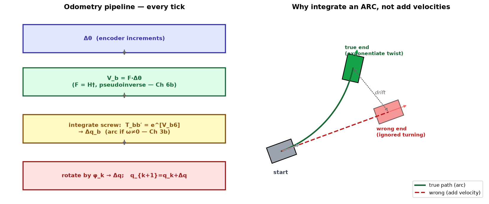
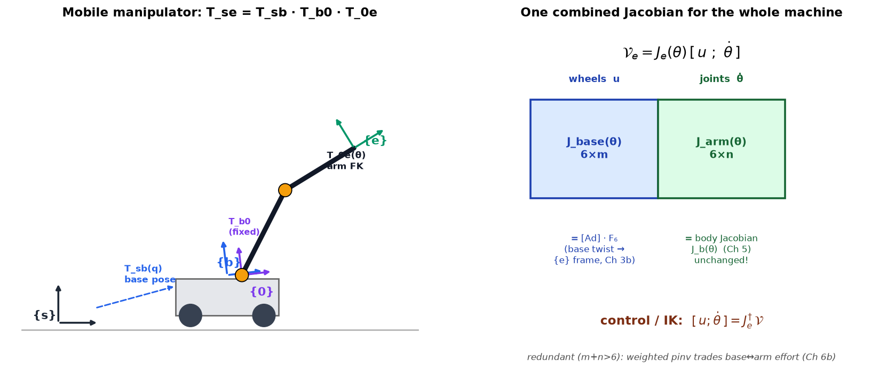
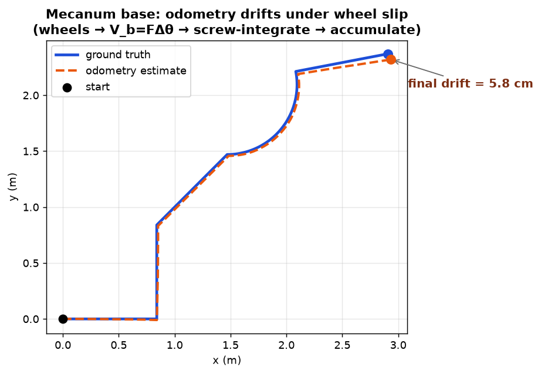

# 13c — Odometry + Mobile Manipulation (the north-star payoff)

> This note closes Chapter 13 and, in a real sense, closes the *whole book*. Two
> topics:
> - **Odometry** (§13.4): wheels → "where am I?" The estimation layer under every
>   nav/SLAM stack.
> - **Mobile manipulation** (§13.5): base + arm as **one robot**, one combined
>   Jacobian. This is *literally* the wheeled-mobile-manipulator we're building,
>   and it reuses SE(3) (Ch 3), forward kinematics (Ch 4), the Jacobian (Ch 5),
>   pseudoinverse IK (Ch 6), and the `F`/`H` maps from 13a. Everything converges.

---

# Part A — Odometry

## A1. Big picture — dead reckoning from the wheels

**Odometry** = estimate the chassis pose `q=(φ,x,y)` by *integrating the wheel
motions*. Every mobile robot already senses how far each wheel turned (encoders,
or commanded stepper steps), so odometry is **free** — no extra hardware.

The catch: it **drifts**. Every tiny wheel slip, skid, or rounding error adds to a
running total that never gets corrected on its own. So odometry is *great on short
timescales, hopeless on long ones*. In practice you **fuse** it with sensors whose
error doesn't accumulate (LiDAR/visual landmarks, GPS) inside a **Kalman filter /
particle filter** — which is exactly the estimation core of **SLAM** (the nav side
of the north star). Odometry is the fast, smooth "prediction"; the exteroceptive
sensor is the slow "correction." Hold that split — it's the whole reason both exist.

## A2. The pipeline — three steps per tick

Given the encoder increments `Δθ` (how much each wheel rotated since last tick):

**Step 1 — wheels → chassis body twist.** Invert the 13a wheel map. We had
`Δθ = H(0)·V_b`; going backward,
$$\mathcal V_b = F\,\Delta\theta,\qquad F = H^{\dagger}(0).$$
`F` is just the **pseudoinverse** of the wheel matrix (Ch 6b) — the least-squares
"best-fit chassis motion that explains these wheel readings." For each base type
it's a fixed little matrix:

- **3 omniwheels:** `F = r·[[−1/3d, −1/3d, −1/3d],[2/3, −1/3, −1/3],[0, −1/(2sin60°), 1/(2sin60°)]]`
- **4 mecanum:** `F = (r/4)·[[−1/(ℓ+w), 1/(ℓ+w), 1/(ℓ+w), −1/(ℓ+w)],[1,1,1,1],[−1,1,−1,1]]`
- **diff-drive / car** (rear wheels `Δθ=(Δθ_L,Δθ_R)`):
  $$\mathcal V_b = r\begin{bmatrix}-1/2d & 1/2d\\ 1/2 & 1/2\\ 0 & 0\end{bmatrix}
  \begin{bmatrix}\Delta\theta_L\\ \Delta\theta_R\end{bmatrix}.$$
  Notice the **third row is zero**: `v_by = 0`. The nonholonomic "no sideways
  slip" constraint from 13b is baked right into the odometry — you can *never*
  estimate a sideways motion, because the wheels can't produce one.

**Step 2 — integrate the twist over the tick (the subtle one).** You might want
to just add `(v_bx, v_by)` to `(x,y)`. **Wrong if the robot is turning.** During
the tick the robot spins by `ω_bz` *while* translating, so its actual path is a
**circular arc**, not a straight segment. Adding the linear velocity ignores the
curving. The right move is to treat `V_b` as a **constant screw** for the tick and
integrate it — the exact **matrix-exponential screw motion from Ch 3b**:
$$T_{bb'} = e^{[\mathcal V_{b6}]},\qquad \mathcal V_{b6}=(0,0,\omega_{bz},v_{bx},v_{by},0).$$
Because the twist is planar, that exponential has a clean closed form for the
body-frame displacement `Δq_b=(Δφ_b,Δx_b,Δy_b)`:

$$\omega_{bz}=0:\ \Delta q_b=\begin{bmatrix}0\\ v_{bx}\\ v_{by}\end{bmatrix}
\qquad\text{(straight — the easy case)}$$
$$\omega_{bz}\ne 0:\ \Delta q_b=\begin{bmatrix}\omega_{bz}\\
(v_{bx}\sin\omega_{bz}+v_{by}(\cos\omega_{bz}-1))/\omega_{bz}\\
(v_{by}\sin\omega_{bz}+v_{bx}(1-\cos\omega_{bz}))/\omega_{bz}\end{bmatrix}
\qquad\text{(arc — the honest case)}$$

Don't memorize the arc formula — recognize it. Those `sin/ω` and `(1−cos)/ω`
terms are the **screw-motion integral** (§3b): "translate along a curving frame."
As `ω→0` they smoothly reduce to the straight case (`sinω/ω→1`, `(1−cos)/ω→0`).

**Step 3 — body frame → world frame.** `Δq_b` is expressed in the chassis frame;
rotate it into the world by the current heading `φ_k` and accumulate:
$$\Delta q=\begin{bmatrix}1&0&0\\0&\cos\phi_k&-\sin\phi_k\\0&\sin\phi_k&\cos\phi_k\end{bmatrix}\Delta q_b,
\qquad q_{k+1}=q_k+\Delta q.$$

That's it: **`Δθ → V_b = F Δθ → integrate the screw → rotate to world → add`,**
every tick.



## A3. Linear algebra / geometry you're reusing

Nothing new here — that's the point. Two old tools:
- **Pseudoinverse `F=H†`** (6b): the least-squares inverse of the (possibly tall)
  wheel map. For `m>3` wheels it also gives you a **slip check** — if the wheels
  disagree, the residual `Δθ − H·V_b` is nonzero.
- **Screw-motion exponential `e^{[V]}`** (3b): integrating a constant twist over a
  finite time = a rigid-body displacement. Odometry is that integral, done once
  per tick. The whole "why arcs not lines" subtlety *is* the difference between
  adding velocities and exponentiating a twist.

---

# Part B — Mobile Manipulation

## B1. Big picture — base + arm as one 9-DOF robot

Bolt an `n`-joint arm onto the mobile base. Now the end-effector can be moved two
ways: **drive the base** or **move the joints**. Two operating styles:

1. **Park-then-manipulate** (the common, easy one): drive up, stop, let the arm do
   the precise work, drive away. The base and arm never move together. This is how
   most real mobile manipulators (and our first build) will operate.
2. **Coordinated whole-body motion**: base and arm move *together* to place the
   end-effector — needed when the task is bigger than the arm's reach, or to keep
   the arm in a dexterous (non-singular, high-manipulability) posture while the
   base handles the gross motion. This is the interesting case, and it needs *one
   Jacobian for the whole machine*.

The base is **coarse and imprecise** (wheel slip, a heavy chassis); the arm is
**fine and precise**. Good coordinated control exploits that division of labor —
we'll see it fall out as a *weighted* pseudoinverse.

## B2. The frame tree — pure Ch 3/4 transform chaining

Four frames: world `{s}`, chassis `{b}`, arm base `{0}`, end-effector `{e}`. The
end-effector pose is a **chain of transforms** — exactly the `T`-multiplication
from Ch 3–4:
$$X(q,\theta)=T_{se}(q,\theta)=\underbrace{T_{sb}(q)}_{\text{base in world}}\,
\underbrace{T_{b0}}_{\text{fixed mount}}\,\underbrace{T_{0e}(\theta)}_{\text{arm FK}}.$$

- `T_{sb}(q)` — the base's planar pose lifted into SE(3): rotation by `φ` about
  vertical, translation `(x,y,z)` (`z` = deck height). This is where the mobile
  base "plugs into" the SE(3) machinery.
- `T_{b0}` — constant bolt-on offset from chassis to arm base.
- `T_{0e}(θ)` — the arm's **forward kinematics** (Ch 4, PoE).



*This is the same transform tree you built by hand in the phone-teleop exercise
(`../proj_phone_teleop.md`), now with a driving `{b}` instead of a fixed one.*

## B3. The combined Jacobian — stacking wheels + joints

We want end-effector twist from **all** the velocities at once — wheel speeds `u`
(`m` of them) and joint speeds `θ̇` (`n` of them). One Jacobian does it:

$$\boxed{\;\mathcal V_e = J_e(\theta)\begin{bmatrix}u\\ \dot\theta\end{bmatrix}
=\big[\,J_{\text{base}}(\theta)\ \big|\ J_{\text{arm}}(\theta)\,\big]
\begin{bmatrix}u\\ \dot\theta\end{bmatrix}\;}$$

`J_e` is `6×(m+n)`: its columns are "**every independent way I can make the
end-effector move**," wheels and joints side by side. It splits cleanly:

- **`J_arm(θ)` = the arm's body Jacobian `J_b(θ)`** — *exactly* what you built in
  Ch 5. The joint-velocity columns are unchanged by mounting the arm on wheels.
- **`J_base(θ)`** — the wheels' contribution, in three moves:
  1. wheels → chassis twist: `V_b6 = F_6 u` (that's `F` from Part A, padded to a
     6-vector `V_b6 = (0,0,ω_bz,v_bx,v_by,0)`).
  2. that twist lives in `{b}`; **transport it into the end-effector frame `{e}`**
     using the **adjoint** (the twist change-of-frame from Ch 3b):
  $$J_{\text{base}}(\theta)=\big[\mathrm{Ad}_{T_{0e}^{-1}(\theta)\,T_{b0}^{-1}}\big]\,F_6.$$

  The adjoint `[Ad_T]` is the `6×6` operator that re-expresses a twist in a new
  frame — "the same base motion, described from the gripper's point of view." It
  depends on `θ` because the arm's pose changes where `{e}` sits relative to `{b}`.

**A slick fact:** `J_e(θ)` **does not depend on `q`** (the base's pose in the
room). The end-effector's velocity *in its own frame* only cares about the arm
config and the relative geometry, not whether the robot is by the door or the
window. (Same reason `H(0)` in 13a didn't depend on `φ`.)

## B4. Using it — one controller for the whole machine

Once you have `J_e`, the mobile manipulator is *just a redundant arm* and every
Ch 6 / Ch 11 tool applies unchanged. To make the end-effector follow a desired
twist `V` (from a trajectory + feedback law), invert with the **pseudoinverse**:

$$\begin{bmatrix}u\\ \dot\theta\end{bmatrix}=J_e^{\dagger}(\theta)\,\mathcal V.$$

Because `m+n > 6`, the system is **redundant** — infinitely many wheel+joint
combos give the same end-effector motion, and `J_e†` picks the least-effort one
(6b again). Even better, use a **weighted** pseudoinverse to encode the coarse/fine
division of labor: **penalize base motion** so the precise arm does small tasks and
the base only kicks in for big reaches — or penalize the arm near its singularities
so the base rescues it. One knob, whole-body priorities.

And feedback control is the **task-space feedforward + PI law from Ch 11** verbatim:
$$\mathcal V(t)=[\mathrm{Ad}_{X^{-1}X_d}]\mathcal V_d(t)+K_p X_{\text{err}}(t)+K_i\!\int X_{\text{err}},
\quad X_{\text{err}}=\log(X^{-1}X_d),$$
then `[u;θ̇]=J_e† V`. Nothing in this line is new — it's the Ch 11 controller with
`J_e` in place of the arm Jacobian.

## B5. Why this note is the whole book

Trace what `J_e† V` touches:

| Piece | Chapter |
|---|---|
| `T_{sb}T_{b0}T_{0e}` frame chain, `log(X⁻¹X_d)` error | **3** SE(3) |
| `T_{0e}(θ)` arm forward kinematics | **4** FK |
| `J_arm = J_b(θ)` body Jacobian | **5** Jacobian |
| `J_e†`, weighted pseudoinverse, redundancy | **6** numerical IK |
| `V_b = FΔθ`, `V_b6 = F_6 u`, `H`/`F` | **13a/13c** |
| `[Ad_T]` twist transport | **3b** adjoint |
| feedforward + PI task-space control | **11** control |

This combined-Jacobian controller **is** the kinematic brain of the wheeled mobile
manipulator — the north-star embodiment. A learned policy (ACT/diffusion/VLA) that
outputs an end-effector twist or pose delta sits *right on top* of exactly this:
policy → `V` → `J_e†` → `[u; θ̇]` → wheels + joints. Our current pick-place build
uses a *fixed*-base Franka; swapping in a mobile base means literally appending
`J_base` columns to the Jacobian the controller already uses. That's the payoff.

---

## E. Hands-on: a mecanum base in MuJoCo (`mujoco/mecanum_kinematics.py`)

We built the omnidirectional base from this chapter and drove it **kinematically**
with our own `H` and `F` — MuJoCo is just the 3D viewer; the motion comes from
integrating the commanded body twist with the **screw exponential** (Part A,
step 2). It demonstrates the whole 13a→13c arc in one script:

- **`F` really inverts `H`.** With the youBot geometry, `F = H†` (numpy
  `pinv`) matches the book's closed form (13.33) exactly, and `F·H = I₃` — i.e.
  odometry recovers the commanded twist perfectly *when there's no slip*. The
  round-trip `F(H·V_b) − V_b` is zero to machine precision. This is the 6b
  pseudoinverse and the 13a rank-3 condition paying off numerically.
- **Odometry drifts under slip.** Feeding the odometry *noisy* wheel readings
  (multiplicative slip + a small per-wheel calibration bias — mecanum wheels
  slip a lot) makes the estimate peel away from ground truth, accumulating to a
  few cm over a ~6 m run. Exactly the "great short-term, drifts long-term" story
  — and why you fuse with LiDAR/vision (SLAM).
- **The arc integration matters.** The largest drift growth is over the
  *forward + rotate* segment, where the path genuinely curves — precisely where
  "add the velocity" would have been wrong and the screw integral earns its keep.



Ground-truth base (blue) + odometry ghost (orange, translucent) animated in
`mujoco/mecanum_demo.gif`. This is the same MuJoCo-as-hands-on-practice mode as
the Ch 4 FK check — and the base here is a candidate embodiment for the build.

---

## C. Gotchas / intuition checks

- **Odometry drifts; fuse it.** Never trust raw odometry over long horizons — it's
  the prediction step, not the answer. The correction comes from
  landmarks/LiDAR/GPS in a filter (→ SLAM).
- **Don't add velocities — exponentiate the twist.** If `ω_bz≠0` the tick traces
  an arc; adding `(v_bx,v_by)` to `(x,y)` accrues a systematic error on every turn.
  Use the screw integral (it reduces to straight-line adding when `ω=0`).
- **The diff-drive's `v_by` row is zero.** Odometry can't invent sideways motion
  the wheels can't make — the 13b constraint shows up as a zero row in `F`.
- **`J_arm` is unchanged by going mobile.** Mounting the arm on wheels doesn't
  touch its body Jacobian; you only *append* the `J_base` columns. `J_e` grows
  wider, not different.
- **`J_e` doesn't depend on `q`.** Where the base sits in the room is irrelevant to
  the end-effector's *own-frame* velocity — only `θ` and fixed offsets matter.
- **Redundancy is a feature.** `m+n>6` means the weighted pseudoinverse can trade
  base vs arm effort — coarse base, fine arm — instead of being a problem.
- **Park-then-manipulate is a legitimate default.** You don't *always* need
  whole-body coordination; often "drive, stop, manipulate" is simpler and more
  reliable. Reach for the combined Jacobian only when the task needs it.

---

## D. FAQ

**Q: Is `F` a Jacobian in the end-effector frame?**

No — `F = H†` lives entirely in the **chassis (base) frame `{b}`**; the
end-effector isn't involved in `F` at all. `F` maps wheel-angle increments →
**chassis body twist `V_b = (ω_bz, v_bx, v_by)`**, and the `b` subscript names the
frame (Ch 3b convention: a twist always carries the frame it's written in). It
*is* a Jacobian in the loose sense — the pseudoinverse of the wheel Jacobian `H`
(`H`: chassis twist → wheels; `F=H†`: wheels → chassis twist) — but its output is
in `{b}`, not `{e}`. The end-effector frame only enters in Part B, and it's the
**adjoint** in `J_base = [Ad_{T0e⁻¹Tb0⁻¹}]·F₆` that transports `F`'s `{b}` output
into `{e}`. The very presence of that adjoint is the proof `F` is in `{b}`.

| object | maps | output frame |
|---|---|---|
| `F = H†` | wheels → chassis twist | **`{b}`** |
| `[Ad]·F₆ = J_base` | wheels → end-effector twist | **`{e}`** |

**Q: `J_base·u` gives an end-effector twist and `J_arm·θ̇` also gives one — do
they just add?**

Yes: `V_e = J_base·u + J_arm·θ̇ = [J_base | J_arm][u; θ̇]`. It's **superposition** —
freeze the arm and only the base moves (`J_base·u`); freeze the base and only the
joints move (`J_arm·θ̇`); move both and the end-effector twist is the sum. Same as
any Jacobian: each column is "the EE twist if only that one DOF moves at unit
speed," and the total is their linear combination; stacking `[J_base | J_arm]` just
puts wheel-DOF columns beside joint-DOF columns.

**The one condition:** twists only add when written in the **same frame**. Both
terms are deliberately in `{e}` — `J_base` via its adjoint, and **`J_arm` is
specifically the *body* Jacobian `J_b(θ)` from Ch 5** (the one that expresses the
EE twist in `{e}`). That's *why* the body Jacobian is used here, not the space
Jacobian; a space Jacobian (twist in `{s}`) couldn't be added without another
adjoint.

**Q: In the tracking law `V = [Ad_{X⁻¹X_d}]V_d + K_p X_err + K_i∫X_err`, how do I
read each piece?** (`X=T_se` actual EE pose, `X_d=T_sd` desired)

- **`X⁻¹X_d = T_ed`** — the **error transform**: the desired frame `{d}` expressed
  relative to the current EE frame `{e}` ("how to get from where I am to where I
  want to be," from the current frame's view). Identity when `X=X_d`.
- **`[Ad_{X⁻¹X_d}]·V_d`** — the feedforward twist `V_d = X_d⁻¹Ẋ_d` is a body twist
  in the **desired** frame `{d}`; the adjoint **re-expresses it in `{e}`** so it
  can be added to the other terms. (Same "get into `{e}` to add" rule.)
- **`X_err = log(X⁻¹X_d) = Ŝθ`** — a **twist** (exponential coordinates, in `{e}`):
  the single screw that carries the current EE frame onto the desired one — which
  way to screw (`Ŝ`) and how far (`θ`). Driving it to zero drives the pose error to
  zero.

All three terms are `{e}`-twists (feedforward + P + I), so they legally add into
one commanded `V`, then `[u; θ̇] = J_e†·V`. This is the Ch 11 task-space
feedforward+PI law verbatim — Ch 13 only changes `J_e†` to feed wheels *and* joints.

**Q: In a mobile pick-place build, a policy trained on teleop emits a "delta EE
pose." Is that a twist in space form? How does it flow to wheels + joints?**

*Is it a twist?* Almost — the policy emits a small relative transform `ΔX ∈ SE(3)`
per step, which is a twist × Δt: `V·Δt = log(ΔX)` (the `Ŝθ` exponential
coordinates). So a per-step delta pose *is* a twist, discretized.

*"Space form"?* That's a **design choice set by how you logged teleop**, not
forced:
- **space/world delta**: `X_d = ΔX·X` (left-multiply) → `log` is a spatial twist `V_s`;
- **body/tool delta**: `X_d = X·ΔX` (right-multiply) → `log` is a body twist `V_b` in `{e}`.

The only rule is **apply it the same way you trained it** (a frame-convention
cousin of the [[pickplace-deploy-loop-bug]] train/deploy mismatch).

*The flow* — and the payoff is how little changes vs the fixed-base Franka:
```
policy → ΔX → X_d = compose(ΔX, X) → task-space law → V (in {e}) → [u;θ̇]=J_e† V → wheels+joints
```
1. **`V` must be in `{e}` before `J_e†`** (it's built from the body Jacobian); if
   the policy emits a *space* delta, convert with an adjoint first (`[Ad_{X⁻¹X_d}]`).
2. **The policy never knows the base exists** — it emits gripper motion; `J_e†`
   silently splits it into wheels vs joints (a *weighted* pinv can say "prefer the
   arm, drive the base only for big reaches"). **Going mobile is a controller
   change, not a policy change** — same action space, swap `J_b†` → `J_e†`.

*Three mobile-specific gotchas:*
- **Odometry drift poisons world-frame observations.** If the policy observes
  absolute world EE pose, it rides the drifting base odometry (§E demo). Feed EE
  pose **relative to the base or the target object** so drift cancels.
- **Holonomic vs nonholonomic base changes what `J_e†` can do.** A **mecanum** base
  can instantaneously contribute any EE direction → clean whole-body control; a
  **diff-drive** base can't produce sideways EE motion instantly, so `J_e†` dumps
  it all on the arm or must reorient first. A real reason to prefer **mecanum** for
  coordinated mobile manipulation (the parked base-type decision).
- **Running-reference vs measured pose, again.** In `compose(ΔX, X)`, using the
  last *commanded* reference for `X` is usually more stable than the *measured*
  pose — doubly so now that measured pose rides on drifting odometry (cf.
  [[pickplace-deploy-loop-bug]], [[robot-learning-iteration-loop]]).

**Q: If the policy outputs a body-frame delta `ΔX` each step, how do I get the
feedforward twist `V_d` (and `X_d`) for the tracking law?**

Let `Δt` = control period, `X_d^{k-1}` = previous reference pose. Because the
delta is in the **EE frame**, it's a **right-multiply**:
$$X_d^{k} = X_d^{k-1}\cdot\Delta X.$$
`V_d` is the body twist of the *reference* trajectory, `V_d=(X_d^{-1}\dot X_d)^\vee`.
Over one step the reference moves by exactly `ΔX`; treat it as a constant screw
`ΔX = e^{[V_d]\Delta t}` and invert with the se(3) log (`MatrixLog6` in
`mr/se3.py`):
$$\boxed{\;\mathcal V_d = \tfrac{1}{\Delta t}\log(\Delta X)^\vee
= \tfrac{1}{\Delta t}\log\!\big((X_d^{k-1})^{-1}X_d^{k}\big)^\vee\;}$$

**No adjoint is needed to compute `V_d`.** Because `ΔX` is a body-frame (right)
delta, `ΔX = X_d^{-1}X_d^{new}` is already the displacement seen from the body
frame, so `log(ΔX)` is *already* a body twist in `{d}` — exactly the frame the law
wants. (The `[Ad_{X⁻¹X_d}]V_d` adjoint in the law is a *later, separate* step: it
transports this `V_d` from `{d}` into the *actual* frame `{e}` — and it uses the
measured pose `X`, not `ΔX`.)

Keep the poses distinct: `V_d` comes from the **reference's own motion** (`ΔX`),
while `X_err = log(X⁻¹X_d)` compares the **actual measured** `X` to the reference —
feedforward and feedback draw on different poses.

*Small-step shortcut* (`ΔX=(R,p)`): `V_d ≈ (log(R)^∨, p)/Δt`. E.g. 1 cm along
tool-x + 5° (`≈0.087` rad) about tool-z over `Δt=0.1 s` →
`V_d ≈ (0,0,0.87 rad/s, 0.1 m/s,0,0)`. (Use full `MatrixLog6` for larger rotations —
the `v=G⁻¹(θ)p` correction matters.) Full per-step recipe:
```
ΔX (policy, EE frame)
  → X_d = X_d_prev · ΔX                 # build reference (right-multiply)
  → V_d = MatrixLog6(ΔX)^∨ / Δt         # feedforward twist, already in {d}
  → V   = [Ad_{X⁻¹X_d}]V_d + Kp·log(X⁻¹X_d) + Ki·∫   # transport V_d to {e}, add PI
  → [u; θ̇] = J_e† V
```

**Q: What is `X_d` relative to?**

Nominally `X_d = T_{sd}` — the desired EE frame `{d}` in the **fixed space frame
`{s}`**, the same reference as the actual pose `X = T_se`. It's a full SE(3)
target (position *and* orientation).

But the controller **never uses `X_d` alone** — only `X⁻¹X_d` (in the error
transform, `X_err`, and the feedforward adjoint). And `X⁻¹X_d` is **invariant to
whatever common frame you express both poses in**: for any reference `{c}`,
`X = T_ce`, `X_d = T_cd` ⇒ `X⁻¹X_d = T_ec T_cd = T_ed`, the `{c}` cancels. So `X_d`
is only meaningful *relative to `X`*; the absolute frame is a free choice, as long
as `X` and `X_d` share it.

**Why it matters (mobile):** choose that shared frame to **cancel odometry drift**.
In `{s}`, both poses ride the drifting `T_sb(q)`; express them relative to the
**base `{b}`** (drops `T_sb`) or, better, relative to the **perceived object**
(rides with the object, immune to drift *and* object motion). This is why learned
policies output targets/deltas in the EE / base / object frame, not world
coordinates.

*Footnote:* the **error** term (`X⁻¹X_d`, `X_err`) is fully reference-free; the
**feedforward** `V_d=(X_d⁻¹Ẋ_d)^∨` is clean only for an inertial/static reference
(a moving-base reference would fold base motion into `Ẋ_d`). Error → any common
frame; feedforward → world-fixed or static-object reference.

**Q: Can the policy's `ΔX` become `T_ed` directly, without forming `X_d` first?**

**Yes — if you compose the (body-frame) delta onto the *measured* pose `X`.** Then
`X_d = X·ΔX` and the current pose cancels:
$$T_{ed} = X^{-1}X_d = X^{-1}(X\cdot\Delta X) = \Delta X.$$
So the policy's `ΔX` **is** the error transform: `X_err = log(ΔX)`, no `X_d` needed.
Bonus: the feedforward adjoint collapses too — `[Ad_{ΔX}]V_d = V_d` (a screw
commutes with its own adjoint, `Ad_{e^{[V]}}V=V`), so the whole command is driven
purely by `ΔX`:
$$\mathcal V = \tfrac{1}{\Delta t}\log(\Delta X)^\vee + K_p\log(\Delta X)^\vee + K_i\!\int\log(\Delta X)^\vee,\quad [u;\dot\theta]=J_e^\dagger\mathcal V.$$

**Caveat — this *is* the measured-pose branch.** Skipping `X_d` forces composing
onto measured `X`, so the target couples to sensor noise / drifting odometry (the
[[pickplace-deploy-loop-bug]] axis). The *running-reference* alternative
(`X_d=X_d^{prev}·ΔX`, decoupled from measured `X`) gives
`T_ed=(X⁻¹X_d^{prev})·ΔX ≠ ΔX`, so you **must** keep `X_d`. "Skip `X_d`" and "use
measured-pose integration" are the same decision — make it deliberately and match
training.

| composition | `T_ed` | keep `X_d`? | behavior |
|---|---|---|---|
| onto **measured** `X` | `= ΔX` | no | simple; couples to measured pose / odometry drift |
| onto **running ref** `X_d^{prev}` | `= (X⁻¹X_d^{prev})·ΔX` | yes | robust to per-step noise; must maintain `X_d` |

**Q: Body-frame vs space-frame delta — which should the policy emit?**

**Body form (EE/tool frame, right-multiply) is generally preferable.** Two wins:

1. *Controller cleanliness.* Body: `T_ed = X⁻¹(X·ΔX) = ΔX` — the current pose
   cancels, and the feedforward adjoint → identity. Space (left-multiply,
   `X_d=ΔX·X`): `T_ed = X⁻¹ΔX·X`, i.e. `X_err = Ad_{X⁻¹}(log ΔX)` — the delta is
   **conjugated by `X`**, so you must know the full current pose and apply an
   adjoint.
2. *Pose-invariance / drift-immunity.* A body-frame delta ("rotate wrist 5°, push
   1 cm forward") means the same thing regardless of where the base/arm is, and
   references the world nowhere — so odometry drift and base heading never enter.
   The space-frame delta's `Ad_{X⁻¹}` pulls in `X`'s orientation, which for a
   mobile base includes drifting `T_sb`.

The only pull toward space form is when task directions are world-anchored
(gravity, a fixed bin) — but you can put those in the **observation** and still
emit body-frame **actions**. Net: emit body-frame deltas.
