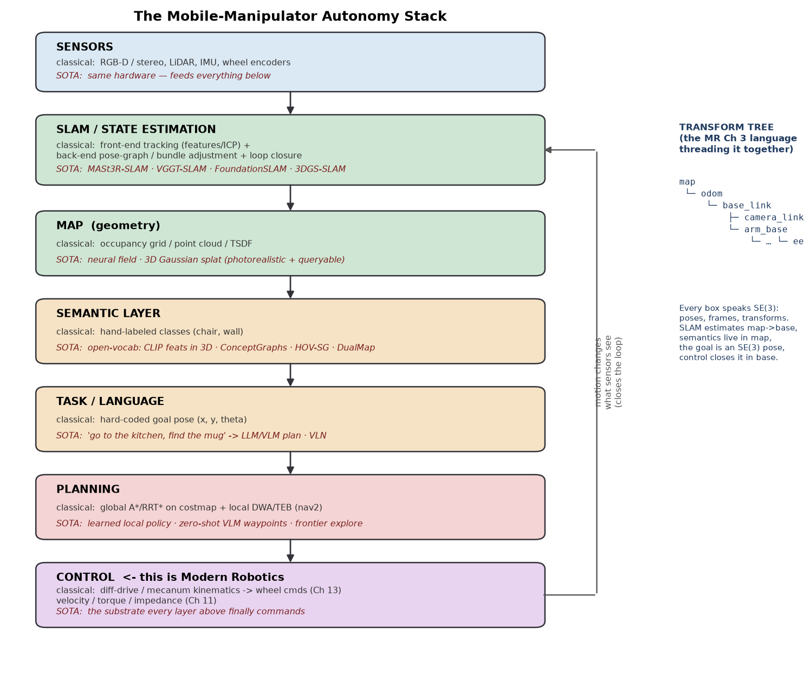
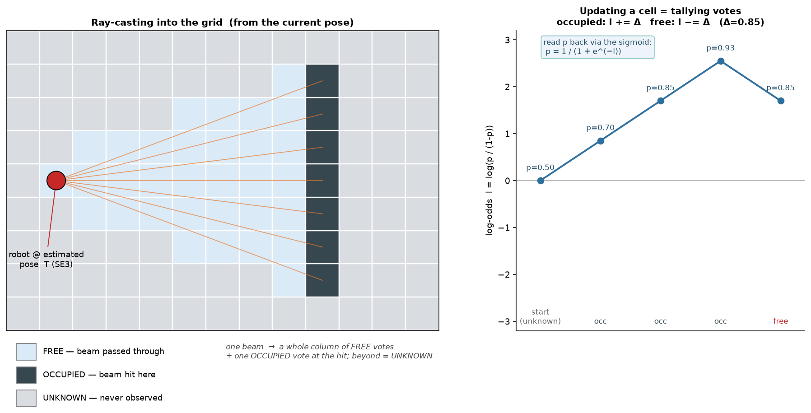
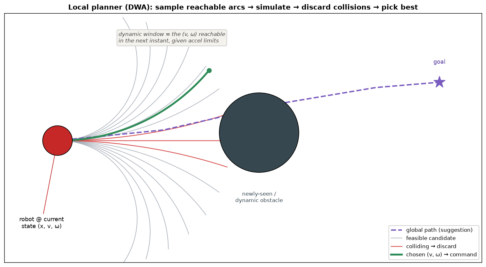

# 13d — SOTA Deep Dive: SLAM & Navigation

> **Capstone note.** This is the "one deep dive" before switching to Underactuated
> Robotics. It sits on top of Ch 10 (motion planning), Ch 13 (wheeled mobile
> robots), and `13c` (odometry / mobile manipulation), and pushes them forward to
> the **2025–2026 state of the art**. Scope, per our agreement: *foundations →
> modern*, covering all four layers — **metric SLAM**, **semantic mapping**,
> **navigation & planning**, and **sim + deployment**.
>
> North-star tie-in: **semantic navigation of a room** is one of your two target
> tasks, and the **wheeled mobile manipulator** is the chosen embodiment. This note
> is the perception-and-nav half of that robot; the arm/manipulation half you've
> been building in `pick_place/`.

---

## 0. The one picture to hold in your head



Read it top to bottom as **data flowing down into motor commands**, and notice the
feedback arrow on the right: *the robot moving changes what the sensors see*, which
is the entire reason SLAM is hard (more on that in §1).

The single most important thing this diagram says for *you*:

> **Modern Robotics is the bottom box.** Everything the DL/perception world adds —
> SLAM, semantic maps, VLMs, planners — eventually has to emit an **SE(3) pose** or
> a **velocity/torque command** and hand it to the controller you spent this whole
> book building. The transform tree on the right (map → odom → base → camera → ee)
> is *literally Ch 3*. You already speak the language every layer above is written in.

Everything below is an expansion of one of these boxes.

---

## PART I — METRIC SLAM (the map-building substrate)

### 1. What SLAM actually estimates, and why it's a chicken-and-egg problem

**SLAM = Simultaneous Localization And Mapping.** You want two things at once:

- **Localization:** where am I? — my pose trajectory `T₁, T₂, …, Tₖ ∈ SE(3)`.
- **Mapping:** what does the world look like? — a set of landmark/point positions
  `m₁, m₂, … ∈ ℝ³` (or a dense surface).

The trap: **to know where you are, you compare what you see now against the map —
but the map was built from your past poses, which you also had to estimate.** Each
depends on the other. SLAM is the joint estimation of *both* from noisy sensor data.

Physical intuition: walk into a dark room with a flashlight. You note "table 2 m
ahead." You step forward; now the table is 1 m ahead — that *agrees* with a 1 m
step, so you trust your motion. But small errors compound: after walking a loop
around the room, you might think the doorway is 30 cm from where it actually is.
That accumulated error is **drift**, and killing drift is what most of SLAM's
machinery exists to do.

### 2. The two-part architecture: front-end and back-end

Essentially every metric SLAM system, classical or learned, splits into:

**Front-end (tracking / odometry) — fast, local, per-frame.**
"Given the last frame and this frame, how did I move?" Two classic flavors:
- **Feature-based:** detect keypoints (ORB, SIFT), match them frame-to-frame, solve
  for the camera motion that explains the matches. (ORB-SLAM lineage.)
- **Direct / dense:** align whole images or point clouds by minimizing photometric
  or geometric error. **ICP (Iterative Closest Point)** is the canonical geometric
  version: repeatedly (1) pair each point to its nearest neighbor in the other
  cloud, (2) find the rigid transform that best aligns the pairs, (3) repeat.

**Back-end (optimization) — slower, global, occasional.**
The front-end drifts. The back-end fixes it by treating *all* poses and landmarks
as unknowns in one big optimization and finding the configuration that best fits
*all* the measurements jointly. Two names for essentially the same idea:
- **Pose-graph optimization:** nodes = poses, edges = relative-motion measurements
  ("frame 5 was roughly this transform from frame 4"). Solve for the node poses
  that best satisfy all edges.
- **Bundle adjustment (BA):** the fuller version that *also* optimizes the 3D
  landmark positions jointly with the poses.

**Loop closure** is the back-end's superpower. When you recognize *"I've been here
before"* (this room matches a place from 200 frames ago), you add an edge between
two far-apart nodes. That single constraint yanks the whole accumulated-drift loop
back into consistency — like a drawstring pulling a floppy loop taut.

> **This is where your SLAM app lives.** When you tune a real system, you're mostly
> tuning: which features, how aggressively to add keyframes, when to trigger loop
> closure, and how much to trust odometry vs. the map. The front-end/back-end split
> is the mental model for *every* knob.

### 3. Linear-algebra aside — what the back-end optimization actually is

This is the LA that runs SLAM, so let's make it geometric rather than symbolic.

You have a pile of measurements, each of which says *"this quantity should be about
this value."* Example edges:
- "pose₅ relative to pose₄ ≈ (measured relative transform)"
- "landmark 12, seen from pose₃, should project to this pixel"

Each measurement `i` has a **residual** `rᵢ = (what the current guess predicts) −
(what was measured)`. If your guess were perfect, every `rᵢ = 0`. It never is. So
you minimize the **sum of squared residuals**:

```
minimize   Σᵢ ‖rᵢ(x)‖²        where x = (all poses, all landmarks) stacked
   x
```

This is **nonlinear least squares** — the same shape as the IK objective from `06b`
(`‖f(θ) − x_target‖²`), just with thousands of variables instead of six. And the
solution method is the same one you already learned: **Gauss–Newton / Levenberg–
Marquardt**.

- **Least squares geometrically:** you have more equations than unknowns
  (over-determined) and they're inconsistent (noise). "Best fit" = the point that's
  *closest to satisfying all of them at once*, in the squared-distance sense. It's
  the projection of your measurement vector onto the space of poses/landmarks the
  model can actually produce.
- **Why squared?** Squaring makes the objective smooth and turns "best fit" into a
  single linear solve at each step (the normal equations `JᵀJ Δx = −Jᵀr`). `J` is
  the Jacobian — *yes, the same Jacobian idea from Ch 5*: how each residual changes
  as you nudge each pose/landmark.
- **Why it's tractable at scale:** `JᵀJ` for SLAM is **sparse** — pose₅ doesn't
  directly constrain landmark 900 it never saw, so most entries are zero. That
  sparsity (exploited by libraries like g2o, GTSAM, Ceres) is the reason you can
  optimize thousands of poses in real time. This sparse-least-squares solver is the
  computational heart of classical SLAM.

The mental takeaway: **SLAM's back-end is one giant, sparse, weighted least-squares
problem, solved the same way as numerical IK.** You already own the tool.

### 4. Classical SOTA baseline: ORB-SLAM3

Still the reference point everything is measured against. Feature-based (ORB
keypoints), handles monocular / stereo / RGB-D / visual-inertial, has excellent loop
closure and relocalization, runs real-time on a CPU. When someone says "our learned
system beats classical SLAM," **ORB-SLAM3 is usually the classical they mean.** If
you want to understand your own app's bones, this is the codebase to read.

### 5. The 2025–2026 shift: foundation-model SLAM

The frontier moved decisively toward **letting a big pretrained network do the
geometry**, in two waves:

**Wave 1 — learned dense BA (DROID-SLAM, 2021).** Replace hand-engineered feature
matching with a network that predicts dense pixel correspondences + confidences,
then feeds them into a **differentiable bundle-adjustment layer**. Hugely robust
(handles textureless walls, motion blur) but heavy.

**Wave 2 — geometry foundation models (this is the current SOTA).** A new class of
models does **feed-forward 3D reconstruction**: throw in a set of images, get out
per-pixel 3D points and relative poses *directly*, no per-scene optimization loop.
The lineage to know:
- **DUSt3R / MASt3R** — "give me two images, I'll output both in a shared 3D
  coordinate frame." Killed the need for careful calibration + matching.
- **VGGT** (Visual Geometry Grounded Transformer) — one forward pass → cameras,
  depth, point maps for a whole image set.
- Built into SLAM systems: **MASt3R-SLAM, VGGT-SLAM, FoundationSLAM** (fuses a depth
  foundation model with a bi-consistent BA layer; ~18 FPS with a small ViT). These
  now **outperform DROID-SLAM** on tracking + reconstruction benchmarks.

> **Why this matters for you:** the classical pipeline (§2–3) is still exactly the
> right *mental model* — there's still a front-end, a back-end, and a least-squares
> core. Foundation SLAM just swaps the hand-crafted front-end for a network and
> often folds the optimization into a differentiable layer. Understanding the
> classical version is what lets you read the modern papers without drowning.

### 6. The map representation is also being reinvented: 3DGS-SLAM

Classical maps are **sparse point clouds** or **occupancy/TSDF grids** — good for
"is this cell blocked?" but ugly and lossy. The 2024–2026 wave rebuilds the map as:

- **Neural fields (NeRF-SLAM):** the map is a small network `f(x, y, z) → density,
  color`. Photorealistic, but slow to query.
- **3D Gaussian Splatting SLAM (the current dense-mapping SOTA):** the map is a
  cloud of millions of little 3D Gaussian blobs, each with position, shape, color,
  opacity. Renders photorealistically *and* fast, and — crucially — it's an
  **explicit, editable, queryable** representation. The 2025 zoo: MonoGS, GS-SLAM,
  GSORB-SLAM (adds ORB features back in for robustness), SplatMAP, plus dynamic-
  scene variants (WildGS-SLAM, GARAD-SLAM) that handle people walking through.

Why a robotics person cares about a *rendering* technique: a 3DGS map is a
**differentiable, photorealistic digital twin of the actual room** — you can render
novel camera views for planning, spawn it in a simulator, and (next part) **attach
semantic features to the Gaussians** so the map knows *what* things are, not just
where. That's the bridge from geometry to semantics.

---

## PART II — SEMANTIC MAPPING (from "where" to "what")

### 7. The gap metric SLAM leaves

A metric map tells you *"there's a surface at (1.2, 0.4, 0.8)."* It does **not** tell
you *"that's a mug."* But your north-star task is **"go find the mug"** — you need a
map that answers **language queries about objects**. That's semantic mapping.

The evolution:
1. **Closed-vocabulary (old):** run a fixed-class segmentation net (chair, table,
   wall, ~80 COCO classes), paint each map voxel with its class. Fails the instant
   you ask for anything outside the training list.
2. **Open-vocabulary (the SOTA idea):** attach a **CLIP-style feature vector** to
   each point/region instead of a discrete label. Now "mug," "the red cup,"
   "something to drink from" are all just *query embeddings* you compare against the
   map — no fixed class list. This is the key unlock.

### 8. The open-vocabulary linear-algebra trick (this is the whole idea)

The mechanism is pure linear algebra and worth making concrete, because it's the
same trick behind your pick-place VLA's language grounding.

- A vision-language model (CLIP) embeds **both** images and text into the **same**
  D-dimensional vector space (D ≈ 512–768). Trained so that a picture of a mug and
  the words "a mug" land at **nearly the same vector**.
- **Build:** for each 3D point (or object region) in the map, store its CLIP image
  embedding `fₚ ∈ ℝ^D`. The map is now `{position ∈ ℝ³, feature ∈ ℝ^D}`.
- **Query:** embed the text "mug" → `q ∈ ℝ^D`. Score every map point by
  **cosine similarity** `sₚ = (q · fₚ) / (‖q‖‖fₚ‖)`. Highest score = most "mug-like"
  location.

> **LA aside — cosine similarity is just the angle between vectors.** The dot
> product `q · fₚ = ‖q‖‖fₚ‖cos(angle)`. Divide out the magnitudes and you're left
> with `cos(angle between them)`: **+1** = same direction (same meaning), **0** =
> perpendicular (unrelated), **−1** = opposite. "Find the mug" is *literally* "find
> the map point whose feature vector points most nearly the same direction as the
> word 'mug'." No training, no fixed classes — language and geometry meet in one
> shared vector space. This is the single most important LA idea in modern semantic
> robotics, and it's the same idea you'll see in every VLA.

### 9. The systems to know (2024 → 2026)

- **VLMaps** — projects CLIP/LSeg pixel features into a **top-down 2D grid**. Clean,
  navigation-friendly ("go to the sofa" → highlight sofa cells → plan a path).
- **ConceptGraphs (2024)** — the influential one. Builds an **object-centric 3D
  scene graph**: nodes = objects (each with a CLIP feature + a caption), edges =
  relations ("mug *on* table"). Compact and directly consumable by an LLM planner.
- **HOV-SG (Hierarchical Open-Vocabulary Scene Graphs)** — adds hierarchy
  (building → floor → room → object), which is what makes *large*, multi-room
  environments tractable — you reason at the room level, then drill in.
- **Spatial language maps** (Huang, Mees, Zeng, Burgard, 2025) — fuse *multiple*
  modalities (visual + spatial-language) for both navigation **and** manipulation.
- **DualMap (2025)** — **online** open-vocab mapping for **dynamic, changing**
  scenes (objects move between visits). This is the realistic-home direction:
  maps that stay correct when someone rearranges the furniture.

**Pattern to internalize:** SOTA semantic mapping = *metric SLAM* (Part I) + *CLIP
features attached to the geometry* + *optionally, structure them into an object
graph an LLM can read*. It is a layer on top of everything in Part I, not a
replacement.

---

## PART III — NAVIGATION & PLANNING (getting there)

### 10. The classical stack you should still know (ROS nav2)

Even in learned systems, this is the fallback and the baseline. Two tiers:

- **Global planner** — plan a rough path over the whole known map. Operates on a
  **costmap** (occupancy grid where cells carry a traversal cost; obstacles are
  "inflated" so the robot's width is respected). Algorithms: **A\*** / **Dijkstra**
  (grid search) or **RRT\*** (sampling-based, from Ch 10). Output: a waypoint list.
- **Local planner / controller** — follow the global path while dodging *newly
  seen* obstacles in real time, respecting the robot's actual motion limits. **DWA
  (Dynamic Window Approach)** and **TEB (Timed Elastic Band)** are the standard two.
  This is where **Ch 13's nonholonomic constraints bite** — a diff-drive base can't
  strafe, so the local planner samples only *feasible* `(v, ω)` commands. *This is
  Modern Robotics doing real work inside the nav stack.*

Rounding out the classical picture: **frontier-based exploration** (to map an
*unknown* room, repeatedly drive to the boundary between known-free and unknown
space) and **ObjectNav** as the task formulation ("navigate to an instance of
class X").

### 11. The learned / language spectrum (the actual SOTA)

Order these from "least learned" to "most learned" — it mirrors the Ch 9/10 story
in `09_10_learned_sota.md`:

1. **Learned local policy** — keep the classical global planner, replace DWA with a
   net trained (RL/imitation) to produce smoother, more human-like local motion.
   Lowest-risk, most-deployed form of "learned nav."
2. **Zero-shot ObjectNav with VLMs** — no map given. The robot explores; at each
   step a **VLM looks at the current view and picks where to go** ("I see a kitchen
   through that doorway; the fridge is likely there → head that way"). Systems:
   CoW, ESC, and the **frontier-semantics** family (score exploration frontiers by
   how likely they lead to the target). Flexible, no task-specific training,
   but slower and less reliable than fine-tuned models.
3. **Vision-Language Navigation (VLN) — the headline capability.** Follow a
   free-form instruction: *"go down the hall, past the kitchen, and stop at the
   second door on your right."* An LLM/VLM parses the instruction, grounds each
   phrase against what the robot sees, and emits waypoints. 2025 systems:
   **InstructNav, VLN-Zero** (builds a symbolic scene graph, then does neuro-
   symbolic planning; notably *model-agnostic* — swap GPT-4.1 for GPT-5 and it still
   works), **NavGPT**, MSNav, and world-model planners like NavForesee.

**Honest state of the field (2026):** zero-shot VLM navigators are wonderfully
general but **still lag fine-tuned specialists** on benchmark success rate. The
practical sweet spot for *your* room-scale semantic-nav goal is the middle:
**a good metric+semantic map (Parts I–II) + a VLM that reasons over it to pick goals
+ the classical nav2 local controller to execute safely.** You get language
generality *and* reliable motion, and every piece is debuggable.

> **This is the semantic-navigation recipe for your project.** Map the room once
> (3DGS or RGB-D SLAM) → attach open-vocab features (ConceptGraphs-style) → user
> says "go to the plant" → embed & cosine-match to find it in the map → hand its
> SE(3) pose to nav2 → diff-drive controller executes. No end-to-end black box
> required to get a working demo.

---

## PART IV — SIM & DEPLOYMENT (where this runs)

### 12. Simulators

- **Habitat (AI Habitat)** — the standard **navigation/embodied-AI** sim. Fast
  photorealistic indoor scenes (HM3D, Matterport, Gibson), built-in ObjectNav/VLN
  benchmarks. **Start here for semantic nav** — it's purpose-built for exactly your
  target task and lets you iterate on policies without a robot.
- **Isaac Sim / Isaac Lab** — the **physics-and-manipulation** sim (GPU-parallel,
  great contact dynamics, ROS bridge). Better when you need the *arm* and real
  dynamics — i.e. the mobile-*manipulator*, not just the base. Your `pick_place/`
  world lives in this family.
- **MuJoCo** — your current playground; lightest weight, best for control-loop and
  manipulation experiments, weakest for large photorealistic scenes.

Rule of thumb: **prototype navigation in Habitat, prototype manipulation in
Isaac/MuJoCo, then integrate.** The wheeled mobile manipulator needs both.

### 13. The real deployment stack (ROS 2)

- **ROS 2 + nav2** — the de facto navigation stack: costmaps, planners (§10),
  behavior trees for recovery ("stuck → back up → re-plan"), and localization
  (AMCL against a prebuilt map, or your live SLAM).
- **The transform tree (tf2)** — `map → odom → base_link → camera_link → …`. This is
  the **most practically important thing on the deployment side, and it is 100%
  Ch 3.** Every sensor reading and every goal has to be expressed in the right
  frame and chained through `SE(3)` transforms to be usable. The classic split:
  `map → odom` is corrected by SLAM/loop-closure (jumps when drift is fixed);
  `odom → base_link` is smooth wheel/visual odometry (no jumps, drifts slowly).
  Understanding *why* that two-hop split exists is a genuine "you understand
  robotics deployment" checkpoint — and it's just frame composition.

### 14. The deployment reality checks

- **Sim-to-real gap:** photorealistic sim ≠ real camera noise, lighting, reflective
  surfaces, glass (which wrecks depth sensors). Domain randomization + real
  fine-tuning are the usual mitigations.
- **Compute budget:** foundation-model SLAM and VLM planners are *heavy*. On a real
  mobile base you'll run the lightweight controller loop (Ch 11/13) at high rate
  onboard, and the heavy perception/reasoning at low rate (possibly offloaded).
  This is exactly the **hierarchy** in your parked LLM-planner-MCP-skills note:
  slow VLM brain sets goals, fast controller executes.
- **Dynamic & changing worlds:** benchmarks are static; homes are not. This is why
  DualMap (dynamic semantic maps) and dynamic-scene 3DGS-SLAM matter for a *real*
  home robot rather than a benchmark number.

---

## 15. How this connects to everything you've done

- **Ch 3 (SE(3), twists):** the transform tree, the poses SLAM estimates, the goal
  pose you hand the planner. Every box in the diagram speaks this. *Highest-leverage
  chapter, confirmed again here.*
- **Ch 5 Jacobian / 06b numerical IK:** the same least-squares + Jacobian machinery
  **is** the SLAM back-end (§3). Same tool, bigger problem.
- **Ch 10 motion planning:** the classical global planner (§10) — RRT\*/A\* — is the
  baseline the learned nav (§11) is measured against.
- **Ch 13 mobile robots + 13c:** the nonholonomic constraints and wheel odometry are
  the bottom of the stack (`odom → base_link`) and shape the local planner.
- **Your pick-place VLA:** the open-vocab CLIP-in-a-shared-space trick (§8) is the
  *same grounding mechanism* your language-conditioned policy uses. Semantic nav and
  language pick-place are two applications of one idea.
- **Your SLAM app:** Parts I–II are its theory. The front-end/back-end split and the
  least-squares core are the knobs you actually tune.
- **Parked LLM-planner-MCP hierarchy:** §14's slow-brain/fast-controller split is
  exactly that architecture — this note is the perception+nav substrate it needs.

## 16. The minimum viable "semantic nav" you could build next

If you wanted to *do* it rather than just read it, the smallest end-to-end loop:

1. **Habitat**, one HM3D house.
2. RGB-D SLAM (or use Habitat's ground-truth pose to skip it at first) → occupancy
   map + posed RGB-D frames.
3. Attach CLIP features to the map (ConceptGraphs-lite: segment objects, embed
   crops, store `{centroid, feature}`).
4. Text goal → cosine-match (§8) → target object's map pose.
5. A\* on the occupancy grid → waypoints → simple diff-drive controller (Ch 13).
6. Demo: type "go to the couch," watch it path there.

Each step is one box in the §0 diagram. That's the whole point of the diagram — and
a clean stopping point before Underactuated.

---

## 17. FAQ — SLAM systems cheat-sheet (captured from discussion)

One line each — the framing to actually recall. (These five are points in the same
cube: **map density** × **sensors fused** × **classical↔learned**; see the table in
the discussion thread / §5–6.)

- **ORB-SLAM3** — *sparse map + very accurate pose tracking.* The **precision
  tracker.** Best-in-class localization, but the sparse feature map isn't directly
  usable for navigation. Monocular has **scale ambiguity** → needs stereo/RGB-D or
  an IMU for metric scale.
- **RTAB-Map** — *dense map + occupancy grid, easy multi-sensor fusion.* The
  **deployment workhorse.** Needs **a depth source — RGB-D *or* stereo *or*
  LiDAR** (not stereo specifically) — and fuses wheel odom / IMU happily. Outputs
  the **nav2 occupancy grid for free** → easiest path to a *navigating* robot, and
  its dense cloud doubles as a **semantic-fusion canvas**.
- **3DGS-SLAM** — *heavyweight photorealistic map.* Millions of Gaussian blobs,
  GPU-heavy. The value is the **map** (photorealistic, queryable, `feature-3DGS` =
  semantic canvas, digital twin for sim), **not** the tracking — it usually rides on
  a classical tracker. Loop closure is awkward (2025 systems bolt ORB/pose-graph
  back on).
- **FoundationSLAM** — *turns mono into dense depth (does what stereo does, but by
  learned prediction) and works from there.* A monocular **depth foundation model**
  supplies per-pixel depth from a **single** image, breaking mono scale ambiguity
  with a **learned prior** instead of a second camera. Dense, robust on
  textureless/blur; GPU, research-frontier. *(Intuition "mono→stereo" is right; it
  **predicts** depth rather than triangulating a real second view.)*
- **VINS** — *camera + IMU; for when wheel odometry isn't available.* Visual-inertial
  fusion → **robust, metric, high-rate** pose. The IMU breaks mono scale via
  **physics** (measures m/s²) and makes roll/pitch drift-free. The star on **drones /
  AR / handheld**; on a **wheeled base** wheel-odometry already covers this role, so
  VINS is a **helper, not essential**.

**Pick-by-question:** most accurate tracking → **ORB-SLAM3** · easiest path to a
navigating (and semantic-map-able) robot → **RTAB-Map** · photorealistic/queryable
digital twin → **3DGS-SLAM** · monocular-only & classical breaks → **FoundationSLAM**
· no wheels, aggressive motion → **VINS**.

**For *your* wheeled semantic-nav robot:** **RTAB-Map as the workhorse** (dense sensed
map + wheel/IMU fusion + nav-ready grid) **+ an IMU (the VINS idea) + 3DGS/feature-3DGS
in the pocket** for a photorealistic, semantically-queryable digital twin.

## 18. Occupancy mapping — how the planner's map is actually built

The maps Part III plans on (costmaps, OctoMaps) are **occupancy maps**. Same idea in
2D and 3D; only the container changes.



### The core idea

Chop space into cells; each cell stores the **probability it is occupied**. Three
meaningful states emerge: **free** (p≈0, drive here), **occupied** (p≈1, obstacle),
**unknown** (p=0.5, never seen).

### How a cell gets its value: ray-casting + inverse sensor model

Each depth/LiDAR measurement is a **ray** from the sensor that travels a distance and
hits a surface. One beam says three things at once (left panel):
- cells **along the ray, up to the hit** → evidence of **FREE** (beam passed through),
- the cell **at the hit** → evidence of **OCCUPIED**,
- **beyond the hit** → still **UNKNOWN** (couldn't see through).

Sensors are noisy, so you never *set* a cell — you **accumulate evidence** over many
observations, one little Bayes filter per cell, with cells assumed **independent**
(the classic occupancy-grid approximation).

### The one piece of math: log-odds turns Bayes into addition

Direct probability updates need multiplication + renormalization and saturate at 0/1.
So store the belief as **log-odds** `l = log(p/(1−p))` (unknown → l=0, occupied →
l→+∞, free → l→−∞). Then the Bayesian update is **plain addition** — every
observation adds a fixed increment:

```
l_new = l_old + (+Δ if "occupied", −Δ if "free")     then clamp to [l_min, l_max]
```

It's literally **tallying votes** (right panel): occupied hits push `l` up, free
observations push it down, a flickering cell hovers near 0. Read probability back with
the **sigmoid** `p = 1/(1+e^{−l})` — the *same* logistic function ML uses to turn a
logit into a probability. Log-odds ↔ probability is that same transform; know one,
know the other.

Because a cell can be voted back down, the **same raycasting erases moving obstacles**:
when a person who blocked a cell walks off, the next beam passes through → FREE votes
→ the cell clears. One mechanism builds walls *and* deletes ghosts.

### 2D vs 3D: same math, different container

- **2D grid** — a flat array (~5 cm cells). Cheap; what a **wheeled base plans on**
  (world projected to the floor). Feeds nav2's costmap.
- **3D — naive voxel grid fails:** `N³` cells, almost all empty → memory blows up.
- **3D — OctoMap (octree):** recursively split space into **8 octants, only where
  there's detail.** Big empty regions = one node; surfaces subdivided finely. Same
  log-odds per leaf; memory scales with *surface complexity*, not volume.

**Cousins:** *costmap + inflation* (obstacles grown by robot radius so the planner
treats the robot as a point; nav2 layers static+obstacle+inflation) · *TSDF* (store
signed distance to nearest surface → clean meshing, KinectFusion/RTAB-Map dense) ·
*ESDF* (distance to nearest obstacle → clearance + gradients for optimization-based
planners) · *semantic/open-vocab occupancy* (cell also carries a CLIP feature → "is
this *a chair*?", the Part II tie-in).

### The pose coupling (the subtle, important part)

Occupancy mapping is the **"mapping given poses"** half of SLAM (§1) — it **consumes**
the pose estimate. Each step is really two: (1) **localize** → SLAM gives pose `T`;
(2) **map** → transform the scan's rays into the global frame *using T* and vote on
cells. The pose **is** the transform that places each ray:

```
T_map_sensor = T_map_base · T_base_sensor      ← the transform tree (Ch 3 SE(3))
               └ from SLAM ┘  └ fixed mount ┘
```

Change the pose, the rays land on different cells. Two consequences of "map is
downstream of pose":

1. **Bad pose → smeared map.** Drift writes measurements into the wrong cells →
   **double walls / ghosting.** A blurry occupancy map is usually a *localization*
   symptom, not a sensor one.
2. **Loop closure revises past poses → the naive incremental grid goes stale.** You
   already baked the map from the old (wrong) poses; a blind single global grid can't
   be un-baked. The fix real systems use: **store the map as per-keyframe *local*
   pieces attached to graph nodes, and re-assemble from the *current optimized*
   poses.** RTAB-Map keeps a local grid/cloud per keyframe; when loop closure moves
   the poses, it just **re-stitches** the pieces — no re-raycasting of raw data.
   Mapping stays a pure function of *current best poses + stored measurements*.

**For your robot:** RTAB-Map emits **both** — a **2D grid** for the base to navigate
(nav2) and a **3D OctoMap** for real 3D collision, which you need once the **arm** is
in play (a mobile *manipulator* reasons about tabletops/overhangs, not just floor
footprint). *2D grid drives the base, 3D OctoMap protects the arm.*

## 19. Local planning / control — turning the path into wheel commands

The global planner (§10) lays a *geometric suggestion* on the occupancy grid. The
**local planner** turns that into actual, safe, feasible motion — moment to moment.
It's the box directly above CONTROL in the §0 diagram, and it's where Ch 13 stops
being theory.



### Why two planners

| | Global | **Local** |
|---|---|---|
| Question | "which way around the building?" | "what velocity *right now*?" |
| Map | whole static grid | rolling window + **live** sensors |
| Robot | a point, **ignores dynamics** | the **real** robot: vel/accel limits, **nonholonomic** |
| Rate | ~1 Hz | **~10–20 Hz** |
| Output | a path (waypoints) | a **command** `(v, ω)` |

The global path knows nothing about the person who just stepped into the hall or that
a diff-drive base **can't strafe.** The local planner's three jobs: **(1) track the
global path, (2) dodge new/dynamic obstacles, (3) obey the robot's real motion
limits** (this is where Ch 13's kinematics bite).

### The core loop = receding-horizon control (MPC)

Every ~50–100 ms, from the **current state**: (1) generate candidate short-horizon
motions (~1–3 s), (2) **forward-simulate** each with the motion model, (3) discard
infeasible/colliding ones, (4) **score** the survivors, (5) execute the best for
**one** cycle, throw the rest away, re-plan. "Plan a short horizon, execute one step,
re-plan" **is Model Predictive Control.** The three methods below are just different
ways to do steps 1–4.

- **DWA (Dynamic Window Approach)** — sample in **velocity space**. The "dynamic
  window" is the `(v, ω)` reachable in the next instant given accel limits. Forward-
  simulate each into an arc (figure), discard collisions, score by **heading/progress
  + clearance + velocity**, pick the best. Simple, robust, cheap.
- **TEB (Timed Elastic Band)** — optimize in **trajectory space**. Represent the local
  path as a band of timed poses; the goal *pulls*, obstacles *push*, kinodynamic
  limits act like stiffness; optimize the band via g2o (the **same sparse least-
  squares back-end as §3**). Smoother/time-optimal, more compute.
- **MPPI (Model Predictive Path Integral)** — the **modern nav2 default**. Sample
  thousands of noisy control rollouts, weight each by `exp(−cost)`, take the weighted
  average. Handles **arbitrary nonlinear costs** (face travel direction, social
  distance), **needs no gradients**, is GPU-parallel and naturally smooth. Same
  "sample→simulate→score" skeleton as DWA, richer sampling + soft average instead of
  hard argmax.

### Where Ch 13 bites: the candidate set *is* the kinematics

Candidates are **only motions the base can execute** — the nonholonomic constraint
made concrete:
- **Diff-drive** → sample space is `(v, ω)`: drive + turn, **no sideways** (arcs, not
  strafes) — the `13b` constraint.
- **Mecanum / omni** → holonomic, sample space adds `v_y` (strafe): can dodge with
  moves a diff-drive simply cannot (`13a`).

Your base choice literally sets the local planner's search space.

### Output → the control substrate (the bottom box)

The local planner emits a **body-frame velocity** `(v, ω)` (or `(v_x, v_y, ω)` for
mecanum). The base controller maps that to **wheel speeds via Ch 13 kinematics** (the
mecanum decomposition `13a` / diff-drive model `13b`). **That handoff — velocity
command → wheel speeds — is where the entire perception/nav stack finally becomes
Modern Robotics.** The learned version (§11) swaps the planner for a net that outputs
`(v, ω)` from sensors, but the **interface is identical** — still a velocity command
into the Ch 13 kinematics.

### Full pipeline, local planner slotted in

> **VLM** picks target → **RTAB-Map semantic map** → object SE(3) pose → **global
> planner** (A*/RRT* on the grid) → rough path → **local planner** (DWA/TEB/MPPI)
> → safe `(v, ω)` every 50–100 ms, dodging live obstacles → **Ch 13 base kinematics**
> → wheel speeds → motors.

## 20. The same stack on legs — and the bridge to Underactuated

A closing thought-experiment: **rebuild this whole stack for a quadruped.** It reveals
the single most important architectural property of everything above — *where the
embodiment actually lives* — and it hands off directly into the next book.

### The abstraction line: the velocity command

Everything **above the local planner** — SLAM, semantic map, global plan, VLM — only
ever says *"go to this place"* / *"move this fast, this way."* **None of it cares
whether you have wheels or legs.** The embodiment is fully abstracted at the
`(v_x, v_y, ω)` velocity-command interface. Wheels vs. legs *only* changes what happens
**below** that line:

- **Wheeled:** `(v, ω)` → wheel speeds via **algebra** (Ch 13). Statically stable,
  can't fall. *Trivial.*
- **Legged:** `(v, ω)` → gait + footstep planning + **balance / whole-body control**
  → an **underactuated, dynamic** control problem. *Hard.*

### What stays, what changes

| Stack layer | Wheeled | Quadruped | Verdict |
|---|---|---|---|
| **Sensors** | RGB-D, LiDAR, **wheel odom**, IMU | **no wheels** → joint encoders + foot-contact ("leg odometry"); IMU essential | shifts |
| **State estimation** | pose from SLAM + wheel odom | SLAM **+ a fast proprioceptive EKF** (IMU + leg kinematics) for **balance** | adds a layer |
| **SLAM** | same | same algorithms; jerkier base → lean on VIO + leg odometry | ~same |
| **Map** | 2D occupancy ("floor blocked?") | **2.5D elevation / traversability** ("height/slope/foothold?") | changes |
| **Semantic layer** | CLIP / ConceptGraphs | identical | **same** |
| **Task / language** | VLM / VLN | identical | **same** |
| **Global planner** | A* on occupancy | A* on **terrain-cost** map (stairs, gaps) | ~same |
| **Local planner** | DWA/MPPI → `(v, ω)` | still emits a velocity command | interface same |
| **Control substrate** | `(v,ω)` → wheel kinematics (Ch 13) | `(v,ω)` → **gait + footstep + WBC, or RL policy** | **rewritten** |

The top ~2/3 of the stack is embodiment-agnostic and survives untouched. The change is
**two upstream ripples + one bottom rewrite.**

### The two upstream ripples

1. **Map describes *terrain*, not just obstacles.** Legs can climb, so the map must
   encode **height/slope/foothold traversability** (robot-centric elevation maps),
   not binary floor occupancy. The map's job expands from 2D avoidance to 3D terrain
   description.
2. **State estimation grows a balance estimator.** A high-rate EKF fusing IMU + leg
   kinematics estimates base tilt/velocity/CoM **underneath** SLAM, feeding the
   balance controller. New and safety-critical — wheels never needed it.

### The bottom box: underactuation (= the next book)

- A **wheeled base is ~fully actuated & statically stable**: command a velocity,
  kinematics give wheel speeds, done. Physically can't fall.
- A **quadruped is underactuated & dynamically balanced**: feet leave the ground, so
  at any instant you can only push where feet are in contact — you **cannot command
  arbitrary body accelerations.** Balance is an active dynamic problem.

Two modern substrates replace "Ch 13 kinematics":
- **MPC + Whole-Body Control** — MPC over reduced (centroidal / single-rigid-body)
  dynamics plans **ground-reaction forces + footstep timing**; WBC converts to ~12
  joint torques (MIT Cheetah / ANYmal). *Same receding-horizon MPC idea as §19, over
  dynamics + contact instead of `(v,ω)` arcs.*
- **RL locomotion policies** — train in **Isaac Gym** with domain randomization →
  deploy; policy maps `(v,ω)` + proprioception → joint targets, robust over rough
  terrain. What most commercial quadrupeds run today — *your* Isaac/RL path applied to
  locomotion instead of manipulation.

### The bridge

Legged locomotion is **the** canonical underactuated control problem — contact,
balance, "you can't actuate the body directly." So **Underactuated Robotics is the
theory of the one box (control substrate) that a quadruped rewrites and a wheeled base
skips.** This also re-justifies the wheeled choice honestly: it was picked *precisely*
to make that bottom box trivial (statically stable → effort goes to perception / nav /
manipulation, not balance). The quadruped moves effort back into the balance problem —
which is why it was deferred, but it's the ideal lens for isolating exactly what the
next book teaches, against a stack you now know cold.

*(Wrinkle for a quadruped-manipulator like Spot+arm: the base sways while the arm
works → **loco-manipulation**, whole-body control coordinating legs + arm together.
Same underactuated-coupling theme, one notch up.)*

> **Compressed:** swap the map to terrain, add a proprioceptive balance estimator, and
> replace the wheel-kinematics box with an underactuated locomotion controller (RL
> policy or MPC+WBC) — **everything else in the stack is untouched.** The
> velocity-command abstraction line is what makes that surgical.

## Sources / further reading

- Foundation SLAM: [FoundationSLAM (arXiv 2512.25008)](https://arxiv.org/html/2512.25008),
  [DINO-VO (arXiv 2507.13145)](https://arxiv.org/pdf/2507.13145); DROID-SLAM, MASt3R-SLAM, VGGT-SLAM lineage.
- 3DGS-SLAM: [GSORB-SLAM](https://aczheng-cai.github.io/gsorb-slam.github.io/),
  [SplatMAP (arXiv 2501.07015)](https://arxiv.org/pdf/2501.07015),
  [GS-SLAM (Semantic Scholar)](https://www.semanticscholar.org/paper/GS-SLAM:-Dense-Visual-SLAM-with-3D-Gaussian-Yan-Qu/8b5f4902411123c5e68ded502f296cf325864831).
- Semantic mapping: [HOV-SG](https://www.emergentmind.com/topics/hierarchical-open-vocabulary-scene-graphs-hov-sg),
  [Multimodal spatial language maps (SAGE 2025)](https://journals.sagepub.com/doi/full/10.1177/02783649251351658),
  [Semantic Mapping in Embodied AI survey (arXiv 2501.05750)](https://arxiv.org/pdf/2501.05750),
  [osmAG-LLM (arXiv 2507.12753)](https://arxiv.org/html/2507.12753v2).
- VLN / zero-shot nav: [VLN-Zero (arXiv 2509.18592)](https://arxiv.org/html/2509.18592v1),
  [MSNav (arXiv 2508.16654)](https://arxiv.org/pdf/2508.16654),
  [VLN-with-Foundation-Models survey](https://github.com/zhangyuejoslin/VLN-Survey-with-Foundation-Models).
